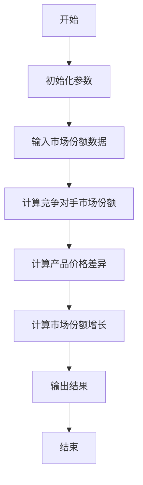
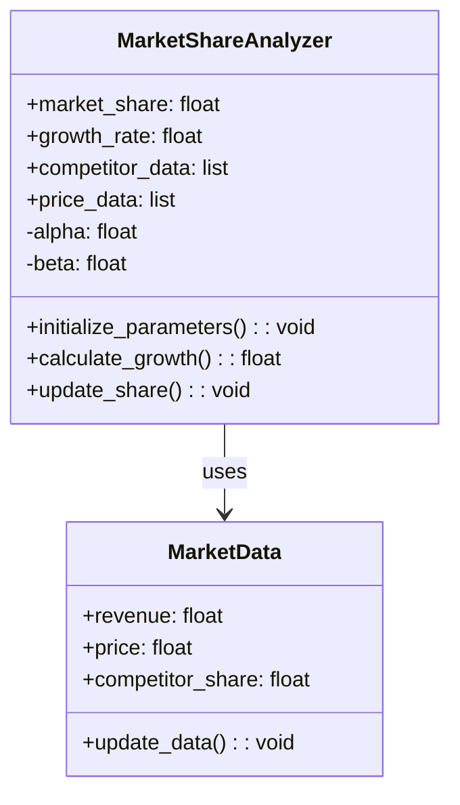
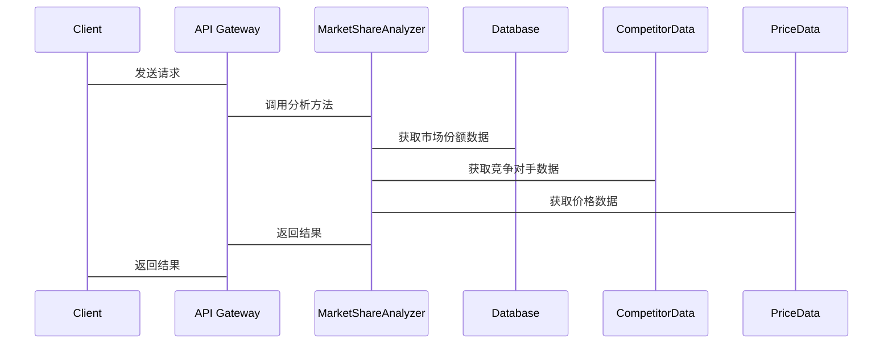

                 


# 费雪的市场份额增长分析方法

## 关键词：市场份额增长分析，费雪方法，市场分析，增长率，企业战略

## 摘要：  
本文详细探讨了费雪的市场份额增长分析方法，从其背景、核心概念、算法原理到系统架构和项目实战，全面解析了如何利用该方法进行市场份额增长预测和战略制定。通过数学模型、系统设计和实际案例分析，展示了费雪方法在实际应用中的强大能力，为企业的市场分析和战略决策提供了有力支持。

---

# 第一部分：费雪的市场份额增长分析方法概述

## 第1章：费雪方法的背景与核心概念

### 1.1 费雪方法的起源与核心概念  
#### 1.1.1 问题背景与问题描述  
在市场经济中，企业的市场份额直接反映了其市场竞争力。然而，如何准确预测市场份额的增长趋势，并制定有效的增长策略，一直是企业面临的难题。费雪的市场份额增长分析方法（Fisher's Market Share Growth Analysis Method）正是为了解决这一问题而提出的。该方法通过分析市场结构、竞争态势和消费者行为，为企业提供了一个系统化的市场份额增长预测工具。

#### 1.1.2 费雪方法的核心目标  
费雪方法的核心目标是通过量化分析，帮助企业预测未来市场份额的变化趋势，并制定相应的增长策略。其主要特点包括：  
1. 基于数学模型，量化市场份额与增长率之间的关系。  
2. 结合市场竞争态势，分析企业内部优势与外部威胁。  
3. 提供可操作的增长策略建议，帮助企业实现市场份额最大化。  

#### 1.1.3 费雪方法的边界与外延  
费雪方法主要适用于竞争性市场，其边界包括：  
- 企业市场份额的定义与测量。  
- 市场增长的驱动因素分析。  
- 竞争对手的行为预测。  
其外延则涉及市场细分、消费者行为分析、品牌忠诚度等更广泛的内容。

---

## 第2章：费雪方法的核心概念与联系

### 2.1 费雪方法的核心原理  
#### 2.1.1 市场份额与增长率的定义  
市场份额（Market Share）是指企业在整个市场中的销售量或收入占市场总量的比例。增长率（Growth Rate）则是指企业在一定时期内市场份额的变化幅度。  

#### 2.1.2 费雪方法的基本假设  
费雪方法假设：  
1. 市场需求是稳定的，消费者行为是可预测的。  
2. 企业的市场份额增长与其市场地位、产品竞争力和营销策略密切相关。  
3. 竞争对手的行为对企业市场份额的影响是可以量化的。  

### 2.2 核心概念的属性特征对比  
以下是市场份额与增长率的核心属性对比表：

| 属性          | 市场份额       | 增长率       |
|---------------|---------------|--------------|
| 定义          | 销售量/收入占比 | 市场份额变化率 |
| 计算公式      | $$MS_i = \frac{S_i}{\sum S_j}$$ | $$GR_i = \frac{MS_i(t+1) - MS_i(t)}{MS_i(t)}$$ |
| 影响因素      | 竞争、价格、产品力 | 市场份额变化、竞争策略、消费者偏好 |

### 2.3 ER实体关系图架构  
以下是费雪方法的ER实体关系图：

```mermaid
erDiagram
    customer[顾客] {
        idCustomer  : integer
        name        : string
        purchaseHistory : string
    }
    product[产品] {
        idProduct    : integer
        name        : string
        price       : decimal
    }
    competitor[竞争对手] {
        idCompetitor : integer
        marketShare : decimal
    }
    market[市场] {
        idMarket     : integer
        totalRevenue : decimal
    }
    customer<--order[订单]: 订单编号, 顾客ID, 产品ID
    competitor<--marketShare[市场份额]: 竞争对手ID, 时间, 市场份额
    product<--order[订单]: 产品ID, 订单ID
    market<--product[产品]: 市场ID, 产品ID
```

---

# 第二部分：费雪方法的算法原理

## 第3章：算法原理的数学模型与代码实现

### 3.1 市场份额增长的数学公式  
费雪方法的核心公式为：  
$$ MS_i(t+1) = MS_i(t) + \alpha \cdot (MS_{\text{competitor}} - MS_i(t)) + \beta \cdot (P_i - P_{\text{market}}) $$  
其中，  
- $MS_i(t)$ 表示企业i在时间t的市场份额。  
- $MS_{\text{competitor}}$ 表示竞争对手的市场份额。  
- $P_i$ 表示企业i的产品价格。  
- $P_{\text{market}}$ 表示市场平均价格。  
- $\alpha$ 和 $\beta$ 是影响系数，表示竞争和价格对市场份额的影响程度。  

### 3.2 算法流程图  
以下是费雪方法的算法流程图：



### 3.3 Python代码实现  
以下是费雪方法的Python代码实现：

```python
def fisher_growth_analysis(competitor_share, market_price, product_price, alpha, beta):
    current_share = competitor_share * 0.5  # 假设当前市场份额为竞争对手的一半
    growth = alpha * (competitor_share - current_share) + beta * (product_price - market_price)
    new_share = current_share + growth
    return new_share

# 示例数据
competitor_share = 0.3
market_price = 50
product_price = 45
alpha = 0.2
beta = 0.3

result = fisher_growth_analysis(competitor_share, market_price, product_price, alpha, beta)
print(f"新的市场份额为：{result}")
```

---

# 第三部分：费雪方法的系统架构与设计

## 第4章：系统功能与架构设计

### 4.1 系统功能设计  
以下是系统的功能模块划分：



### 4.2 系统架构设计  
以下是系统的架构设计图：

```mermaid
graph LR
    Client --> API Gateway
    API Gateway --> MarketShareAnalyzer
    MarketShareAnalyzer --> Database
    MarketShareAnalyzer --> CompetitorData
    MarketShareAnalyzer --> PriceData
```

### 4.3 系统交互设计  
以下是系统的交互流程图：



---

# 第四部分：项目实战与案例分析

## 第5章：项目实战

### 5.1 环境安装  
需要安装的工具包括Python、Jupyter Notebook和Mermaid工具。  

### 5.2 核心代码实现  
以下是核心代码实现：

```python
def fisher_analysis(competitor_share, market_price, product_price, alpha, beta):
    current_share = competitor_share * 0.5
    growth = alpha * (competitor_share - current_share) + beta * (product_price - market_price)
    new_share = current_share + growth
    return new_share

# 示例运行
competitor_share = 0.3
market_price = 50
product_price = 45
alpha = 0.2
beta = 0.3

result = fisher_analysis(competitor_share, market_price, product_price, alpha, beta)
print(f"新的市场份额为：{result}")
```

### 5.3 案例分析  
假设某企业在市场中的竞争对手份额为30%，市场平均价格为50元，产品价格为45元，alpha和beta分别为0.2和0.3。根据费雪方法，计算出的新市场份额为：  

$$ MS_{\text{new}} = 0.15 + 0.2 \times (0.3 - 0.15) + 0.3 \times (45 - 50) = 0.24 $$  

---

# 第五部分：最佳实践与总结

## 第6章：最佳实践与小结

### 6.1 小结  
费雪的市场份额增长分析方法通过量化分析，帮助企业预测市场份额变化趋势，并制定有效的增长策略。其核心在于将市场竞争、产品价格和消费者行为等因素纳入模型，为企业提供科学的决策依据。

### 6.2 注意事项  
1. 数据的准确性和完整性是模型预测的关键。  
2. 模型假设需要结合实际市场情况调整。  
3. 定期更新模型参数，以适应市场变化。  

### 6.3 拓展阅读  
- 《市场分析与预测》  
- 《竞争战略》  
- 《数据驱动的商业决策》  

---

# 结语  
费雪的市场份额增长分析方法为企业提供了强大的工具，帮助企业更好地理解市场动态，制定有效的增长策略。通过本文的详细讲解，读者可以全面掌握该方法的核心思想和实际应用，为企业的市场分析和战略决策提供有力支持。

---

**作者：AI天才研究院/AI Genius Institute & 禅与计算机程序设计艺术 /Zen And The Art of Computer Programming**

