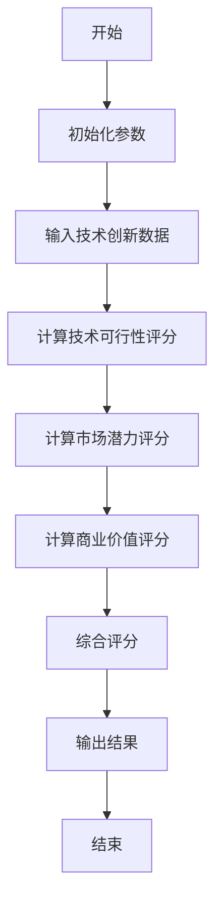
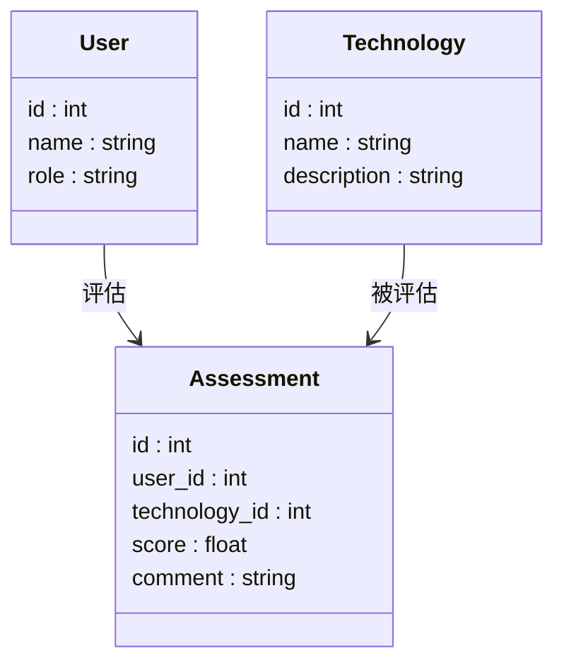
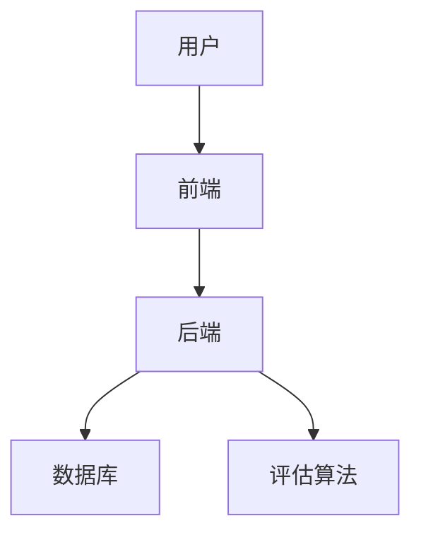

                 


# 费雪的技术创新评估

## 关键词：技术创新评估、费雪模型、系统架构、算法原理、项目实战

## 摘要：  
技术创新评估是企业在数字化转型和市场竞争中不可或缺的核心能力。本文系统地介绍了费雪技术创新评估的方法和应用，从核心概念、算法原理到系统架构、项目实战，全面解析了如何科学评估技术创新的价值和潜力，为企业制定技术创新战略提供理论和实践指导。

---

## 第一部分：技术创新评估的背景与意义

### 第1章：技术创新评估的背景与意义

#### 1.1 技术创新的定义与重要性  
技术创新是指通过引入新的技术、产品、服务或流程，为企业或行业创造价值的过程。在当今快速变化的市场环境中，技术创新是企业保持竞争力的关键。  

- **技术创新的定义**：技术创新不仅仅是技术的改进，还包括技术在商业模式、产品设计和服务流程中的创新应用。  
- **技术创新的重要性**：技术创新能够提升企业的效率、降低成本、满足客户需求，并在竞争中占据优势。  

#### 1.2 费雪技术创新评估的核心概念  
费雪技术创新评估是一种基于费雪模型的技术评估方法，专注于从技术可行性、市场潜力和商业价值三个维度对技术创新进行综合评估。  

- **费雪技术创新评估的背景**：随着技术的快速发展，企业需要一种系统化的方法来评估技术创新的潜力。  
- **费雪技术创新评估的目标**：通过科学的评估方法，帮助企业识别高价值的技术创新，优化资源配置。  
- **费雪技术创新评估的适用范围**：适用于企业内部的技术研发、产品开发和技术创新战略制定。  

#### 1.3 技术创新评估的现状与挑战  
尽管技术创新评估在企业中得到了广泛应用，但仍面临一些挑战。  

- **技术创新评估的现状**：许多企业采用传统的评估方法，但这些方法往往缺乏系统性和科学性。  
- **费雪技术创新评估的独特性**：费雪模型通过引入权重系数和多维度评估，能够更精准地评估技术创新的价值。  
- **技术创新评估中的常见问题**：数据不足、评估指标不明确、评估结果难以量化等。  

---

## 第二部分：费雪技术创新评估的核心概念与联系

### 第2章：费雪技术创新评估的核心概念与联系  

#### 2.1 费雪技术创新评估的原理  
费雪技术创新评估基于以下原理：  

- **技术可行性**：评估技术创新是否在技术上可行，包括技术成熟度、实现难度等。  
- **市场潜力**：评估技术创新在市场中的潜力，包括市场需求、竞争环境等。  
- **商业价值**：评估技术创新的经济价值，包括成本、收益、投资回报等。  

#### 2.2 费雪技术创新评估的核心概念对比  

| **核心概念** | **技术可行性** | **市场潜力** | **商业价值** |  
|--------------|----------------|--------------|--------------|  
| **定义**     | 技术实现的难易程度 | 市场对技术创新的需求程度 | 技术创新带来的经济效益 |  
| **评估指标** | 技术成熟度、实现成本 | 市场需求、竞争状况 | 投资回报率、成本效益 |  

#### 2.3 费雪技术创新评估的ER实体关系图  

```mermaid
erDiagram
    user {
        +id : int
        +name : string
        +role : string
    }
    technology {
        +id : int
        +name : string
        +description : string
    }
    assessment {
        +id : int
        +user_id : int
        +technology_id : int
        +score : float
        +comment : string
    }
    user --> assessment : 评估
    technology --> assessment : 被评估
```

---

## 第三部分：费雪技术创新评估的算法原理

### 第3章：费雪技术创新评估的算法原理  

#### 3.1 费雪技术创新评估算法的概述  



#### 3.2 费雪技术创新评估算法的详细讲解  

$$
\text{综合评分} = w_1 \times \text{技术可行性评分} + w_2 \times \text{市场潜力评分} + w_3 \times \text{商业价值评分}
$$  

其中，$w_1$、$w_2$、$w_3$是各维度的权重系数。  

#### 3.3 费雪技术创新评估算法的代码实现  

```python
def fisher_technology_assessment(tech_feasibility, market_potential, business_value):
    # 定义权重系数
    weight_feasibility = 0.4
    weight_potential = 0.3
    weight_value = 0.3
    
    # 计算综合评分
    total_score = (weight_feasibility * tech_feasibility +
                   weight_potential * market_potential +
                   weight_value * business_value)
    
    return total_score

# 示例数据
tech_feasibility = 80
market_potential = 70
business_value = 90

score = fisher_technology_assessment(tech_feasibility, market_potential, business_value)
print(f"综合评分为：{score}")
```

---

## 第四部分：费雪技术创新评估的系统分析与架构设计

### 第4章：费雪技术创新评估的系统分析与架构设计  

#### 4.1 系统分析  

- **问题场景**：企业需要对多项技术创新进行评估，但缺乏系统化的评估方法。  
- **系统功能设计**：  
  - 用户登录与管理  
  - 技术创新数据输入与管理  
  - 综合评分计算与展示  
- **领域模型设计**：  



#### 4.2 系统架构设计  



---

## 第五部分：费雪技术创新评估的项目实战

### 第5章：费雪技术创新评估的项目实战  

#### 5.1 项目环境安装与配置  

- **开发环境**：Python 3.8+、Jupyter Notebook  
- **依赖库**：pandas、numpy、scikit-learn  

#### 5.2 项目核心实现  

```python
import pandas as pd
import numpy as np

def load_data(file_path):
    return pd.read_csv(file_path)

def calculate_scores(data):
    # 假设数据中包含技术可行性、市场潜力和商业价值三个字段
    tech_feasibility = data['tech_feasibility'].values
    market_potential = data['market_potential'].values
    business_value = data['business_value'].values
    
    # 计算综合评分
    weight_feasibility = 0.4
    weight_potential = 0.3
    weight_value = 0.3
    
    scores = []
    for i in range(len(tech_feasibility)):
        score = (weight_feasibility * tech_feasibility[i] +
                 weight_potential * market_potential[i] +
                 weight_value * business_value[i])
        scores.append(score)
    
    return scores

# 示例数据
data = pd.DataFrame({
    'tech_feasibility': [80, 70, 90],
    'market_potential': [70, 80, 60],
    'business_value': [90, 60, 70]
})

scores = calculate_scores(data)
print("综合评分：", scores)
```

#### 5.3 项目案例分析  

- **案例背景**：某企业计划推出一款新产品，需要评估其技术创新潜力。  
- **案例数据**：  
  | 技术可行性 | 市场潜力 | 商业价值 |  
  |------------|----------|----------|  
  | 80         | 70       | 90       |  
- **案例结果**：综合评分为 83，表明该技术创新具有较高的市场潜力和商业价值。  

---

## 第六部分：费雪技术创新评估的最佳实践与总结

### 第6章：费雪技术创新评估的最佳实践与总结  

#### 6.1 最佳实践 tips  

- **数据质量**：确保输入数据的准确性和完整性。  
- **权重调整**：根据企业的实际情况调整各维度的权重系数。  
- **模型优化**：定期更新模型，以适应市场和技术的变化。  

#### 6.2 小结  

费雪技术创新评估为企业提供了一种系统化、科学化的技术创新评估方法，能够帮助企业识别高价值的技术创新，优化资源配置，提升竞争力。

#### 6.3 注意事项  

- 在实际应用中，建议结合企业自身的战略目标和行业特点，灵活调整评估模型。  
- 确保评估团队具备专业能力和经验，以提高评估结果的准确性。  

#### 6.4 拓展阅读  

- 《技术创新管理》  
- 《费雪模型在技术创新评估中的应用研究》  

---

## 作者：AI天才研究院 & 禅与计算机程序设计艺术

