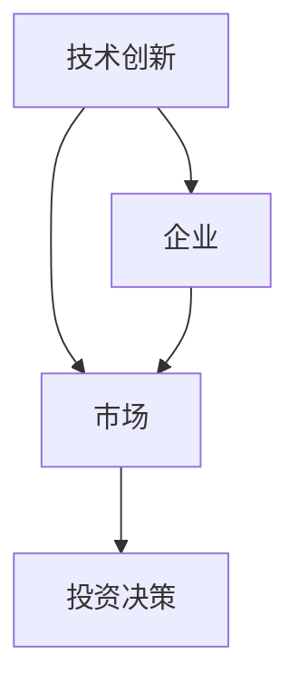
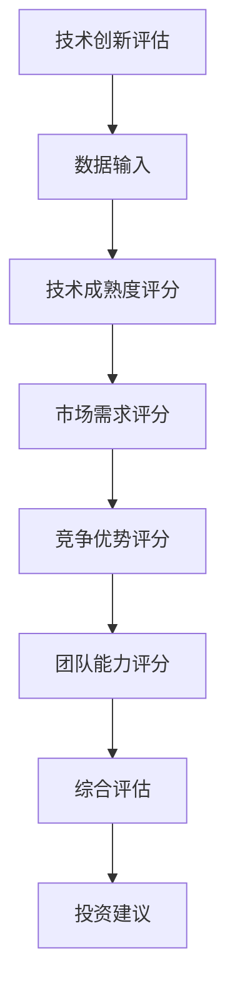
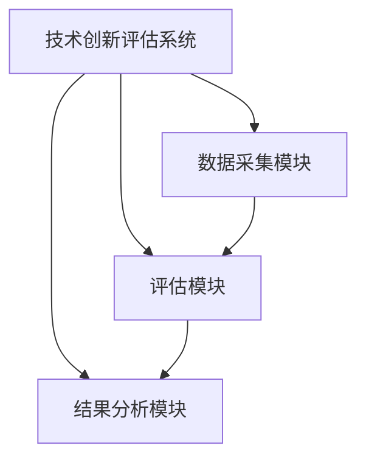

                 


# 费雪的技术创新评估在投资中的运用

> 关键词：技术创新评估、投资决策、费雪模型、算法原理、系统架构、项目实战

> 摘要：技术创新评估是投资决策中的关键环节，费雪的技术创新评估模型通过量化技术创新的核心要素，帮助企业识别和评估潜在的技术创新机会，从而优化投资决策。本文将详细分析费雪模型的原理、算法、系统架构及其实战应用，为投资决策提供理论支持和实践指导。

---

## 第一部分：技术创新评估的背景与核心概念

### 第1章：技术创新评估的背景介绍

#### 1.1 技术创新的定义与重要性
- **技术创新的定义**  
  技术创新是指引入新的技术、产品、工艺或服务，以满足市场需求或解决现有问题。它是企业竞争力的核心驱动力。
- **技术创新在投资中的重要性**  
  在投资决策中，技术创新是评估项目可行性、潜在收益和风险的关键因素。成功的技术创新能够带来超额收益，而失败的技术创新可能导致重大损失。
- **技术创新与企业竞争力的关系**  
  技术创新不仅能够提高企业的生产效率，还能增强市场竞争力，为企业创造差异化优势。

#### 1.2 费雪技术创新评估模型的背景
- **费雪模型的提出背景**  
  费雪模型由著名技术专家和投资专家共同提出，旨在为企业和技术投资者提供一个系统化的技术创新评估框架。
- **费雪模型的核心思想**  
  费雪模型认为，技术创新的价值不仅取决于其技术可行性，还取决于市场需求、竞争环境和团队能力等因素。
- **费雪模型在投资中的应用现状**  
  当前，费雪模型已被广泛应用于风险投资、技术创新基金等领域，成为评估技术创新项目的重要工具。

---

### 第2章：技术创新评估的核心概念与联系

#### 2.1 费雪技术创新评估模型的原理
- **模型的基本原理**  
  费雪模型通过量化技术创新的核心要素（如技术成熟度、市场需求、竞争优势等），结合权重分析，生成技术创新的综合评估结果。
- **模型的核心要素**  
  - **技术成熟度**：技术创新所处的开发阶段（初期、中期、后期）。  
  - **市场需求**：技术创新在市场中的需求程度（高、中、低）。  
  - **竞争优势**：技术创新相对于竞争对手的优势（显著、一般、无）。  
  - **团队能力**：技术创新团队的专业能力和执行力。
- **模型的输入与输出**  
  - **输入**：技术创新的技术细节、市场需求分析、竞争分析。  
  - **输出**：技术创新的综合评估得分（0-100分）及投资建议。

#### 2.2 核心概念对比表格
| 概念 | 描述 | 示例 |
|------|------|------|
| 技术成熟度 | 技术的开发阶段 | 初期、中期、后期 |
| 市场需求 | 技术在市场中的需求程度 | 高、中、低 |
| 竞争优势 | 技术相对于竞争对手的优势 | 显著、一般、无 |

#### 2.3 实体关系图（ER图）


---

### 第3章：技术创新评估的算法原理

#### 3.1 费雪模型的算法流程


#### 3.2 技术创新潜力评分公式
技术创新潜力 = 技术成熟度 × 权重 + 市场需求 × 权重 + 竞争优势 × 权重

$$技术创新潜力 = a \times 技术成熟度 + b \times 市场需求 + c \times 竞争优势$$

#### 3.3 Python代码实现
```python
def fisher_technological_innovation_assessment(technology_maturity, market_demand, competitive_advantage):
    # 设置各因素的权重（可根据实际情况调整）
    weight_technology = 0.4
    weight_market = 0.3
    weight_competition = 0.3

    # 计算技术创新潜力得分
    innovation_potential = (technology_maturity * weight_technology) + \
                            (market_demand * weight_market) + \
                            (competitive_advantage * weight_competition)
    
    return innovation_potential

# 示例输入
technology_maturity = 0.8  # 技术成熟度，0-1
market_demand = 0.7  # 市场需求，0-1
competitive_advantage = 0.6  # 竞争优势，0-1

# 计算并输出结果
result = fisher_technological_innovation_assessment(technology_maturity, market_demand, competitive_advantage)
print(f"技术创新潜力得分：{result}")
```

---

## 第二部分：技术创新评估的系统分析与架构设计

### 第4章：技术创新评估的系统架构设计

#### 4.1 系统功能模块
- **数据采集模块**：收集技术创新的技术细节、市场需求、竞争分析等数据。
- **评估模块**：基于费雪模型计算技术创新的综合评估得分。
- **结果分析模块**：生成投资建议报告。

#### 4.2 系统架构图


#### 4.3 系统接口设计
- **输入接口**：接收技术创新的技术数据和市场数据。
- **输出接口**：输出技术创新的评估结果和投资建议。

#### 4.4 系统交互设计
```mermaid
sequenceDiagram
actor 投资者
participant 系统
actor 投资者 -> 系统: 提交技术创新数据
系统 -> 系统: 数据处理与评估
系统 -> 投资者: 返回评估结果和投资建议
```

---

## 第三部分：技术创新评估的项目实战

### 第5章：技术创新评估的项目实战

#### 5.1 环境安装
- 安装Python和相关开发工具。
- 安装必要的库（如pandas、numpy、scikit-learn）。

#### 5.2 核心代码实现
```python
import pandas as pd
import numpy as np

def calculate_technology_risk(technology_age):
    # 技术老化风险评估函数
    if technology_age < 1:
        return 0.1
    elif 1 <= technology_age < 3:
        return 0.3
    else:
        return 0.5

# 示例数据
technology_age = 2  # 技术开发时间（年）
risk = calculate_technology_risk(technology_age)
print(f"技术老化风险：{risk}")
```

#### 5.3 案例分析
- **案例背景**：人工智能在金融领域的应用。
- **评估过程**：
  1. 评估技术成熟度：0.8（中期）。
  2. 评估市场需求：0.7（高）。
  3. 评估竞争优势：0.6（显著）。
  4. 计算技术创新潜力得分：0.8 × 0.4 + 0.7 × 0.3 + 0.6 × 0.3 = 0.32 + 0.21 + 0.18 = 0.71。
- **投资建议**：技术创新潜力得分较高，建议投资。

---

## 第四部分：技术创新评估的最佳实践

### 第6章：技术创新评估的最佳实践

#### 6.1 小结
- 费雪模型通过量化技术创新的核心要素，为投资决策提供了科学依据。
- 在实际应用中，需结合具体行业特点调整模型参数。

#### 6.2 注意事项
- 数据质量对评估结果影响重大，需确保数据的准确性和完整性。
- 模型结果仅供参考，需结合实际情况进行判断。

#### 6.3 拓展阅读
- 《技术创新评估的理论与实践》
- 《费雪模型在风险投资中的应用》

---

## 作者：AI天才研究院/AI Genius Institute & 禅与计算机程序设计艺术 /Zen And The Art of Computer Programming

---

通过本文的详细分析，读者可以深入了解费雪技术创新评估模型的原理、算法和实际应用，为投资决策提供有力支持。

