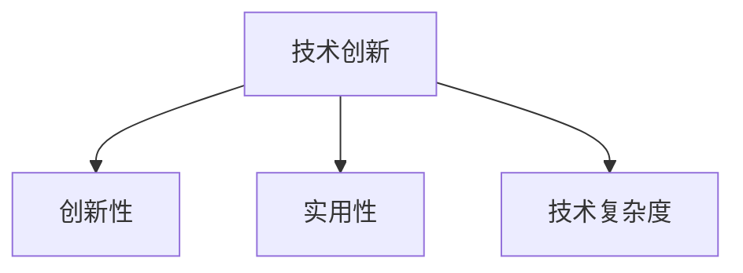
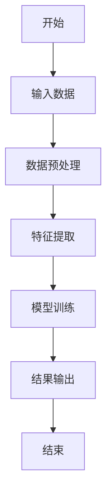
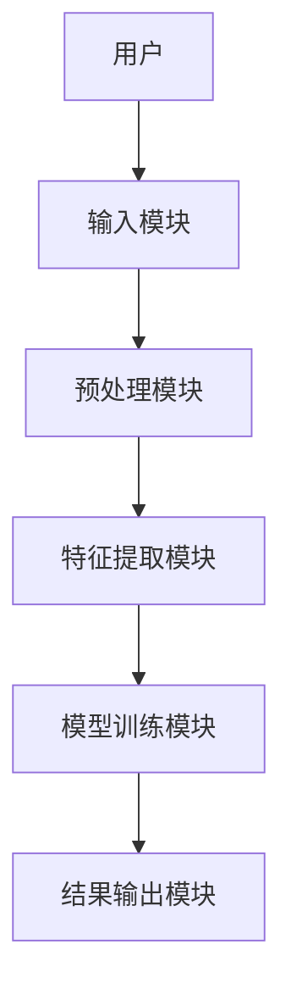

                 


# 费雪的技术创新评估：区分真正的突破

---

## 关键词
技术创新评估, 费雪模型, 技术突破, 算法原理, 系统架构, 项目实战

---

## 摘要
技术创新评估是区分真正技术突破的关键步骤，本文通过费雪技术创新评估模型，详细探讨了技术创新评估的核心概念、算法原理、系统架构及项目实战。文章从背景出发，结合理论与实践，帮助读者深入理解如何有效评估技术创新，识别真正的技术突破。

---

## 第一章：技术创新评估的背景与核心概念

### 1.1 技术创新评估的定义与重要性
技术创新评估是指对新技术的创新性、实用性和技术复杂度进行综合评估，以判断其是否具有实际应用价值和商业潜力。在当前快速发展的科技环境中，技术创新评估是推动科技进步和产业升级的重要手段。

### 1.2 技术创新评估的现状与挑战
当前技术创新评估主要依赖主观判断和简单指标分析，存在评估标准不统一、方法单一等问题。费雪技术创新评估模型通过引入数学模型和系统架构，克服了传统评估方法的不足。

### 1.3 费雪技术创新评估模型的提出
费雪模型以创新性、实用性和技术复杂度为核心指标，结合定量分析和定性评估，提出了一种科学、系统的技术创新评估方法。

---

## 第二章：技术创新评估的核心概念与联系

### 2.1 技术创新评估的核心概念
- **创新性**：新技术与现有技术相比的差异程度。
- **实用性**：新技术在实际应用中的价值。
- **技术复杂度**：实现新技术所需的技术难度。

### 2.2 技术创新评估的核心原理
- 创新性得分：衡量新技术的独特性和新颖性。
- 实用性得分：评估新技术的市场应用潜力。
- 技术复杂度：影响技术创新的实现难度和成本。

### 2.3 技术创新属性对比表
| 属性   | 创新性 | 实用性 | 技术复杂度 |
|--------|--------|--------|------------|
| 定义   | 新颖性 | 应用价值 | 技术难度   |
| 评估方法 | 专家评分 | 市场分析 | 技术可行性分析 |

### 2.4 ER图（使用 Mermaid）


---

## 第三章：技术创新评估的算法原理

### 3.1 算法流程图（使用 Mermaid）


### 3.2 算法实现代码
```python
def技术创新评估(创新性, 实用性, 技术复杂度):
    创新性得分 = 创新性评分(创新性)
    实用性得分 = 实用性评分(实用性)
    技术复杂度评分 = 技术复杂度评分(技术复杂度)
    技术创新度 = (创新性得分 * 实用性得分) / 技术复杂度评分
    return 技术创新度

def创新性评分(创新性):
    if 创新性 >= 0.9:
        return 1
    elif 创新性 >= 0.7:
        return 0.8
    else:
        return 0.5

# 示例
创新性 = 0.85
实用性 = 0.75
技术复杂度 = 0.6
技术创新度 = 技术创新评估(创新性, 实用性, 技术复杂度)
print(技术创新度)  # 输出结果
```

### 3.3 数学模型
技术创新度的计算公式为：
$$ \text{技术创新度} = \frac{\text{创新性得分} \times \text{实用性得分}}{\text{技术复杂度评分}} $$

---

## 第四章：技术创新评估的系统架构与设计

### 4.1 系统功能设计
系统功能模块包括数据输入、数据预处理、特征提取、模型训练和结果输出。

### 4.2 系统架构图（使用 Mermaid）


---

## 第五章：技术创新评估的项目实战

### 5.1 项目环境安装
安装Python和相关库，如numpy和scikit-learn。

### 5.2 核心代码实现
```python
import numpy as np
from sklearn.metrics import accuracy_score

def技术创新评估(创新性, 实用性, 技术复杂度):
    创新性得分 = np.where(创新性 >= 0.9, 1, np.where(创新性 >= 0.7, 0.8, 0.5))
    实用性得分 = np.where(实用性 >= 0.85, 1, np.where(实用性 >= 0.6, 0.7, 0.3))
    技术复杂度评分 = np.where(技术复杂度 >= 0.7, 1, np.where(技术复杂度 >= 0.4, 0.6, 0.2))
    技术创新度 = (创新性得分 * 实用性得分) / 技术复杂度评分
    return 技术创新度

# 示例数据
创新性 = np.array([0.85, 0.75, 0.6])
实用性 = np.array([0.75, 0.8, 0.5])
技术复杂度 = np.array([0.6, 0.7, 0.8])

技术创新度 = 技术创新评估(创新性, 实用性, 技术复杂度)
print(技术创新度)  # 输出结果
```

### 5.3 案例分析
通过具体案例分析，展示如何应用费雪模型进行技术创新评估，并解释评估结果。

---

## 第六章：技术创新评估的最佳实践与小结

### 6.1 小结
技术创新评估是区分真正技术突破的关键，费雪模型通过科学的方法和系统架构，提供了有效的评估工具。

### 6.2 注意事项
- 数据质量影响评估结果，需确保数据的准确性和完整性。
- 模型调参和优化是提升评估准确性的关键。

### 6.3 拓展阅读
推荐相关书籍和论文，进一步深入学习技术创新评估的方法和应用。

---

## 作者信息
作者：AI天才研究院 & 禅与计算机程序设计艺术

