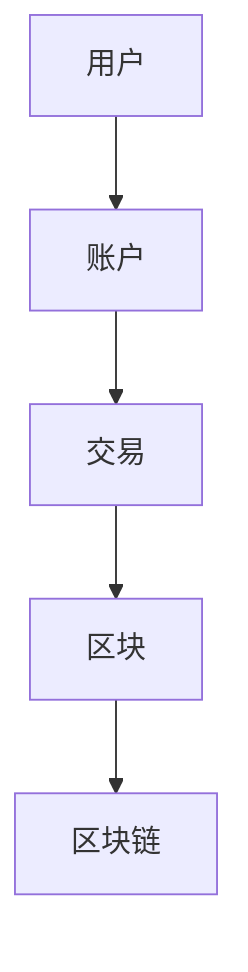
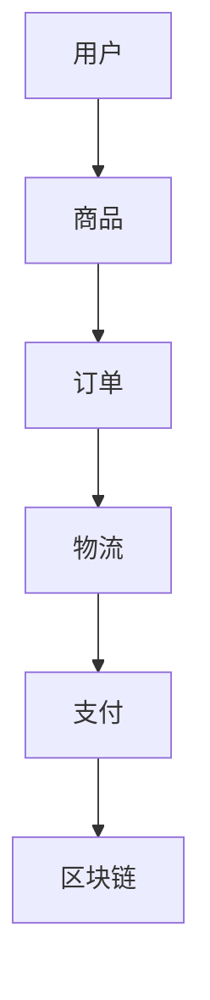
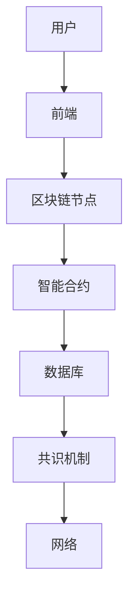
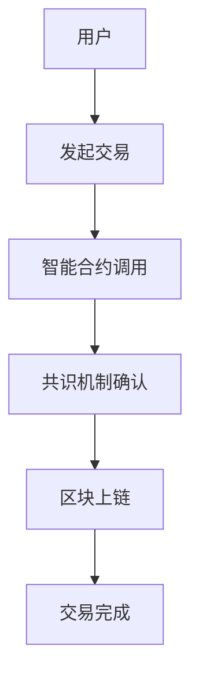

                 


# 费雪的技术创新评估：区块链技术的投资潜力分析

## 关键词：区块链，技术创新评估，投资潜力，分布式账本，共识机制，智能合约，加密算法

## 摘要：  
区块链技术作为一种革命性的分布式账本技术，近年来在金融、供应链、医疗等领域展现了巨大的应用潜力。本文通过费雪的技术创新评估框架，从技术原理、算法机制、系统架构、投资价值等多个维度，深入分析区块链技术的投资潜力。通过对区块链技术核心概念、创新性、应用案例的详细解读，结合实际的代码实现和数学模型分析，为投资者提供清晰的技术评估路径和投资建议。

---

## 第1章: 区块链技术的背景与核心概念

### 1.1 区块链技术的起源与发展  
区块链技术起源于2008年的比特币白皮书，最初旨在解决去中心化电子货币的交易问题。随着技术的发展，区块链逐渐从单一的加密货币扩展到多个领域，形成了公有链、私有链和联盟链等多种形态。区块链的核心价值在于其去中心化、不可篡改和透明性特征，这些特点使其在多个行业领域展现出巨大的应用潜力。  

---

### 1.2 区块链技术的定义与分类  
区块链是一种去中心化的分布式账本技术，通过密码学和共识机制确保数据的安全性和一致性。根据权限和应用场景的不同，区块链可以分为以下几类：  
1. **公有链**：完全去中心化，任何人都可以参与的区块链网络，如比特币和以太坊。  
2. **私有链**：仅限于特定组织或机构内部使用的区块链，通常用于企业内部的供应链管理或数据存储。  
3. **联盟链**：由多个组织共同维护的区块链网络，适用于跨机构的合作场景，如金融联盟或物流联盟。  

---

### 1.3 区块链技术的关键组件  
区块链技术的核心组件包括以下几个方面：  
1. **分布式账本**：记录所有交易数据的结构，确保数据的完整性和一致性。  
2. **共识机制**：通过算法确保所有节点达成一致，如工作量证明（PoW）、权益证明（PoS）等。  
3. **智能合约**：基于区块链的可编程规则，实现自动化的交易和执行逻辑。  
4. **加密算法**：通过密码学技术确保数据的安全性和隐私性，如哈希函数和数字签名。  

---

### 1.4 区块链技术的创新性与价值  
区块链技术的创新性主要体现在以下几个方面：  
1. **去中心化**：消除对中间机构的依赖，降低交易成本和信任成本。  
2. **不可篡改性**：通过链式结构和加密算法，确保数据的安全性和不可篡改性。  
3. **透明性**：所有交易数据公开透明，便于追溯和审计。  
4. **可编程性**：通过智能合约实现复杂的业务逻辑自动化。  

---

## 第2章: 区块链技术的核心概念与联系  

### 2.1 区块链技术的核心概念  
区块链技术的核心概念包括：  
1. **分布式账本**：数据分布在多个节点上，确保数据的高可用性和一致性。  
2. **共识机制**：通过算法确保所有节点对交易的一致性达成共识。  
3. **智能合约**：基于区块链的自动化交易规则，实现复杂的业务逻辑。  
4. **加密算法**：通过密码学技术保障数据的安全性和隐私性。  

---

### 2.2 区块链技术的核心属性特征对比  
以下是区块链技术的核心属性特征对比表：  

| 属性       | 特征                 | 说明                                                                 |
|------------|----------------------|----------------------------------------------------------------------|
| 分布式     | 去中心化             | 数据分布在网络中多个节点，无单点故障。                                 |
| 可靠性     | 容错性               | 能够容忍部分节点故障，确保系统正常运行。                               |
| 安全性     | 加密性               | 使用加密算法保障数据安全，防止数据篡改和伪造。                         |
| 可扩展性   | 并行处理能力         | 支持高并发交易，提升系统吞吐量。                                       |

---

### 2.3 区块链技术的ER实体关系图  



---

## 第3章: 区块链技术的算法原理与数学模型  

### 3.1 共识算法原理  
共识算法是区块链技术的核心，以下是几种常见的共识算法：  

1. **工作量证明（PoW）**  
   - 原理：通过计算哈希值，找到满足特定条件的随机数，证明计算过程的工作量。  
   - 优点：安全性高，防止双重支付攻击。  
   - 缺点：资源消耗大，效率较低。  

2. **权益证明（PoS）**  
   - 原理：根据节点持有的代币数量分配记账权，减少能源消耗。  
   - 优点：效率高，资源消耗低。  
   - 缺点：存在“持币者话语权”问题。  

3. **拜占庭容错（BFT）**  
   - 原理：通过投票机制达成共识，适用于节点数较少的场景。  
   - 优点：效率高，适用于联盟链。  
   - 缺点：安全性依赖于诚实节点的数量。  

---

### 3.2 区块链技术的数学模型  

1. **哈希函数**  
   $$H(x) = \text{哈希值}$$  
   哈希函数用于将任意长度的数据映射为固定长度的哈希值，确保数据的唯一性和完整性。  

2. **加密算法**  
   $$E(x) = \text{加密结果}$$  
   $$D(E(x)) = x$$  
   加密算法用于保护数据的隐私性，确保只有合法用户能够解密数据。  

---

### 3.3 共识机制的数学模型  
1. **概率一致性模型**  
   通过概率理论确保共识算法的最终一致性。  

2. **节点权重分配模型**  
   根据节点的贡献或持币数量分配记账权，提高系统的公平性和效率。  

---

## 第4章: 区块链技术的系统分析与架构设计  

### 4.1 问题场景介绍  
以供应链管理为例，区块链技术可以实现商品的全流程追踪，确保数据的真实性和透明性。  

---

### 4.2 系统功能设计  
以下是供应链管理的领域模型：  



---

### 4.3 系统架构设计  



---

### 4.4 系统交互设计  



---

## 第5章: 区块链技术的项目实战  

### 5.1 环境安装  
1. 安装Python和区块链开发框架（如Ethereum或Hyperledger）。  
2. 配置区块链网络环境，启动节点。  

### 5.2 核心实现源代码  

```python
# 智能合约实现（以太坊Solidity）
pragma solidity ^0.8.0;

contract SupplyChain {
    struct Item {
        uint id;
        string name;
        address owner;
        uint price;
    }

    event ItemCreated(uint id, string name, address owner, uint price);

    function createItem(string memory name, uint price) public {
        Item memory newItem = Item({
            id: block.timestamp,
            name: name,
            owner: msg.sender,
            price: price
        });
        emit ItemCreated(newItem.id, newItem.name, newItem.owner, newItem.price);
    }
}
```

### 5.3 案例分析与代码解读  
以上代码实现了一个简单的供应链管理智能合约，用户可以创建商品信息，合约会记录商品的创建时间、名称、所有者和价格，并通过事件通知区块链网络。  

---

## 第6章: 区块链技术的投资潜力与注意事项  

### 6.1 投资潜力分析  
1. **技术创新**：区块链技术的去中心化和不可篡改性使其在多个领域具有广泛应用潜力。  
2. **市场需求**：随着企业数字化转型的推进，区块链技术的应用场景不断扩展。  
3. **政策支持**：多个国家和地区开始出台政策支持区块链技术的发展，为其商业化提供了良好的环境。  

### 6.2 投资注意事项  
1. **技术风险**：区块链技术仍处于快速发展阶段，存在技术瓶颈和安全隐患。  
2. **市场风险**：区块链市场波动较大，投资者需谨慎选择项目。  
3. **合规性**：需关注各国的政策法规，确保投资项目的合法性。  

---

## 小结  
区块链技术作为一项具有革命性的技术创新，其在投资潜力和应用前景方面具有重要意义。通过技术创新评估框架，我们可以更好地理解区块链技术的核心价值和应用潜力。投资者在进行区块链技术投资时，需结合技术、市场和政策等多方面因素，做出科学的投资决策。  

---

## 作者：AI天才研究院/AI Genius Institute & 禅与计算机程序设计艺术 /Zen And The Art of Computer Programming

