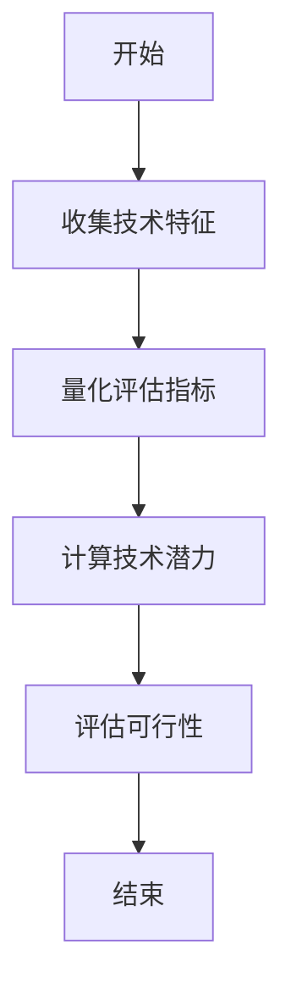
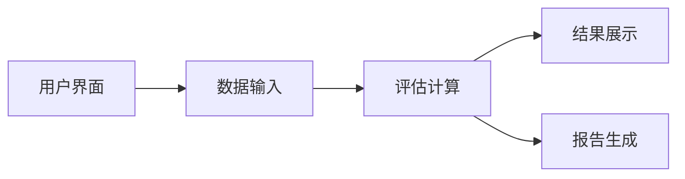

                 


# 费雪的技术创新评估：未来领导者的特征

> 关键词：技术创新评估，未来领导者，费雪模型，领导力特征，系统架构，技术创新

> 摘要：本文系统地探讨了费雪技术创新评估模型的核心原理及其在领导力特征分析中的应用，通过详细的技术背景介绍、模型算法解析、系统架构设计和实际案例分析，揭示了技术创新评估在未来领导力发展中的重要性。文章从理论到实践，深入分析了技术创新评估的数学模型、系统架构、项目实现和最佳实践，为读者提供了全面的理解和实用的指导。

---

## 第一部分：技术创新评估的背景与意义

### 第1章：技术创新评估的背景介绍

#### 1.1 技术创新评估的核心概念

##### 1.1.1 问题背景与问题描述
技术创新是推动社会进步的核心动力，而技术创新评估则是确保技术创新能够有效落地的关键环节。随着技术的快速发展，传统的评估方法已难以满足现代需求。费雪技术创新评估模型作为一种新兴的方法，旨在通过系统化的方式评估技术创新的价值和潜力。

##### 1.1.2 技术创新评估的目标与意义
技术创新评估的目标在于识别具有潜力的技术，并为决策者提供科学依据。其意义在于优化资源配置、降低创新风险，并加速技术的商业化进程。通过技术创新评估，领导者可以更有效地把握技术发展趋势，制定战略规划。

##### 1.1.3 技术创新评估的边界与外延
技术创新评估的边界包括技术可行性、市场潜力和经济可行性。其外延则涉及技术生命周期、团队能力和社会影响等多个方面。

##### 1.1.4 技术创新评估的核心要素组成
技术创新评估的核心要素包括技术成熟度、市场需求、团队能力和实施成本。

#### 1.2 未来领导者的特征演变

##### 1.2.1 技术创新对领导力的影响
技术创新对领导力的影响主要体现在对技术的理解能力、团队协作能力和决策能力的要求上。未来领导者需要具备技术敏锐度、创新思维和战略眼光。

##### 1.2.2 未来领导者的角色与责任
未来领导者不仅是决策者，更是技术创新的推动者和团队的赋能者。他们需要具备跨学科知识，能够协调技术团队与业务部门，推动技术创新的落地。

##### 1.2.3 费雪模型的基本概念
费雪模型是一种基于技术创新评估的数学模型，通过量化指标评估技术的潜力和可行性。其核心在于将技术特征与市场需求相结合，提供科学的评估依据。

---

### 第2章：技术创新评估的核心概念与联系

#### 2.1 技术创新评估的原理与框架

##### 2.1.1 费雪模型的原理
费雪模型通过量化指标对技术创新进行评估，其原理包括技术可行性分析、市场需求分析和经济可行性分析。

##### 2.1.2 费雪模型的核心要素
费雪模型的核心要素包括技术创新的市场规模、技术成熟度、实施成本和团队能力。

##### 2.1.3 费雪模型的评估方法
费雪模型通过构建数学模型，结合加权评分法对技术创新进行综合评估。

#### 2.2 技术创新评估与领导力的关联

##### 2.2.1 技术创新评估的领导力特征
技术创新评估的领导力特征包括技术创新的敏锐度、团队协作能力、决策能力和风险控制能力。

##### 2.2.2 费雪模型与领导力的结合
费雪模型为领导者提供了科学的决策工具，帮助领导者更好地把握技术创新的方向和节奏。

##### 2.2.3 费雪模型与传统模型的对比
与传统模型相比，费雪模型更加注重技术的量化评估和市场需求的结合。

---

## 第二部分：技术创新评估的算法原理与数学模型

### 第3章：技术创新评估的算法原理

#### 3.1 费雪模型的算法流程

##### 3.1.1 算法流程图（Mermaid）


##### 3.1.2 算法的详细步骤
1. 收集技术特征：包括技术成熟度、市场需求、实施成本等。
2. 量化评估指标：将技术特征转化为可量化的指标。
3. 计算技术潜力：通过数学模型计算技术的潜力。
4. 评估可行性：结合实际条件评估技术的可行性。

##### 3.1.3 算法的Python实现代码
```python
def fisher_technology_assessment(technology_features):
    # 定义评估指标权重
    weights = {'market_size': 0.3, 'maturity': 0.4, 'cost': 0.3}
    # 计算加权评分
    score = 0
    for feature in technology_features:
        score += technology_features[feature] * weights[feature]
    return score

# 示例使用
technology_features = {
    'market_size': 80,
    'maturity': 70,
    'cost': 60
}
result = fisher_technology_assessment(technology_features)
print(f"技术创新评估得分为：{result}")
```

#### 3.2 数学模型与公式

##### 3.2.1 技术创新评估的数学模型
$$ \text{技术创新潜力} = \sum_{i=1}^{n} w_i x_i $$
其中，$w_i$ 是第$i$个指标的权重，$x_i$ 是第$i$个指标的评分。

##### 3.2.2 费雪模型的核心公式
$$ \text{技术潜力} = \sum_{i=1}^{m} w_i x_i $$
其中，$m$ 是指标的数量，$w_i$ 是权重，$x_i$ 是评分。

##### 3.2.3 公式的详细推导
通过权重分配和评分计算，费雪模型能够量化技术的潜力和可行性。

### 第4章：技术创新评估的系统架构与项目实战

#### 4.1 系统架构设计

##### 4.1.1 系统功能设计
系统功能包括数据输入、评估计算、结果展示和报告生成。

##### 4.1.2 系统架构图（Mermaid）


##### 4.1.3 系统接口设计
系统接口包括数据输入接口、评估计算接口和报告生成接口。

##### 4.1.4 系统交互图（Mermaid）


#### 4.2 项目实战

##### 4.2.1 环境安装
需要安装Python和相关库，如numpy和pandas。

##### 4.2.2 系统核心实现源代码
```python
import numpy as np
import pandas as pd

def main():
    # 数据输入
    data = pd.read_csv('technology.csv')
    # 评估计算
    weights = {'market_size': 0.3, 'maturity': 0.4, 'cost': 0.3}
    scores = []
    for index, row in data.iterrows():
        score = 0
        for feature in ['market_size', 'maturity', 'cost']:
            score += row[feature] * weights[feature]
        scores.append(score)
    # 结果展示
    result = pd.DataFrame({'技术名称': data['name'], '评估得分': scores})
    print(result)

if __name__ == "__main__":
    main()
```

##### 4.2.3 实际案例分析
通过具体案例分析，展示费雪模型在技术创新评估中的实际应用。

---

## 第三部分：技术创新评估的总结与展望

### 第5章：技术创新评估的总结与展望

#### 5.1 最佳实践 tips
- 确保数据的准确性和完整性。
- 结合实际情况调整权重和指标。

#### 5.2 小结
技术创新评估是未来领导者必备的技能，费雪模型为技术创新评估提供了科学的工具和方法。

#### 5.3 注意事项
- 避免过于依赖模型，结合实际情况进行判断。
- 定期更新模型和指标，以适应技术的发展。

#### 5.4 拓展阅读
推荐阅读相关技术书籍和论文，深入理解技术创新评估的理论和实践。

---

作者：AI天才研究院 & 禅与计算机程序设计艺术

