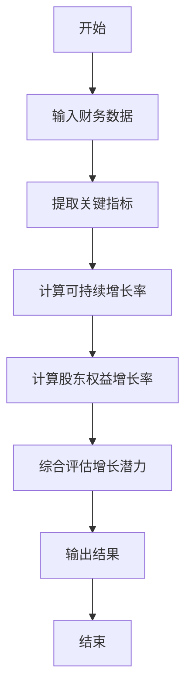
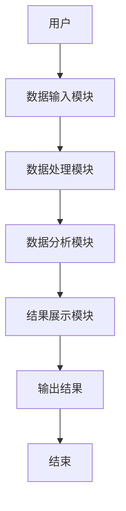

                 


# 费雪的未来增长潜力评估：看透当前财务数据

## 关键词：
- 费雪模型
- 财务数据分析
- 企业增长潜力
- 可持续增长率
- 股东权益增长率

## 摘要：
本文将详细介绍费雪的未来增长潜力评估模型，通过分析企业的财务数据，揭示如何通过该模型预测企业的未来增长潜力。文章从理论基础到算法实现，再到系统设计和项目实战，全面解析费雪模型的应用。我们还将讨论如何通过优化财务指标和数据分析方法，提升企业增长潜力评估的准确性。

---

# 第1章 费雪的未来增长潜力评估概述

## 1.1 问题背景与重要性

### 1.1.1 企业增长潜力评估的必要性
企业在竞争激烈的市场环境中，需要通过评估自身的增长潜力来制定战略决策。财务数据作为企业经营状况的核心反映，是评估增长潜力的重要依据。

### 1.1.2 财务数据在增长潜力评估中的核心作用
财务数据能够揭示企业的盈利能力、资本结构和资产状况，这些因素直接影响企业的增长潜力。

### 1.1.3 费雪模型的提出与目标
菲舍尔（Fisher）提出了一种基于财务数据的增长潜力评估方法，旨在通过分析企业的财务指标，预测其未来的增长潜力。

## 1.2 费雪模型的核心概念与原理

### 1.2.1 费雪模型的定义与基本假设
费雪模型通过分析企业的可持续增长率（Sustainable Growth Rate）和股东权益增长率（Shareholder's Equity Growth Rate），评估企业的未来增长潜力。

### 1.2.2 费雪模型的输入变量与输出结果
- **输入变量**：ROE（净资产收益率）、资本结构（D/E）、行业平均增长率等。
- **输出结果**：可持续增长率、股东权益增长率、综合增长潜力评分。

## 1.3 费雪模型与传统财务分析的对比

### 1.3.1 传统财务分析方法的局限性
传统方法通常只关注单个财务指标，缺乏对企业整体增长潜力的综合评估。

### 1.3.2 费雪模型的优势与创新点
费雪模型通过综合分析多个财务指标，结合企业的资本结构和行业特点，提供更全面的增长潜力评估。

### 1.3.3 费雪模型的应用场景与边界条件
适用于上市公司和非上市公司，但需注意模型的假设条件，如资本结构稳定性和行业周期性影响。

---

# 第2章 费雪模型的数学原理与算法实现

## 2.1 费雪模型的数学模型与公式

### 2.1.1 可持续增长率的计算公式
$$ g = \frac{ROE \times (1 - \frac{D}{E})}{1 - ROE \times (1 - \frac{D}{E})} $$

### 2.1.2 股东权益增长率的计算公式
$$ g_{ shareholders} = \frac{ROE \times (1 - \frac{D}{E})}{1 - ROE \times (1 - \frac{D}{E})} $$

## 2.2 费雪模型的算法实现与流程图

### 2.2.1 数据输入与处理流程


## 2.3 费雪模型的假设条件与限制

### 2.3.1 财务数据的假设条件
- 数据完整性：财务数据需完整且准确。
- 资本结构稳定性：资本结构在评估期间保持稳定。

### 2.3.2 模型的局限性与改进方向
- 未考虑通货膨胀和行业周期性影响。
- 可通过引入更多变量（如行业增长率）进行改进。

---

# 第3章 费雪模型的系统架构设计

## 3.1 系统功能模块划分

### 3.1.1 数据输入模块
负责接收企业的财务数据，包括收入、利润、资产、负债和所有者权益等。

### 3.1.2 数据分析模块
对输入的财务数据进行清洗、预处理和关键指标提取。

### 3.1.3 结果展示模块
将计算出的可持续增长率和股东权益增长率以图表和报告形式展示。

## 3.2 系统架构设计

### 3.2.1 系统功能设计


### 3.2.2 系统架构设计


---

# 第4章 费雪模型的项目实战

## 4.1 环境安装与工具准备

### 4.1.1 Python环境安装
安装Python和必要的库，如Pandas、NumPy、Matplotlib。

### 4.1.2 数据处理工具安装
安装Jupyter Notebook或PyCharm用于代码开发。

## 4.2 核心代码实现

### 4.2.1 数据提取与处理
```python
import pandas as pd

# 读取财务数据
df = pd.read_csv('financial_data.csv')

# 提取关键指标
roe = df['ROE'].values
debt_equity = df['D/E'].values
```

### 4.2.2 可持续增长率计算
```python
def calculate_sustainable_growth(roe, debt_equity):
    numerator = roe * (1 - debt_equity)
    denominator = 1 - roe * (1 - debt_equity)
    return numerator / denominator

sustainable_growth = calculate_sustainable_growth(roe, debt_equity)
```

### 4.2.3 股东权益增长率计算
```python
def calculate_shareholder_growth(roe, debt_equity):
    numerator = roe * (1 - debt_equity)
    denominator = 1 - roe * (1 - debt_equity)
    return numerator / denominator

shareholder_growth = calculate_shareholder_growth(roe, debt_equity)
```

## 4.3 实际案例分析

### 4.3.1 数据分析与解读
以某公司为例，计算其可持续增长率和股东权益增长率，并结合行业平均水平进行对比分析。

### 4.3.2 结果展示与解释
通过图表展示计算结果，并对企业未来增长潜力进行详细解读。

---

# 第5章 费雪模型的最佳实践与注意事项

## 5.1 最佳实践 tips

### 5.1.1 数据质量的重要性
确保输入数据的准确性和完整性。

### 5.1.2 模型适用性
根据企业实际情况选择合适的模型参数。

## 5.2 小结
费雪模型通过分析企业的财务数据，能够有效评估其未来增长潜力，帮助企业制定科学的战略决策。

## 5.3 注意事项

### 5.3.1 模型的局限性
费雪模型假设资本结构稳定，未考虑行业周期性影响。

### 5.3.2 数据更新频率
定期更新财务数据，确保评估结果的准确性。

## 5.4 拓展阅读
建议进一步学习财务分析和投资学相关知识，以更好地应用费雪模型。

---

# 作者：AI天才研究院/AI Genius Institute & 禅与计算机程序设计艺术 /Zen And The Art of Computer Programming

