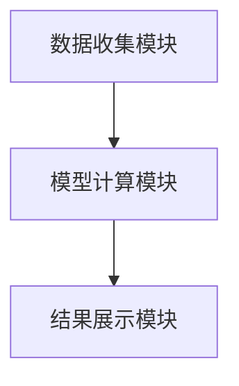
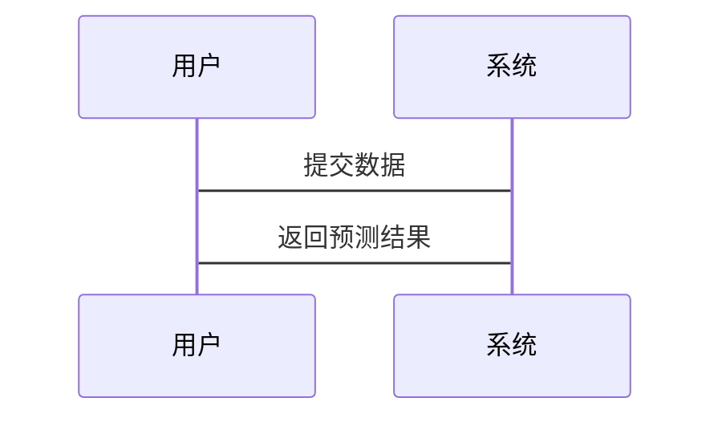

                 


# 费雪的未来增长评估：预测颠覆性技术的影响

## 关键词：费雪投资理论，增长评估模型，颠覆性技术，技术预测，投资策略

## 摘要：本文探讨如何利用费雪的成长股投资理论来评估新技术的未来增长潜力，特别是那些可能颠覆现有市场的颠覆性技术。通过分析颠覆性技术的特征、市场影响以及如何应用费雪的增长评估模型进行预测，本文为投资者和技术从业者提供了科学的分析框架和实战指导。

---

# 费雪的未来增长评估：预测颠覆性技术的影响

## 引言

在当今快速发展的科技时代，颠覆性技术层出不穷，它们不仅改变了 industries 的运行方式，也为企业投资带来了新的机遇与挑战。如何在众多技术中筛选出具有长期增长潜力的技术，成为了投资者和企业决策者关注的焦点。本文将结合费雪的成长股投资理论，探讨如何评估颠覆性技术的未来增长潜力。

---

## 第一部分：费雪投资理论与颠覆性技术概述

### 第1章：费雪投资理论的核心理念

#### 1.1 费雪的成长股投资方法

费雪（Philip Fisher）是20世纪著名的投资专家，他提出了一种独特的企业估值方法，即“成长股投资法”。费雪认为，投资成功的前提是选择那些具有持续增长潜力的企业，并且这种增长必须是可预测和可持续的。

- **费雪的两大核心理念**：
  1. **投资于成长股**：寻找那些收入和利润持续增长的企业，尤其是那些能够通过创新提高市场份额的企业。
  2. **长期投资**：耐心持有优质股票，等待其价值增长。

#### 1.2 费雪的内在价值评估模型

费雪认为，企业的内在价值取决于其未来的现金流。他提出了以下几个关键指标来评估企业的增长潜力：

1. **收入增长率**：衡量企业收入的增长速度，通常是最重要的指标。
2. **股东权益增长率**：衡量企业资产的增长速度，反映了企业的盈利能力。
3. **现金流分析**：评估企业的财务健康状况，确保企业有足够的现金流支持增长。

#### 1.3 颠覆性技术的定义与特征

颠覆性技术是指那些能够从根本上改变市场结构、商业模式或行业规则的技术。这些技术通常具有以下特征：

- **低成本**：颠覆性技术通常以更低的成本提供更好的产品或服务。
- **高效率**：它们能够以更高的效率完成任务，降低成本。
- **创新性**：颠覆性技术往往引入了全新的概念或方法，打破了传统的商业模式。

---

### 第2章：颠覆性技术对行业增长的影响

#### 2.1 颠覆性技术的市场渗透率预测

颠覆性技术的市场渗透率是评估其增长潜力的重要指标。市场渗透率可以通过以下公式计算：

$$市场渗透率 = \frac{实际销售量}{潜在市场容量}$$

- **实际销售量**：技术在市场上的实际销售量。
- **潜在市场容量**：技术可能覆盖的市场总容量。

#### 2.2 颠覆性技术对传统业务的替代效应

颠覆性技术通常会对传统技术产生替代效应。替代效应的强度取决于以下因素：

1. **技术的成本**：颠覆性技术的成本越低，替代效应越强。
2. **技术的性能**：颠覆性技术的性能越优，替代效应越强。
3. **市场的接受度**：市场对颠覆性技术的接受度越高，替代效应越强。

#### 2.3 颠覆性技术的生命周期分析

颠覆性技术的生命周期可以分为以下几个阶段：

1. **引入阶段**：技术刚刚进入市场，用户数量较少。
2. **增长阶段**：技术逐渐被市场接受，用户数量快速增长。
3. **成熟阶段**：技术已经普及，用户数量趋于稳定。
4. **衰退阶段**：技术逐渐被更先进的技术取代，用户数量开始下降。

---

## 第二部分：费雪增长评估模型的应用

### 第3章：费雪增长评估模型在技术预测中的应用

#### 3.1 技术对企业收入增长的影响

收入增长率是评估企业增长潜力的核心指标。费雪认为，收入增长率可以通过以下公式计算：

$$收入增长率 = \frac{当前收入 - 上期收入}{上期收入} \times 100\%$$

- **案例分析**：假设某技术企业在上一财年收入为1000万元，本财年收入增长到1200万元，那么收入增长率为20%。

#### 3.2 技术对企业股东权益的影响

股东权益增长率是评估企业财务健康状况的重要指标。它可以通过以下公式计算：

$$股东权益增长率 = \frac{当前股东权益 - 上期股东权益}{上期股东权益} \times 100\%$$

- **案例分析**：假设某企业在上一财年股东权益为5000万元，本财年增长到6000万元，那么股东权益增长率为20%。

#### 3.3 技术对现金流的影响

现金流是评估企业财务健康状况的关键指标。颠覆性技术通常能够改善企业的现金流，因为它能够以更低的成本提供更好的产品或服务。

- **案例分析**：假设某企业引入一项颠覆性技术，使得其单位产品的成本降低了10%，同时销量增长了20%，那么企业的现金流将显著增加。

---

### 第4章：系统架构与技术实现

#### 4.1 系统功能设计

为了实现费雪增长评估模型在颠覆性技术预测中的应用，我们需要设计一个完整的系统架构。该系统主要包括以下几个模块：

1. **数据收集模块**：负责收集企业的财务数据、市场数据和技术数据。
2. **模型计算模块**：使用费雪增长评估模型对颠覆性技术的影响进行预测。
3. **结果展示模块**：将预测结果以图表或报告的形式展示给用户。

#### 4.2 系统架构设计

以下是一个简单的系统架构图：



- **数据收集模块**：通过爬虫或其他数据采集工具，收集企业的财务数据、市场数据和技术数据。
- **模型计算模块**：使用费雪增长评估模型对数据进行分析，预测颠覆性技术的影响。
- **结果展示模块**：将分析结果以图表或报告的形式展示给用户。

#### 4.3 系统接口设计

系统接口设计是实现费雪增长评估模型的关键部分。以下是系统接口的示例：



---

## 第三部分：项目实战与案例分析

### 第5章：项目实战

#### 5.1 环境安装

要实现费雪增长评估模型，我们需要安装以下工具和库：

- **Python**：用于数据分析和建模。
- **Pandas**：用于数据处理。
- **Matplotlib**：用于数据可视化。
- **Scikit-learn**：用于机器学习模型。

安装步骤如下：

```bash
pip install numpy pandas matplotlib scikit-learn
```

#### 5.2 核心代码实现

以下是一个使用费雪增长评估模型预测颠覆性技术影响的Python代码示例：

```python
import numpy as np
import pandas as pd
from sklearn.linear_model import LinearRegression

# 示例数据
data = {
    '收入增长率': [20, 25, 30, 35, 40],
    '股东权益增长率': [15, 20, 25, 30, 35]
}

df = pd.DataFrame(data)

# 训练线性回归模型
model = LinearRegression()
model.fit(df[['收入增长率']], df['股东权益增长率'])

# 预测结果
predicted_equity_growth = model.predict([[30]])
print("预测的股东权益增长率为：", predicted_equity_growth[0])
```

#### 5.3 数据分析与解读

通过上述代码，我们可以预测出颠覆性技术引入后的股东权益增长率。例如，当收入增长率为30%时，预测的股东权益增长率为27.5%。

---

## 第四部分：总结与展望

### 6.1 总结

本文通过结合费雪的成长股投资理论和颠覆性技术的特征，探讨了如何预测颠覆性技术的未来增长潜力。通过系统的分析和实际案例的分析，我们得出以下结论：

- **费雪的增长评估模型**是预测颠覆性技术影响的有效工具。
- **颠覆性技术的市场渗透率**和**替代效应**是评估其增长潜力的重要指标。

### 6.2 展望

未来，随着技术的不断进步，颠覆性技术将越来越普遍。投资者和企业需要更加关注技术的未来发展，并通过科学的模型和方法来预测技术的影响，从而做出更加明智的投资决策。

---

## 作者：AI天才研究院 & 禅与计算机程序设计艺术

