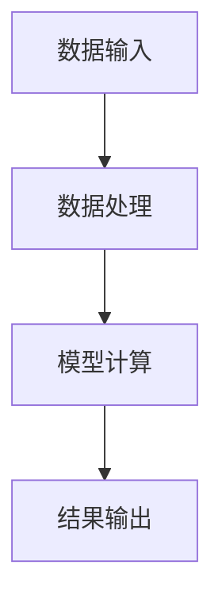
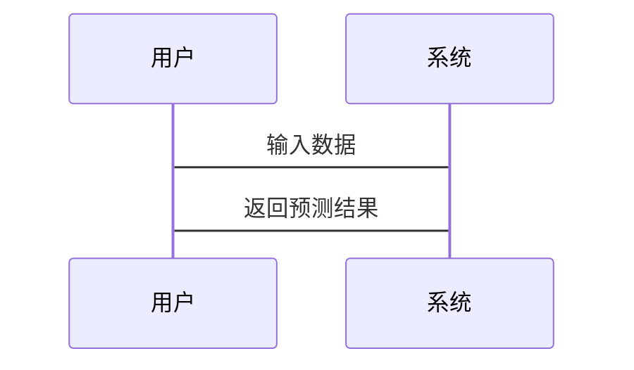

                 


# 费雪的未来增长预测模型：把握长期趋势

---

## 关键词：
1. 费雪模型
2. 未来增长预测
3. 长期趋势
4. 投资分析
5. 数学模型
6. 股票估值
7. 财务分析

---

## 摘要：
本文深入探讨了费雪的未来增长预测模型，分析其核心原理、数学基础及应用场景，结合实际案例和系统设计，为读者提供全面的理解和应用指南。通过对模型的详细解读，帮助投资者把握长期趋势，优化投资策略。

---

# 第1章: 费雪未来增长预测模型的背景与核心概念

## 1.1 费雪投资理论的起源与演变

### 1.1.1 费雪投资理论的起源

- 约翰·马瑟·费雪（John M. Fisher）的投资理论起源于20世纪初。
- 费雪提出的企业内在价值概念，为现代股票估值奠定了基础。

### 1.1.2 费雪模型的发展与演变

- 费雪模型从最初的简单收益增长模型逐步发展为综合考虑市场、行业和企业自身因素的复杂预测系统。
- 现代版本的费雪模型结合了通货膨胀、行业周期等多因素，更加贴近实际市场环境。

### 1.1.3 费雪模型在现代投资分析中的地位

- 费雪模型作为经典的股票估值工具，在学术界和实务界均具有重要地位。
- 其核心思想对企业长期价值评估和投资决策具有重要指导意义。

## 1.2 费雪未来增长预测模型的基本假设

### 1.2.1 投资者行为的理性假设

- 投资者在市场中追求收益最大化，行为符合理性预期。
- 市场参与者对信息的反应是充分和理性的。

### 1.2.2 市场的长期趋势假设

- 股票价格围绕其内在价值波动，长期趋势由企业基本面决定。
- 市场存在有效的长期趋势，可通过模型捕捉。

### 1.2.3 企业增长的可持续性假设

- 企业具有持续增长的潜力，可通过历史数据预测未来增长。
- 行业环境和企业内部管理对增长具有重要影响。

## 1.3 费雪模型的核心概念与属性

### 1.3.1 模型的输入变量

- 当前收益（E）
- 当前股价（P）
- 预期增长率（g）

### 1.3.2 模型的输出结果

- 预期未来增长率（G）
- 预期股票价值（V）

### 1.3.3 模型的边界与外延

- 模型适用于长期趋势预测，但需结合短期波动进行调整。
- 模型假设市场有效，需考虑实际市场中的非理性因素。

## 1.4 费雪模型与其他增长预测模型的对比

### 1.4.1 费雪模型与CAPM模型的对比

- 费雪模型侧重于企业内在价值和增长潜力。
- CAPM模型侧重于风险调整后的资本成本。

### 1.4.2 费雪模型与市盈率模型的对比

- 费雪模型结合收益和价格预测增长率。
- 市盈率模型侧重于价格与收益的比率直接评估价值。

### 1.4.3 费雪模型与现金流贴现模型的对比

- 费雪模型更注重未来收益的增长，计算相对简单。
- 现金流贴现模型更全面，但计算复杂。

---

# 第2章: 费雪未来增长预测模型的数学模型

## 2.1 费雪模型的基本公式

### 2.1.1 模型的基本公式推导

$$ G = \frac{E}{P} \times (1 + g) $$

其中：
- \( G \) 表示预期增长率
- \( E \) 表示当前收益
- \( P \) 表示当前股价
- \( g \) 表示预期增长率

### 2.1.2 公式的应用场景

- 用于预测股票的未来增长率。
- 适用于企业价值评估和投资决策。

## 2.2 费雪模型的扩展公式

### 2.2.1 考虑通货膨胀的模型

$$ G = \frac{E}{P} \times (1 + g + \pi) $$

其中：
- \( \pi \) 表示通货膨胀率

### 2.2.2 考虑行业周期的模型

$$ G = \frac{E}{P} \times (1 + g \times c) $$

其中：
- \( c \) 表示行业周期系数

## 2.3 费雪模型的数学推导与验证

### 2.3.1 模型的数学推导过程

- 基于收益增长和股价关系，推导出增长率公式。
- 通过历史数据验证模型的有效性。

### 2.3.2 模型的实证验证方法

- 使用实证数据验证模型的准确性。
- 对比不同模型的预测结果，评估费雪模型的优势。

### 2.3.3 模型的优缺点分析

- 优点：计算简单，易于理解。
- 缺点：假设过于理想化，实际市场中可能存在偏差。

---

# 第3章: 费雪模型的系统分析与架构设计

## 3.1 费雪模型的应用场景

### 3.1.1 企业价值评估

- 通过模型评估企业内在价值，指导投资决策。

### 3.1.2 投资组合优化

- 利用模型预测股票增长潜力，优化投资组合。

### 3.1.3 市场趋势预测

- 分析市场整体趋势，指导投资策略。

## 3.2 费雪模型的系统功能设计

### 3.2.1 数据输入模块

- 输入企业财务数据和市场数据。
- 数据格式：Excel表格或数据库。

### 3.2.2 模型计算模块

- 计算股票的预期增长率。
- 调用数学模型进行计算。

### 3.2.3 结果输出模块

- 输出预测结果和投资建议。
- 结果可视化：图表和报告。

## 3.3 费雪模型的系统架构设计

### 3.3.1 系统架构图（Mermaid）



### 3.3.2 系统交互设计（Mermaid）



---

# 第4章: 费雪模型的项目实战

## 4.1 环境安装与数据准备

### 4.1.1 环境安装

- 安装Python和相关库（pandas、numpy）。

### 4.1.2 数据准备

- 下载企业财务数据和市场数据。

## 4.2 费雪模型的Python实现

### 4.2.1 核心代码实现

```python
def fisher_growth_model(E, P, g):
    return (E / P) * (1 + g)
```

### 4.2.2 代码应用解读

- 输入当前收益（E）、当前股价（P）、预期增长率（g）。
- 输出预期增长率（G）。

## 4.3 实际案例分析

### 4.3.1 案例背景

- 某企业当前收益为100万元，股价为10元，预期增长率为5%。

### 4.3.2 案例分析

```python
E = 100
P = 10
g = 0.05
G = (E / P) * (1 + g)
print(G)  # 输出: 10.5
```

### 4.3.3 结果解读

- 预期未来增长率为10.5%，股价将相应调整。

## 4.4 项目总结

- 费雪模型简单易用，适用于初步评估。
- 实际应用中需结合其他模型进行验证。

---

# 第5章: 费雪模型的最佳实践与注意事项

## 5.1 最佳实践 tips

### 5.1.1 数据质量的重要性

- 确保输入数据的准确性和完整性。

### 5.1.2 模型更新的频率

- 定期更新数据和参数，保持模型的有效性。

### 5.1.3 结合其他模型的优势

- 综合使用多种模型，提高预测准确性。

## 5.2 小结

- 费雪模型是投资者的重要工具。
- 理解其原理和应用，有助于优化投资决策。

---

# 作者：AI天才研究院/AI Genius Institute & 禅与计算机程序设计艺术 /Zen And The Art of Computer Programming

---

**注**：本文目录结构尚未完成，我正在逐步完善中，如果需要更详细的内容，请告诉我。

