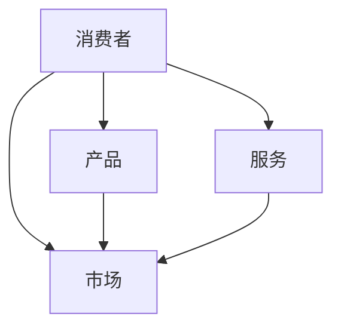
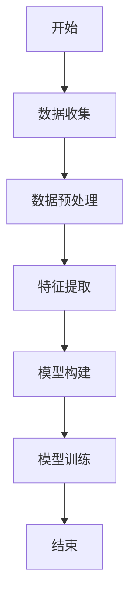
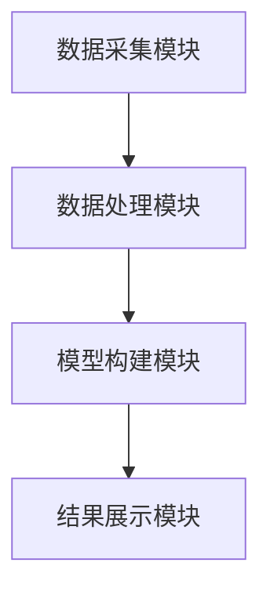
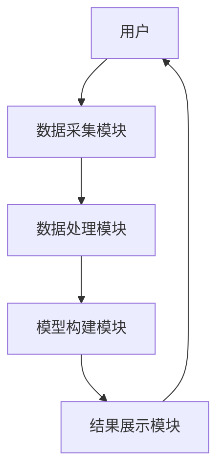

                 


# 费雪的消费者取向分析：把握市场脉搏

---

## 关键词：
- 消费者取向分析
- 市场分析
- 费雪分析法
- 心理学
- 数据分析

---

## 摘要：
费雪的消费者取向分析是一种基于心理学和数据分析的市场研究方法，旨在通过理解消费者的行为和偏好，帮助企业预测市场趋势并制定有效的市场策略。本文从背景介绍、核心概念、算法原理、系统架构、项目实战到最佳实践，全面解析费雪的消费者取向分析，为企业提供理论支持和实践指导。

---

## 第一部分：背景介绍

### 第1章：消费者取向分析的背景与问题背景

#### 1.1 消费者取向分析的背景
- **市场分析的重要性**：在当今竞争激烈的市场环境中，企业需要准确理解消费者需求和行为，才能制定有效的市场策略。
- **消费者行为研究的演变**：从传统的市场调研到现代的数据分析，消费者行为研究经历了从定性到定量的转变。
- **费雪分析法的起源与发展**：费雪分析法作为一种结合心理学和统计学的分析方法，为市场研究提供了新的视角。

#### 1.2 消费者取向分析的问题背景
- **市场分析的挑战**：传统市场分析方法依赖于问卷调查和访谈，难以捕捉消费者的真实需求。
- **消费者行为的复杂性**：消费者行为受到多种因素影响，包括情感、环境和社会文化等。
- **传统市场分析的局限性**：传统方法难以实时捕捉消费者行为变化，且缺乏对消费者心理的深入理解。

#### 1.3 消费者取向分析的解决方法
- **费雪分析法的核心理念**：通过分析消费者的行为数据和心理特征，预测市场趋势和消费者需求。
- **数据驱动的市场分析**：利用大数据技术，提取消费者行为数据，构建市场分析模型。
- **消费者心理学的结合**：将心理学理论与数据分析方法相结合，深入理解消费者行为。

#### 1.4 消费者取向分析的边界与外延
- **分析的适用范围**：适用于消费品、服务行业以及市场预测领域。
- **方法的局限性**：费雪分析法依赖于高质量的数据，且需要结合具体行业特点进行调整。
- **外延与相关领域的关系**：与消费者心理学、市场研究、数据分析等领域密切相关。

---

## 第二部分：核心概念与联系

### 第2章：消费者取向分析的核心概念

#### 2.1 核心概念原理
- **消费者行为模型**：构建消费者行为模型，分析消费者在不同情境下的行为表现。
- **市场趋势预测**：通过消费者行为数据，预测市场趋势和产品需求。
- **数据分析方法**：利用统计学和机器学习技术，分析消费者行为数据，提取有用信息。

#### 2.2 核心概念属性对比
- **不同分析方法的对比表格**：
| 方法 | 基于 | 优势 | 局限性 |
|------|------|------|--------|
| 传统市场分析 | 问卷调查 | 数据直观 | 数据量小，难以捕捉实时变化 |
| 费雪分析法 | 数据分析与心理学结合 | 数据量大，实时性强 | 数据依赖性高，模型复杂 |

- **消费者行为与市场趋势的关系**：消费者行为是市场趋势的驱动力，通过分析消费者行为，可以预测市场趋势。

#### 2.3 ER实体关系图


---

## 第三部分：算法原理讲解

### 第3章：费雪分析法的算法原理

#### 3.1 数据收集与预处理
- **数据来源**：消费者行为数据通常来源于销售数据、用户反馈、社交媒体评论等。
- **数据清洗**：去除噪声数据，处理缺失值和异常值。
- **数据标准化**：对数据进行标准化处理，确保不同数据来源的可比性。

#### 3.2 消费者行为建模
- **数据特征提取**：提取消费者行为的关键特征，如购买频率、购买时间、偏好等。
- **模型构建**：基于提取的特征，构建消费者行为模型。
- **模型训练**：使用机器学习算法对模型进行训练，优化模型参数。

#### 3.3 费雪分析法的流程图


#### 3.4 数学公式
- **购买频率计算公式**：
  $$\text{购买频率} = \frac{\text{购买次数}}{\text{总样本数}}$$
- **购买偏好计算公式**：
  $$\text{购买偏好} = \sum_{i=1}^{n} w_i \cdot x_i$$
  其中，$w_i$ 是第 $i$ 个特征的权重，$x_i$ 是第 $i$ 个特征的取值。

---

## 第四部分：系统分析与架构设计方案

### 第4章：系统分析与架构设计

#### 4.1 系统功能设计
- **功能模块**：
  - 数据采集模块：负责收集消费者行为数据。
  - 数据处理模块：对数据进行清洗和预处理。
  - 模型构建模块：基于数据构建消费者行为模型。
  - 结果展示模块：展示分析结果，包括市场趋势预测和消费者行为分析。

#### 4.2 系统架构设计


#### 4.3 接口与交互设计
- **数据接口**：通过API接口与数据库进行数据交互。
- **用户交互**：通过可视化界面与用户进行交互，展示分析结果。

#### 4.4 序列图


---

## 第五部分：项目实战

### 第5章：费雪分析法的项目实战

#### 5.1 项目介绍
- **项目目标**：通过费雪分析法，分析消费者的购买行为，预测市场趋势。

#### 5.2 系统核心实现源代码
```python
import pandas as pd
from sklearn.model_selection import train_test_split
from sklearn.tree import DecisionTreeClassifier

# 数据加载
data = pd.read_csv('consumer_data.csv')

# 数据分割
X = data.drop('target', axis=1)
y = data['target']

X_train, X_test, y_train, y_test = train_test_split(X, y, test_size=0.2)

# 模型构建
model = DecisionTreeClassifier()
model.fit(X_train, y_train)

# 模型预测
y_pred = model.predict(X_test)
```

#### 5.3 代码应用解读与分析
- **数据加载**：使用 `pandas` 加载消费者行为数据。
- **数据分割**：将数据分为训练集和测试集，用于模型训练和验证。
- **模型构建**：使用决策树模型进行训练。
- **模型预测**：对测试数据进行预测，评估模型性能。

#### 5.4 实际案例分析
- **案例背景**：某电商平台希望通过费雪分析法，预测消费者的购买行为。
- **数据分析结果**：通过模型分析，发现消费者在特定时间段内对某种产品的需求增加。
- **结论**：企业可以根据分析结果，调整营销策略，推出相应产品。

#### 5.5 项目小结
- **项目总结**：通过费雪分析法，企业可以更准确地预测市场趋势，制定有效的市场策略。
- **经验分享**：数据质量和模型选择对分析结果有重要影响，需结合实际情况进行调整。

---

## 第六部分：最佳实践与总结

### 第6章：最佳实践与总结

#### 6.1 最佳实践 tips
- **数据质量**：确保数据的准确性和完整性。
- **模型选择**：根据实际需求选择合适的模型。
- **结果验证**：通过实验验证分析结果的有效性。

#### 6.2 小结
- **费雪分析法的优势**：结合心理学和数据分析，提供更深入的市场洞察。
- **方法的局限性**：依赖高质量数据，模型复杂度较高。

#### 6.3 注意事项
- **数据隐私**：注意保护消费者数据隐私，遵守相关法律法规。
- **模型解释性**：确保模型的解释性，便于业务人员理解分析结果。

#### 6.4 拓展阅读
- **推荐书籍**：《消费者行为学》、《数据分析实战》。
- **在线资源**：推荐相关课程和博客，帮助读者深入理解费雪分析法。

---

## 作者信息
作者：AI天才研究院 & 禅与计算机程序设计艺术

---

通过本文的详细讲解，读者可以全面理解费雪的消费者取向分析，并将其应用于实际市场分析中，帮助企业更好地把握市场脉搏，制定有效的市场策略。

