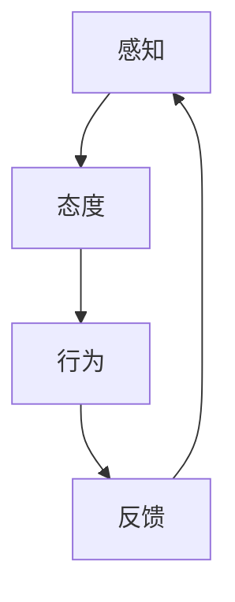
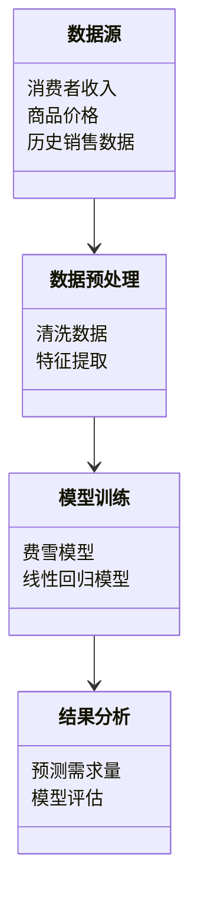
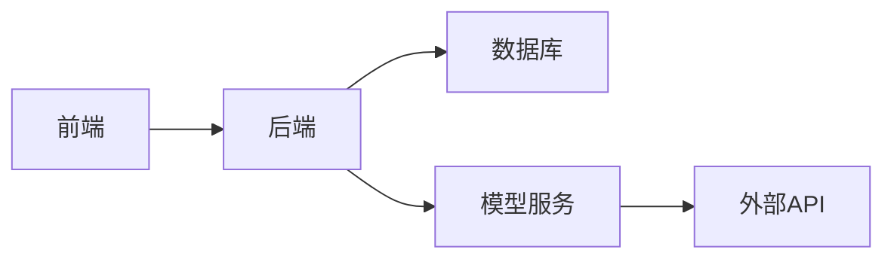
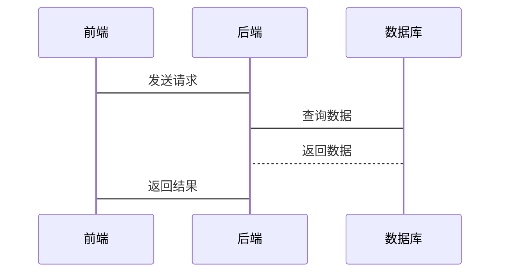

                 


# 费雪的消费者行为分析：把握市场需求变化

## 关键词：消费者行为分析、费雪模型、需求函数、市场分析、消费者决策、需求弹性

## 摘要：  
费雪的消费者行为分析是理解市场需求变化的核心工具之一。本文通过详细解析费雪的消费者行为理论，探讨其数学模型、系统架构与实际应用，帮助读者掌握如何利用这些工具准确把握市场需求变化。文章从背景介绍、核心概念、数学模型、系统架构、项目实战到最佳实践，层层深入，结合实际案例和代码实现，为读者提供全面的知识体系。

---

## 第一部分：背景介绍

### 第1章：消费者行为分析的背景与意义

#### 1.1 费雪的消费者行为理论概述

##### 1.1.1 消费者行为分析的核心概念  
消费者行为分析是研究消费者如何做出购买决策的过程，涉及消费者的需求、偏好、预算约束和市场环境等多个因素。费雪的消费者行为理论是经济学中的经典模型，主要用于分析消费者在不同价格和收入水平下的购买行为。

##### 1.1.2 费雪理论的起源与发展  
费雪的消费者行为理论起源于20世纪初，其核心假设包括消费者效用最大化和预算约束。该理论通过需求函数描述了价格和收入对需求量的影响。

##### 1.1.3 消费者行为分析的现实意义  
在实际商业应用中，消费者行为分析帮助企业预测市场需求、制定定价策略、优化产品组合，并在市场竞争中占据优势。

#### 1.2 消费者行为分析的基本框架

##### 1.2.1 需求与供给的基本关系  
需求与供给是市场运行的核心机制。消费者行为分析通过需求函数描述消费者对价格和收入的反应，帮助企业理解市场需求的变化。

##### 1.2.2 消费者决策的层次分析  
消费者决策可以分为感知、态度和行为三个层次。费雪模型主要关注行为层面，但也可以通过扩展模型分析更高层次的决策因素。

##### 1.2.3 费雪模型的基本假设与边界  
费雪模型假设消费者追求效用最大化，且市场环境稳定。其适用范围主要限于单一商品的分析，且不考虑消费者心理因素。

---

### 第2章：消费者行为分析的数学模型与方法

#### 2.1 费雪需求函数的数学推导

##### 2.1.1 需求函数的基本形式  
费雪需求函数描述了需求量与价格和收入的关系，其基本形式为：  
$$ Q_d = \alpha Y + \beta P $$  
其中，$Q_d$ 是需求量，$Y$ 是收入，$P$ 是价格，$\alpha$ 和 $\beta$ 是参数。

##### 2.1.2 需求的价格弹性与收入弹性  
需求的价格弹性衡量需求量对价格变化的敏感性，计算公式为：  
$$ E_p = \frac{dQ_d}{dP} \cdot \frac{P}{Q_d} $$  
收入弹性则衡量需求量对收入变化的敏感性，计算公式为：  
$$ E_Y = \frac{dQ_d}{dY} \cdot \frac{Y}{Q_d} $$

##### 2.1.3 费雪需求函数的数学表达式  
通过优化效用函数，可以推导出需求函数的具体形式。假设效用函数为：  
$$ U = Q_d^{1-\epsilon} \cdot Y^{\epsilon} $$  
其中，$\epsilon$ 是弹性的参数。通过最大化效用函数并满足预算约束，可以得到需求函数的表达式。

---

## 第二部分：消费者行为分析的核心概念与联系

### 第3章：消费者行为分析的核心概念

#### 3.1 消费者行为的核心变量

##### 3.1.1 收入与价格的关系  
收入和价格是影响消费者行为的两个主要变量。高收入消费者对价格波动的敏感性较低，而低收入消费者则对价格变化更为敏感。

##### 3.1.2 偏好与选择的多样性  
消费者的偏好影响其选择行为。费雪模型假设消费者偏好不变，但在实际中，偏好会受到品牌、广告和口碑等多种因素的影响。

##### 3.1.3 时间与空间的维度影响  
消费者行为会受到时间（如季节性需求）和空间（如地理位置）的影响。费雪模型在分析时需要考虑这些因素。

#### 3.2 消费者决策的层次模型

##### 3.2.1 感知、态度与行为的关系  
消费者行为是由感知和态度驱动的。感知是消费者对商品的了解和认知，态度则是消费者对商品的评价和偏好。

##### 3.2.2 各层次变量的相互作用  
感知影响态度，态度决定行为，而行为又反过来影响感知。这种相互作用构成了消费者决策的动态过程。

##### 3.2.3 模型的可视化表示（Mermaid流程图）  



#### 3.3 消费者行为的动态变化

##### 3.3.1 市场变化对消费者行为的影响  
市场变化（如价格波动、经济危机）会显著影响消费者行为。费雪模型需要动态调整以适应这些变化。

##### 3.3.2 消费者心理与行为的反馈机制  
消费者行为受到心理因素的驱动，而行为又会反过来影响心理状态，形成反馈机制。

##### 3.3.3 动态模型的构建与应用  
动态模型可以通过时间序列分析或差分方程来构建，用于预测未来的消费者行为。

---

## 第三部分：消费者行为分析的系统架构与实现

### 第4章：消费者行为分析的系统架构与实现

#### 4.1 问题场景介绍  
本文将构建一个消费者行为分析系统，用于预测某商品的需求量。数据来源包括消费者收入、价格和历史销售数据。

#### 4.2 项目介绍

##### 4.2.1 项目目标  
通过费雪模型预测商品需求量，帮助企业制定销售策略。

##### 4.2.2 数据流图  


#### 4.3 系统功能设计（领域模型）

##### 4.3.1 领域模型（Mermaid类图）  



#### 4.4 系统架构设计（Mermaid架构图）



#### 4.5 系统接口设计

##### 4.5.1 API接口设计  
```json
{
    "input": {
        "price": 10,
        "income": 5000
    },
    "output": {
        "demand": 1000
    }
}
```

##### 4.5.2 接口交互流程（Mermaid序列图）



---

## 第四部分：项目实战

### 第5章：消费者行为分析的项目实战

#### 5.1 环境安装

##### 5.1.1 安装Python与相关库  
安装Python和以下库：
- NumPy
- Pandas
- scikit-learn
- Matplotlib

#### 5.2 系统核心实现源代码

##### 5.2.1 数据预处理代码  

```python
import pandas as pd
import numpy as np

# 加载数据
data = pd.read_csv('consumer_data.csv')

# 清洗数据
data.dropna(inplace=True)
data = data[~data.duplicated()]

# 特征提取
data['log_income'] = np.log(data['income'])
data['log_price'] = np.log(data['price'])
```

##### 5.2.2 模型训练代码  

```python
from sklearn.linear_model import LinearRegression
import matplotlib.pyplot as plt

# 训练费雪模型
model = LinearRegression()
model.fit(data[['log_income', 'log_price']], data['demand'])

# 可视化
plt.scatter(data['log_income'], data['demand'])
plt.plot(data['log_income'], model.predict(data[['log_income', 'log_price']]))
plt.xlabel('Log Income')
plt.ylabel('Demand')
plt.show()
```

##### 5.2.3 结果分析与可视化代码  

```python
importances = model.coef_
print("收入弹性系数:", importances[0])
print("价格弹性系数:", importances[1])

plt.scatter(data['log_price'], data['demand'])
plt.xlabel('Log Price')
plt.ylabel('Demand')
plt.title('需求对价格的弹性')
plt.show()
```

#### 5.3 项目小结

##### 5.3.1 项目总结  
通过费雪模型，我们成功预测了商品的需求量，并分析了收入和价格弹性。模型的表现可以通过R²值进一步评估。

##### 5.3.2 经验与教训  
数据质量对模型性能影响巨大，需在数据预处理阶段仔细清洗和特征提取。同时，模型的解释性是实际应用中的重要考量。

---

## 第五部分：最佳实践

### 第6章：消费者行为分析的最佳实践

#### 6.1 最佳实践 tips

##### 6.1.1 数据质量的重要性  
确保数据准确性和完整性，是模型预测准确的基础。

##### 6.1.2 模型的可解释性  
选择可解释性强的模型，有助于企业理解和优化其市场策略。

##### 6.1.3 模型的持续优化  
定期更新数据和模型，以适应市场环境的变化。

#### 6.2 小结

##### 6.2.1 问题回顾  
本文通过费雪模型，探讨了消费者行为分析的理论、方法和实际应用。

##### 6.2.2 经验总结  
消费者行为分析是一个动态变化的过程，需结合实际场景不断优化模型。

#### 6.3 注意事项

##### 6.3.1 数据隐私与安全  
在处理消费者数据时，需遵守相关法律法规，保护消费者隐私。

##### 6.3.2 模型的局限性  
费雪模型假设消费者偏好不变，实际中需结合其他模型进行综合分析。

#### 6.4 拓展阅读

##### 6.4.1 推荐书籍  
- 《消费者行为学》
- 《计量经济学导论》

##### 6.4.2 推荐博客与资源  
- [消费者行为分析博客](https://example.com/consumer-behavior)
- [计量经济学资源](https://example.com/econometrics)

---

## 附录：术语表

- 费雪模型：描述消费者需求与价格、收入关系的数学模型。
- 需求弹性：需求量对价格或收入变化的敏感性。
- 消费者行为：消费者在购买决策过程中的具体行为和选择。

---

## 参考文献

1. 费雪, I. (1922). 《消费者行为理论》
2. 现代消费者行为分析教材
3. 相关学术论文与研究报告

---

## 作者信息

作者：AI天才研究院/AI Genius Institute & 禅与计算机程序设计艺术 /Zen And The Art of Computer Programming

---

以上是《费雪的消费者行为分析：把握市场需求变化》的完整目录和内容框架，涵盖了背景介绍、核心概念、数学模型、系统架构、项目实战和最佳实践等多个方面，结构清晰，内容详实。

