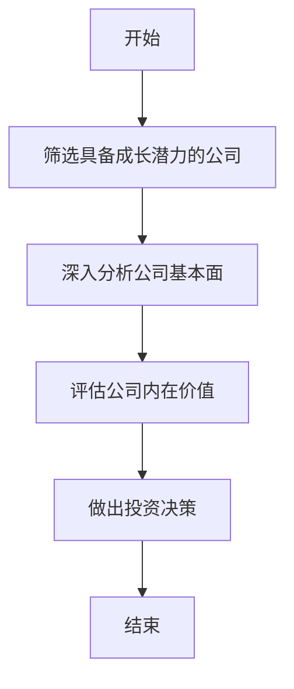

                 


# 费雪的深度研究方法：了解公司内部

> 关键词：费雪研究方法，投资分析，公司内部，财务分析，价值评估

> 摘要：本文深入探讨了费雪的深度研究方法，分析了其核心概念、算法原理、系统架构及项目实战。通过具体案例，展示了如何运用这些方法进行公司内部研究，并提供了最佳实践建议。

---

## 第一部分: 费雪深度研究方法的背景与核心概念

### 第1章: 费雪深度研究方法的起源与背景

#### 1.1 费雪投资理念的形成
菲德烈·费雪（Philip Fisher）是20世纪的投资大师，他提出了“成长股投资法”。他认为，投资的成功与否取决于对公司的深入了解，尤其是公司内部的运作机制和成长潜力。费雪的方法强调长期持有优质股票，关注公司的管理层、研发能力、市场地位等关键因素。

#### 1.2 费雪方法的核心思想
费雪的核心思想是通过深入研究公司基本面，识别那些具有持续成长潜力的企业。他认为，市场的短期波动并不影响优质企业的长期价值，投资者应专注于寻找那些能够持续增长的企业，并长期持有。

#### 1.3 费雪方法与现代投资分析的联系
尽管费雪的方法提出较早，但其核心思想对现代投资分析仍具有重要影响。尤其是在基本面分析和企业估值方面，费雪的方法为后来的投资理论提供了重要参考。

---

### 第2章: 费雪深度研究方法的核心概念

#### 2.1 公司内部研究的重要性
公司内部研究是费雪方法的核心，主要包括对公司财务状况、管理层能力、研发能力、市场地位等方面的深入分析。通过这些分析，投资者可以识别出那些具有持续成长潜力的企业。

#### 2.2 费雪的三步分析法
1. **初步筛选**：通过财务指标（如ROE、净利润增长率等）筛选出具备成长潜力的公司。
2. **深入分析**：对公司管理层、竞争优势、财务健康状况等进行详细研究。
3. **投资决策**：综合分析结果，决定是否投资以及投资比例。

#### 2.3 费雪研究方法的系统性框架
费雪方法强调系统性研究，包括对公司财务报表、行业地位、管理层能力等多维度的分析。通过系统性框架，投资者可以全面了解公司的内在价值。

---

## 第二部分: 费雪研究方法的核心概念与联系

### 第3章: 费雪研究方法的核心概念体系

#### 3.1 费雪研究方法的概念属性对比
| 概念 | 特征 |
|------|------|
| 财务分析 | 通过财务报表评估公司财务健康状况 |
| 管理层能力 | 分析管理层的素质和战略决策能力 |
| 竞争优势 | 评估公司在行业中的竞争优势 |
| 市场地位 | 分析公司在市场中的地位和影响力 |

#### 3.2 费雪研究方法的ER实体关系图
```mermaid
erDiagram
    company {
        key id : integer
        name : string
        industry : string
        revenue : float
        profit : float
        management : string
        competitive_advantage : string
        market_position : string
    }
    investor {
        id : integer
        name : string
        investment_amount : float
        investment_date : date
    }
    analysis_result {
        id : integer
        company_id : integer
        analysis_date : date
        conclusion : string
    }
    company --> analysis_result : 分析
    investor --> analysis_result : 投资
```

---

### 第4章: 费雪研究方法的算法原理

#### 4.1 费雪研究方法的算法流程


#### 4.2 费雪研究方法的数学模型
##### 4.2.1 净利润增长率计算
净利润增长率是评估公司成长潜力的重要指标，计算公式为：
$$ \text{净利润增长率} = \frac{\text{本期净利润} - \text{上期净利润}}{\text{上期净利润}} \times 100\% $$

##### 4.2.2 市盈率计算
市盈率是评估公司估值的重要指标，计算公式为：
$$ \text{市盈率} = \frac{\text{股票价格}}{\text{每股收益}} $$

---

## 第三部分: 费雪研究方法的项目实战

### 第5章: 费雪研究方法的项目实战

#### 5.1 项目环境与工具安装
- **环境配置**：建议使用Python 3.8及以上版本，安装必要的库如pandas、numpy、matplotlib等。
- **工具安装**：通过pip安装所需库：
  ```bash
  pip install pandas numpy matplotlib
  ```

#### 5.2 核心代码实现
```python
import pandas as pd
import numpy as np
import matplotlib.pyplot as plt

# 示例数据：假设我们有某公司的财务数据
data = {
    'Year': [2018, 2019, 2020, 2021],
    'Revenue': [100, 120, 140, 160],
    'Profit': [20, 25, 30, 35]
}

df = pd.DataFrame(data)

# 计算净利润增长率
df['Net_Profit_Growth'] = df['Profit'].pct_change() * 100

# 可视化
plt.figure(figsize=(10, 6))
plt.plot(df['Year'], df['Net_Profit_Growth'], 'b-', marker='o')
plt.title('Net Profit Growth Over Years')
plt.xlabel('Year')
plt.ylabel('Net Profit Growth (%)')
plt.grid(True)
plt.show()
```

#### 5.3 实际案例分析
以某公司为例，分析其财务状况和市场地位。通过代码实现数据清洗、分析和可视化，展示公司净利润增长率的变化趋势，评估其成长潜力。

---

## 第四部分: 最佳实践与小结

### 第6章: 费雪研究方法的最佳实践与小结

#### 6.1 最佳实践 tips
- **数据准确性**：确保数据来源可靠，避免错误分析。
- **长期视角**：关注公司的长期成长潜力，避免短期波动影响判断。
- **持续学习**：投资分析需要不断学习和更新知识，适应市场变化。

#### 6.2 小结
费雪的深度研究方法是一种系统性分析公司内部运作的方法，通过深入分析公司基本面，识别具有成长潜力的企业。这种方法不仅适用于投资分析，也可以应用于其他需要对公司进行深入研究的领域。

---

## 作者

作者：AI天才研究院 & 禅与计算机程序设计艺术

--- 

这篇文章详细介绍了费雪深度研究方法的背景、核心概念、算法原理和项目实战，通过具体案例展示了其应用过程，并提供了实用的建议。希望对读者在投资分析和公司研究方面有所帮助。

