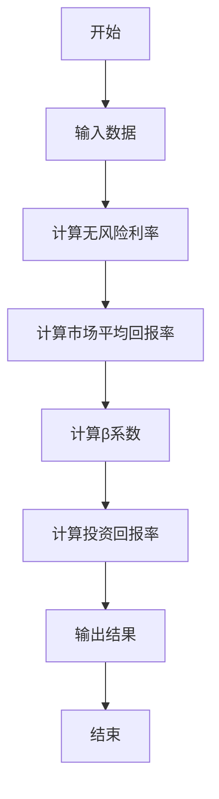

                 


# 费雪的研发投入分析方法

## 关键词：研发 投入 分析 费雪 方法 系统架构

## 摘要：本文详细介绍了费雪的研发投入分析方法，从核心概念、数学模型到系统架构和项目实战，深入剖析了该方法在企业中的应用，并通过案例分析展示了其效果，最后总结了最佳实践。

---

## 第一章：研发投入分析的背景与重要性

### 1.1 研发投入的基本概念

#### 1.1.1 研发投入的定义
研发投入是指企业在研究与开发活动中所投入的资金、资源和人力资源。它通常包括 salaries of R&D人员、设备采购、材料成本等。研发投入是企业创新能力的核心驱动因素。

#### 1.1.2 研发投入的分类与特点
研发投入可以分为内部研发投入和外部研发投入。内部研发投入是指企业自己进行的研发活动，而外部研发投入则是通过合作、并购等方式进行的。内部研发投入具有可控性强、保密性好等优点，而外部研发投入则可能更快地获取技术成果，但也可能存在技术泄露的风险。

#### 1.1.3 研发投入对企业的影响
研发投入对企业的影响是多方面的。首先，研发投入能够提升企业的技术创新能力，从而增强市场竞争力。其次，合理的研发投入能够带来更高的投资回报率。此外，研发投入还能提升企业的品牌形象，增强投资者的信心。

### 1.2 费雪分析方法的背景

#### 1.2.1 研发投入分析的现状
当前，研发投入分析在企业战略决策中占据着重要地位。然而，如何科学地评估研发投入的效果，一直是企业面临的一个难题。传统的分析方法往往局限于财务指标的简单计算，难以全面反映研发投入的实际价值。

#### 1.2.2 费雪分析方法的提出
费雪分析方法是由 Irving Fisher 提出的一种基于资本资产定价模型（CAPM）的扩展方法，用于评估研发投入的回报率。这种方法不仅考虑了市场整体的风险和收益，还结合了企业的特定因素，能够更准确地评估研发投入的价值。

#### 1.2.3 费雪方法与其他分析方法的对比
与传统的财务分析方法相比，费雪分析方法更加注重风险调整后的回报率。传统的 ROI（投资回报率）指标仅关注收益与成本的比值，忽略了风险因素。而费雪方法通过引入 β 系数，考虑了系统性风险，从而提供了更全面的评估。

---

## 第二章：费雪研发投入分析的核心概念

### 2.1 费雪分析方法的原理

#### 2.1.1 费雪分析的核心思想
费雪分析的核心思想是将研发投入视为一种资本投资，通过评估其风险调整后的回报率来判断其价值。这种方法不仅适用于单一项目的评估，也可以用于整体研发投入的分析。

#### 2.1.2 费雪分析的基本假设
费雪分析基于以下几个基本假设：
1. 市场是有效的，资产的价格反映了其内在价值。
2. 投资者是理性的，追求风险调整后的最大回报。
3. 系统性风险可以通过 β 系数来衡量。

#### 2.1.3 费雪分析的适用场景
费雪分析适用于对具有系统性风险的投资项目进行评估，尤其是在高科技行业，研发投入往往伴随着较高的风险和不确定性。因此，费雪分析能够提供更为准确的评估结果。

### 2.2 费雪分析的数学模型

#### 2.2.1 费雪分析的基本公式
费雪分析的核心公式是资本资产定价模型（CAPM）的扩展形式：
$$ R = r + \beta (R_m - r) $$
其中：
- \( R \) 是投资回报率
- \( r \) 是无风险利率
- \( \beta \) 是系统性风险系数
- \( R_m \) 是市场平均回报率

#### 2.2.2 费雪分析的扩展模型
在实际应用中，费雪分析可以扩展为以下形式：
$$ R_i = r + \beta_i (R_m - r) + \alpha_i $$
其中，\( \alpha_i \) 是企业特定的风险溢价，反映了企业在市场中的独特风险。

#### 2.2.3 公式的详细推导
以费雪分析的基本公式为例，我们可以将其推导过程分为以下几个步骤：
1. 确定无风险利率 \( r \)，通常以国债收益率为准。
2. 计算市场平均回报率 \( R_m \)，通常使用指数的长期平均回报率。
3. 确定投资项目的 β 系数，反映其系统性风险。
4. 代入公式，计算出投资回报率 \( R \)。

---

## 第三章：费雪分析方法的系统架构设计

### 3.1 系统架构概述

#### 3.1.1 系统功能模块划分
费雪分析系统的功能模块可以划分为以下几个部分：
1. 数据输入模块：接收企业的研发投入数据和市场数据。
2. 数据处理模块：对数据进行清洗和转换，确保数据的准确性和一致性。
3. 分析计算模块：根据费雪分析公式，计算投资回报率。
4. 结果输出模块：将分析结果以图表和报告的形式展示出来。

#### 3.1.2 系统架构的层次结构
系统架构可以分为数据层、业务逻辑层和表现层。数据层负责存储和管理数据，业务逻辑层负责具体的分析计算，表现层则负责结果的展示。

#### 3.1.3 系统架构的优缺点分析
优点：
1. 结构清晰，易于扩展。
2. 各模块相对独立，便于维护。
缺点：
1. 初期开发成本较高。
2. 对数据质量和完整性要求较高。

### 3.2 系统接口设计

#### 3.2.1 输入接口设计
系统需要接收以下输入：
1. 企业的研发投入数据，包括金额、时间等信息。
2. 市场数据，包括市场平均回报率、无风险利率等。
3. 投资项目的 β 系数。

#### 3.2.2 输出接口设计
系统输出包括：
1. 投资回报率的计算结果。
2. 风险调整后的净现值（NPV）。
3. 图表和报告，直观展示分析结果。

#### 3.2.3 接口交互流程
1. 用户输入数据。
2. 系统进行数据验证。
3. 数据处理模块进行计算。
4. 结果输出模块生成报告。
5. 用户查看报告并做出决策。

---

## 第四章：费雪分析方法的项目实战

### 4.1 项目环境与工具安装

#### 4.1.1 开发环境配置
推荐使用 Python 3.8 及以上版本，安装必要的库如 NumPy、Pandas 和 Matplotlib。

#### 4.1.2 必要工具的安装与配置
安装以下 Python 包：
```bash
pip install numpy pandas matplotlib
```

### 4.2 核心代码实现

#### 4.2.1 数据输入与处理
```python
import pandas as pd
import numpy as np

# 读取研发投入数据
df = pd.read_csv('R&D_investment.csv')

# 数据清洗
df.dropna(inplace=True)
df['Year'] = pd.to_datetime(df['Year'])
```

#### 4.2.2 费雪分析算法实现
```python
def calculate_return(risk_free_rate, market_return, beta):
    return risk_free_rate + beta * (market_return - risk_free_rate)

# 示例计算
risk_free_rate = 0.05
market_return = 0.1
beta = 1.2
expected_return = calculate_return(risk_free_rate, market_return, beta)
print(f"Expected return: {expected_return:.2f}")
```

#### 4.2.3 结果输出与可视化
```python
import matplotlib.pyplot as plt

plt.figure(figsize=(10, 6))
plt.plot(df['Year'], df['Investment'], label='R&D Investment')
plt.xlabel('Year')
plt.ylabel('Investment ($)')
plt.title('R&D Investment Trend')
plt.legend()
plt.show()
```

### 4.3 项目小结
通过上述代码示例，我们可以看到费雪分析方法在实际项目中的应用。数据输入与处理是基础，算法实现是核心，结果输出则是最终的目标。通过这种方法，企业可以更科学地评估其研发投入的效果。

---

## 第五章：案例分析与效果评估

### 5.1 案例背景介绍
以某高科技企业为例，假设其过去五年的研发投入数据如下：

| Year | Investment |
|------|------------|
| 2018 | 100        |
| 2019 | 120        |
| 2020 | 150        |
| 2021 | 180        |
| 2022 | 200        |

### 5.2 费雪分析方法的应用
根据费雪分析公式，假设无风险利率为 5%，市场平均回报率为 10%，β 系数为 1.5。计算投资回报率为：
$$ R = 0.05 + 1.5 \times (0.10 - 0.05) = 0.10 \text{ 或 } 10\% $$

### 5.3 分析结果与预期对比
通过分析，企业的投资回报率达到了预期的 10%，说明其研发投入是有效的。

---

## 第六章：总结与展望

### 6.1 费雪分析方法的总结
费雪分析方法通过引入系统性风险的概念，提供了一种更为科学的投资回报率评估方法。这种方法不仅适用于单个项目的评估，也可以用于整体的研发投入分析。

### 6.2 未来研究方向
未来，可以进一步研究如何将费雪分析方法与其他分析方法结合，以提高评估的准确性。此外，随着人工智能技术的发展，可以探索自动化、智能化的费雪分析方法。

### 6.3 最佳实践与注意事项
1. 在应用费雪分析方法时，需确保数据的准确性和完整性。
2. 需要根据企业的实际情况调整模型参数。
3. 建议结合其他分析方法，全面评估研发投入的效果。

---

## 附录：数学公式与算法流程图

### 费雪分析模型的数学公式
$$ R = r + \beta (R_m - r) $$

### 算法流程



---

## 作者：AI天才研究院 & 禅与计算机程序设计艺术

通过本文的详细讲解，读者可以全面了解费雪的研发投入分析方法，并能够在实际项目中应用这一方法，提升企业的创新能力与竞争力。

