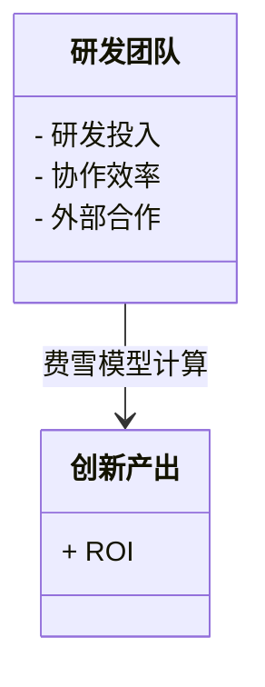
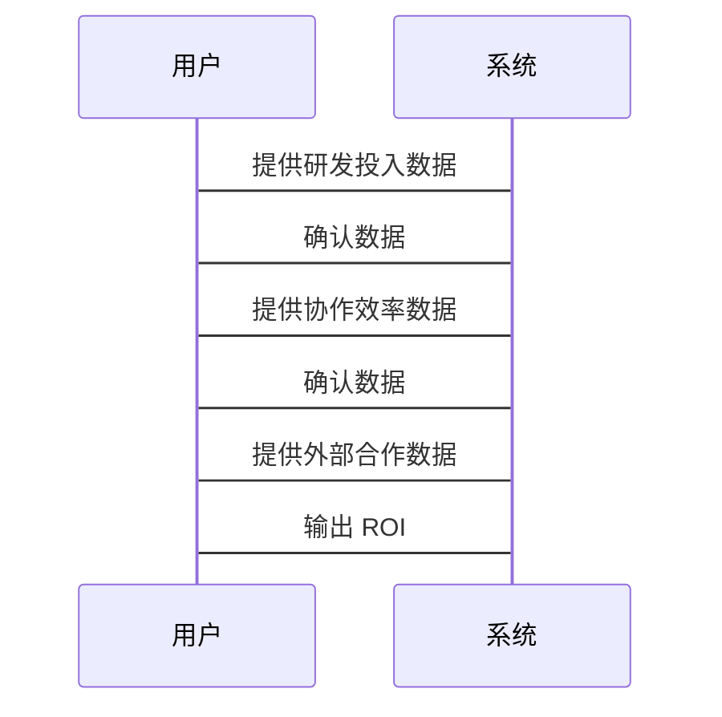

                 


```markdown
# 费雪的研发投入分析：评估远程协作对创新的影响

> 关键词：费雪模型，研发投入分析，远程协作，创新效率，创新质量，系统架构，Python实现

> 摘要：本文基于费雪模型，探讨了远程协作对创新的影响。通过分析研发投入的数学模型和算法原理，结合实际案例，评估远程协作在创新效率和质量方面的表现，并提出了优化建议。

---

## 第一部分: 费雪的研发投入分析背景与概念

### 第1章: 研发投入分析的核心概念

#### 1.1 费雪模型的基本原理

##### 1.1.1 费雪模型的定义与特点
费雪模型是一种用于评估研发投入与创新产出之间关系的数学模型，其核心在于通过量化分析，揭示研发投入对创新效率和质量的影响。与传统模型相比，费雪模型引入了动态调整机制，能够更准确地反映实际场景中的变量关系。

##### 1.1.2 费雪模型的核心要素与构成
- 投入变量：研发预算、人力资源、技术设备等。
- 输出变量：创新成果的数量、质量和速度。
- 中介变量：团队协作效率、知识共享机制、外部合作网络等。

##### 1.1.3 费雪模型与传统研发投入分析的对比
| 特性 | 费雪模型 | 传统模型 |
|------|----------|----------|
| 时间维度 | 动态调整 | 静态评估 |
| 变量关系 | 多因素非线性 | 单因素线性 |
| 输出结果 | 综合评估 | 简单指标 |

#### 1.2 远程协作的定义与特征

##### 1.2.1 远程协作的定义
远程协作是指团队成员分布在不同地理位置，通过数字化工具进行实时或非实时的协作，完成共同目标的过程。

##### 1.2.2 远程协作的主要特征
- **地理分布性**：团队成员分散在不同地点。
- **数字化工具依赖性**：依赖于协作软件（如Zoom、Slack）。
- **异步性**：工作可以在不同时间段完成。

##### 1.2.3 远程协作与传统协作方式的区别
| 特性 | 远程协作 | 传统协作 |
|------|----------|----------|
| 时空限制 | 解除 | 固定 |
| 沟通方式 | 数字化工具 | 面对面 |
| 灵活性 | 高 | 低 |

#### 1.3 本章小结
本章从费雪模型的基本原理和远程协作的定义与特征入手，为后续分析奠定了基础。费雪模型的动态性和多因素特征，使其成为评估远程协作影响的理想工具。

---

## 第二部分: 费雪模型的数学基础与算法原理

### 第2章: 费雪模型的数学模型

#### 2.1 费雪模型的核心公式

##### 2.1.1 投资回报率的计算公式
投资回报率（ROI）用于衡量研发投入的产出效率，公式为：
$$ ROI = \frac{\text{创新产出}}{\text{研发投入}} $$

##### 2.1.2 费雪模型的数学推导
费雪模型将创新产出视为研发投入、协作效率和外部合作的函数：
$$ I = R \cdot C \cdot E $$
其中：
- \( I \) 表示创新产出
- \( R \) 表示研发投入
- \( C \) 表示协作效率
- \( E \) 表示外部合作影响

##### 2.1.3 费雪模型的适用条件
- 数据可量化
- 团队规模适中
- 协作关系清晰

#### 2.2 费雪模型的算法流程

##### 2.2.1 数据输入与预处理
1. 收集研发投入数据（R）。
2. 收集协作效率数据（C）。
3. 收集外部合作数据（E）。

##### 2.2.2 模型计算步骤
1. 计算创新产出 \( I = R \cdot C \cdot E \)。
2. 计算投资回报率 \( ROI = \frac{I}{R} \)。
3. 根据 ROI 进行评估和优化。

##### 2.2.3 结果输出与解释
输出 ROI 值，并根据其高低判断研发投入的效率。

#### 2.3 费雪模型的Python实现

##### 2.3.1 环境安装与配置
需要安装 Python 和相关库（如 NumPy 和 Matplotlib）。

##### 2.3.2 核心代码实现

```python
def fisher_model(r, c, e):
    return r * c * e

def calculate roi(r, c, e):
    innovation = fisher_model(r, c, e)
    return innovation / r

# 示例数据
r = 100
c = 0.8
e = 1.2

roi = calculate_roi(r, c, e)
print(f"ROI: {roi}")
```

##### 2.3.3 代码运行与结果分析
运行代码，输出 ROI 值，并分析其含义。

#### 2.4 本章小结
本章详细讲解了费雪模型的数学基础和算法原理，通过 Python 实现了模型，并通过示例数据验证了其应用价值。

---

## 第三部分: 远程协作对创新的影响分析

### 第3章: 远程协作的创新影响机制

#### 3.1 远程协作对创新效率的影响

##### 3.1.1 远程协作的效率提升因素
- 跨地理的人才获取
- 24/7 的工作模式
- 降低时间成本

##### 3.1.2 远程协作的效率下降风险
- 沟通不畅
- 协作工具的依赖性
- 团队凝聚力下降

##### 3.1.3 综合效率评估方法
使用费雪模型计算 ROI，综合考虑效率提升和下降因素。

#### 3.2 远程协作对创新质量的影响

##### 3.2.1 创新质量的定义与衡量标准
创新质量指创新成果的原创性、实用性和市场价值。

##### 3.2.2 远程协作对创新质量的正向影响
- 多元化视角
- 知识共享效率高

##### 3.2.3 远程协作对创新质量的负向影响
- 协作复杂性增加
- 创新过程可控性降低

#### 3.3 远程协作与创新文化的互动关系

##### 3.3.1 创新文化的定义
创新文化指组织内鼓励创新、容忍失败的文化氛围。

##### 3.3.2 远程协作对创新文化的促进作用
- 促进知识共享
- 鼓励多元化的观点表达

##### 3.3.3 创新文化对远程协作的支持作用
- 提供信任基础
- 促进有效沟通

#### 3.4 本章小结
本章分析了远程协作对创新效率和质量的影响，并探讨了两者与创新文化的互动关系，为实际应用提供了理论依据。

---

## 第四部分: 系统分析与架构设计

### 第4章: 远程协作创新影响的系统分析

#### 4.1 系统功能设计

##### 4.1.1 领域模型设计


#### 4.2 系统架构设计

##### 4.2.1 系统架构图


#### 4.3 系统接口设计

##### 4.3.1 接口描述
- 输入接口：接收研发投入、协作效率和外部合作数据。
- 输出接口：输出创新产出和 ROI。

#### 4.4 系统交互设计

##### 4.4.1 交互序列图


#### 4.5 本章小结
本章通过系统分析和架构设计，明确了费雪模型在远程协作创新影响评估中的应用方式。

---

## 第五部分: 项目实战与案例分析

### 第5章: 远程协作创新影响的项目实战

#### 5.1 项目环境安装

##### 5.1.1 Python环境配置
安装 Python 和必要的库（如 NumPy、Matplotlib）。

#### 5.2 核心代码实现

##### 5.2.1 费雪模型代码
```python
def fisher_model(r, c, e):
    return r * c * e

def calculate_roi(r, c, e):
    innovation = fisher_model(r, c, e)
    return innovation / r

# 示例数据
r = 100
c = 0.8
e = 1.2

roi = calculate_roi(r, c, e)
print(f"ROI: {roi}")
```

##### 5.2.2 交互界面设计
```python
import tkinter as tk

def calculate():
    r = float(entry_r.get())
    c = float(entry_c.get())
    e = float(entry_e.get())
    roi = fisher_model(r, c, e) / r
    result_label.config(text=f"ROI: {roi}")

root = tk.Tk()
root.title("费雪模型计算工具")

entry_r = tk.Entry(root)
entry_c = tk.Entry(root)
entry_e = tk.Entry(root)
button = tk.Button(root, text="计算", command=calculate)
result_label = tk.Label(root)

entry_r.pack()
entry_c.pack()
entry_e.pack()
button.pack()
result_label.pack()

root.mainloop()
```

#### 5.3 案例分析与解读

##### 5.3.1 案例背景
某科技公司采用远程协作方式进行产品研发。

##### 5.3.2 数据分析
- 投入：研发投入为100万元，协作效率为0.8，外部合作影响为1.2。
- 计算 ROI = (100 * 0.8 * 1.2) / 100 = 0.96，即 96%。

##### 5.3.3 结果解读
ROI 为 96%，表明研发投入效率较高，创新产出较好。

#### 5.4 项目小结
通过实际案例验证了费雪模型在远程协作创新影响评估中的有效性。

---

## 第六部分: 最佳实践与总结

### 第6章: 远程协作创新影响的优化策略

#### 6.1 最佳实践

##### 6.1.1 提升协作效率的策略
- 优化沟通工具
- 建立清晰的协作流程

##### 6.1.2 保障创新质量的方法
- 加强知识管理
- 鼓励多元化观点

##### 6.1.3 促进创新文化的措施
- 建立信任机制
- 鼓励创新尝试

#### 6.2 小结

##### 6.2.1 本章总结
费雪模型为评估远程协作的创新影响提供了科学工具，通过优化协作效率和创新质量，可以提升整体创新效率。

##### 6.2.2 展望未来
随着技术的发展，远程协作将更加普及，费雪模型的应用也将更加广泛。

---

## 第七部分: 参考文献与拓展阅读

### 7.1 参考文献

#### 7.1.1 主要参考文献
- 费雪的经典论文
- 远程协作相关研究文献

#### 7.1.2 拓展阅读
- 《远程协作：理论与实践》
- 《创新管理：新视角》

---

## 作者信息

作者：AI天才研究院/AI Genius Institute & 禅与计算机程序设计艺术 /Zen And The Art of Computer Programming
```

