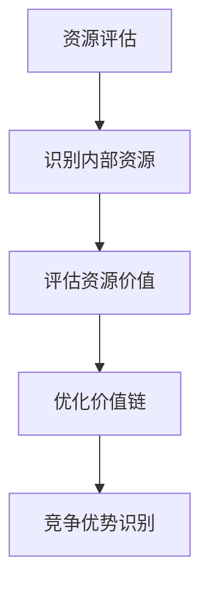

                 


# 费雪的竞争优势分析框架

**关键词**：竞争优势分析、投资框架、企业分析、资源基础视角、价值链模型、投资决策

**摘要**：费雪的竞争优势分析框架是一种系统性的方法，用于识别和评估企业的竞争优势，从而指导投资决策。本文将从背景介绍、核心概念、分析框架、投资应用、系统架构、项目实战等方面详细阐述该框架，并通过实际案例分析其应用效果。

---

# 1. 费雪的竞争优势分析框架背景

## 1.1 费雪框架的背景与意义
### 1.1.1 竞争优势分析的背景
竞争优势是企业在市场中立足的关键。费雪的竞争优势分析框架基于资源基础视角和价值链模型，旨在帮助企业识别和评估其核心竞争优势。

### 1.1.2 费雪框架的提出
彼得·费雪（Peter C. Fisher）提出竞争优势分析框架，用于评估企业内部资源和外部环境的匹配程度，从而确定企业的竞争优势。

### 1.1.3 框架的应用范围
该框架适用于企业战略规划、投资决策、风险管理等领域，帮助投资者和管理者做出更明智的决策。

## 1.2 竞争优势的核心概念
### 1.2.1 竞争优势的定义
竞争优势是指企业在市场中相对于竞争对手的独特优势，能够为企业创造超额价值。

### 1.2.2 费雪框架中的竞争优势类型
1. **成本优势**：企业通过规模经济或效率优势降低成本。
2. **质量优势**：产品或服务的质量优于竞争对手。
3. **创新优势**：企业具备快速创新的能力，能够引领市场变革。
4. **品牌优势**：强大的品牌影响力吸引消费者。

### 1.2.3 竞争优势的动态变化
竞争优势并非静态，随着市场环境的变化，企业需要不断调整其竞争优势。

## 1.3 分析框架的逻辑结构
### 1.3.1 资源基础视角
企业内部资源（如技术、人才、管理）是竞争优势的来源。

### 1.3.2 价值链模型
企业通过优化价值链中的各个环节，提升整体竞争力。

### 1.3.3 框架的边界与外延
竞争优势分析框架不仅关注内部资源，还考虑外部环境（如行业竞争、政策法规）对企业的影响。

---

# 2. 竞争优势分析的核心概念与联系

## 2.1 竞争优势的来源
### 2.1.1 内部资源
1. 技术优势：企业的技术创新能力。
2. 资金优势：充足的资本支持企业扩张。
3. 人才优势：高素质的员工团队。

### 2.1.2 外部环境
1. 市场需求：消费者偏好变化。
2. 行业竞争：竞争对手的策略调整。
3. 政策法规：政府政策对企业的影响。

## 2.2 竞争优势的类型
### 2.2.1 低成本优势
企业通过优化生产流程降低成本，提升价格竞争力。

### 2.2.2 高质量优势
通过精湛的产品工艺和严格的质量控制，赢得客户的信任。

### 2.2.3 创新优势
企业通过持续创新，保持市场领先地位。

---

# 3. 竞争优势分析框架的算法原理

## 3.1 分析框架的核心算法
### 3.1.1 资源评估算法
1. 识别企业内部资源。
2. 评估资源的价值和稀缺性。

### 3.1.2 价值链优化算法
1. 分析价值链中的关键环节。
2. 优化各环节的效率和质量。

## 3.2 算法流程图


## 3.3 数学模型
### 3.3.1 竞争优势指数计算
竞争优势指数（CRI）= Σ（内部资源价值 × 外部环境影响）

---

# 4. 投资应用与案例分析

## 4.1 费雪框架在投资中的应用
### 4.1.1 投资策略
基于竞争优势分析框架，选择具备可持续竞争优势的企业进行投资。

### 4.1.2 风险管理
识别潜在风险，评估竞争优势的稳定性。

## 4.2 实际案例分析
以苹果公司为例，分析其在技术创新、品牌建设和市场扩展方面的竞争优势。

---

# 5. 系统架构与实现

## 5.1 系统架构设计
### 5.1.1 功能模块
1. 资源评估模块。
2. 价值链优化模块。
3. 竞争优势指数计算模块。

### 5.1.2 系统架构图


## 5.2 系统实现
### 5.2.1 核心代码实现
```python
def calculate_competitive_advantage(resources, value_chain):
    # 资源评估
    resource_value = sum([r.value for r in resources])
    # 价值链优化
    optimized_chain = optimize(value_chain)
    # 竞争优势指数
    advantage_index = resource_value * optimized_chain
    return advantage_index
```

---

# 6. 项目实战与应用

## 6.1 项目环境安装
### 6.1.1 安装Python环境
使用Anaconda安装Python 3.8及以上版本。

## 6.2 核心代码实现
### 6.2.1 资源评估函数
```python
def assess_resource(resource):
    # 评估资源的价值
    return resource.value
```

## 6.3 案例分析
以某科技公司为例，分析其竞争优势，并使用代码计算竞争优势指数。

---

# 7. 结论与展望

## 7.1 结论
费雪的竞争优势分析框架为企业提供了系统化的竞争优势识别方法，帮助企业制定有效的战略决策。

## 7.2 展望
未来，竞争优势分析将更加注重动态变化和技术创新，为企业创造更大的价值。

---

**作者：AI天才研究院 & 禅与计算机程序设计艺术**

