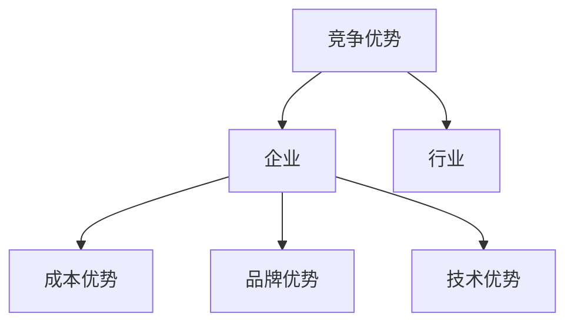
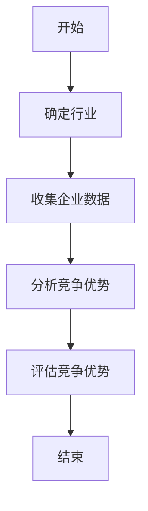
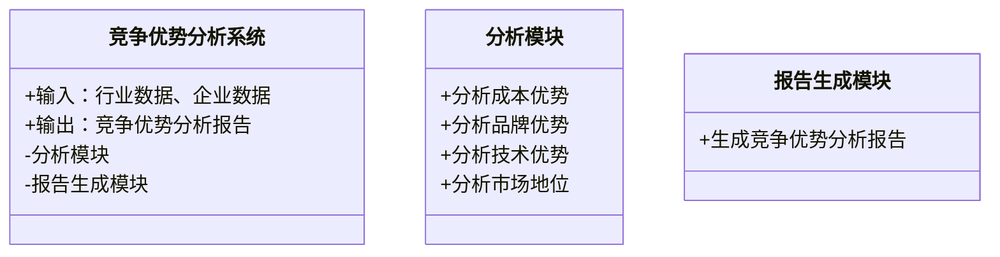

                 


# 费雪的竞争优势分析：寻找行业领导者

## 关键词：费雪，竞争优势分析，行业领导者，投资策略，企业分析

## 摘要：本文深入探讨了费雪的竞争优势分析方法，分析其在寻找行业领导者中的应用。通过详细讲解竞争优势的构成要素、分析流程、算法原理以及实际案例，帮助读者掌握如何在复杂市场环境中识别和评估企业的竞争优势，从而做出明智的投资决策。

---

## 第一部分：费雪的竞争优势分析概述

### 第1章：费雪的生平与投资理念

#### 1.1.1 费雪的生平简介

本杰明·格雷厄姆（Benjamin Graham）和戴维·多德（David Dodd）是价值投资的先驱，但费雪（Philip Fisher）则是另一位在投资领域具有深远影响的投资者。费雪出生于1907年，是一位成功的投资家和作家。他在20世纪50年代提出了“成长股投资”的理念，强调长期投资和选择具有持续增长潜力的公司。

#### 1.1.2 费雪的投资理念与方法

费雪的核心理念是寻找那些能够持续增长的公司，即那些具有强大竞争优势的公司。他认为，投资者应该关注企业的管理团队、产品创新能力和市场地位。费雪的投资方法强调长期持有，避免频繁交易，并注重对公司基本面的深入分析。

#### 1.1.3 费雪竞争优势分析的核心思想

费雪认为，竞争优势是企业能够在市场上长期盈利的关键。他提出，企业竞争优势主要体现在以下几个方面：
1. **成本优势**：企业能够在生产过程中以更低的成本提供产品或服务。
2. **品牌优势**：强大的品牌可以帮助企业获得更高的定价能力。
3. **技术优势**：技术创新可以为企业带来差异化优势。
4. **市场地位**：企业在市场中占据领先地位，能够影响市场价格和趋势。

---

### 第2章：竞争优势分析的定义与背景

#### 1.2.1 竞争优势的定义

竞争优势是指企业在市场中相对于竞争对手的独特优势，这些优势使得企业在价格、质量、创新或其他方面能够胜出。竞争优势可以是暂时的，也可以是长期的，但长期的竞争优势更能为企业带来持续的超额利润。

#### 1.2.2 竞争优势分析的背景与意义

在现代商业环境中，竞争优势分析对于企业制定战略决策至关重要。通过对竞争对手的分析，企业可以识别自身的强项和弱点，并制定相应的策略以增强自身优势。

#### 1.2.3 竞争优势分析的边界与外延

竞争优势分析不仅限于内部因素，还包括外部市场环境、行业趋势等。例如，行业周期、市场需求变化、政策法规等都可能影响企业的竞争优势。

---

### 第3章：竞争优势分析的核心要素

#### 1.3.1 成本优势

成本优势是企业竞争优势的核心要素之一。通过优化生产流程、提高效率、降低材料成本等方式，企业可以降低成本，从而在价格竞争中占据优势。

#### 1.3.2 品牌优势

强大的品牌可以帮助企业在市场上获得更高的溢价能力。例如，苹果公司通过其强大的品牌影响力，能够以高价销售其产品。

#### 1.3.3 技术优势

技术创新是企业保持竞争优势的重要手段。例如，科技公司在研发新产品时，往往能够通过技术优势迅速占领市场。

#### 1.3.4 市场地位

市场地位是指企业在市场中的影响力和知名度。市场地位高的企业通常具有更强的定价权和客户忠诚度。

---

## 第二部分：竞争优势分析的核心概念与联系

### 第2章：竞争优势分析的核心概念与联系

#### 2.1 核心概念原理

竞争优势分析的核心在于识别企业的核心竞争力。企业核心竞争力是指企业在市场中能够长期保持竞争优势的独特能力。例如，某些企业可能在研发、生产、营销等方面具有独特优势。

#### 2.2 竞争优势的核心属性特征对比

以下是几种竞争优势的核心属性特征对比：

| 竞争优势类型 | 特征描述                   |
|--------------|---------------------------|
| 成本优势     | 低成本生产                 |
| 品牌优势     | 强大的品牌影响力           |
| 技术优势     | 创新能力强                 |
| 市场地位     | 市场占有率高               |

#### 2.3 竞争优势分析的ER实体关系图



---

## 第三部分：竞争优势分析的算法原理

### 第3章：竞争优势分析的算法原理

#### 3.1 竞争优势分析的流程图



#### 3.2 竞争优势分析的Python实现

以下是竞争优势分析的Python代码示例：

```python
def analyze_competitive_advantages(industry, company):
    advantages = []
    # 成本优势分析
    if company.cost < industry.average_cost:
        advantages.append("成本优势")
    # 品牌优势分析
    if company.brand_strength > industry.average_brand_strength:
        advantages.append("品牌优势")
    # 技术优势分析
    if company技术创新能力 > industry.average_technology_capability:
        advantages.append("技术优势")
    # 市场地位分析
    if company.market_share > industry.average_market_share:
        advantages.append("市场地位")
    return advantages

# 示例用法
industry = {"average_cost": 50, "average_brand_strength": 70, "average_technology_capability": 60, "average_market_share": 30}
company = {"cost": 45, "brand_strength": 80, "技术创新能力": 70, "market_share": 40}
advantages = analyze_competitive_advantages(industry, company)
print("竞争优势包括：", advantages)
```

---

## 第四部分：竞争优势分析的数学模型

### 第4章：竞争优势分析的数学模型

#### 4.1 成本优势的数学模型

成本优势可以通过以下公式进行评估：

$$ 成本优势 = \frac{\text{行业平均成本} - \text{企业成本}}{\text{行业平均成本}} $$

#### 4.2 品牌优势的数学模型

品牌优势可以通过品牌价值的比较来评估：

$$ 品牌优势 = \frac{\text{企业品牌价值} - \text{行业平均品牌价值}}{\text{行业平均品牌价值}} $$

---

## 第五部分：竞争优势分析的系统设计

### 第5章：竞争优势分析的系统设计

#### 5.1 问题场景介绍

竞争优势分析的系统设计可以帮助企业快速识别自身的竞争优势，并制定相应的战略。

#### 5.2 系统功能设计

以下是竞争优势分析系统的功能模块：



---

## 第六部分：竞争优势分析的项目实战

### 第6章：竞争优势分析的项目实战

#### 6.1 环境安装

以下是竞争优势分析系统所需的环境安装：

1. 安装Python
2. 安装相关库（如Pandas、NumPy）
3. 下载行业数据和企业数据

#### 6.2 系统核心实现源代码

以下是竞争优势分析系统的Python代码示例：

```python
import pandas as pd
import numpy as np

def analyze_competitive_advantages(industry_data, company_data):
    advantages = []
    # 成本优势分析
    if company_data['cost'] < industry_data['average_cost']:
        advantages.append("成本优势")
    # 品牌优势分析
    if company_data['brand_strength'] > industry_data['average_brand_strength']:
        advantages.append("品牌优势")
    # 技术优势分析
    if company_data['technology_capability'] > industry_data['average_technology_capability']:
        advantages.append("技术优势")
    # 市场地位分析
    if company_data['market_share'] > industry_data['average_market_share']:
        advantages.append("市场地位")
    return advantages

# 示例用法
industry_data = pd.DataFrame({
    'company': ['A', 'B', 'C'],
    'average_cost': [50, 60, 45],
    'average_brand_strength': [70, 60, 50],
    'average_technology_capability': [60, 70, 50],
    'average_market_share': [30, 25, 35]
})

company_data = {
    'cost': 45,
    'brand_strength': 80,
    'technology_capability': 70,
    'market_share': 40
}

advantages = analyze_competitive_advantages(industry_data, company_data)
print("竞争优势包括：", advantages)
```

---

## 结语

通过本文的详细分析，我们可以看到，费雪的竞争优势分析方法在寻找行业领导者中具有重要的应用价值。通过科学的方法和工具，企业可以更好地识别自身的竞争优势，并制定相应的战略。

作者：AI天才研究院/AI Genius Institute & 禅与计算机程序设计艺术 /Zen And The Art of Computer Programming

