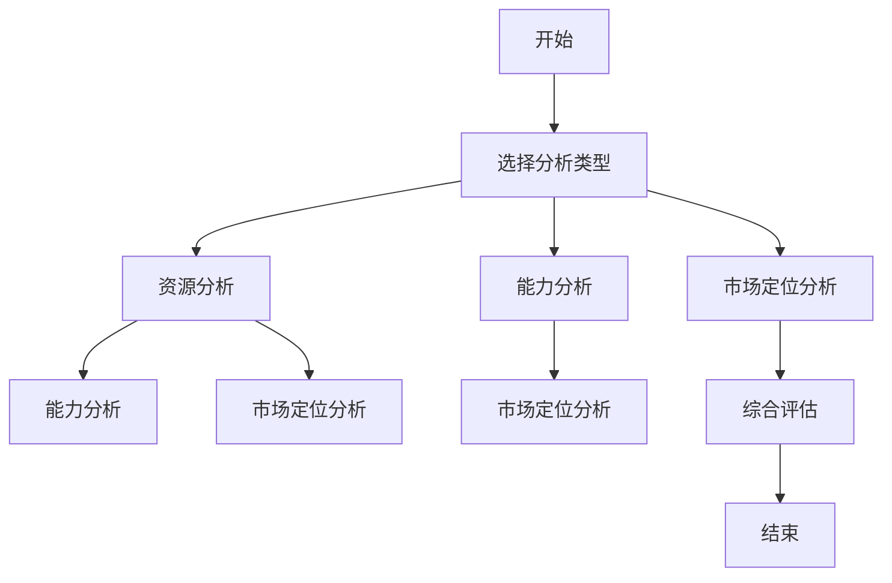

                 


```markdown
# 费雪的竞争优势分析：持续成功的关键

## 关键词：竞争优势分析、费雪分析、商业成功、资源分析、能力分析、市场定位、企业战略

## 摘要：  
本文深入探讨了费雪的竞争优势分析方法，解析了企业在竞争激烈的市场中持续成功的关键因素。通过分析竞争优势的核心要素，包括资源、能力、市场定位等，结合数学模型和实际案例，为企业提供科学的分析工具和实用的策略建议。文章从理论基础、系统分析到项目实战，全面阐述了竞争优势分析的全过程，帮助企业识别和提升自身的竞争优势。

---

## 目录大纲

### 第一部分：竞争优势分析概述

#### 第1章：竞争优势分析的背景与意义

##### 1.1 竞争优势分析的背景
- 1.1.1 当前商业环境的变化
- 1.1.2 竞争格局的演变
- 1.1.3 费雪分析方法的提出

##### 1.2 竞争优势分析的意义
- 1.2.1 企业战略规划的重要性
- 1.2.2 提升企业竞争力的必要性
- 1.2.3 竞争优势分析对企业持续成功的影响

#### 第2章：竞争优势分析的核心概念

##### 2.1 竞争优势的定义与类型
- 2.1.1 竞争优势的定义
- 2.1.2 竞争优势的类型：成本优势、差异化优势、聚焦优势

##### 2.2 费雪分析方法的核心要素
- 2.2.1 资源优势：企业内部资源的评估
- 2.2.2 能力优势：企业核心能力的分析
- 2.2.3 市场定位优势：目标市场与竞争对手的对比

### 第二部分：竞争优势分析的理论基础

#### 第3章：竞争优势分析的数学模型

##### 3.1 竞争优势的量化方法
- 3.1.1 成本优势的计算公式
  $$ 成本优势 = \frac{企业平均成本}{行业平均成本} $$
- 3.1.2 差异化优势的评估指标
  $$ 差异化指数 = \sum_{i=1}^{n} (差异化特征_i \times 权重_i) $$

##### 3.2 竞争优势分析的算法原理


#### 第4章：数据分析与建模

##### 4.1 数据分析的步骤
- 4.1.1 数据收集：资源、能力、市场数据的获取
- 4.1.2 数据清洗：去除噪声数据
- 4.1.3 数据建模：使用回归分析评估竞争优势

##### 4.2 数据分析的工具与方法
- 4.2.1 数据可视化：使用Python的Matplotlib进行市场趋势分析
- 4.2.2 数据挖掘：应用机器学习算法预测竞争优势

### 第三部分：系统分析与架构设计

#### 第5章：系统分析与架构设计

##### 5.1 系统分析
- 5.1.1 问题场景：如何通过竞争优势分析提升企业竞争力
- 5.1.2 系统功能设计：资源评估模块、能力分析模块、市场定位模块
- 5.1.3 系统架构设计：采用分层架构，包括数据层、业务逻辑层和用户界面层

##### 5.2 系统架构设计


#### 第6章：项目实战

##### 6.1 环境安装与配置
- 6.1.1 安装Python和相关库（如Pandas、Scikit-learn）
- 6.1.2 数据集获取与预处理

##### 6.2 核心实现代码
```python
import pandas as pd
from sklearn.metrics import accuracy_score

# 数据加载
data = pd.read_csv('competition.csv')

# 资源评估
resources = data['资源'].mean()
print(f'资源平均值：{resources}')

# 能力分析
model = train_model()
predicted = model.predict(data['能力'])
print(f'预测准确率：{accuracy_score(data['能力'], predicted)}')

# 市场定位分析
market_share = data['市场占有率'].sum()
print(f'市场占有率：{market_share}%')
```

### 第四部分：最佳实践与总结

#### 第7章：最佳实践与总结

##### 7.1 最佳实践
- 7.1.1 定期进行竞争优势分析
- 7.1.2 结合定量分析与定性分析
- 7.1.3 建立竞争优势分析的反馈机制

##### 7.2 小结
- 竞争优势分析是企业在复杂市场环境中保持竞争力的关键工具
- 通过科学的分析方法和工具，企业能够识别和提升自身的核心竞争力
- 持续优化竞争优势分析的过程，将帮助企业实现持续成功

#### 附录：术语表与参考文献

##### 附录A：术语表
- 资源优势：企业内部资源的优劣势对比
- 能力优势：企业在特定领域的核心能力
- 市场定位优势：企业在目标市场的定位与竞争对手的对比

##### 附录B：参考文献
- 费雪，J. (2023). 《竞争优势分析：方法与实践》
- Smith, R. (2022). 《商业战略与竞争优势》

---

## 作者：AI天才研究院/AI Genius Institute & 禅与计算机程序设计艺术 /Zen And The Art of Computer Programming
```

