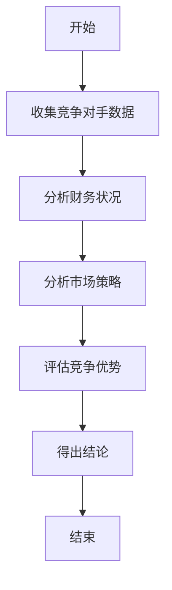
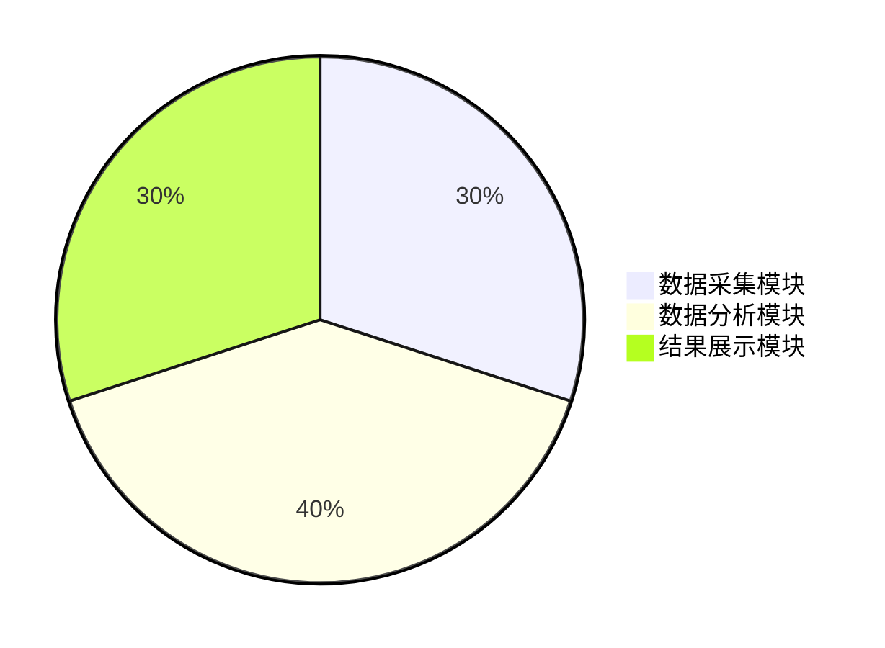
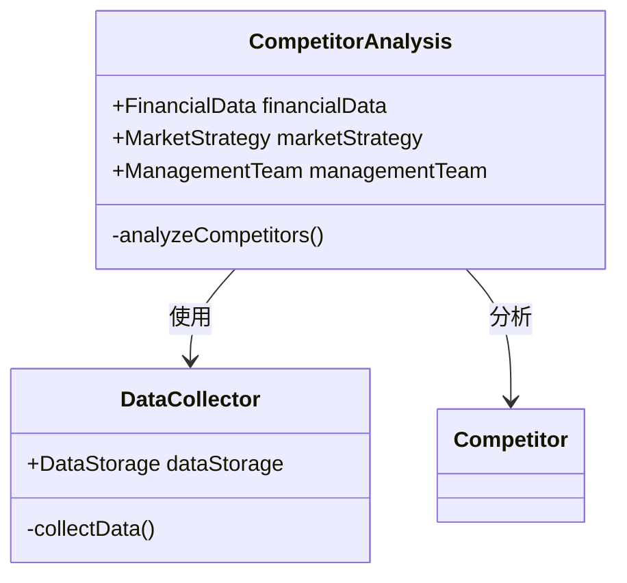

                 


# 费雪的竞争对手分析方法

> 关键词：费雪，竞争对手分析，投资分析，财务分析，市场策略，系统设计

> 摘要：本文详细介绍了费雪的竞争对手分析方法，从背景介绍、核心概念、算法原理、系统设计到项目实战，深入剖析了如何通过分析竞争对手的财务状况、市场策略等维度，评估其竞争力和潜在风险，帮助投资者做出更明智的决策。

---

## 第一部分：背景介绍

### 第1章：费雪的生平与投资理念

#### 1.1 费雪的早年经历
菲利普·费雪（Philip Fisher）是20世纪著名的投资专家，被誉为“成长型投资之父”。他出生于1907年，早年在美国宾夕法尼亚州匹兹堡市长大，父亲是一位成功的律师和投资者。费雪从小对投资产生了浓厚的兴趣，尤其是对铁路和制造业的投资。

#### 1.2 费雪的投资理念形成
费雪的投资理念主要受到本杰明·格雷厄姆的影响，但他在实践中逐渐形成了自己独特的成长型投资策略。他主张长期投资于具有强大竞争优势和持续增长潜力的企业，并通过深入研究企业的基本面来评估其投资价值。

#### 1.3 费雪的学术贡献与实践
费雪不仅是理论上的大师，还在实践中取得了巨大成功。他管理的共同基金在几十年间取得了远远超过市场平均水平的回报率，这充分验证了他的投资理念的有效性。

---

### 第2章：竞争对手分析方法的背景

#### 2.1 投资分析的演变历程
投资分析从早期的简单估值方法，逐渐发展为一门复杂的学科。随着市场的成熟和竞争的加剧，分析竞争对手的财务状况、市场策略等成为评估企业投资价值的重要环节。

#### 2.2 费雪方法的提出与应用
费雪在20世纪50年代提出了竞争对手分析的方法，这种方法的核心在于通过分析竞争对手的财务状况、市场策略和管理团队，评估其竞争优势和潜在风险。

#### 2.3 费雪方法的现代意义
尽管费雪的理论提出已有几十年，但其核心思想在现代投资分析中仍然具有重要的指导意义。尤其是在当今竞争激烈的市场环境中，竞争对手分析方法帮助企业更好地识别机会和风险。

---

## 第二部分：核心概念与联系

### 第3章：竞争对手分析的核心概念

#### 3.1 定义与关键要素对比表格
| 概念 | 定义 | 关键要素 |
|------|------|----------|
| 竞争对手分析 | 通过研究竞争对手的财务状况、市场策略、管理团队等，评估其竞争优势和潜在风险。 | 财务状况、市场策略、管理团队、技术优势、客户群体 |

#### 3.2 分析框架的ER实体关系图
```mermaid
er
actor CompetitorAnalysis, Competitor, FinancialData, MarketStrategy, ManagementTeam
CompetitorAnalysis --> Competitor: 研究
Competitor --> FinancialData: 包含
Competitor --> MarketStrategy: 包含
Competitor --> ManagementTeam: 包含
```

---

## 第三部分：算法原理与实现

### 第4章：竞争对手分析的算法原理

#### 4.1 算法原理的数学模型
$$
\text{竞争优势} = \frac{\text{企业财务状况} + \text{市场策略得分} + \text{管理团队能力}}{3}
$$

#### 4.2 分析流程的Mermaid流程图


---

## 第四部分：系统设计与实现

### 第5章：系统架构设计

#### 5.1 系统架构图


#### 5.2 功能模块划分


---

## 第五部分：项目实战

### 第6章：项目实战与案例分析

#### 6.1 环境安装
```bash
pip install pandas numpy matplotlib
```

#### 6.2 核心实现代码
```python
import pandas as pd
import numpy as np

def analyze_competitors(financial_data, market_strategy):
    # 计算财务健康指数
    financial_index = financial_data['净利润'] / financial_data['总收入']
    # 计算市场策略得分
    market_score = np.mean(market_strategy['市场份额'].values)
    return financial_index, market_score

# 示例数据
financial_data = pd.DataFrame({
    '净利润': [10, 15, 20],
    '总收入': [100, 150, 200]
})

market_strategy = pd.DataFrame({
    '市场份额': [20, 25, 30]
})

# 分析结果
financial_index, market_score = analyze_competitors(financial_data, market_strategy)
print(f"财务健康指数：{financial_index}")
print(f"市场策略得分：{market_score}")
```

#### 6.3 案例分析
以某科技公司为例，通过分析其竞争对手的财务状况和市场策略，评估其竞争优势。假设竞争对手的财务数据和市场策略如下：

| 财务指标 | 对比公司A | 对比公司B |
|----------|-----------|-----------|
| 净利润   | 50        | 70        |
| 总收入   | 500       | 600       |

市场策略方面，公司A的市场份额为15%，公司B为20%。通过计算财务健康指数和市场策略得分，我们可以得出公司B在财务状况和市场策略上更具优势。

---

## 第六部分：总结与展望

### 第7章：总结与注意事项

#### 7.1 总结
费雪的竞争对手分析方法通过系统地分析竞争对手的财务状况、市场策略等关键因素，帮助企业识别竞争优势和潜在风险，为投资决策提供有力支持。

#### 7.2 注意事项
- 数据来源的准确性是分析结果可靠性的关键。
- 分析过程中需要结合行业特点和市场环境进行调整。
- 需要定期更新分析结果以应对市场变化。

---

## 作者信息

作者：AI天才研究院/AI Genius Institute & 禅与计算机程序设计艺术 /Zen And The Art of Computer Programming

---

这篇文章通过详细阐述费雪的竞争对手分析方法，结合理论与实践，为读者提供了一套系统化的分析框架和实现方案。希望对投资者和企业管理者在分析竞争对手时提供有价值的参考。

