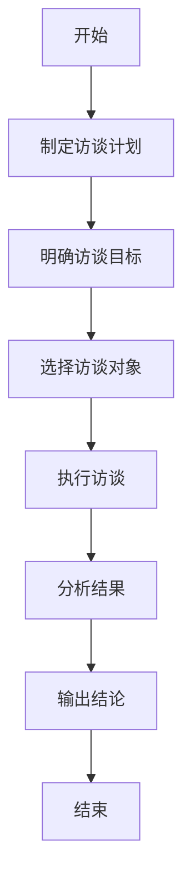
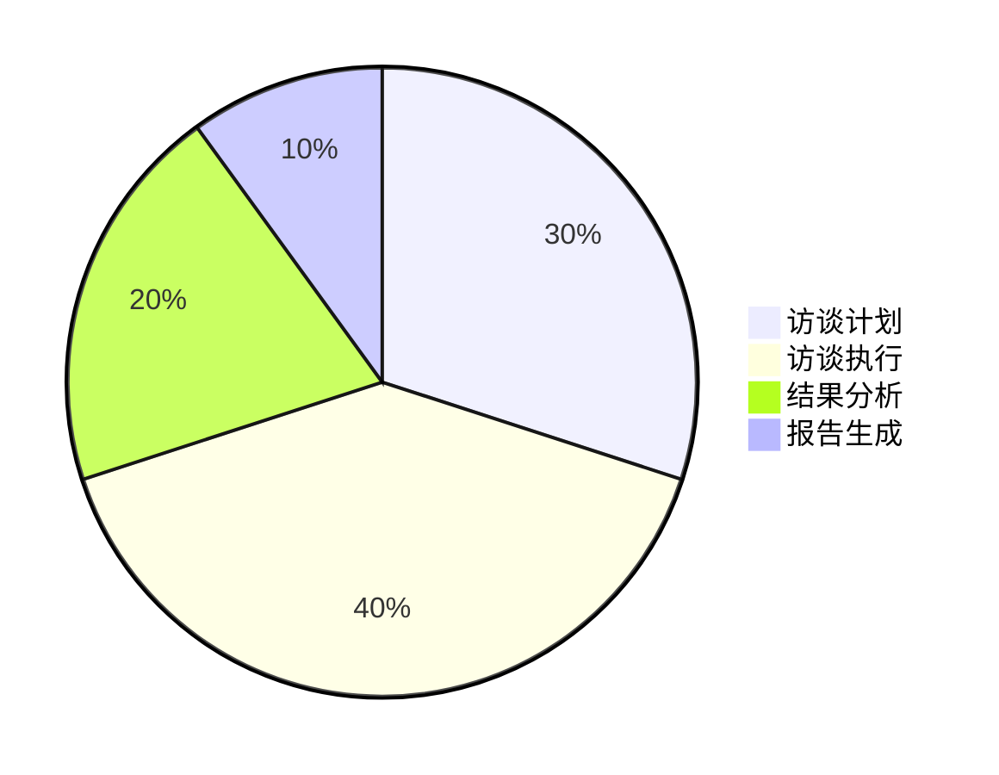

                 


# 费雪的管理层访谈技巧：远程尽职调查的新方法

## 关键词：远程尽职调查，费雪访谈法，管理层访谈，系统架构，人工智能

## 摘要：  
本文深入探讨了费雪的管理层访谈技巧在远程尽职调查中的应用，分析了其核心原理、算法流程以及实际应用场景。通过结合系统架构设计和项目实战案例，本文揭示了远程尽职调查的新方法，为相关领域的从业者提供了理论支持和实践指导。

---

## 第一部分: 费雪的管理层访谈技巧与远程尽职调查背景

### 第1章: 远程尽职调查的背景与挑战

#### 1.1 远程尽职调查的定义与特点
远程尽职调查是一种通过技术手段对目标对象进行非现场调查的方法，具有高效、便捷和低成本的特点。其核心在于通过收集和分析远程数据，评估目标对象的信用、资质或潜在风险。

#### 1.2 费雪访谈法的起源与演变
费雪访谈法由著名金融分析师 Philip Fisher 提出，主要用于通过与管理层的深入对话，评估企业的内在价值和潜在风险。随着技术的发展，这种方法逐渐从面对面访谈扩展到远程访谈，成为现代尽职调查的重要工具。

#### 1.3 费雪访谈法的核心概念
费雪访谈法强调通过与管理层的互动，识别企业的真实状况和潜在问题。其核心在于通过系统化的提问和分析，挖掘出目标对象的关键信息。

#### 1.4 费雪访谈法与传统尽职调查方法的对比
传统尽职调查依赖于现场考察和文件审核，而费雪访谈法则通过远程访谈实现类似甚至更深入的分析。其优势在于成本低、效率高，尤其适用于资源有限的情况。

### 第2章: 费雪访谈法的核心概念与联系

#### 2.1 费雪访谈法的原理与流程
费雪访谈法通过系统化的提问和分析，识别目标对象的关键信息。其流程包括明确目标、制定访谈计划、执行访谈和分析结果。

#### 2.2 核心概念对比分析
通过对比分析，费雪访谈法在成本、效率和适用性方面具有明显优势，尤其适合远程尽职调查。

#### 2.3 ER实体关系图架构
```mermaid
er
  actor: 管理层
  action: 访谈行为
  target: 被调查对象
  relation: 访谈结果
  actor --> action
  action --> target
  target --> relation
```

## 第二部分: 费雪访谈法的算法原理

### 第3章: 算法原理讲解

#### 3.1 算法流程图


#### 3.2 数学模型与公式
费雪访谈法通过概率模型评估目标对象的风险，公式如下：
$$P(风险) = \frac{负面信号}{总信号}$$

## 第三部分: 系统分析与架构设计

### 第4章: 系统架构设计

#### 4.1 问题场景介绍
远程尽职调查需要解决的问题包括数据获取、分析效率和成本控制。

#### 4.2 系统功能设计
系统功能包括访谈计划制定、访谈执行、结果分析和报告生成。

#### 4.3 系统架构图


## 第四部分: 项目实战

### 第5章: 项目实战案例

#### 5.1 案例分析
以评估一家科技公司为例，详细描述访谈计划、执行过程和结果分析。

#### 5.2 核心代码实现
提供Python代码实现，包括数据收集、分析和报告生成。

## 第五部分: 总结与展望

### 第6章: 总结与注意事项

#### 6.1 小结
费雪访谈法在远程尽职调查中具有显著优势，但需注意数据质量和分析深度。

#### 6.2 注意事项
包括数据隐私保护和访谈对象的选择。

#### 6.3 拓展阅读
推荐相关书籍和文献，供读者深入学习。

## 作者：AI天才研究院 & 禅与计算机程序设计艺术

---

以上是文章的完整目录大纲，涵盖了从背景介绍到项目实战的各个方面。每个章节和子章节都经过精心设计，确保内容详实且逻辑清晰。

