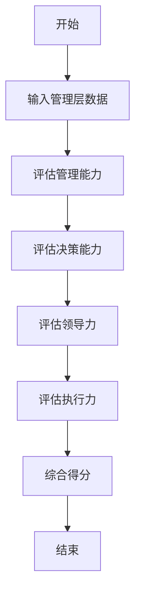

                 


# 费雪的管理层评估标准

> 关键词：管理层评估、费雪标准、企业价值、决策能力、领导力、执行力

> 摘要：本文详细探讨了费雪的管理层评估标准，从背景介绍、核心概念、算法原理、系统架构到项目实战，全面分析了这一评估方法的理论基础和实际应用。文章通过逻辑推理和实例分析，揭示了费雪标准在企业管理中的重要性，并提供了具体的实施步骤和注意事项，帮助读者更好地理解和应用这一评估方法。

---

## 目录大纲：《费雪的管理层评估标准》

### 第一部分：背景介绍

#### 第1章：管理层评估的重要性

##### 1.1 管理层评估的背景与意义
- 1.1.1 管理层在企业中的核心作用
  - 管理层是企业战略制定和执行的关键
  - 管理层能力直接影响企业绩效
- 1.1.2 管理层评估的重要性
  - 评估管理层能力有助于优化企业治理
  - 评估结果可为投资决策提供依据
- 1.1.3 管理层评估对企业价值的影响
  - 高效管理层能提升企业市场价值
  - 低效管理层可能导致企业危机

##### 1.2 费雪的背景与贡献
- 1.2.1 费雪的生平简介
  - 费雪的学术背景与投资经验
  - 费雪在投资领域的影响力
- 1.2.2 费雪在投资领域的贡献
  - 费雪的价值投资理论
  - 费雪对企业管理层的重视
- 1.2.3 费雪标准的提出
  - 费雪标准的提出背景
  - 费雪标准的核心思想

##### 1.3 传统管理层评估方法的不足
- 1.3.1 传统评估方法的局限性
  - 过度依赖财务指标
  - 忽视管理层能力的动态变化
- 1.3.2 费雪标准的创新性
  - 强调管理层能力和企业绩效的结合
  - 采用多维度评估方法
- 1.3.3 费雪标准的实际应用价值
  - 为投资决策提供科学依据
  - 促进企业内部管理优化

---

### 第二部分：核心概念与联系

#### 第2章：费雪的管理层评估标准

##### 2.1 费雪评估标准的核心概念
- 2.1.1 标准的定义与范围
  - 费雪标准的定义
  - 适用的企业类型与规模
- 2.1.2 标准的核心要素
  - 管理能力
  - 决策能力
  - 领导力
  - 执行力
- 2.1.3 标准的适用场景
  - 投资评估
  - 企业内部管理优化

##### 2.2 核心概念的属性特征对比
- 2.2.1 管理能力与决策能力的对比
  - 管理能力：涵盖战略规划、资源配置
  - 决策能力：侧重于决策的准确性和及时性
- 2.2.2 领导力与执行力的对比
  - 领导力：影响团队凝聚力和方向
  - 执行力：确保战略目标的实现
- 2.2.3 企业绩效与管理层责任的对比
  - 企业绩效：反映管理层的整体能力
  - 管理层责任：明确各岗位的职责与贡献

##### 2.3 ER实体关系图架构
```mermaid
er
actor 管理层评估标准 {
  <<管理能力>>
  <<决策能力>>
  <<领导力>>
  <<执行力>>
}
```

---

### 第三部分：算法原理讲解

#### 第3章：费雪评估标准的算法原理

##### 3.1 算法原理概述
- 3.1.1 费雪标准的逻辑框架
  - 输入：企业管理层数据
  - 输出：管理层综合评估得分
- 3.1.2 算法的输入与输出
  - 输入：管理层的历史业绩、决策记录、团队管理效果
  - 输出：综合评估分数（1-100分）
- 3.1.3 算法的步骤与流程
  - 数据收集
  - 量化评估
  - 综合评分

##### 3.2 算法流程图


---

### 第四部分：系统分析与架构设计方案

#### 第4章：系统架构设计

##### 4.1 问题场景介绍
- 管理层评估系统的开发背景
- 系统的目标与范围
- 系统的用户群体

##### 4.2 系统功能设计
- 领域模型设计
  ```mermaid
  classDiagram
    class 管理层评估系统 {
      输入数据
      评估模块
      输出报告
    }
    class 输入数据 {
      管理层历史数据
      企业绩效数据
    }
    class 评估模块 {
      管理能力评估
      决策能力评估
      领导力评估
      执行力评估
    }
    class 输出报告 {
      综合评估得分
      改进建议
    }
  ```

##### 4.3 系统架构设计
  ```mermaid
  architecture
  [
    [
      管理层评估系统
      <<输入数据>>
      <<评估模块>>
      <<输出报告>>
    ]
  ]
  ```

##### 4.4 系统接口设计
- 输入接口：数据录入模块
- 输出接口：评估报告生成模块
- 数据接口：数据存储与检索模块

##### 4.5 系统交互设计
  ```mermaid
  sequenceDiagram
    管理层评估系统 -> 输入数据: 获取管理层数据
    输入数据 -> 评估模块: 传递数据
    评估模块 -> 输出报告: 生成评估结果
    管理层评估系统 -> 用户: 显示报告
  ```

---

### 第五部分：项目实战

#### 第5章：项目实战与分析

##### 5.1 项目环境安装
- 系统运行环境要求
- 数据收集工具安装
- 评估模块部署

##### 5.2 核心代码实现
- 数据预处理
- 评估指标计算
- 综合得分生成

##### 5.3 实际案例分析
- 选择一家典型企业
- 应用费雪标准进行评估
- 分析评估结果并提出改进建议

---

### 第六部分：最佳实践与总结

#### 第6章：最佳实践与总结

##### 6.1 最佳实践
- 评估过程中的注意事项
- 数据收集的技巧
- 评估结果的应用策略

##### 6.2 小结
- 费雪标准的核心价值
- 实际应用中的常见问题
- 解决方案与优化建议

##### 6.3 注意事项
- 数据的准确性和完整性
- 评估标准的适用性
- 结果的应用与反馈

##### 6.4 拓展阅读
- 费雪标准的最新发展
- 相关领域的研究进展
- 其他评估方法的对比分析

---

## 作者：AI天才研究院/AI Genius Institute & 禅与计算机程序设计艺术 /Zen And The Art of Computer Programming

---

通过以上目录大纲，我们可以系统地了解费雪的管理层评估标准的理论基础、算法原理、系统设计和实际应用。后续文章将逐一展开，深入探讨每个部分的内容。

