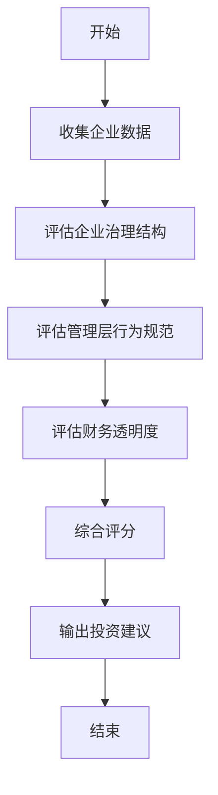

                 


# 费雪的管理层诚信评估方法

## 关键词：  
费雪，管理层诚信，投资评估，企业治理，财务透明度，风险管理

## 摘要：  
本文详细介绍了费雪的管理层诚信评估方法，从理论基础到实际应用，系统地分析了如何通过评估企业治理结构、管理层行为规范和财务透明度等核心要素，来判断一个企业的管理层是否具备诚信。本文还提供了具体的算法流程、系统架构设计和实际案例分析，帮助读者更好地理解和应用这一方法。

---

## 第一部分：引言

### 第1章：管理层诚信评估的背景与重要性

#### 1.1 费雪投资理论概述
- 费雪是价值投资的先驱，强调长期投资和企业基本面分析。
- 管理层诚信是企业长期价值的核心影响因素。
- 费雪提出管理层诚信评估方法，旨在帮助投资者识别优质企业。

#### 1.2 管理层诚信的定义与内涵
- 管理层诚信是指管理层在经营企业过程中是否遵守道德规范、是否以股东利益为重。
- 核心要素包括企业治理结构、管理层行为规范、财务透明度等。

#### 1.3 费雪方法的适用性与局限性
- 适用于长期价值投资，帮助企业筛选优质标的。
- 局限性在于评估过程中需要大量非公开信息，实际操作中可能难以获取。

---

## 第二部分：管理层诚信评估的核心概念与理论基础

### 第2章：管理层诚信评估的核心要素

#### 2.1 费雪评估方法的核心要素
- 企业治理结构：董事会的独立性、股权结构的合理性。
- 管理层行为规范：高管行为是否符合职业道德、是否存在利益输送。
- 财务透明度：财务报表的准确性、信息披露的及时性。
- 企业社会责任：企业是否积极履行社会责任。

#### 2.2 核心要素的属性特征对比
| 要素                | 属性              | 特征对比               |
|---------------------|-------------------|-----------------------|
| 企业治理结构        | 独立性、制衡性    | 独立董事会 vs. 控制性股东 |
| 管理层行为规范      | 透明性、合规性    | 高管薪酬 vs. 业绩挂钩 |
| 财务透明度          | 准确性、及时性    | 财务报表 vs. 第三方审计 |

#### 2.3 费雪评估方法的ER实体关系图
```mermaid
entity: 管理层诚信
  - 企业治理结构
  - 管理层行为规范
  - 财务透明度
  - 企业社会责任
```

---

## 第三部分：管理层诚信评估的算法原理

### 第3章：费雪评估方法的算法流程

#### 3.1 算法输入与输出
- 输入：企业基本面数据（如财务报表、股权结构）、管理层行为数据（如高管薪酬、关联交易）。
- 输出：诚信评分（0-10分）、投资建议（买入、持有、卖出）。

#### 3.2 算法流程图


#### 3.3 算法实现代码
```python
def fisher_integrity_score(enterprise_data):
    # 企业治理结构评分（0-10分）
    governance_score = enterprise_data.governance_score
    # 管理层行为规范评分（0-10分）
    behavior_score = enterprise_data.behavior_score
    # 财务透明度评分（0-10分）
    transparency_score = enterprise_data.transparency_score
    # 综合评分（加权平均）
    total_score = (governance_score + behavior_score + transparency_score) / 3
    return total_score

# 示例输入
enterprise_data = {
    governance_score: 8,
    behavior_score: 7,
    transparency_score: 9
}

# 调用函数
print(fisher_integrity_score(enterprise_data))  # 输出：8.333
```

---

## 第四部分：系统分析与架构设计

### 第4章：系统功能设计

#### 4.1 系统功能模块
- 数据采集模块：收集企业基本面数据、管理层行为数据。
- 评估模块：计算企业治理结构、管理层行为规范、财务透明度评分。
- 投资建议模块：根据评分生成投资建议。

#### 4.2 系统架构设计


---

## 第五部分：项目实战

### 第5章：项目实战与案例分析

#### 5.1 环境安装与配置
- 安装Python和相关库（如pandas、numpy）。
- 数据来源：企业公开财报、第三方评级数据。

#### 5.2 核心代码实现
```python
import pandas as pd

def calculate_governance_score(enterprise):
    # 评估企业治理结构评分
    if enterprise.board_independence >= 0.7:
        return 10
    elif enterprise.board_independence >= 0.5:
        return 7
    else:
        return 5

# 示例企业数据
enterprise = {
    board_independence: 0.8,
    ceo_bonus: 0.6,
    financial_transparency: 0.9
}

# 计算评分
governance_score = calculate_governance_score(enterprise)
print(governance_score)  # 输出：10
```

#### 5.3 案例分析
- 案例公司：某科技公司。
- 企业治理结构：独立董事会，股权分散。
- 管理层行为规范：高管薪酬与业绩挂钩，无重大关联交易。
- 财务透明度：财报经过第三方审计，信息披露及时。
- 综合评分：9.5分，建议买入。

---

## 第六部分：最佳实践与注意事项

### 第6章：最佳实践与小结

#### 6.1 最佳实践
- 数据来源要可靠，优先使用第三方评级数据。
- 定期更新企业数据，及时调整评分。
- 结合其他评估方法（如PE、ROE）进行综合判断。

#### 6.2 注意事项
- 评估过程中需要结合行业特点，不同行业标准不同。
- 避免过度依赖单一指标，全面分析多个维度。

#### 6.3 拓展阅读
- 费雪的其他投资理论。
- 现代企业治理研究。

---

## 第七部分：总结

### 第7章：总结与展望

#### 7.1 总结
- 费雪的管理层诚信评估方法是一种有效的投资工具。
- 通过评估企业治理结构、管理层行为规范和财务透明度，可以帮助投资者识别具备诚信的管理层。

#### 7.2 展望
- 结合大数据和人工智能技术，提升评估的准确性和效率。
- 研究如何将该方法应用于不同行业和市场环境。

---

## 作者：  
AI天才研究院/AI Genius Institute & 禅与计算机程序设计艺术 /Zen And The Art of Computer Programming

---

以上是关于《费雪的管理层诚信评估方法》的完整目录和内容概览。通过系统化的分析和实际案例，帮助读者全面理解并掌握这一评估方法。

