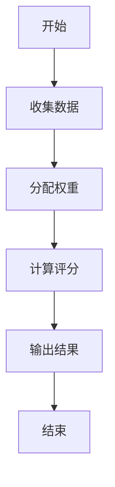
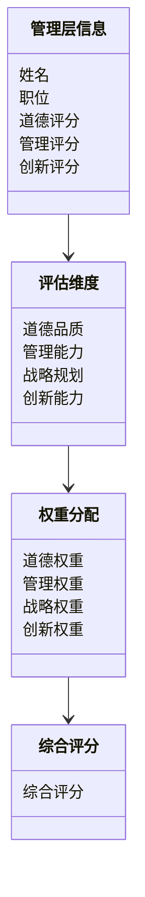

                 


# 费雪的管理层质量评估方法

## 关键词：费雪，管理层质量，投资评估，企业治理，价值分析

## 摘要：费雪的管理层质量评估方法是一种通过分析企业管理层的质量来评估企业价值的方法。这种方法强调了管理层在企业成功中的关键作用，并提供了一套系统的方法来评估管理层的质量。本文将详细探讨这种方法的核心概念、评估模型、系统架构以及实际应用案例，帮助读者更好地理解和应用这一方法。

---

# {{此处是文章标题}}

> 关键词：{{此处列出文章的5-7个核心关键词}}

> 摘要：{{此处给出文章的核心内容和主题思想}}

---

# 费雪的管理层质量评估方法

## 引言

在投资领域，企业的管理层质量往往是决定企业价值的关键因素之一。费雪（Philip Fisher）作为价值投资的先驱，提出了管理层质量评估的方法，认为管理层的能力和决策对企业长期成功至关重要。本文将详细探讨这一方法的背景、核心概念、评估模型和实际应用，帮助投资者更好地评估企业的管理层质量。

---

## 第1章：费雪的管理层质量评估方法概述

### 1.1 费雪的生平与投资理念

#### 1.1.1 费雪的生平简介

Philip Fisher是20世纪著名的投资专家，被誉为“成长股之父”。他出生于1906年，去世于1999年，是价值投资的重要倡导者之一。Fisher的投资理念强调长期增长，认为企业的管理层质量是决定企业成功与否的关键因素。

#### 1.1.2 费雪的投资理念与方法

Fisher主张投资于具有持续增长潜力的企业，特别是那些在管理层领导下能够不断创新和提高效率的企业。他认为，企业的管理层应该具备良好的道德品质、卓越的管理能力和清晰的战略规划。

#### 1.1.3 费雪对管理层质量的重视

在Fisher看来，企业的管理层是企业的“火车头”，他们的决策直接影响企业的命运。因此，评估管理层的质量是投资决策中的重要环节。

### 1.2 管理层质量评估的重要性

#### 1.2.1 管理层质量对企业价值的影响

管理层的质量直接影响企业的战略制定、运营效率和创新能力。一个优秀的管理层能够带领企业在激烈的竞争中脱颖而出，实现持续增长。

#### 1.2.2 投资者如何通过评估管理层质量获得收益

投资者通过评估管理层的质量，可以识别出那些具有长期增长潜力的企业，从而获得超额收益。相反，管理层素质低下的企业往往难以实现持续增长，投资风险较大。

#### 1.2.3 管理层质量评估的边界与外延

管理层质量评估并非孤立的行为，它需要结合企业的财务状况、市场环境和行业特点进行综合分析。评估的边界包括企业的战略、文化和组织结构等因素。

### 1.3 费雪管理层质量评估方法的核心要素

#### 1.3.1 核心概念与定义

管理层质量评估的核心概念包括管理层的道德品质、管理能力、战略规划和创新能力等。

#### 1.3.2 核心要素的构成与特征

- **道德品质**：管理层是否具备诚信和责任感。
- **管理能力**：管理层是否具备领导力和决策能力。
- **战略规划**：管理层是否制定清晰的战略目标。
- **创新能力**：管理层是否能够推动企业创新。

#### 1.3.3 与其它评估方法的对比分析

与传统的财务评估方法相比，费雪的方法更加注重非财务因素，尤其是管理层的质量。这种方法能够更全面地评估企业的潜在价值。

---

## 第2章：管理层质量评估的核心概念与联系

### 2.1 核心概念原理

#### 2.1.1 费雪方法的核心原理

费雪的管理层质量评估方法基于以下原理：企业的长期价值取决于管理层的质量，而管理层的质量可以通过对其道德品质、管理能力和战略规划的评估来衡量。

#### 2.1.2 管理层质量评估的关键维度

- **道德品质**：管理层是否具备诚信和责任感。
- **管理能力**：管理层是否具备领导力和决策能力。
- **战略规划**：管理层是否制定清晰的战略目标。
- **创新能力**：管理层是否能够推动企业创新。

#### 2.1.3 各维度的权重分配

在评估过程中，每个维度的权重可以根据企业的行业特点和具体情况进行调整。例如，对于技术行业，创新能力的权重可能更高。

### 2.2 核心概念属性特征对比表

以下表格对比了管理层质量评估的四个维度及其属性特征：

| 维度         | 特性               | 权重（示例） |
|--------------|--------------------|--------------|
| 道德品质     | 诚信、责任感        | 20%          |
| 管理能力     | 领导力、决策能力    | 30%          |
| 战略规划     | 战略目标、规划能力  | 25%          |
| 创新能力     | 创新意识、技术能力  | 25%          |

### 2.3 ER实体关系图架构

以下是一个简单的ER实体关系图，展示了管理层质量评估的核心要素：

```mermaid
erd
    Manager
    +----+
    | 姓名 |  管理层
    | 职位 |<--(1..n)- 关系
    +----+
        |
        |
        技能
        +----+
        | 类型   |
        +----+
```

---

## 第3章：管理层质量评估的算法原理

### 3.1 算法原理概述

#### 3.1.1 算法的基本思路

费雪的管理层质量评估方法可以通过以下步骤实现：

1. **数据收集**：收集企业的管理层信息，包括道德品质、管理能力和战略规划等方面的数据。
2. **权重分配**：根据企业的行业特点，为每个评估维度分配相应的权重。
3. **评分计算**：根据每个维度的评分，计算综合评分。
4. **结果分析**：根据综合评分，评估企业的管理层质量。

#### 3.1.2 算法的输入与输出

- **输入**：企业的管理层信息、评估维度权重。
- **输出**：综合评分、管理层质量评估结果。

#### 3.1.3 算法的数学模型

综合评分的计算公式如下：

$$
\text{综合评分} = \sum (\text{各维度评分} \times \text{权重})
$$

### 3.2 算法流程图

以下是一个简单的算法流程图：



---

## 第4章：系统分析与架构设计方案

### 4.1 问题场景介绍

为了实现费雪的管理层质量评估方法，我们需要设计一个系统，能够收集、处理和分析企业的管理层信息，并生成评估结果。

### 4.2 系统功能设计

#### 4.2.1 领域模型

以下是一个简单的领域模型类图：



### 4.3 系统架构设计

#### 4.3.1 系统架构图

以下是一个简单的系统架构图：


---

## 第5章：项目实战

### 5.1 环境安装

为了实现费雪的管理层质量评估方法，我们需要安装以下环境：

- **编程语言**：Python
- **开发工具**：PyCharm
- **依赖库**：pandas, numpy

### 5.2 核心代码实现

以下是一个简单的Python代码实现：

```python
# 管理层质量评估函数
def calculate_manager_score(manager_info, weights):
    score = 0
    for key in manager_info:
        score += manager_info[key] * weights[key]
    return score

# 示例数据
manager_info = {
    '道德品质': 90,
    '管理能力': 85,
    '战略规划': 80,
    '创新能力': 85
}

weights = {
    '道德品质': 0.2,
    '管理能力': 0.3,
    '战略规划': 0.25,
    '创新能力': 0.25
}

# 计算综合评分
score = calculate_manager_score(manager_info, weights)
print("综合评分：", score)
```

### 5.3 代码应用解读与分析

上述代码实现了费雪的管理层质量评估方法，首先定义了一个计算综合评分的函数，然后使用示例数据进行计算。最终输出综合评分。

### 5.4 案例分析

以一家科技公司为例，假设其管理层的评分如下：

- 道德品质：90
- 管理能力：85
- 战略规划：80
- 创新能力：85

权重分配如下：

- 道德品质：0.2
- 管理能力：0.3
- 战略规划：0.25
- 创新能力：0.25

综合评分计算如下：

$$
\text{综合评分} = 90 \times 0.2 + 85 \times 0.3 + 80 \times 0.25 + 85 \times 0.25 = 18 + 25.5 + 20 + 21.25 = 84.75
$$

综合评分为84.75，属于优秀水平。

### 5.5 项目总结

通过上述案例分析，我们可以看到，费雪的管理层质量评估方法能够有效地帮助企业评估管理层的质量，从而为投资决策提供有力支持。

---

## 第6章：总结

费雪的管理层质量评估方法是一种简单而有效的评估工具，能够帮助企业识别优秀的企业管理层，从而为投资决策提供依据。本文通过详细讲解这种方法的核心概念、评估模型和实际应用，帮助读者更好地理解和应用这一方法。

---

## 作者：AI天才研究院/AI Genius Institute & 禅与计算机程序设计艺术 /Zen And The Art of Computer Programming

---

以上就是《费雪的管理层质量评估方法》的技术博客文章。通过本文，读者可以深入了解费雪的管理层质量评估方法，并将其应用到实际投资决策中。

