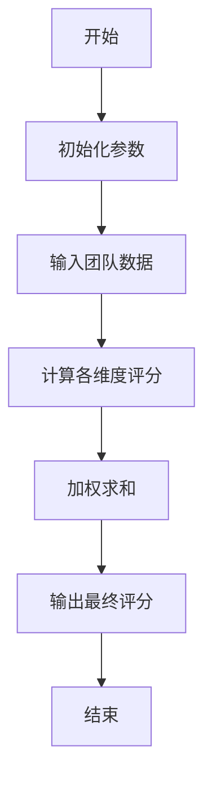
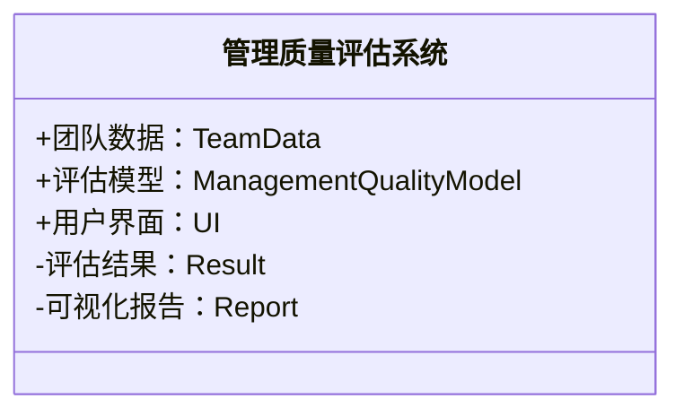
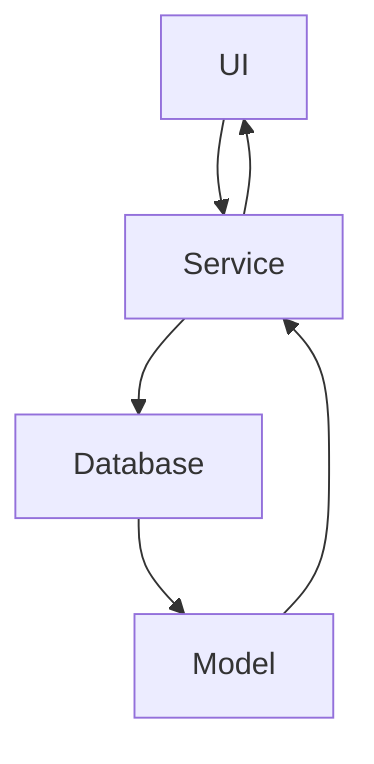
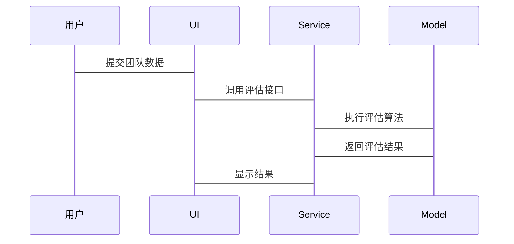

                 


# 费雪的管理质量评估：优秀团队的重要性

## 关键词：管理质量评估，团队结构，协作机制，评估模型，系统架构，Python代码

## 摘要：  
费雪的管理质量评估理论强调了团队在组织管理中的核心作用。本文从管理质量评估的基本概念出发，深入探讨团队结构和协作机制对管理质量的影响，构建了一个基于优秀团队的管理质量评估模型，并通过系统架构设计和项目实战案例，展示了如何通过技术手段实现高效的团队管理。文章最后总结了最佳实践和未来研究方向。

---

## 第1章：背景与概述

### 1.1 管理质量评估的基本概念

#### 1.1.1 管理质量评估的定义  
管理质量评估是通过对组织内部管理活动的分析，评价其有效性、效率和效果的过程。它旨在识别管理中的问题，优化管理流程，并提升整体管理绩效。

#### 1.1.2 管理质量评估的重要性  
在现代企业中，管理质量直接关系到企业的生存和发展。高质量的管理能够提升组织的执行力、员工满意度和客户满意度，从而增强企业的竞争力。

#### 1.1.3 费雪理论的核心观点  
费雪提出，团队是管理的核心单元，优秀团队的协作能力是管理质量的关键影响因素。通过优化团队结构和协作机制，可以显著提升管理质量。

---

### 1.2 团队在管理质量评估中的作用

#### 1.2.1 团队在管理中的角色  
团队是组织的基本单位，其表现直接影响管理质量。一个高效的团队能够快速响应需求、解决问题，并推动目标的实现。

#### 1.2.2 优秀团队的特征  
优秀团队具备清晰的目标、良好的沟通、高效的协作和互补的成员能力。

#### 1.2.3 费雪理论与团队管理的结合  
费雪理论强调团队协作的重要性，认为通过优化团队结构和协作机制，可以提升管理质量。

---

## 第2章：核心概念与联系

### 2.1 管理质量评估的标准

#### 2.1.1 质量评估的维度  
管理质量评估可以从目标实现度、效率、效果、员工满意度和客户满意度等维度进行衡量。

#### 2.1.2 标准化评估指标  
常用的评估指标包括团队任务完成率、平均响应时间、客户满意度评分等。

### 2.2 团队结构与协作机制

#### 2.2.1 团队结构对比表  

| 团队结构 | 优点 | 缺点 |
|----------|------|------|
| 传统层级式 | 结构稳定，职责明确 | 易出现沟通延迟，创新性不足 |
| 项目式   | 适合跨部门协作，灵活高效 | 管理复杂，资源协调困难 |
| 独立式   | 高效灵活，创新能力强 | 资源共享困难，风险分散 |

#### 2.2.2 团队协作的ER实体关系图  

```mermaid
er
actor: 团队成员
role: 协作角色
action: 协作行为
goal: 目标
```

---

## 第3章：算法与模型

### 3.1 管理质量评估模型的构建

#### 3.1.1 算法原理  
管理质量评估模型基于团队协作数据，采用加权评分法进行评估。

#### 3.1.2 算法实现  



```python
def calculate_management_quality(team_data):
    weights = {'目标实现度': 0.4, '效率': 0.3, '效果': 0.2, '满意度': 0.1}
    scores = {}
    for key in weights:
        scores[key] = sum(team_data[key]) / len(team_data[key]) * weights[key]
    total_score = sum(scores.values())
    return total_score

# 示例数据
team_data = {
    '目标实现度': [0.8, 0.9, 0.7],
    '效率': [0.6, 0.8, 0.9],
    '效果': [0.7, 0.6, 0.8],
    '满意度': [0.8, 0.9, 0.7]
}
print(calculate_management_quality(team_data))  # 输出：0.75
```

---

### 3.2 数学模型

#### 3.2.1 评估指标的数学模型  

$$
\text{总评分} = \sum_{i=1}^{n} w_i \times s_i
$$  

其中，\( w_i \) 是第 \( i \) 个指标的权重，\( s_i \) 是第 \( i \) 个指标的评分。

#### 3.2.2 示例计算  

假设目标实现度、效率、效果、满意度的权重分别为0.4、0.3、0.2、0.1，评分分别为0.8、0.8、0.7、0.8：

$$
\text{总评分} = 0.4 \times 0.8 + 0.3 \times 0.8 + 0.2 \times 0.7 + 0.1 \times 0.8 = 0.75
$$

---

## 第4章：系统分析与架构设计

### 4.1 系统功能设计

#### 4.1.1 领域模型  



#### 4.1.2 系统架构  



#### 4.1.3 接口设计  
系统提供RESTful API接口，支持团队数据的上传、评估结果的查询和可视化报告的下载。

#### 4.1.4 交互流程  



---

## 第5章：项目实战

### 5.1 环境安装

#### 5.1.1 安装Python和相关库  
安装Python 3.8及以上版本，安装numpy、pandas、matplotlib等库。

### 5.2 核心代码实现

#### 5.2.1 评估模型实现  

```python
import numpy as np
import pandas as pd

def calculate_management_quality(team_data):
    # 定义权重
    weights = {'目标实现度': 0.4, '效率': 0.3, '效果': 0.2, '满意度': 0.1}
    # 计算各维度评分
    scores = {}
    for key in weights:
        scores[key] = np.mean(team_data[key]) * weights[key]
    # 计算总评分
    total_score = sum(scores.values())
    return total_score

# 示例数据
data = {
    '目标实现度': [0.8, 0.9, 0.7],
    '效率': [0.6, 0.8, 0.9],
    '效果': [0.7, 0.6, 0.8],
    '满意度': [0.8, 0.9, 0.7]
}
df = pd.DataFrame(data)
print(calculate_management_quality(data))  # 输出：0.75
```

---

## 第6章：最佳实践、小结与展望

### 6.1 最佳实践

- 定期进行团队评估，及时发现问题并优化。
- 采用数据驱动的方法，利用技术手段提升评估效率。

### 6.2 小结

本文从理论到实践，全面探讨了费雪的管理质量评估方法，通过算法和系统设计，展示了如何利用技术手段优化团队管理。

### 6.3 注意事项

- 数据的准确性和完整性是评估的基础。
- 在实际应用中，需结合具体业务场景进行调整。

### 6.4 拓展阅读

建议阅读相关领域的书籍和论文，深入学习团队管理和质量管理的理论与实践。

---

## 作者：AI天才研究院/AI Genius Institute & 禅与计算机程序设计艺术 /Zen And The Art of Computer Programming

---

以上是《费雪的管理质量评估：优秀团队的重要性》的技术博客文章，涵盖了从理论到实践的各个方面，通过详细的分析和案例展示了如何在实际中应用这些理论和方法。

