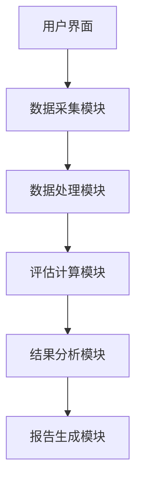

                 


# 费雪的管理质量评估：远程团队管理能力的重要性

> **关键词**：管理质量评估、远程团队管理、费雪评估模型、团队协作、沟通效率、管理能力

> **摘要**：本文系统地介绍费雪的管理质量评估方法，重点分析远程团队管理能力的重要性。通过理论与实践结合，探讨如何构建科学的评估体系，提升远程团队的管理质量，为管理者提供实用的指导和建议。

---

# 第1章: 费雪的管理质量评估概述

## 1.1 费雪管理质量评估的背景与意义

### 1.1.1 远程团队管理的挑战与问题背景

随着企业数字化转型的加速，远程办公已成为现代职场的重要模式。然而，远程团队管理面临诸多挑战：沟通效率下降、团队协作困难、管理目标难以量化等。这些问题直接影响团队绩效和企业竞争力。费雪管理质量评估的提出，为解决这些问题提供了新的思路。

### 1.1.2 费雪管理质量评估的核心概念

费雪管理质量评估是一种专注于远程团队管理能力的评估方法，通过量化团队协作、沟通效率、目标达成等关键指标，帮助企业识别管理问题并制定改进策略。

### 1.1.3 评估远程团队管理能力的重要性

远程团队管理能力的强弱直接决定了团队的生产力和凝聚力。通过科学的评估方法，管理者可以发现潜在问题，优化管理流程，提升团队整体表现。

---

## 1.2 管理质量评估的核心要素

### 1.2.1 管理质量的定义与内涵

管理质量是指管理者在组织、协调、决策等方面的能力，核心在于实现团队目标的同时，提升团队成员的满意度和工作效率。

### 1.2.2 远程团队管理的关键维度

远程团队管理的关键维度包括：沟通效率、协作能力、目标达成度、团队凝聚力等。

### 1.2.3 费雪评估模型的核心要素

费雪评估模型由以下几个核心要素组成：

- **团队协作效率**：衡量团队成员之间的合作程度。
- **沟通渠道有效性**：评估信息传递的效率和准确性。
- **目标达成度**：量化团队完成既定目标的程度。
- **团队满意度**：通过问卷调查等方式，评估团队成员对管理方式的满意度。

---

## 1.3 费雪管理质量评估的框架与方法

### 1.3.1 评估框架的构建

费雪评估模型的构建基于以下原则：科学性、可操作性、可量化性。通过设立明确的评估指标和权重，确保评估结果的客观性和可比性。

### 1.3.2 评估方法的选择

费雪评估方法结合了定量分析和定性分析，采用层次分析法（AHP）确定各评估指标的权重。

### 1.3.3 评估指标的设定

费雪评估模型的指标体系包括以下几方面：

- **团队协作效率**：任务完成速度、团队成员分工合理性。
- **沟通渠道有效性**：信息传递延迟、信息完整性。
- **目标达成度**：任务完成质量、目标调整的灵活性。
- **团队满意度**：团队成员满意度调查。

---

## 1.4 本章小结

本章介绍了费雪管理质量评估的背景、核心概念和评估框架，为后续章节的深入分析奠定了基础。

---

# 第2章: 管理质量评估的核心概念与联系

## 2.1 管理质量评估的理论基础

### 2.1.1 管理学基础理论

费雪评估模型基于现代管理学理论，结合远程团队管理的特点，提出了独特的评估方法。

### 2.1.2 远程团队管理的特殊性

远程团队管理不同于传统现场管理，其特殊性主要体现在：空间分离、沟通依赖技术工具、团队成员分散等。

### 2.1.3 费雪评估模型的理论依据

费雪评估模型结合了组织行为学、管理学和系统工程学的理论，形成了独特的评估体系。

---

## 2.2 核心概念的属性特征对比

### 2.2.1 远程团队管理能力的特征对比

通过对比传统团队管理与远程团队管理的特征，明确远程团队管理的独特性和挑战性。

### 2.2.2 费雪评估模型的属性分析

费雪评估模型的属性包括：科学性、可操作性、动态性、可量化性。

### 2.2.3 案例分析：某企业的远程团队管理实践

通过实际案例，分析费雪评估模型在企业中的应用效果。

---

## 2.3 管理质量评估的ER实体关系图

### 2.3.1 实体关系图的构建

使用Mermaid绘制ER实体关系图，展示管理质量评估中的核心实体及其关系。

```mermaid
erd
    title 管理质量评估 ER 实体关系图
    管理团队 (id, 团队名称, 团队目标)
    团队成员 (id, 姓名, 职位)
    管理指标 (id, 指标名称, 指标权重)
    评估结果 (id, 评估时间, 评估分数)
    管理团队 --> 管理指标: 关联关系
    团队成员 --> 管理指标: 关联关系
    评估结果 <-- 管理指标: 关联关系
```

### 2.3.2 实体关系图的分析

通过对ER实体关系图的分析，明确各实体之间的关联关系和数据流向。

### 2.3.3 实体关系图的优化

根据实际应用需求，优化ER实体关系图，确保其科学性和实用性。

---

## 2.4 本章小结

本章从理论和实践两个方面，深入分析了管理质量评估的核心概念及其应用，为后续章节的系统分析奠定了基础。

---

# 第3章: 远程团队管理能力的评估框架

## 3.1 费雪管理质量评估模型的构建

### 3.1.1 模型构建的逻辑

费雪评估模型的构建遵循以下逻辑：明确目标 → 确定指标 → 设定权重 → 收集数据 → 计算得分 → 分析结果。

### 3.1.2 模型的核心要素

费雪评估模型的核心要素包括：团队协作效率、沟通渠道有效性、目标达成度、团队满意度。

### 3.1.3 模型的适用范围

费雪评估模型适用于各类远程团队，特别是需要量化管理能力的企业团队。

---

## 3.2 远程团队管理能力的评估框架

### 3.2.1 评估框架的设计原则

评估框架的设计原则包括：科学性、可操作性、可量化性、动态性。

### 3.2.2 评估框架的实现步骤

1. 明确评估目标。
2. 确定评估指标。
3. 设定指标权重。
4. 收集评估数据。
5. 计算评估得分。
6. 分析评估结果。

### 3.2.3 案例分析：某科技公司的远程团队评估

通过具体案例，展示费雪评估模型的应用过程和结果。

---

## 3.3 费雪评估模型的系统架构

### 3.3.1 系统功能设计

系统功能包括：指标管理、数据采集、评估计算、结果分析。

### 3.3.2 系统架构设计

使用Mermaid绘制系统架构图，展示系统的整体架构。



---

## 3.4 本章小结

本章详细阐述了费雪管理质量评估模型的构建逻辑和评估框架，并通过案例分析和系统架构设计，展示了其实际应用价值。

---

接下来的章节将围绕管理质量评估的方法论、系统实现、案例分析等方面展开，为读者提供全面的理论和实践指导。

