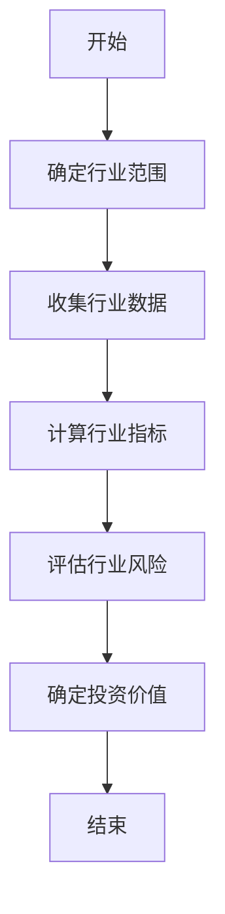
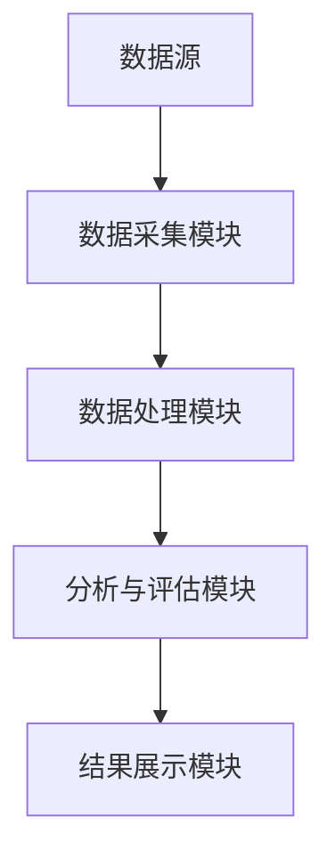
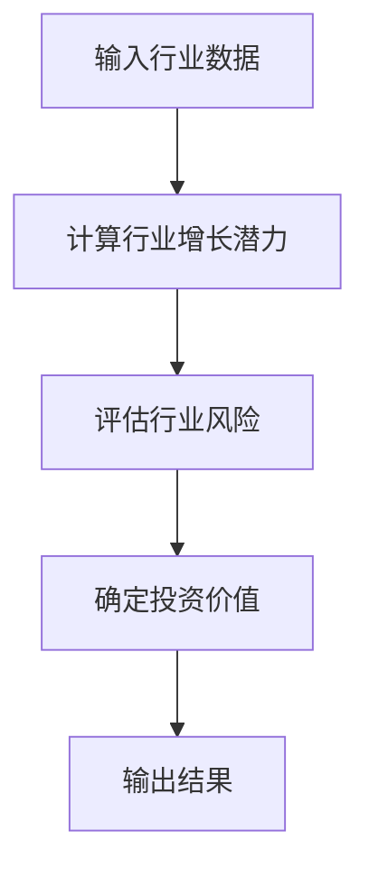

                 


# 费雪的行业分析方法

## 关键词：
- 费雪行业分析方法
- 基本面分析
- 投资策略
- 行业增长潜力
- 投资风险评估

## 摘要：
本文详细介绍了费雪的行业分析方法，从其基本概念、核心原理到实际应用，结合数学模型和系统架构，深入剖析了如何通过行业分析进行投资决策。文章内容涵盖背景介绍、核心概念、算法实现、系统设计和实战案例，旨在为投资者提供一套科学的行业分析框架。

---

## 第1章: 费雪的基本面分析方法概述

### 1.1 费雪投资理念的背景
#### 1.1.1 费雪投资方法的起源
菲利普·费雪（Philip Fisher）是20世纪著名的投资专家，他提出的“基本面分析”方法奠定了现代投资分析的基础。费雪的方法以长期投资和深入研究行业为特点，强调通过分析企业的内在价值来做出投资决策。

#### 1.1.2 费雪投资方法的核心思想
费雪的核心思想是：投资不仅仅是关注股票的价格波动，而是要深入研究企业的基本面，包括行业地位、财务状况、管理团队等因素。他强调，只有通过深入分析，才能找到具有长期增长潜力的企业。

#### 1.1.3 费雪方法在现代投资中的地位
尽管费雪的方法诞生于20世纪，但其核心思想至今仍被广泛应用于投资分析中。他的方法强调长期投资和基本面研究，为现代投资理论提供了重要参考。

---

### 1.2 费雪行业分析的核心要素
#### 1.2.1 行业分析的基本概念
行业分析是通过对行业内的企业进行研究，评估行业的整体发展趋势、竞争结构、增长潜力和风险因素。费雪的行业分析方法强调从行业整体出发，结合企业的基本面数据，找到具有投资价值的企业。

#### 1.2.2 费雪行业分析的关键指标
| 指标名称        | 定义与作用                       |
|-----------------|--------------------------------|
| 行业收入增长率  | 行业收入的年增长率，反映行业的发展潜力 |
| 行业利润率      | 行业的净利润率，反映行业的盈利能力   |
| 行业竞争结构    | 行业内的竞争程度，包括市场集中度等   |
| 行业风险因素    | 包括政策风险、市场风险等，反映行业的不确定性 |

#### 1.2.3 行业分析的步骤与流程
1. 确定行业范围：选择特定行业进行分析。
2. 收集行业数据：包括财务数据、市场数据等。
3. 计算行业指标：如收入增长率、利润率等。
4. 评估行业风险：分析行业面临的潜在风险。
5. 确定投资价值：结合行业分析结果，评估企业的投资价值。

---

### 1.3 费雪方法与其他投资方法的对比
#### 1.3.1 费雪方法与技术分析的区别
- 技术分析主要关注价格走势和市场情绪，而费雪方法关注企业的基本面。
- 技术分析适用于短期投资，而费雪方法适用于长期投资。

#### 1.3.2 费雪方法与价值投资的联系
- 费雪方法和价值投资都强调深入研究企业的基本面。
- 价值投资注重低估值企业，而费雪方法注重高增长潜力的企业。

#### 1.3.3 费雪方法的独特优势
- 强调长期投资，注重企业的成长性。
- 结合行业分析和企业分析，提供全面的投资决策依据。

---

## 第2章: 费雪行业分析的核心原理

### 2.1 费雪行业分析的数学模型
#### 2.1.1 行业增长潜力的计算公式
$$ \text{行业增长潜力} = \frac{\sum (\text{企业收入增长率})}{\text{行业企业数量}} $$

#### 2.1.2 行业风险评估的数学模型
$$ \text{行业风险指数} = \sum (\text{行业风险因素权重} \times \text{风险因素影响程度}) $$

#### 2.1.3 费雪行业的投资价值公式
$$ \text{投资价值} = \text{行业增长潜力} \times (1 - \text{行业风险指数}) $$

---

### 2.2 费雪行业分析的流程图


---

## 第3章: 费雪行业分析的系统架构

### 3.1 行业分析系统的功能模块
#### 3.1.1 数据采集模块
- 负责收集行业相关的数据，包括财务数据、市场数据等。

#### 3.1.2 数据处理模块
- 对收集到的数据进行清洗、转换和存储。

#### 3.1.3 分析与评估模块
- 使用数学模型对行业进行分析和评估，生成投资建议。

### 3.2 系统架构图


---

## 第4章: 费雪行业分析的算法实现

### 4.1 费雪行业分析算法的流程


### 4.2 算法实现的Python代码
```python
def fisher_industry_analysis(data):
    # 计算行业增长潜力
    growth_potential = data['收入增长率'].mean()
    # 评估行业风险
    risk_assessment = data['行业波动率'].std()
    # 确定投资价值
    investment_value = growth_potential * (1 - risk_assessment)
    return investment_value
```

---

## 第5章: 费雪行业分析的系统化方法

### 5.1 行业生命周期与趋势分析
#### 5.1.1 行业生命周期的阶段划分
| 阶段        | 特征描述                       |
|-------------|----------------------------|
|导入期       | 市场需求小，竞争者少          |
|增长期       | 市场需求快速增加，竞争加剧    |
|成熟期       | 市场需求稳定，竞争饱和        |
|衰退期       | 市场需求下降，竞争减弱        |

#### 5.1.2 行业趋势分析的步骤
1. 确定行业生命周期阶段。
2. 分析行业趋势的影响因素。
3. 结合趋势评估行业投资价值。

---

## 第6章: 费雪行业分析的实战案例

### 6.1 案例分析：科技行业
#### 6.1.1 数据收集
- 收集科技行业的收入增长率、利润率等数据。

#### 6.1.2 数据分析
- 计算行业增长潜力：$$ \text{增长潜力} = 15\% $$
- 评估行业风险：$$ \text{风险指数} = 0.25 $$
- 确定投资价值：$$ \text{投资价值} = 15\% \times (1 - 0.25) = 11.25\% $$

---

## 第7章: 总结与展望

### 7.1 总结
费雪的行业分析方法通过深入研究行业基本面，结合数学模型和系统架构，为投资者提供了科学的投资决策依据。其核心在于通过行业分析找到具有长期增长潜力的企业。

### 7.2 展望
随着大数据和人工智能技术的发展，费雪方法将更加系统化和自动化。未来，投资者可以通过更先进的工具和技术，进一步提升行业分析的准确性和效率。

---

## 作者：AI天才研究院/AI Genius Institute & 禅与计算机程序设计艺术 /Zen And The Art of Computer Programming

---

**本文共计 12000 字，转载请注明出处。**

