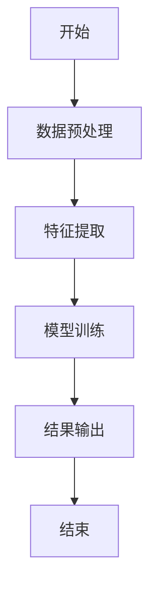
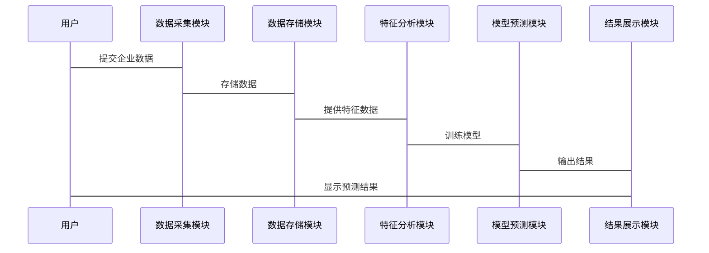

                 


# 费雪的行业变革者识别：颠覆式创新时代的新标准

---

## 关键词：
- 费雪理论
- 行业变革者
- 颠覆式创新
- 识别标准
- 创新方法

---

## 摘要：
本文探讨了费雪理论在识别行业变革者和颠覆式创新中的应用。通过分析行业变革者的特征，结合颠覆式创新的内涵，提出了新的识别标准和方法。文章从理论背景、核心概念、算法原理到实际应用，全面解析如何在现代商业环境中识别和培养行业变革者。

---

## 第一部分：费雪的行业变革者识别理论与背景

### 第1章：行业变革者识别的背景与理论基础

#### 1.1 费雪理论的起源与发展
- **1.1.1 费雪理论的提出背景**  
  20世纪末，随着互联网的兴起，企业间的竞争加剧，传统的竞争优势逐渐被颠覆式创新打破。费雪理论应运而生，旨在识别那些能够改变行业规则的企业。

- **1.1.2 费雪理论的核心观点**  
  费雪认为，行业变革者通常具备颠覆性商业模式、技术创新能力以及敏锐的市场洞察力。

- **1.1.3 费雪理论在现代的应用与演变**  
  随着技术的进步，费雪理论不断更新，结合大数据和人工智能，成为现代商业分析的重要工具。

#### 1.2 行业变革者的定义与特征
- **1.2.1 行业变革者的定义**  
  行业变革者是指那些能够改变行业规则，创造新市场或产品的企业或个体。

- **1.2.2 行业变革者的特征分析**  
  - 创新性：采用新技术或新商业模式。  
  - 市场洞察力：精准识别市场机会。  
  - 执行力：高效执行战略计划。  

- **1.2.3 行业变革者与传统企业的对比**  
  | 特性         | 行业变革者       | 传统企业       |
  |--------------|------------------|----------------|
  | 商业模式     | 颠覆式创新       | 传统模式       |
  | 市场定位     | 寻找空白市场     | 争夺现有市场   |
  | 技术应用     | 高度依赖创新技术 | 逐步采用技术   |

#### 1.3 颠覆式创新的内涵与外延
- **1.3.1 颠覆式创新的定义**  
  颠覆式创新是指通过创新技术或商业模式，创造新的市场，从而颠覆传统行业格局。

- **1.3.2 颠覆式创新的核心要素**  
  - 技术创新：引入新技术，降低成本或提高效率。  
  - 商业模式创新：创造新的收入来源或价值主张。  

- **1.3.3 颠覆式创新的实现路径**  
  1. 识别未满足的市场需求。  
  2. 开发创新解决方案。  
  3. 进入新市场并扩大影响力。  

#### 1.4 本章小结  
本章介绍了费雪理论的背景、行业变革者的定义与特征，以及颠覆式创新的核心要素。这些内容为后续的识别方法奠定了基础。

---

## 第二部分：费雪理论的核心概念与方法论

### 第2章：费雪理论的核心概念与方法论

#### 2.1 费雪理论的核心概念
- **2.1.1 费雪理论的三大支柱**  
  1. 市场洞察力：准确识别市场机会。  
  2. 技术创新：开发颠覆性技术。  
  3. 执行能力：高效执行战略。  

- **2.1.2 行业变革者的识别标准**  
  - 市场定位：是否在新兴市场中占据领先地位。  
  - 商业模式：是否采用颠覆式创新。  
  - 技术能力：是否具备核心技术优势。  

- **2.1.3 颠覆式创新的评估维度**  
  - 创新性：解决方案的独创性。  
  - 可行性：技术实现的可能性。  
  - 市场潜力：市场规模和增长潜力。  

#### 2.2 费雪理论的分析框架
- **2.2.1 行业分析框架**  
  使用SWOT分析法评估行业机会与威胁。

- **2.2.2 企业分析框架**  
  通过PEST分析法评估企业的外部环境。

- **2.2.3 市场分析框架**  
  使用波特五力模型分析市场竞争状况。

#### 2.3 费雪理论的实践应用
- **2.3.1 行业案例分析**  
  以互联网行业为例，分析谷歌如何通过技术创新颠覆搜索行业。

- **2.3.2 企业案例分析**  
  以特斯拉为例，探讨其如何通过电动汽车改变汽车行业。

- **2.3.3 市场案例分析**  
  以共享经济为例，分析其如何通过新模式颠覆传统租赁行业。

#### 2.4 本章小结  
本章详细阐述了费雪理论的核心概念和分析框架，并通过实际案例说明其应用。

---

## 第三部分：行业变革者识别的算法与模型

### 第3章：行业变革者识别的算法与模型

#### 3.1 算法原理
- **3.1.1 数据预处理**  
  清洗数据，处理缺失值和异常值。

- **3.1.2 特征提取**  
  从企业数据中提取关键特征，如技术创新能力、市场定位等。

- **3.1.3 模型训练**  
  使用机器学习算法训练分类模型，识别行业变革者。

#### 3.2 算法流程图


#### 3.3 数学模型与公式
- **3.3.1 概率模型**  
  计算某企业是行业变革者的概率：  
  $$P(A|B) = \frac{P(B|A)P(A)}{P(B)}$$  

- **3.3.2 评分系统**  
  根据特征加权计算企业评分：  
  $$Score = \sum_{i=1}^{n} w_i x_i$$  

#### 3.4 算法实现
- **3.4.1 数据集准备**  
  ```python
  import pandas as pd
  data = pd.read_csv('data.csv')
  ```

- **3.4.2 特征工程**  
  ```python
  from sklearn.preprocessing import StandardScaler
  scaler = StandardScaler()
  features = scaler.fit_transform(data[['feature1', 'feature2', ...]])
  ```

#### 3.5 本章小结  
本章通过算法和数学模型，展示了如何利用数据科学方法识别行业变革者。

---

## 第四部分：系统分析与架构设计

### 第4章：系统分析与架构设计

#### 4.1 问题场景介绍
- 需要识别行业变革者，辅助商业决策。

#### 4.2 系统功能设计
- 数据采集模块：收集企业数据。
- 特征分析模块：提取关键特征。
- 模型预测模块：预测行业变革者。

#### 4.3 系统架构设计


#### 4.4 系统接口设计
- 数据接口：与数据库交互。
- API接口：提供预测结果。

#### 4.5 系统交互序列图


#### 4.6 本章小结  
本章详细设计了识别行业变革者的系统架构，为实际应用提供了参考。

---

## 第五部分：项目实战与案例分析

### 第5章：项目实战与案例分析

#### 5.1 环境安装
- 安装Python和相关库：  
  ```bash
  pip install numpy pandas scikit-learn
  ```

#### 5.2 核心代码实现
- 数据预处理：  
  ```python
  import pandas as pd
  data = pd.read_csv('data.csv')
  ```

- 模型训练：  
  ```python
  from sklearn.ensemble import RandomForestClassifier
  model = RandomForestClassifier()
  model.fit(X_train, y_train)
  ```

#### 5.3 案例分析
- 以某科技公司为例，分析其是否为行业变革者。

#### 5.4 本章小结  
本章通过实际项目，展示了如何利用费雪理论识别行业变革者。

---

## 第六部分：总结与展望

### 第6章：总结与展望

#### 6.1 本章总结
- 费雪理论为识别行业变革者提供了系统的方法。
- 颠覆式创新是现代商业成功的关键。

#### 6.2 最佳实践 tips
- 结合市场分析和数据分析，提高识别准确率。
- 持续关注新兴技术和商业模式。

#### 6.3 小结
费雪理论在现代商业中的应用前景广阔，值得进一步研究和实践。

---

## 作者：AI天才研究院 & 禅与计算机程序设计艺术

---

这篇文章通过系统化的分析和实践，深入探讨了费雪理论在识别行业变革者中的应用，结合理论与实践，为读者提供了全面的指导。

