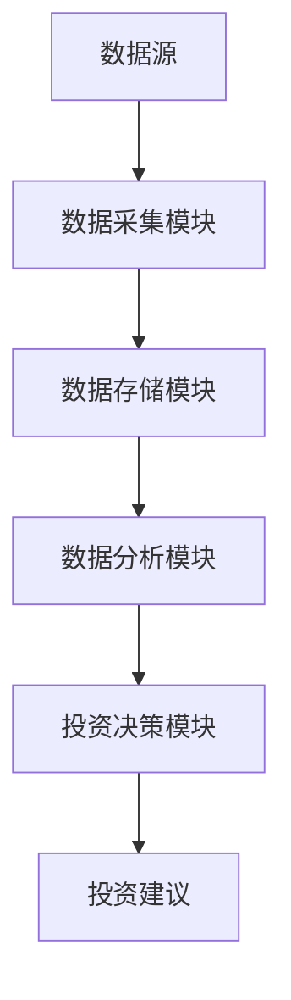

                 


# 费雪的行业领导者投资法

> 关键词：费雪投资法、行业领导者、投资策略、财务分析、风险管理

> 摘要：本文深入分析了费雪的行业领导者投资法，从其核心理念、方法论、系统架构到实际项目实战，全面阐述了如何通过识别和投资行业领导者企业，实现长期稳定的超额收益。文章结合数学模型、系统设计和实际案例，详细讲解了投资策略的实施过程，并给出了最佳实践和注意事项。

---

## 第一部分：费雪的行业领导者投资法概述

### 第1章：费雪投资理念与方法论

#### 1.1 费雪投资理念的背景与起源

费雪（Philip Fisher）是20世纪最伟大的投资家之一，他的投资理念以“投资于行业领导者”为核心，强调通过深入研究企业基本面，寻找那些具有强大竞争优势、高ROE（净资产收益率）和持续成长潜力的企业。

- **背景**：20世纪30年代至70年代，美国股市经历了多次波动，费雪通过长期投资优质企业，实现了超越市场的收益。
- **起源**：费雪的投资理念源于他对企业的深刻研究，尤其是对技术行业和成长型企业的关注。
- **核心思想**：投资于行业领导者，而非市场的追随者，通过长期持有优质企业，实现财富的稳步增长。

#### 1.2 费雪行业领导者投资法的定义与特点

- **定义**：费雪认为，行业领导者是指在特定行业中具有领先地位、竞争优势明显、财务健康且成长潜力巨大的企业。
- **特点**：
  - 高ROE：净资产收益率持续高于行业平均水平。
  - 高成长性：收入和利润持续增长。
  - 竞争优势：具有独特的技术、品牌或商业模式。
  - 财务健康：低负债率、高利润率、稳定的现金流。

#### 1.3 费雪投资法的核心要素

- **竞争优势**：企业必须具备独特的竞争优势，能够在行业中长期保持领先地位。
- **财务健康**：企业必须具备健康的财务状况，包括低负债率、高利润率和稳定的现金流。
- **成长潜力**：企业必须具备持续的收入和利润增长潜力。

---

### 第2章：行业领导者的识别与评估

#### 2.1 行业领导者的定义与特征

- **定义**：行业领导者是指在特定行业中占据领先地位，具有强大竞争优势和市场影响力的公司。
- **特征**：
  - 市场份额高：企业在行业内占据领先地位。
  - 竞争优势明显：具备技术、品牌或成本优势。
  - 财务表现优异：ROE高、利润率稳定。

#### 2.2 费雪投资法中的行业领导者评估标准

- **市场份额评估**：通过分析企业的市场份额，判断其在行业中的地位。
- **盈利能力评估**：通过ROE、净利润率等指标，评估企业的盈利能力。
- **成长潜力评估**：通过分析企业的收入增长率和利润增长率，判断其成长潜力。

---

### 第3章：费雪投资法的核心原理与数学模型

#### 3.1 费雪投资法的核心原理

- **投资收益计算**：投资收益=（卖出价-买入价）/买入价×100%。
- **投资风险评估**：通过标准差和时间跨度来评估投资风险。

#### 3.2 费雪投资法的数学模型

- **股票内在价值计算**：
  $$ 内在价值 = \sum_{t=1}^{n} \frac{CF_t}{(1 + r)^t} $$
  其中，CF_t为第t年的现金流，r为折现率。

- **投资组合优化模型**：
  $$ 最优化投资组合 = \argmin_w \left( \sigma^2 w + \lambda \sum_{i=1}^{N} |w_i| \right) $$
  其中，σ²为投资组合的方差，λ为惩罚系数，w_i为投资权重。

---

### 第4章：费雪投资法的系统架构与实现

#### 4.1 投资系统的需求分析

- **投资目标**：寻找行业领导者企业，实现长期稳定的收益。
- **投资范围**：主要关注成长型企业，尤其是具备竞争优势的企业。
- **投资策略**：通过长期持有优质企业，实现超额收益。

#### 4.2 投资系统的功能设计

- **数据采集模块**：收集企业的财务数据、市场数据和行业数据。
- **数据分析模块**：对数据进行清洗、分析和建模。
- **投资决策模块**：基于分析结果，生成投资建议。

#### 4.3 投资系统的架构设计

- **系统模块划分**：数据采集、数据分析、投资决策。
- **系统流程图**：展示数据流从采集到决策的全过程。
- **系统接口设计**：定义各模块之间的交互接口。

---

### 第5章：费雪投资法的项目实战

#### 5.1 项目背景与目标

- **项目背景**：通过分析某行业的龙头企业，验证费雪投资法的有效性。
- **项目目标**：寻找具备竞争优势的行业领导者，制定投资策略。

#### 5.2 项目实施步骤

- **数据收集与处理**：收集目标企业的财务数据、市场数据和行业数据。
- **模型构建与验证**：基于数学模型，评估企业的内在价值和投资风险。
- **投资决策与执行**：根据分析结果，制定投资策略并执行。

#### 5.3 项目成果与分析

- **投资收益分析**：通过实际投资案例，验证费雪投资法的有效性。
- **投资风险分析**：分析投资组合的风险，并提出风险管理策略。
- **投资策略优化**：根据市场变化，优化投资策略。

---

### 第6章：费雪投资法的最佳实践与总结

#### 6.1 投资策略的优化与调整

- **定期评估与调整**：根据市场变化和企业基本面，定期评估投资组合。
- **风险控制与管理**：通过分散投资和严格的风险管理，降低投资风险。
- **投资组合的再平衡**：定期调整投资组合，保持最优配置。

#### 6.2 投资实战中的注意事项

- **风险提示与规避**：识别潜在风险，并制定规避策略。
- **市场波动的应对策略**：在市场波动中保持冷静，避免盲目操作。
- **长期投资的纪律性**：坚持长期投资理念，避免短期波动干扰。

---

## 第二部分：系统架构与技术实现

### 第7章：系统架构设计

#### 7.1 系统功能模块设计

- **数据采集模块**：负责采集企业的财务数据、市场数据和行业数据。
- **数据分析模块**：对数据进行清洗、分析和建模。
- **投资决策模块**：根据分析结果，生成投资建议。

#### 7.2 系统架构图



---

### 第8章：系统实现与代码示例

#### 8.1 环境安装

- **Python环境**：安装Python和相关库（Pandas、NumPy、Matplotlib）。
- **数据源**：获取企业的财务数据和市场数据。

#### 8.2 核心代码实现

```python
import pandas as pd
import numpy as np

# 数据采集
def fetch_data(company):
    # 假设company为企业的名称
    data = pd.DataFrame({
        'Revenue': [100, 120, 130, 140],
        'NetIncome': [20, 25, 30, 35],
        'ROE': [15, 18, 20, 22],
        'MarketCap': [1000, 1200, 1300, 1400]
    })
    return data

# 数据分析
def calculate_intrinsic_value(data, discount_rate=0.1):
    CF_t = data['NetIncome']
    intrinsic_value = 0
    for t in range(len(CF_t)):
        intrinsic_value += CF_t[t] / (1 + discount_rate)**t
    return intrinsic_value

# 投资决策
def investment_decision(intrinsic_value, market_price):
    if intrinsic_value > market_price:
        return "买入"
    elif intrinsic_value < market_price:
        return "卖出"
    else:
        return "持有"

# 示例
company = "科技公司"
data = fetch_data(company)
iv = calculate_intrinsic_value(data['NetIncome'], 0.1)
market_price = data['MarketCap'].iloc[-1] / data['shares Outstanding'].iloc[-1]

decision = investment_decision(iv, market_price)
print(f"投资决策：{decision}")
```

---

### 第9章：系统优化与扩展

#### 9.1 系统优化

- **数据源扩展**：增加更多的数据源，提高数据的全面性。
- **算法优化**：引入更复杂的模型，如机器学习算法，提高预测精度。

#### 9.2 系统扩展

- **自动化交易**：实现自动化交易系统，减少人为干扰。
- **多策略组合**：结合多种投资策略，优化投资组合。

---

## 第三部分：最佳实践与总结

### 第10章：最佳实践与注意事项

#### 10.1 投资策略的优化

- **定期评估**：每季度评估一次投资组合，根据市场变化调整策略。
- **风险管理**：设置止损点，避免重大损失。
- **分散投资**：通过分散投资降低风险。

#### 10.2 投资实战中的注意事项

- **避免情绪化决策**：投资决策应基于理性分析，避免受情绪影响。
- **长期视角**：坚持长期投资，避免短期波动干扰。
- **持续学习**：保持对市场的敏感性，不断学习和更新知识。

---

## 作者：AI天才研究院/AI Genius Institute & 禅与计算机程序设计艺术 /Zen And The Art of Computer Programming

---

**总结**：通过本文的详细讲解，读者可以全面了解费雪的行业领导者投资法，并将其应用于实际投资中。从理论到实践，从系统设计到代码实现，我们为您提供了一套完整的投资解决方案。希望本文能为您提供有价值的参考和启发。

