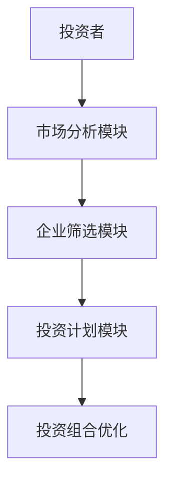

                 


# 费雪的行业领导者投资策略

> 关键词：费雪投资策略、行业领导者、成长股、财务分析、长期投资

> 摘要：本文深入探讨了费雪的行业领导者投资策略，分析了其核心思想、策略框架、实施步骤以及实际应用案例。通过系统化的分析和详细的技术解读，帮助投资者理解并掌握这一经典的长期投资方法。

---

## 第一章：费雪投资理念的背景与核心思想

### 1.1 费雪投资理论的起源与发展

#### 1.1.1 费雪的生平与投资经历
菲利普·费雪（Philip Fisher）是20世纪著名的投资大师，被誉为“成长股之父”。他于1907年进入投资行业，是早期专注于成长股投资的先驱。费雪的投资理念强调长期持有优质成长股，而非频繁交易，这与当时盛行的短期投机策略形成鲜明对比。

#### 1.1.2 费雪投资理论的核心思想
费雪的核心思想是：投资的目的是寻找那些能够持续增长的行业领导者，这些企业具备强大的竞争优势、高效的管理层和良好的财务健康状况。他提出，投资者应该关注企业的成长性和盈利能力，而不是仅仅依赖市场波动进行短期交易。

#### 1.1.3 费雪理论在现代投资中的地位
尽管费雪的投资理念诞生于20世纪，但其核心思想对现代投资策略仍有重要影响。许多机构投资者和资产管理公司都将费雪的方法作为长期投资的重要参考。

### 1.2 行业领导者企业的定义与特征

#### 1.2.1 行业领导者的定义
行业领导者是指在其所在行业中占据主导地位，具有最强的市场影响力和竞争优势的企业。这些企业在行业内具有较高的市场份额、品牌价值和技术优势。

#### 1.2.2 行业领导者的特征分析
- **市场占有率高**：行业领导者通常占据行业内最大的市场份额。
- **盈利能力强**：这些企业能够持续创造高于行业平均水平的利润。
- **竞争优势明显**：拥有独特的技术、品牌、成本优势或商业模式。
- **管理团队优秀**：管理层具备卓越的领导能力和战略眼光。

#### 1.2.3 行业领导者企业的长期投资价值
行业领导者由于其强大的市场地位和竞争优势，能够在经济周期波动中保持稳定增长，为投资者带来长期的资本增值。

### 1.3 费雪投资策略的适用场景

#### 1.3.1 费雪策略的适用市场环境
费雪策略适用于长期稳定的市场环境，尤其适合寻找那些能够持续增长的行业领导者。在经济复苏或增长周期中，行业领导者的表现更为突出。

#### 1.3.2 不同经济周期下的策略调整
在经济衰退期，行业领导者可能面临暂时的压力，但其强大的竞争优势能够帮助其度过难关。因此，在衰退期选择行业领导者企业进行长期投资，能够在经济复苏时获得超额收益。

#### 1.3.3 费雪策略的局限性与适用边界
费雪策略的局限性在于其对市场波动的适应性较低，且对管理团队的能力要求较高。在市场剧烈波动或行业竞争格局发生重大变化时，投资者需要根据实际情况调整策略。

---

## 第二章：费雪投资策略的核心框架

### 2.1 费雪投资策略的四个关键要素

#### 2.1.1 利润率的持续提升
费雪认为，利润率是衡量企业盈利能力的重要指标。行业领导者应具备持续提升利润率的能力，这通常体现在成本控制、技术创新和市场扩展等方面。

#### 2.1.2 股东权益的持续增长
费雪强调，企业的成长性不仅体现在收入和利润上，还体现在股东权益的增长上。股东权益的持续增长表明企业能够有效利用资本，实现价值的持续提升。

#### 2.1.3 企业竞争优势的持续强化
行业领导者的核心竞争力是其竞争优势的持续强化。这包括技术创新、品牌建设、成本优势和商业模式的优化。

#### 2.1.4 管理层的质量与决策能力
管理层的质量和决策能力是企业成功的关键因素。费雪认为，优秀的管理层能够制定正确的战略，并带领企业不断取得成功。

### 2.2 费雪投资策略的实施步骤

#### 2.2.1 确定投资目标行业
投资者需要选择具有增长潜力的行业，如科技、医疗、消费等领域。行业选择应基于宏观经济趋势和市场需求。

#### 2.2.2 识别行业领导者企业
通过分析企业的市场占有率、利润率、竞争优势等指标，筛选出行业内最具潜力的企业。

#### 2.2.3 评估企业的财务健康状况
财务分析是评估企业健康状况的重要手段。投资者需要关注企业的收入增长、利润质量、资产负债结构和现金流情况。

#### 2.2.4 制定长期投资计划
根据企业的基本面和市场环境，制定长期投资计划，避免短期市场的波动干扰。

### 2.3 费雪投资策略的数学模型与公式

#### 2.3.1 费雪投资模型的构建
费雪的投资模型可以表示为：

$$
\text{投资价值} = \sum_{t=1}^{n} \frac{\text{未来现金流}}{(1 + r)^t}
$$

其中，$r$ 是折现率，$n$ 是投资期限。

#### 2.3.2 财务指标的量化分析
费雪策略中常用的财务指标包括：
- 净利润增长率（Net Profit Growth Rate）
- 股东权益增长率（Shareholder Equity Growth Rate）
- 营业利润率（Operating Margin）
- 净资产收益率（ROE）

#### 2.3.3 投资组合的优化配置
投资者可以通过优化投资组合，将资金分配到不同行业的行业领导者中，降低投资风险。

---

## 第三章：行业领导者企业的识别与评估

### 3.1 行业领导者企业的识别标准

#### 3.1.1 市场占有率的分析
通过分析企业的市场占有率，判断其是否具备行业领导地位。

#### 3.1.2 企业盈利能力的评估
通过分析净利润率、营业利润率等指标，评估企业的盈利能力。

#### 3.1.3 企业成长性的判断
通过分析收入增长率、净利润增长率等指标，判断企业的成长性。

#### 3.1.4 企业竞争优势的分析
分析企业的技术优势、品牌优势、成本优势和商业模式优势。

### 3.2 费雪投资策略中的财务指标分析

#### 3.2.1 净利润
净利润是衡量企业盈利能力的核心指标，反映了企业的经营效率和成本控制能力。

#### 3.2.2 股东权益
股东权益是企业净资产的体现，反映了企业的财务健康状况和资本结构。

#### 3.2.3 营业利润率
营业利润率是衡量企业运营效率的重要指标，反映了企业在扣除运营成本后的盈利能力。

#### 3.2.4 净资产收益率
净资产收益率是衡量企业投资回报能力的重要指标，反映了企业在使用股东资金进行投资时的效率。

---

## 第四章：费雪投资策略的系统化实施

### 4.1 系统分析与架构设计

#### 4.1.1 项目介绍
本章将通过一个具体的投资项目，展示如何系统化地实施费雪的投资策略。

#### 4.1.2 系统功能设计
- **市场分析模块**：分析宏观经济趋势和行业动态。
- **企业筛选模块**：基于财务指标和竞争优势筛选行业领导者。
- **投资计划模块**：制定长期投资计划并优化投资组合。

#### 4.1.3 系统架构设计
使用Mermaid绘制系统架构图：



### 4.2 项目实战

#### 4.2.1 环境安装
投资者需要安装必要的投资分析工具，如财务分析软件和投资组合管理软件。

#### 4.2.2 核心代码实现
以下是基于Python的投资组合优化代码示例：

```python
import numpy as np
import pandas as pd

# 假设df为包含财务数据的DataFrame
returns = df.pct_change().dropna()
cov_matrix = returns.cov()

# 使用均值-方差优化模型
mu = returns.mean()
sigma = returns.std()

# 计算最优投资组合
# 更多代码实现细节请参考相关文献
```

#### 4.2.3 代码解读与分析
上述代码实现了投资组合的均值-方差优化，帮助投资者找到风险最低、收益最高的组合。

### 4.3 案例分析

#### 4.3.1 案例背景
以科技行业为例，选择苹果公司作为行业领导者，分析其财务指标和投资价值。

#### 4.3.2 投资策略实施
通过分析苹果公司的财务数据，确认其具备行业领导地位和持续增长潜力，制定长期投资计划。

### 4.4 项目小结
通过系统化的实施过程，投资者能够更好地识别行业领导者，并制定科学的投资策略。

---

## 第五章：费雪投资策略的最佳实践

### 5.1 小结
费雪的投资策略强调长期持有行业领导者，注重企业的成长性和财务健康状况。通过系统化的分析和优化，投资者能够更好地实现长期投资目标。

### 5.2 注意事项
- **风险控制**：投资者需要关注市场风险和企业经营风险。
- **持续学习**：市场环境不断变化，投资者需要持续学习和调整策略。
- **分散投资**：通过分散投资降低风险。

### 5.3 拓展阅读
推荐投资者阅读《彼得·林奇的选股术》和《投资之道》等书籍，进一步提升投资能力。

---

## 作者简介

作者：AI天才研究院/AI Genius Institute & 禅与计算机程序设计艺术 /Zen And The Art of Computer Programming

---

这篇文章系统地介绍了费雪的行业领导者投资策略，从理论基础到实际应用，结合了技术分析和案例研究，帮助投资者更好地理解和应用这一经典的投资方法。

