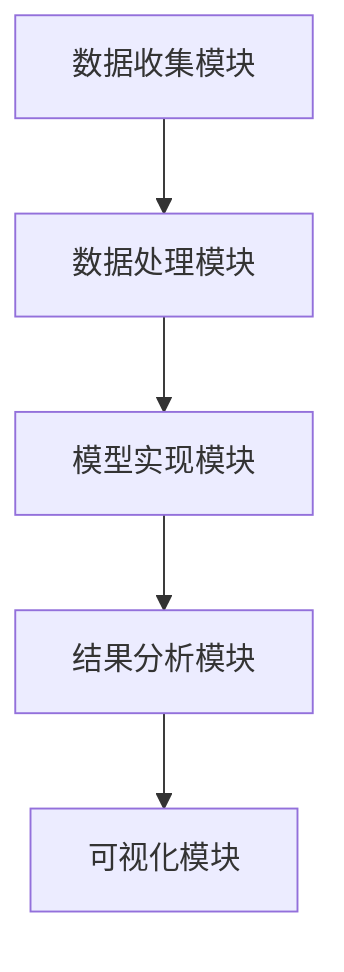

                 


# 费雪的行业领导者理论：寻找市场冠军

## 关键词：
费雪，行业领导者，市场冠军，投资理论，五角星模型，ROE，可持续盈利能力

## 摘要：
本文深入探讨了费雪的行业领导者理论，分析了如何通过这一理论寻找市场中的冠军企业。文章首先介绍了费雪的背景及其投资理论的核心思想，然后详细讲解了行业领导者的定义、特征以及识别标准。接着，通过费雪的五角星模型，展示了如何系统地评估企业的内在价值和竞争优势。文章还通过实际案例分析了如何应用这一理论进行投资决策，并总结了最佳实践策略，帮助读者在复杂多变的市场中找到真正的行业领导者。

---

## 第一部分：费雪的行业领导者理论概述

### 第1章：费雪的背景与投资理论

#### 1.1 费雪的生平与投资理念
菲利普·费雪（Philip Fisher）是20世纪著名的投资专家，被誉为“成长型投资之父”。他提出了许多影响深远的投资理论，尤其是关于如何识别和投资于行业领导者的理念。费雪认为，投资的成功不仅仅依赖于市场 timing，更重要的是选择那些具有强大竞争优势和持续盈利能力的公司。

#### 1.2 费雪投资理论的核心思想
费雪的理论强调长期投资和选择具有成长潜力的公司。他认为，市场的冠军企业通常具有以下特征：
1. 高ROE（净资产收益率）。
2. 可持续的盈利能力。
3. 市场领导地位。
4. 良好的管理团队。
5. 创新的能力和竞争优势。

#### 1.3 投资策略与五角星模型
费雪提出了著名的“五角星模型”，用于评估企业的内在价值和投资潜力。该模型包括以下几个关键因素：
1. **管理质量**：公司管理层的能力和决策水平。
2. **产品或服务的独特性**：公司在市场上的独特竞争优势。
3. **财务健康状况**：包括资产负债表、利润表和现金流量表的分析。
4. **市场地位**：公司在行业中的市场份额和影响力。
5. **成长潜力**：公司的未来增长前景和扩张能力。

### 第2章：行业领导者的定义与特征

#### 2.1 行业领导者的定义
行业领导者是指在特定行业中具有最强竞争力和市场份额的公司。这些公司通常在技术创新、市场占有率、品牌影响力等方面处于领先地位。

#### 2.2 行业领导者的特征
1. **高市场份额**：行业领导者通常占据了市场的较大份额，具有定价权。
2. **强大的竞争优势**：公司在产品、技术、成本等方面具有显著优势。
3. **可持续的盈利能力**：能够在不同经济周期中保持稳定的盈利能力。
4. **良好的管理团队**：公司管理层具有战略眼光和执行力。
5. **创新能力强**：能够不断推出新产品或服务，引领行业趋势。

#### 2.3 费雪的行业领导者识别标准
为了识别行业领导者，费雪提出了以下具体标准：
1. **ROE大于行业平均水平**：ROE（净资产收益率）是衡量公司盈利能力的重要指标，通常认为ROE大于15%的公司具有较高的投资价值。
2. **持续的盈利增长**：公司过去几年的收入和利润保持稳定增长。
3. **低债务水平**：公司资产负债表健康，债务负担较低。
4. **高股息收益率**：虽然费雪并不特别强调股息，但高股息收益率通常反映了公司较强的盈利能力。
5. **良好的行业前景**：公司所在行业的未来增长潜力较大。

---

## 第二部分：费雪的五角星模型与数学分析

### 第3章：五角星模型的数学表达

#### 3.1 五角星模型的公式化表达
五角星模型可以通过以下公式进行量化评估：

$$
\text{综合得分} = 0.2 \times \text{管理质量} + 0.2 \times \text{产品独特性} + 0.2 \times \text{财务健康状况} + 0.2 \times \text{市场地位} + 0.2 \times \text{成长潜力}
$$

其中，每个因素的评分范围为1（较差）到5（优秀）。

#### 3.2 案例分析：以苹果公司为例
以苹果公司为例，我们可以通过五角星模型来评估其是否符合行业领导者的标准。

1. **管理质量**：苹果的管理层以创新和执行力著称，评分为5。
2. **产品独特性**：苹果的产品（如iPhone、Mac）在市场上具有强大的品牌影响力和技术创新，评分为5。
3. **财务健康状况**：苹果拥有强劲的现金流和低债务水平，评分为5。
4. **市场地位**：苹果是全球科技行业的领导者，市场份额和品牌影响力均排名第一，评分为5。
5. **成长潜力**：苹果在智能设备、服务和新兴市场方面具有巨大的增长潜力，评分为5。

综合得分：
$$
\text{综合得分} = 0.2 \times 5 + 0.2 \times 5 + 0.2 \times 5 + 0.2 \times 5 + 0.2 \times 5 = 5
$$

根据模型，苹果公司完全符合行业领导者的标准，具有较高的投资价值。

---

## 第三部分：系统分析与架构设计

### 第4章：系统分析与架构设计

#### 4.1 系统分析
为了系统化地应用费雪的理论，我们可以构建一个基于五角星模型的投资决策系统。该系统包括以下几个模块：

1. **数据收集模块**：收集目标公司的财务数据、市场数据和行业报告。
2. **模型实现模块**：使用五角星模型对目标公司进行评分。
3. **结果分析模块**：根据评分结果生成投资建议。
4. **可视化模块**：将分析结果以图表形式展示。

#### 4.2 系统架构设计



#### 4.3 算法实现
以下是五角星模型的Python实现代码：

```python
def calculate_five_star_model(company_data):
    management_quality = company_data['management_score']
    product_uniqueness = company_data['product_score']
    financial_health = company_data['financial_score']
    market_position = company_data['market_score']
    growth_potential = company_data['growth_score']
    
    total_score = 0.2 * management_quality + \
                   0.2 * product_uniqueness + \
                   0.2 * financial_health + \
                   0.2 * market_position + \
                   0.2 * growth_potential
    return total_score

# 示例数据
company_data = {
    'management_score': 5,
    'product_score': 5,
    'financial_score': 5,
    'market_score': 5,
    'growth_score': 5
}

# 计算综合得分
total_score = calculate_five_star_model(company_data)
print(f"综合得分：{total_score}")
```

---

## 第四部分：项目实战与案例分析

### 第5章：项目实战

#### 5.1 项目背景
假设我们希望在科技行业中寻找一家行业领导者，我们选择苹果公司作为分析对象。

#### 5.2 数据收集与分析
1. **财务数据**：收集苹果公司过去五年的ROE、净利润增长率等数据。
2. **市场数据**：分析苹果公司在全球市场的份额和竞争对手情况。
3. **行业报告**：阅读最新的行业分析报告，了解科技行业的趋势。

#### 5.3 模型应用
通过五角星模型对苹果公司进行评分，结果如前所述，综合得分为5分，符合行业领导者标准。

#### 5.4 投资建议
基于模型分析，建议投资者长期持有苹果股票，同时关注其技术创新和市场动态。

---

## 第五部分：最佳实践与总结

### 第6章：最佳实践与总结

#### 6.1 投资策略的优化
1. **分散投资**：不要将所有资金投入单一行业或公司，分散投资以降低风险。
2. **长期持有**：避免频繁交易，长期持有优质股票以获得复利效应。
3. **持续学习**：密切关注行业动态和公司基本面，及时调整投资策略。

#### 6.2 费雪理论的总结
费雪的行业领导者理论为我们提供了一个系统化的方法来识别和投资于市场中的冠军企业。通过五角星模型，我们可以量化评估企业的内在价值和竞争优势，从而做出更加科学的投资决策。

#### 6.3 小结
本文详细介绍了费雪的行业领导者理论，并通过实际案例展示了如何应用这一理论进行投资决策。希望读者能够通过本文掌握寻找市场冠军的方法，并在实际投资中取得成功。

---

## 注意事项

1. **风险管理**：投资有风险，读者需根据自身风险承受能力进行投资。
2. **数据来源**：建议使用权威的数据源进行分析，确保数据的准确性和可靠性。
3. **持续学习**：市场变化莫测，投资者需不断学习和调整策略。

---

## 拓展阅读

1. **《彼得·林奇的选股术》**：进一步了解如何在市场中寻找优质股票。
2. **《价值投资入门》**：学习价值投资的基本原理和方法。
3. **《巴菲特的秘诀》**：了解巴菲特的投资理念及其成功经验。

---

## 作者信息

作者：AI天才研究院/AI Genius Institute & 禅与计算机程序设计艺术/Zen And The Art of Computer Programming

---

以上是《费雪的行业领导者理论：寻找市场冠军》的完整目录大纲和文章内容。希望对您有所帮助！

