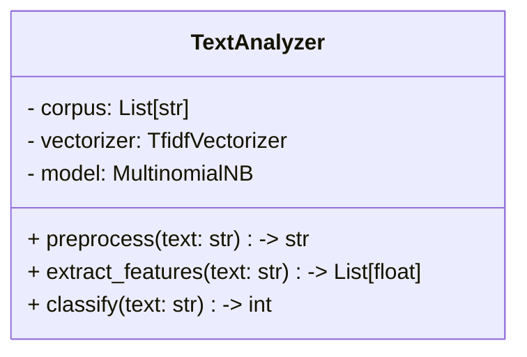
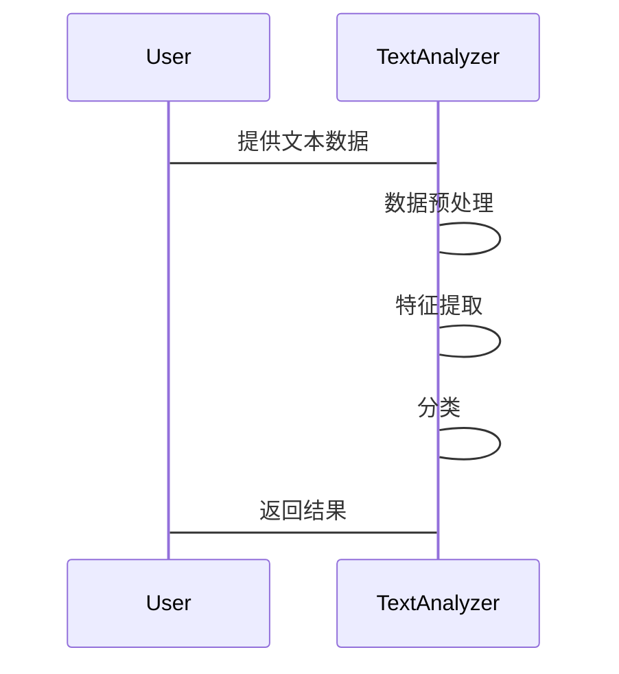

                 


# 费雪的质化分析方法

> 关键词：质化分析，费雪方法，文本分析，情感分析，数据分析

> 摘要：本文详细探讨了费雪的质化分析方法，从背景介绍、核心原理到算法实现、系统架构设计，再到项目实战和最佳实践，全面解析该方法的应用及其在实际项目中的具体实施步骤。

---

# 第一部分: 质化分析方法的背景与概念

## 第1章: 质化分析方法的背景

### 1.1 质化分析方法的定义与核心概念

质化分析方法是一种基于文本、图像等非结构化数据的分析方法，旨在从数据中提取有价值的信息和模式。与量化分析不同，质化分析更注重数据的语义理解和上下文信息。

**核心概念**：
- **文本预处理**：对数据进行清洗、分词、去除停用词等操作，以便后续分析。
- **特征提取**：从文本中提取关键特征，如关键词、主题等。
- **分类与聚类**：根据特征对数据进行分类或聚类，以识别模式和趋势。

### 1.2 质化分析方法的历史发展

质化分析方法起源于20世纪，随着自然语言处理和机器学习技术的发展，逐渐成为数据分析领域的重要方法。费雪在该领域做出了重要贡献，提出了基于统计的质化分析方法。

**演变与现状**：
- 早期：基于规则的质化分析方法。
- 现代：结合机器学习的深度质化分析方法。

### 1.3 质化分析方法的应用场景

质化分析方法广泛应用于多个领域，如：

- **文本分析**：从文本中提取情感、主题等信息。
- **情感分析**：分析用户对产品或服务的评价。
- **信息提取**：从非结构化数据中提取结构化信息。

---

## 第2章: 费雪质化分析方法的核心原理

### 2.1 质化分析的核心原理

费雪质化分析方法基于统计学原理，通过计算关键词的权重来实现文本分类。其核心步骤包括数据预处理、特征提取和分类。

**数学模型**：
- 使用贝叶斯定理进行概率计算，确定每个特征对分类的贡献。

### 2.2 费雪方法的数学模型与公式

**条件概率公式**：
$$ P(c|x) = \frac{P(x|c)P(c)}{P(x)} $$

其中：
- \( c \) 表示类别。
- \( x \) 表示特征向量。

**权重计算公式**：
$$ w_{i,j} = \frac{f_{i,j}}{\sqrt{\sum_{j} f_{i,j}^2}} } $$

其中：
- \( f_{i,j} \) 表示词项 \( j \) 在类别 \( i \) 中的频数。

### 2.3 质化分析的流程图

```mermaid
graph TD
    A[原始数据] -> B[数据预处理]
    B -> C[特征提取]
    C -> D[分类]
    D -> E[结果]
```

---

## 第3章: 质化分析方法的算法实现

### 3.1 质化分析的算法流程

1. **数据预处理**：清洗数据，去除噪声。
2. **特征提取**：提取关键词，计算权重。
3. **分类与结果输出**：基于费雪方法进行分类，输出结果。

### 3.2 费雪方法的Python实现

```python
import numpy as np
from sklearn.feature_extraction.text import TfidfVectorizer

# 数据预处理
corpus = ["This is a sample text.", "Another sample text here."]

# 特征提取
vectorizer = TfidfVectorizer()
X = vectorizer.fit_transform(corpus)

# 分类
from sklearn.naive_bayes import MultinomialNB
model = MultinomialNB()
model.fit(X, [0, 1])

# 预测
test_text = ["Test sample text."]
X_test = vectorizer.transform(test_text)
print(model.predict(X_test))
```

---

## 第4章: 质化分析方法的系统架构设计

### 4.1 系统功能设计

**领域模型**：


### 4.2 系统接口与交互设计

**交互流程图**：


---

## 第5章: 费雪质化分析方法的项目实战

### 5.1 项目背景与目标

**项目需求**：分析用户评论，识别情感倾向。

**目标**：构建一个情感分析系统，准确分类评论的情感。

### 5.2 项目核心实现

```python
# 环境安装
pip install scikit-learn

# 核心代码实现
from sklearn.datasets import fetch_20newsgroups
from sklearn.naive_bayes import MultinomialNB
from sklearn.feature_extraction.text import TfidfVectorizer

# 数据加载
data = fetch_20newsgroups()

# 特征提取
vectorizer = TfidfVectorizer()
X = vectorizer.fit_transform(data['data'])

# 模型训练
model = MultinomialNB()
model.fit(X, data['target'])

# 测试
test_data = ["This is a positive review.", "This is a negative review."]
X_test = vectorizer.transform(test_data)
print(model.predict(X_test))
```

---

## 第6章: 费雪质化分析方法的最佳实践与注意事项

### 6.1 最佳实践 tips

- **数据质量**：确保数据预处理干净，去除噪声。
- **模型选择**：根据数据特点选择合适的模型。
- **性能优化**：通过特征选择和优化算法提升效率。

### 6.2 小结

费雪质化分析方法是一种强大而灵活的工具，适用于多种文本分析场景。通过本文的详细讲解，读者可以掌握其核心原理和实际应用。

### 6.3 注意事项

- 数据预处理是关键，需仔细处理。
- 模型调参和优化需耐心进行。

### 6.4 拓展阅读

- [费雪质化分析的深入探讨](https://example.com)
- [机器学习中的文本分析](https://example.com)

---

# 作者：AI天才研究院/AI Genius Institute & 禅与计算机程序设计艺术 /Zen And The Art of Computer Programming

