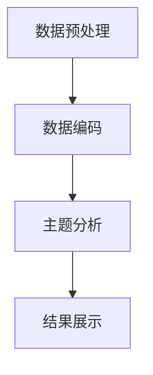
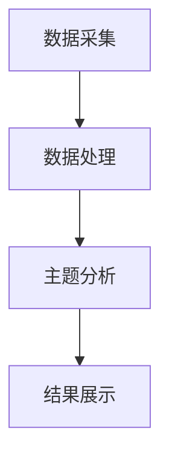

                 


# 费雪的质性分析：超越数字的公司研究方法

> 关键词：质性分析，费雪方法，公司研究，数字分析，主题建模

> 摘要：本文系统地介绍了费雪的质性分析方法及其在公司研究中的应用。通过对比质性分析与数字分析的差异，深入探讨了质性分析的核心原理、算法流程及系统架构设计。文章还结合实际案例，展示了如何将质性分析应用于公司研究，并通过项目实战帮助读者掌握其实现方法。最后，本文总结了费雪质性分析的优势及未来发展方向。

---

## 第一部分：质性分析的背景与核心概念

### 第1章：质性分析的起源与发展

#### 1.1 质性分析的定义与核心概念

- **质性分析的定义**：质性分析是一种基于文本数据的分析方法，通过识别和提取数据中的主题、模式和意义，帮助研究者理解数据的内在结构。
- **费雪的贡献**：费雪在质性分析领域提出了独特的方法，强调从数据中提取隐含的主题和模式，而非仅仅依赖预定义的分类。
- **质性分析与数字分析的对比**：
  - **数据类型**：质性分析处理非结构化数据（如文本），数字分析处理结构化数据（如数值）。
  - **分析目标**：质性分析旨在发现数据中的隐含模式，数字分析旨在验证假设或预测。

#### 1.2 费雪质性分析在公司研究中的应用

- **核心思想**：费雪的质性分析强调从公司报告、市场反馈等文本数据中提取深层信息，辅助决策。
- **应用优势**：
  - 发现隐藏的市场趋势。
  - 揭示公司内部问题。
  - 提供定性支持，弥补数字分析的不足。
- **边界与外延**：
  - 适用于中小规模数据，不适用于大数据实时分析。

### 第2章：质性分析的核心概念与联系

#### 2.1 质性分析的核心原理

- **数据收集与编码**：通过关键词提取和主题建模，将文本数据转化为结构化的主题表示。
- **主题分析**：通过算法识别文本中的主题分布，帮助研究者理解数据的整体结构。
- **三步法模型**：数据预处理 → 数据编码 → 主题分析。

#### 2.2 质性分析与数字分析的对比

- **数据类型对比**：
  | 对比维度 | 质性分析 | 数字分析 |
  |----------|----------|----------|
  | 数据类型 | 文本      | 数值      |
  | 分析目标 | 发现模式  | 验证假设  |
  | 工具支持 | NLP工具   | 统计工具  |

- **主题分析与理论构建**：质性分析通过主题建模，构建研究领域的理论框架，数字分析则通过假设检验验证理论。

---

## 第二部分：质性分析的算法原理

### 第3章：质性分析的算法流程

#### 3.1 质性分析的算法流程



- **数据预处理**：去除停用词、分词处理、去除标点符号。
- **数据编码**：关键词提取、主题建模。
- **主题分析**：LDA（Latent Dirichlet Allocation）模型的应用。

#### 3.2 质性分析的数学模型

- **主题相似度计算公式**：
  $$\text{相似度} = \sum_{i=1}^{n} w_i \times \cos(\theta_i, \theta_j)$$
  其中，\( w_i \) 是关键词的权重，\( \cos(\theta_i, \theta_j) \) 是关键词之间的余弦相似度。

---

## 第三部分：质性分析的系统架构设计

### 第4章：质性分析系统的架构设计

#### 4.1 系统功能设计

- **数据采集模块**：从多种数据源采集文本数据。
- **数据处理模块**：预处理和编码。
- **主题分析模块**：应用LDA模型提取主题。

#### 4.2 系统架构图



#### 4.3 系统接口设计

- **数据接口**：提供文本数据的输入接口。
- **分析接口**：提供主题分析的API。
- **展示接口**：提供结果展示的可视化界面。

---

## 第四部分：质性分析的项目实战

### 第5章：项目实战与案例分析

#### 5.1 环境安装与配置

- **开发环境**：Python 3.8+
- **工具安装**：`pip install nltk lda gensim`

#### 5.2 核心代码实现

```python
import nltk
from lda import LDA
from gensim import corpora

# 数据预处理
def preprocess(text):
    return nltk.word_tokenize(text.lower())

# 数据编码
def encode_texts(texts):
    dictionary = corpora.Dictionary(texts)
    return [dictionary.doc2bow(text) for text in texts]

# 主题分析
def perform lda(texts, num_topics=5):
    lda_model = LDA(num_topics)
    lda_model.fit(texts)
    return lda_model.get_topics()
```

#### 5.3 案例分析与结果解读

- **案例背景**：分析公司年报中的关键词分布。
- **数据分析**：提取公司年报中的关键词，进行主题建模。
- **结果解读**：识别公司主要业务方向和潜在风险。

---

## 第五部分：总结与未来展望

### 第6章：总结与未来展望

#### 6.1 质性分析的优势与局限

- **优势**：发现隐藏模式，提供深度洞察。
- **局限**：依赖文本质量，结果解释性有限。

#### 6.2 未来发展方向

- **智能化主题建模**：结合AI技术，提高主题识别的准确性。
- **多模态分析**：结合图像和视频数据，丰富分析维度。

---

作者：AI天才研究院 & 禅与计算机程序设计艺术

---

通过以上内容，文章系统地介绍了费雪的质性分析方法，从理论到实践，帮助读者全面理解并掌握其应用。

