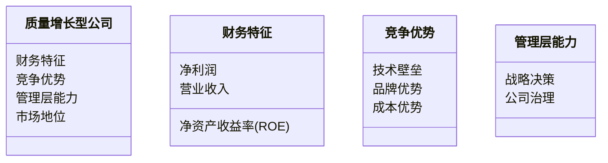
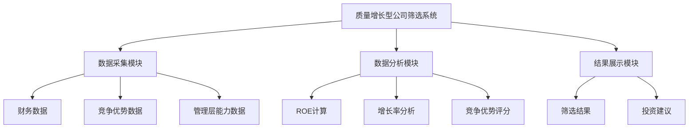

                 


# 费雪的质量增长型公司特征

## 关键词：费雪、质量增长型公司、选股标准、投资策略、财务分析、竞争优势

## 摘要：  
本文详细分析了费雪提出的“质量增长型公司”特征，探讨了其核心概念、分析方法、系统架构及实际应用。通过对比分析和案例研究，揭示了质量增长型公司的财务特征、竞争优势及管理层能力，为投资者提供科学的选股标准和投资策略。

---

## 第1章: 费雪的投资理念与质量增长型公司背景

### 1.1 费雪的投资理念概述  
菲德烈·费雪（Philip A. Fisher）是20世纪著名的投资专家，提出了“质量增长型公司”的投资理念。他强调选择那些具有持续增长潜力和高质量特性的公司，而非单纯追求短期收益。  
- **费雪的核心思想**：公司质量是投资的核心，重点关注公司的盈利能力、成长能力、竞争优势和管理层能力。  
- **质量增长型公司的定义**：指那些具有强大财务表现、竞争优势和持续增长能力的公司。  
- **质量增长型公司的投资价值**：这类公司能够在经济周期中保持稳定增长，为投资者提供长期超额收益。  

### 1.2 质量增长型公司的背景与现状  
- **经济周期与公司质量增长的关系**：在经济波动中，质量增长型公司表现出更强的抗压能力和恢复能力。  
- **质量增长型公司在全球市场中的表现**：通过长期数据分析，质量增长型公司在全球市场中表现出色，尤其是在成熟市场中更为显著。  
- **质量增长型公司的未来发展趋势**：随着全球经济的复苏和技术创新，具备质量增长特性的公司将继续引领市场。  

### 1.3 费雪选股标准的背景与意义  
- **费雪选股标准的核心思想**：选择那些具有独特竞争优势、强大财务表现和优秀管理层的公司。  
- **质量增长型公司的财务特征**：重点关注净利润、营业收入、净资产收益率（ROE）等财务指标。  
- **费雪选股标准的实际应用案例**：通过具体案例分析，展示如何应用费雪的标准筛选出高质量增长型公司。  

---

## 第2章: 质量增长型公司的核心概念与特征  

### 2.1 质量增长型公司的核心概念  
- **质量增长型公司的定义与内涵**：指那些在行业中具有领先地位，财务表现优异，且具备持续增长能力的公司。  
- **质量增长型公司的关键属性**：  
  - **财务稳定性**：高ROE、稳定的现金流和低负债率。  
  - **竞争优势**：技术壁垒、品牌优势和成本优势。  
  - **成长能力**：持续增长的营业收入和净利润。  

### 2.2 质量增长型公司的特征对比  
- **质量型公司与成长型公司的对比**：  
  | 特征      | 质量型公司                | 成长型公司                |  
  |-----------|--------------------------|--------------------------|  
  | 财务表现   | 稳定的ROE，低风险         | 高增长，但财务杠杆高     |  
  | 市场地位   | 行业领先，市场占有率高    | 市场份额小，增长空间大   |  
  | 竞争优势  | 强大的技术壁垒           | 创新能力强，但竞争优势不明显 |  

- **质量增长型公司与周期性公司的对比**：  
  - 质量增长型公司受经济周期影响较小，具备防御性和增长性双重特征。  
  - 周期性公司依赖于经济周期波动，风险较高。  

### 2.3 费雪选股标准的实体关系图  
```mermaid
graph TD
    A[质量增长型公司] --> B[财务特征]
    B --> C[净利润]
    B --> D[营业收入]
    B --> E[净资产收益率(ROE)]
    A --> F[竞争优势]
    F --> G[技术壁垒]
    F --> H[品牌优势]
    F --> I[成本优势]
    A --> J[管理层能力]
    J --> K[战略决策]
    J --> L[公司治理]
```

---

## 第3章: 质量增长型公司的系统分析与架构设计  

### 3.1 系统分析背景与目标  
- **问题场景介绍**：如何通过系统化的分析方法，筛选出符合费雪选股标准的公司。  
- **系统分析的目标**：构建一个基于费雪选股标准的质量增长型公司分析框架，提供可操作的选股策略。  

### 3.2 领域模型设计  


### 3.3 系统架构设计  


---

## 第4章: 质量增长型公司的数学模型与算法实现  

### 4.1 数学模型设计  
基于费雪选股标准，构建一个质量增长型公司评分模型：  
$$ \text{质量评分} = 0.4 \times \text{ROE} + 0.3 \times \text{净利润增长率} + 0.3 \times \text{竞争优势评分} $$  

其中，竞争优势评分基于技术壁垒、品牌优势和成本优势的加权计算：  
$$ \text{竞争优势评分} = 0.4 \times \text{技术壁垒} + 0.3 \times \text{品牌优势} + 0.3 \times \text{成本优势} $$  

### 4.2 算法实现  
以下是一个简单的Python实现：  

```python
import pandas as pd

def calculate_roe(net_profit, equity):
    return net_profit / equity

def calculate_growth(net_profit_current, net_profit_previous):
    return (net_profit_current - net_profit_previous) / net_profit_previous

def calculate_competitive_advantage(tech_barr, brand_adv, cost_adv):
    return 0.4 * tech_barr + 0.3 * brand_adv + 0.3 * cost_adv

def quality_score(ro

