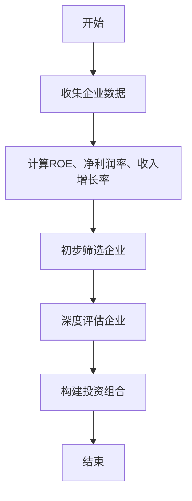
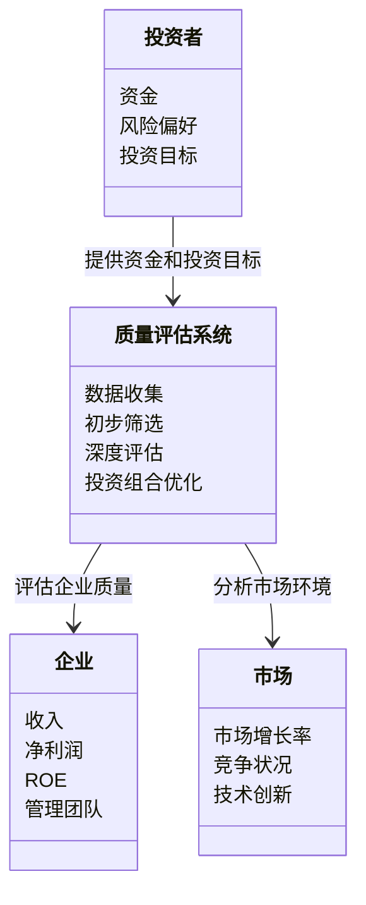
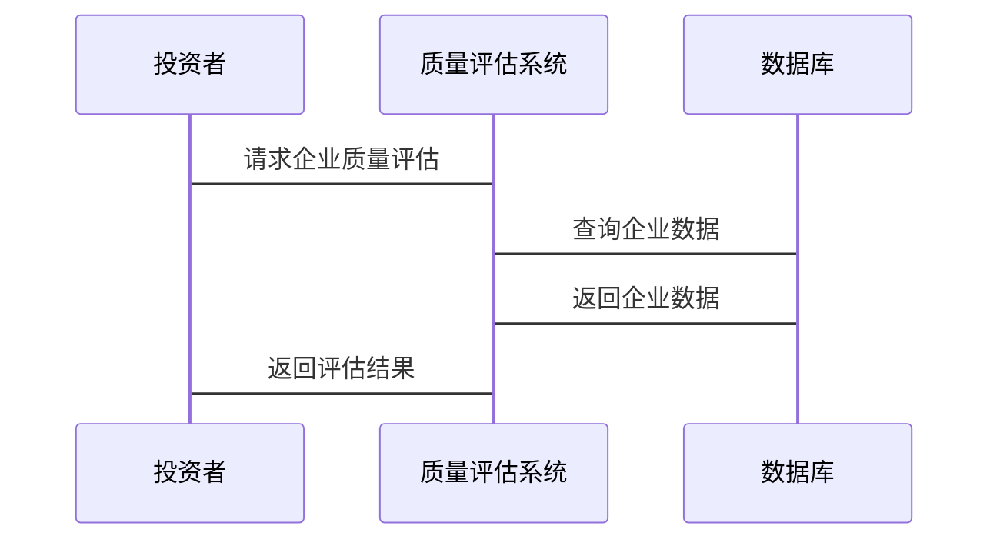

                 


# 费雪的质量增长策略：在高科技时代的重新诠释

## 关键词：
费雪，质量增长策略，高科技时代，投资策略，现代诠释，质量评估，投资组合优化

## 摘要：
本文旨在重新诠释菲利普·费雪的质量增长策略，探讨其在高科技时代的适用性。通过分析质量增长策略的核心概念、算法原理和系统架构，结合实际案例，展示如何将传统投资策略与现代技术相结合，以优化投资组合并最大化收益。

---

## 第1章：费雪质量增长策略的背景与核心概念

### 1.1 费雪质量增长策略的起源与演变

#### 1.1.1 费雪投资理论的起源
菲利普·费雪是20世纪著名的投资专家，提出了一系列投资理论，其中质量增长策略是其核心思想之一。该策略强调投资于具有强大基本面和持续增长潜力的企业。

#### 1.1.2 高科技时代对策略的重新诠释
随着科技的快速发展，企业之间的竞争加剧，质量增长策略需要结合现代技术手段，如数据分析和人工智能，以适应新的市场环境。

#### 1.1.3 质量增长策略与其他策略的区别
质量增长策略不同于传统的价值投资和成长股投资，它更关注企业的内在质量和持续增长能力。

### 1.2 质量增长策略的定义与特点

#### 1.2.1 质量增长的定义
质量增长指的是企业通过创新、管理和运营等方面的优势，实现可持续的业绩增长。

#### 1.2.2 核心要素
- **创新能力强**：企业具备持续创新能力，能够推出新产品或服务。
- **管理团队优秀**：管理层具备战略眼光和执行力。
- **财务健康**：企业具备健康的财务状况，能够支撑持续增长。
- **市场地位稳固**：企业在市场上具备竞争优势，占据重要地位。

#### 1.2.3 质量增长与传统增长策略的区别
- **传统增长策略**：注重企业的短期增长和市场份额的扩张。
- **质量增长策略**：注重企业的长期可持续增长和内在质量。

### 1.3 质量增长策略的适用场景

#### 1.3.1 高科技企业的特征分析
高科技企业通常具有高成长性、高研发投入和高技术壁垒，适合应用质量增长策略。

#### 1.3.2 策略在高科技行业的应用
- **技术创新**：关注企业在技术创新方面的投入和成果。
- **市场拓展**：关注企业在市场拓展方面的策略和成效。
- **财务健康**：关注企业的财务状况是否能够支持持续增长。

#### 1.3.3 策略的边界与外延
质量增长策略并非适用于所有企业，需要根据企业的具体情况灵活调整。

---

## 第2章：质量增长策略的核心概念与联系

### 2.1 核心概念原理

#### 2.1.1 投资的三个阶段
1. **初创阶段**：企业处于起步阶段，具备较大的增长潜力。
2. **成长阶段**：企业进入快速成长期，收入和利润持续增长。
3. **成熟阶段**：企业进入稳定发展阶段，增长速度放缓。

#### 2.1.2 成长股的核心特征
- **高ROE**：股东权益回报率高。
- **高净利润率**：净利润占收入的比例高。
- **高增长潜力**：收入和利润持续增长。

#### 2.1.3 质量增长的衡量标准
- **ROE（股东权益回报率）**：ROE = 净利润 / 平均股东权益。
- **净利润率**：净利润率 = 净利润 / 收入。
- **收入增长率**：收入增长率 = (本年收入 - 上年收入) / 上年收入。

### 2.2 核心概念属性对比表

| 比较维度 | 质量增长策略 | 价值投资 | 成长股投资 |
|----------|--------------|----------|------------|
| 核心目标 | 寻找具备质量优势且能够持续增长的企业 | 寻找被市场低估的优质企业 | 寻找具备高增长潜力的企业 |
| 重点指标 | ROE、净利润率、收入增长率 | 市盈率、市净率 | 收入增长率、净利润增长率 |
| 投资期限 | 中长期 | 中长期 | 中长期 |

### 2.3 ER实体关系图

```mermaid
erDiagram
    actor 投资者 {
        <属性>
        - 资金：金额
        - 风险偏好：低/中/高
        - 投资目标：收益/风险平衡
    }
    actor 企业 {
        <属性>
        - 收入：金额
        - 净利润：金额
        - ROE：百分比
        - 管理团队：优秀/一般
    }
    actor 市场 {
        <属性>
        - 市场增长率：百分比
        - 竞争状况：激烈/一般
        - 技术创新：活跃/缓慢
    }
    relation 质量评估 {
        <关系>
        投资者 -> 企业 : 评估企业质量
        企业 -> 市场 : 反映市场表现
    }
```

---

## 第3章：质量增长策略的算法原理

### 3.1 算法原理概述

#### 3.1.1 筛选算法
质量增长策略的筛选算法旨在从企业中筛选出具备质量优势和持续增长潜力的企业。以下是算法的主要步骤：

1. **数据收集**：收集企业的财务数据、管理团队信息、市场表现等。
2. **初步筛选**：根据ROE、净利润率、收入增长率等指标进行初步筛选。
3. **深度评估**：对通过初步筛选的企业进行深度评估，包括管理团队、技术创新能力等。
4. **投资组合优化**：根据评估结果，构建投资组合。

#### 3.1.2 算法流程图



### 3.2 算法实现

#### 3.2.1 Python代码实现

```python
import pandas as pd

def calculate_roe(net_profit, equity):
    return net_profit / equity

def calculate_net_profit_margin(net_profit, revenue):
    return net_profit / revenue

def calculate_revenue_growth(current_revenue, previous_revenue):
    return (current_revenue - previous_revenue) / previous_revenue

def quality_growth_strategy(stocks):
    selected_stocks = []
    for stock in stocks:
        roe = calculate_roe(stock.net_profit, stock.equity)
        npm = calculate_net_profit_margin(stock.net_profit, stock.revenue)
        rg = calculate_revenue_growth(stock.current_revenue, stock.previous_revenue)
        if roe > 0.1 and npm > 0.1 and rg > 0.1:
            selected_stocks.append(stock)
    return selected_stocks
```

#### 3.2.2 算法优化建议
- **动态调整指标权重**：根据市场环境变化，动态调整ROE、净利润率、收入增长率等指标的权重。
- **引入机器学习模型**：利用机器学习技术，对企业的质量进行更精准的评估。

### 3.3 数学模型与公式

#### 3.3.1 质量评分模型
$$ \text{质量评分} = 0.4 \times \text{ROE} + 0.3 \times \text{净利润率} + 0.3 \times \text{收入增长率} $$

#### 3.3.2 投资组合优化模型
$$ \text{投资组合收益} = \sum_{i=1}^{n} w_i \times r_i $$
其中，\( w_i \) 是第i个股票的权重，\( r_i \) 是第i个股票的预期收益。

#### 3.3.3 风险评估公式
$$ \text{风险评分} = 0.5 \times \text{行业风险} + 0.5 \times \text{企业特有风险} $$

---

## 第4章：系统分析与架构设计

### 4.1 系统功能设计

#### 4.1.1 领域模型（mermaid类图）



### 4.2 系统架构设计

#### 4.2.1 系统架构图（mermaid架构图）


#### 4.2.2 系统交互设计（mermaid序列图）



---

## 第5章：项目实战

### 5.1 环境安装

#### 5.1.1 安装Python和相关库
```bash
pip install pandas numpy matplotlib
```

#### 5.1.2 数据获取
使用Yahoo Finance获取企业的财务数据。

### 5.2 核心实现

#### 5.2.1 数据处理

```python
import pandas as pd

# 获取企业数据
def get_stock_data(tickers):
    data = {}
    for ticker in tickers:
        stock_data = pd.DataFrame()
        # 获取财务数据
        stock_data = pd.read_csv(f'data/{ticker}.csv')
        data[ticker] = stock_data
    return data

# 计算质量评分
def calculate_quality_score(data):
    scores = {}
    for ticker, df in data.items():
        roe = df['ROE'].mean()
        npm = df['Net Profit Margin'].mean()
        rg = df['Revenue Growth'].mean()
        score = 0.4 * roe + 0.3 * npm + 0.3 * rg
        scores[ticker] = score
    return scores
```

#### 5.2.2 投资组合优化

```python
import numpy as np

def optimize_portfolio(scores, returns):
    n = len(scores)
    # 定义目标函数
    def objective(x):
        return - (x.T @ returns @ x)
    # 定义约束条件
    constraints = [{'type': 'eq', 'fun': lambda x: np.sum(x) - 1}]
    # 求解优化问题
    from scipy.optimize import minimize
    result = minimize(objective, np.ones(n)/n, constraints=constraints)
    return result.x
```

### 5.3 案例分析

#### 5.3.1 数据分析

```python
tickers = ['AAPL', 'MSFT', 'GOOGL']
data = get_stock_data(tickers)
scores = calculate_quality_score(data)
```

#### 5.3.2 投资组合优化

```python
returns = pd.DataFrame(data).apply('mean', axis=0)
weights = optimize_portfolio(scores, returns)
print(weights)
```

---

## 第6章：总结与扩展

### 6.1 最佳实践 tips

- **持续学习**：市场环境不断变化，需要持续学习和调整策略。
- **动态优化**：根据市场环境变化，动态优化投资组合。
- **风险管理**：合理控制风险，避免过度集中投资。

### 6.2 小结

本文重新诠释了费雪的质量增长策略，并将其应用到高科技时代。通过算法和系统设计，展示了如何利用现代技术手段优化投资策略。

### 6.3 注意事项

- **数据质量**：数据的准确性和完整性对策略的有效性至关重要。
- **模型局限性**：模型假设可能存在局限性，需要结合实际情况进行调整。

### 6.4 拓展阅读

- 费雪的《怎样选择成长股》
- 现代投资组合理论

---

## 作者：AI天才研究院 & 禅与计算机程序设计艺术

本文由AI天才研究院与“禅与计算机程序设计艺术”联合撰写，转载请注明出处。

