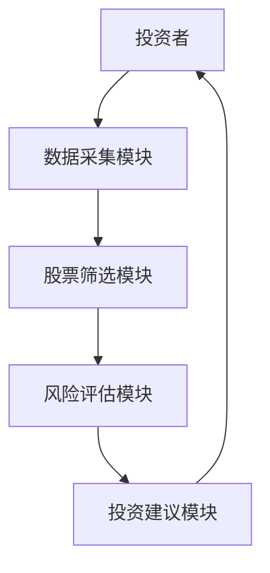
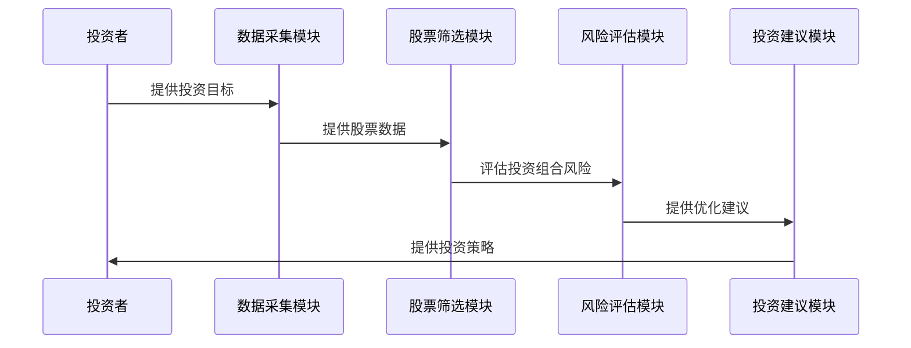

                 


# 费雪的长期持股策略：减少交易成本的智慧之举

## 关键词：费雪、长期持股、交易成本、投资策略、股票选择、复利效应

## 摘要：本文详细探讨了费雪的长期持股策略，分析了其减少交易成本的优势，并结合投资组合理论、市场有效性假设和数学模型，阐述了该策略的核心要素。通过实际案例分析，展示了如何应用这些策略进行投资决策，并总结了最佳实践和注意事项，为投资者提供了深入的指导。

---

# 费雪的长期持股策略：减少交易成本的智慧之举

## 第一部分：背景介绍

### 第1章：费雪的生平与投资理念

#### 1.1 费雪的生平简介
菲利普·费雪（Philip Fisher）是20世纪著名的投资家，被誉为“成长股之父”。他出生于1907年，去世于2004年，是投资界的重要人物。费雪的投资理念强调长期持有优质股票，避免频繁交易，从而减少交易成本，实现长期稳定的收益。

#### 1.2 费雪的投资哲学
费雪的核心思想是寻找具有持续增长潜力的公司，并长期持有这些股票。他认为，成功的投资不仅依赖于市场的波动，更依赖于公司本身的成长性和盈利能力。因此，他提出了“成长股”概念，即那些能够持续增长并为股东创造价值的公司。

#### 1.3 长期持股策略的核心思想
费雪的长期持股策略基于以下几点：
- **减少交易成本**：频繁交易会增加佣金、印花税等成本，降低整体收益。
- **避免短期波动**：市场的短期波动难以预测，长期持有可以平滑波动，实现稳定收益。
- **复利效应**：长期持有股票可以充分利用复利效应，使投资收益最大化。

### 第2章：长期持股策略的背景与意义

#### 2.1 现代投资市场的特点
现代投资市场具有高度的波动性和不确定性，信息透明度高，投资者选择多样化。然而，频繁的交易行为增加了成本，削弱了长期投资的回报。

#### 2.2 交易成本对企业投资的影响
交易成本包括佣金、印花税、买卖价差等。这些成本在频繁交易中累积，显著降低了净收益。对于小额投资者而言，交易成本的影响更为明显。

#### 2.3 长期持股策略的优势与局限性
- **优势**：
  - 减少交易成本，提高净收益。
  - 平滑市场波动，降低心理压力。
  - 充分利用复利效应，实现长期增长。
- **局限性**：
  - 需要选择优质股票，否则长期持有可能带来损失。
  - 短期市场波动可能影响情绪，但长期来看并不影响价值。

### 第3章：减少交易成本的重要性

#### 3.1 交易成本的定义与分类
交易成本包括显性成本（佣金、印花税）和隐性成本（买卖价差、滑点）。这些成本在频繁交易中累积，显著影响投资收益。

#### 3.2 交易成本对企业投资决策的影响
高交易成本会增加投资组合的负担，降低整体回报。因此，减少交易次数是提高投资效率的重要策略。

#### 3.3 减少交易成本的智慧与策略
- **选择优质股票**：减少更换股票的频率。
- **长期持有**：避免频繁交易，降低交易成本。
- **分散投资**：通过多样化减少风险，降低因频繁调整带来的成本。

### 第4章：费雪长期持股策略的核心要素

#### 4.1 股票选择的标准
费雪强调选择具有持续增长潜力的公司，关注公司的基本面指标，如盈利能力、成长性、管理团队等。

#### 4.2 长期持有股票的优势
长期持有可以充分利用复利效应，平滑市场波动，避免短期亏损。

#### 4.3 如何避免短期波动的干扰
投资者应关注公司的长期价值，忽略短期市场波动，避免因情绪化决策导致亏损。

## 第二部分：核心概念与联系

### 第5章：投资组合理论

#### 5.1 马科维茨的投资组合理论
马科维茨提出了现代投资组合理论（MPT），强调通过分散投资降低风险，提高收益。费雪的长期持股策略与MPT的理念相符，通过持有优质股票构建稳健的投资组合。

#### 5.2 复利效应与长期投资
复利效应是长期投资的核心优势，通过不断再投资收益，实现收益的指数增长。

#### 5.3 市场有效性与长期投资
在有效市场中，长期持股策略可能难以实现超额收益，但在弱有效市场中，通过基本面分析选择优质股票仍有机会获得超额收益。

### 第6章：长期持股策略的数学模型

#### 6.1 复利计算公式
复利计算公式为：\[ A = P \times (1 + r)^n \]
其中，\( A \) 是终值，\( P \) 是本金，\( r \) 是年化收益率，\( n \) 是投资年数。

#### 6.2 股票选择模型
费雪的股票选择模型基于公司基本面分析，通过筛选具有高ROE（净资产收益率）、持续增长潜力和强大管理团队的公司。

#### 6.3 风险评估模型
使用夏普比率评估投资组合的风险调整后收益：
\[ \text{夏普比率} = \frac{E[r_p] - r_f}{\sigma_p} \]
其中，\( E[r_p] \) 是投资组合的期望收益，\( r_f \) 是无风险利率，\( \sigma_p \) 是投资组合的波动率。

## 第三部分：系统分析与架构设计

### 第7章：投资决策支持系统

#### 7.1 系统功能设计
- **数据采集**：收集股票的基本面数据和市场数据。
- **股票筛选**：基于费雪的策略筛选优质股票。
- **风险评估**：计算投资组合的风险指标。
- **投资建议**：提供长期持股的策略建议。

#### 7.2 系统架构图
使用Mermaid绘制系统架构图：



#### 7.3 系统交互流程图
使用Mermaid绘制交互流程图：



## 第四部分：项目实战

### 第8章：长期持股策略的实战应用

#### 8.1 环境配置
- **工具**：使用Python进行数据分析，利用Pandas、NumPy等库。
- **数据源**：获取历史股票数据，如Yahoo Finance API。

#### 8.2 核心代码实现

```python
import pandas as pd
import numpy as np

# 加载股票数据
data = pd.read_csv('stock_data.csv')

# 计算复利回报
def compound_return(principal, rate, years):
    return principal * (1 + rate) ** years

# 筛选优质股票
def fisher_stock_screening(data):
    # 计算ROE
    data['ROE'] = data['净利润'] / data['净资产']
    # 筛选ROE大于行业平均水平的股票
    industry_avg = data['ROE'].mean()
    filtered = data[data['ROE'] > industry_avg]
    return filtered

# 示例应用
principal = 10000
rate = 0.08
years = 10
return_amount = compound_return(principal, rate, years)
print(f"复利计算后的金额：{return_amount:.2f}")
```

#### 8.3 案例分析
以某成长型公司为例，展示如何通过长期持股实现收益增长。计算不同持有期限下的回报，并对比频繁交易的成本影响。

#### 8.4 结果解读
分析长期持有策略在实际案例中的表现，验证其在减少交易成本和提高收益方面的有效性。

## 第五部分：最佳实践与总结

### 第9章：最佳实践

#### 9.1 长期投资的关键要素
- 选择具有持续增长潜力的公司。
- 长期持有，避免频繁交易。
- 定期审视投资组合，及时调整。

#### 9.2 风险管理
- 分散投资，降低集中风险。
- 定期评估市场环境，调整投资策略。

### 第10章：小结与注意事项

#### 10.1 小结
费雪的长期持股策略通过减少交易成本和利用复利效应，帮助投资者实现稳健的长期收益。选择优质股票和长期持有是该策略的核心。

#### 10.2 注意事项
- 投资者需具备基本面分析能力，选择优质股票。
- 长期持有需耐心，避免因短期波动影响决策。
- 定期评估投资组合，及时调整以应对市场变化。

### 第11章：拓展阅读

#### 11.1 推荐书籍
- 《股市长线思维》——彼得·林奇
- 《投资最重要的事》——约翰·邓普顿

#### 11.2 在线资源
- 网络课程：投资策略与长期持股
- 数据工具：Yahoo Finance API、Pandas库

## 作者：AI天才研究院 & 禅与计算机程序设计艺术

---

这篇文章系统地介绍了费雪的长期持股策略，结合理论分析、数学模型和实际案例，为投资者提供了深入的指导。通过减少交易成本和利用复利效应，长期持有优质股票是实现稳健收益的有效策略。希望本文能帮助读者更好地理解并应用这一策略。

