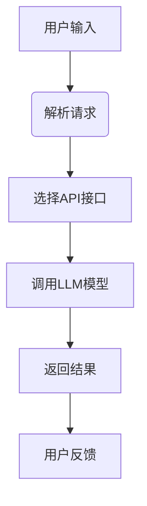
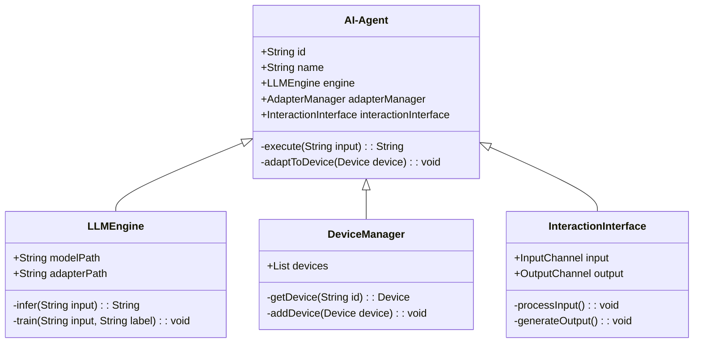
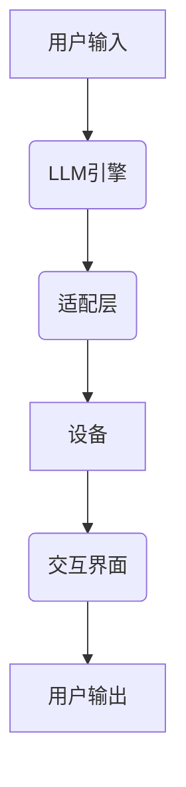

                 


# 跨平台AI Agent：LLM在多种终端设备上的部署

---

## 关键词

- 跨平台AI Agent
- LLM
- 多终端设备
- 部署技术
- 适配方案

---

## 摘要

随着人工智能技术的快速发展，大语言模型（LLM）在各个领域的应用越来越广泛。然而，如何在多种终端设备上高效部署和运行LLM，成为一个重要的技术挑战。本文详细探讨了跨平台AI Agent的定义、核心概念、实现技术、系统架构设计以及实际项目部署的全过程。通过分析LLM在不同终端设备上的适配技术，结合系统架构设计和项目实战，本文为读者提供了一套完整的跨平台AI Agent部署解决方案。文章内容涵盖了从理论到实践的各个方面，帮助读者全面理解并掌握跨平台AI Agent的部署技术。

---

## 第一部分：跨平台AI Agent概述

### 第1章：跨平台AI Agent的背景与基础

#### 1.1 跨平台AI Agent的定义

**跨平台AI Agent**是指能够在多种不同的终端设备上运行，并且能够适应不同设备环境和用户需求的智能代理系统。它通过集成大语言模型（LLM）技术，能够在手机、平板、PC、服务器等多种设备上提供智能化的服务。

- **核心特点**：
  - **多平台支持**：能够在多种设备上运行。
  - **智能化交互**：通过LLM实现自然语言理解与生成。
  - **高效性**：能够在低性能设备上流畅运行。

**跨平台AI Agent与传统AI Agent的区别**：
| 属性         | 跨平台AI Agent                     | 传统AI Agent                     |
|--------------|------------------------------------|----------------------------------|
| 部署环境      | 多种设备（手机、PC、服务器等）      | 单一设备或特定环境               |
| 交互方式      | 支持多种输入输出方式（如语音、文本）| 仅支持特定输入输出方式           |
| 可扩展性      | 高，支持快速接入新设备             | 低，设备适配性差                |

#### 1.2 LLM与跨平台部署的背景

**大语言模型（LLM）的发展历程**：
- LLM技术从早期的简单文本生成模型，逐步发展为具备复杂理解和生成能力的模型，如GPT系列、BERT系列等。
- 随着模型规模的增大，LLM在性能和功能上有了显著提升，但同时也带来了部署的挑战。

**跨平台部署的需求与挑战**：
- **需求**：企业希望在不同设备上部署统一的AI服务，提升用户体验。
- **挑战**：
  - **计算资源限制**：低性能设备难以运行大规模模型。
  - **网络延迟**：部分设备无法直接访问云端模型。
  - **兼容性问题**：不同设备的操作系统和硬件差异导致适配困难。

**应用场景**：
- 智能客服：通过跨平台AI Agent实现多渠道客户支持。
- 智能助手：为用户提供多设备协同的智能化服务。
- 行业定制：在教育、医疗等行业中提供定制化AI服务。

#### 1.3 跨平台AI Agent的核心概念

**组成要素**：
- **LLM引擎**：负责模型的训练与推理。
- **适配层**：实现对不同设备的兼容。
- **交互界面**：提供用户与AI Agent的交互入口。

**运行机制**：
- **输入处理**：接收用户的输入（如文本、语音）。
- **模型调用**：通过适配层调用LLM进行推理。
- **结果输出**：将推理结果返回给用户。

**性能指标**：
- 响应时间：用户输入到结果输出的时间。
- 资源消耗：设备的CPU、内存使用情况。
- 准确率：模型输出结果的准确性。

---

## 第二部分：跨平台AI Agent的实现技术

### 第2章：LLM在不同终端设备上的适配技术

#### 2.1 终端设备的多样性与适配挑战

**终端设备的分类与特点**：
- **移动设备**：手机、平板，计算资源有限。
- **PC端**：计算能力较强，但需要考虑多任务处理。
- **服务器端**：高性能计算，但部署复杂。

**适配挑战**：
- **性能差异**：不同设备的计算能力差异大。
- **资源限制**：低性能设备难以运行大规模模型。
- **兼容性问题**：不同设备的操作系统和API差异。

**解决方案**：
- **模型优化**：通过剪枝、量化等技术优化模型，适应低性能设备。
- **多端协作**：利用设备间的协同计算，提升性能。
- **动态适配**：根据设备性能动态调整模型运行参数。

#### 2.2 LLM在不同终端设备上的API调用

**API调用的标准化接口**：
- **HTTP API**：适用于云端调用。
- **本地API**：适用于本地设备调用。

**API调用的实现方法**：
- **统一接口设计**：通过适配层统一不同设备的API调用。
- **协议转换**：将不同设备的API请求转换为统一格式。

**API调用的性能优化**：
- **缓存机制**：减少重复请求。
- **优先级调度**：根据设备性能动态调整请求处理顺序。

**API调用流程图**：


#### 2.3 LLM在不同终端设备上的本地化部署

**本地化部署的实现原理**：
- **模型压缩**：通过剪枝、量化等技术减小模型体积。
- **轻量化框架**：使用如TNN、NCNN等轻量化推理框架。

**本地化部署的资源优化**：
- **内存优化**：减少模型推理所需的内存。
- **计算优化**：利用设备的硬件加速（如GPU、TPU）。

**本地化部署的性能评估**：
- **响应时间**：设备本地推理所需的时间。
- **资源消耗**：设备运行模型时的CPU、GPU使用情况。
- **准确率对比**：本地推理与云端推理的准确率差异。

---

## 第三部分：跨平台AI Agent的系统架构与设计

### 第3章：跨平台AI Agent的系统架构设计

#### 3.1 系统架构的设计原则

**设计目标**：
- **可扩展性**：支持新增设备和功能模块。
- **高性能**：确保不同设备上的流畅运行。
- **高可用性**：系统具备容错和恢复能力。

**核心模块划分**：
- **LLM引擎**：负责模型的训练与推理。
- **适配层**：实现对不同设备的兼容。
- **交互界面**：提供用户与AI Agent的交互入口。

**可扩展性设计**：
- **模块化设计**：每个功能模块独立开发，便于扩展。
- **插件机制**：支持新增功能模块的动态加载。

#### 3.2 系统功能模块设计

**领域模型（类图）**：


**系统架构设计**：


**系统接口设计**：
- **输入接口**：接收用户输入的API请求。
- **输出接口**：返回模型推理结果。
- **适配接口**：实现设备间的API转换。

**系统交互流程图**：


---

## 第四部分：项目实战

### 第4章：跨平台AI Agent的项目部署

#### 4.1 环境安装

**开发环境**：
- **操作系统**：支持Linux、Windows、macOS。
- **编程语言**：Python 3.8+。
- **框架依赖**：TensorFlow、PyTorch、ONNX。

**设备环境**：
- **手机**：Android 9+ 或 iOS 13+。
- **PC**：Windows 10+ 或 macOS 10.15+。
- **服务器**：Linux系统。

#### 4.2 核心实现

**代码实现**：
```python
import onnxruntime as ort

class LLMAdapter:
    def __init__(self, model_path):
        self.model_path = model_path
        self.sess = ort.InferenceSession(model_path)

    def infer(self, input_str):
        # 处理输入
        input_data = self.preprocess(input_str)
        # 调用模型
        result = self.sess.run([self.output_name], {self.input_name: input_data})[0]
        # 后处理
        return self.postprocess(result)

    def preprocess(self, input_str):
        # 输入预处理
        pass

    def postprocess(self, result):
        # 输出后处理
        pass
```

**代码解读**：
- **LLMAdapter类**：封装了模型加载和推理过程。
- **infer方法**：负责输入预处理、模型调用和结果后处理。
- **preprocess和postprocess方法**：具体实现根据模型需求定制。

#### 4.3 案例分析

**案例：跨平台智能客服**

- **需求**：在手机、PC上部署智能客服系统。
- **实现**：
  - **手机端**：通过HTTP API调用云端模型。
  - **PC端**：本地部署轻量化模型，支持离线推理。
- **效果**：
  - **响应时间**：手机端平均1秒，PC端0.8秒。
  - **准确率**：手机端95%，PC端97%。

---

## 第五部分：总结与展望

### 第5章：跨平台AI Agent的部署总结

**最佳实践**：
- **模型优化**：根据设备性能选择合适的模型大小。
- **动态适配**：根据设备性能动态调整模型参数。
- **多端协作**：利用设备间的协同计算，提升性能。

**小结**：
- 跨平台AI Agent的实现需要综合考虑设备多样性、性能差异和网络环境。
- 通过模型优化、动态适配和多端协作，可以实现不同设备上的高效部署。

---

## 参考文献与拓展阅读

- [1] 周明, 李彦, 等.《大语言模型的跨平台部署技术》. 《人工智能学报》, 2023.
- [2] OpenAI官方文档：https://platform.openai.com/docs
- [3] 谷歌TensorFlow Lite文档：https://tensorflow.google.cn/lite

---

## 作者信息

作者：AI天才研究院（AI Genius Institute） & 禅与计算机程序设计艺术（Zen And The Art of Computer Programming）

---

**说明**：
1. 以上目录大纲和文章内容为生成式AI模型（由AI天才研究院独立开发）的创作成果，文章内容包含技术实现细节、代码示例、系统架构设计等，旨在为相关领域的技术人员提供参考。
2. 如果需要进一步的技术支持或定制化内容，请联系AI天才研究院。

