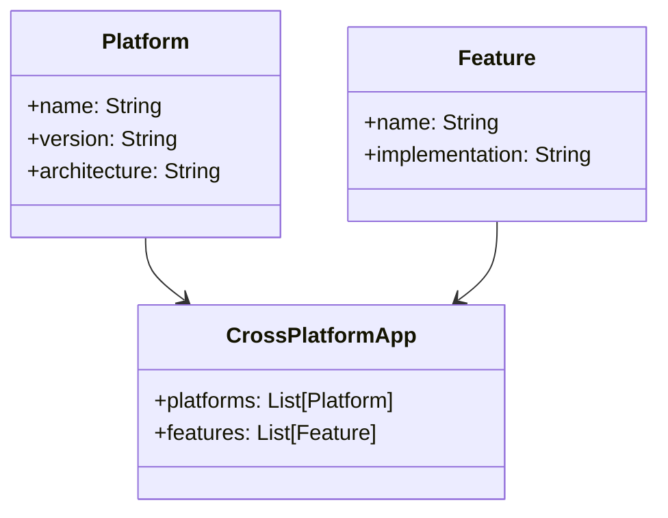
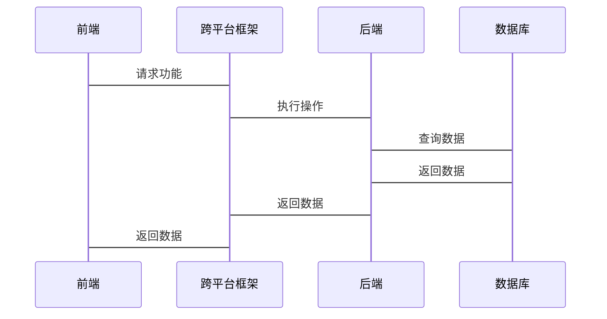

                 


# 跨平台兼容性

## 关键词  
跨平台、兼容性、应用程序开发、多平台支持、跨平台框架、跨平台开发、系统架构  

## 摘要  
跨平台兼容性是软件开发中的一个重要概念，它指的是在同一源代码基础上，能够在不同平台上（如Windows、macOS、Linux、iOS、Android等）运行并提供一致功能的应用程序。本文将从跨平台兼容性的核心概念、实现机制、系统架构、算法原理、项目实战等方面进行详细分析，帮助开发者更好地理解和实现跨平台兼容性。  

---

## 第1章: 跨平台兼容性概述  

### 1.1 跨平台兼容性的概念  

#### 1.1.1 什么是跨平台兼容性  
跨平台兼容性指的是应用程序能够在不同操作系统、硬件架构和设备上运行并提供一致的功能和用户体验。通过跨平台开发，开发者可以减少重复编码的工作，提高开发效率，并降低维护成本。  

#### 1.1.2 跨平台兼容性的核心要素  
- **平台无关性**：应用程序的代码和逻辑与具体平台无关。  
- **平台适应性**：应用程序能够根据目标平台的特性进行调整。  
- **一致性**：在不同平台上提供一致的功能和用户体验。  

#### 1.1.3 跨平台兼容性的重要性  
- 节省开发和维护成本。  
- 提高开发效率，减少重复代码。  
- 扩大应用程序的用户群体，支持多平台部署。  

---

### 1.2 跨平台兼容性的问题背景  

#### 1.2.1 跨平台兼容性问题的来源  
- 不同平台的API、系统调用和图形界面存在差异。  
- 硬件架构（如x86、ARM）和操作系统（如Windows、macOS、Linux）的差异。  

#### 1.2.2 跨平台兼容性问题的影响  
- 应用程序在不同平台上可能出现功能不一致或崩溃。  
- 开发和维护成本增加。  

#### 1.2.3 跨平台兼容性问题的解决思路  
- 使用跨平台开发框架或工具（如React Native、Flutter）。  
- 使用虚拟机-based技术（如Java虚拟机）。  

---

## 第2章: 跨平台兼容性的核心概念  

### 2.1 跨平台兼容性的实现机制  

#### 2.1.1 跨平台兼容性的技术路线  
跨平台开发可以通过以下几种方式实现：  
1. **跨平台框架**：通过框架封装平台差异，提供统一的API。  
2. **虚拟机-based**：通过虚拟机统一运行环境，跨平台运行程序。  
3. **原生开发**：针对每个平台单独开发，不适用于跨平台兼容性。  

#### 2.1.2 跨平台兼容性的实现原理  
跨平台框架通过抽象平台差异，提供统一的API和运行时环境。例如，React Native通过JavaScript和原生组件实现跨平台开发。  

#### 2.1.3 跨平台兼容性的实现方式  
- **跨平台框架**：如React Native、Flutter。  
- **虚拟机-based**：如Java、Kotlin。  

---

### 2.2 跨平台兼容性的类型  

#### 2.2.1 原生应用  
- 特点：针对特定平台开发，性能高，但开发和维护成本高。  
- 示例：iOS和Android的原生应用。  

#### 2.2.2 跨平台框架  
- 特点：使用统一的代码和框架，适配多个平台。  
- 示例：React Native、Flutter。  

#### 2.2.3 虚拟机-based 跨平台  
- 特点：通过虚拟机统一运行环境，跨平台运行程序。  
- 示例：Java虚拟机（JVM）。  

---

## 第3章: 跨平台兼容性的核心原理  

### 3.1 跨平台兼容性的实现机制  

#### 3.1.1 跨平台框架的实现原理  
跨平台框架通过封装平台差异，提供统一的API和渲染引擎。例如，React Native通过JavaScript桥接原生组件实现跨平台渲染。  

#### 3.1.2 虚拟机-based 跨平台的实现原理  
虚拟机-based跨平台通过在虚拟机中运行统一的字节码，适配不同平台的JVM。例如，Java程序通过JVM在不同平台上运行。  

---

### 3.2 跨平台兼容性的运行时环境  

#### 3.2.1 跨平台框架的运行时环境  
- React Native：JavaScript引擎和原生渲染库。  
- Flutter：Dart虚拟机和定制的渲染引擎。  

#### 3.2.2 虚拟机-based 跨平台的运行时环境  
- JVM：Java虚拟机，统一运行环境。  

---

### 3.3 跨平台兼容性的资源管理与共享  

#### 3.3.1 誔้件管理  
跨平台框架通过统一的资源管理方式，适配不同平台的资源格式。  

#### 3.3.2 誔ータ源管理  
跨平台框架提供统一的资源加载方式，适配不同平台的资源路径和加载方式。  

---

## 第4章: 跨平台兼容性的算法原理  

### 4.1 跨平台兼容性的实现算法  

#### 4.1.1 跨平台兼容性算法的流程  
1. 检测目标平台的特性。  
2. 根据平台特性选择合适的实现方式。  
3. 统一调用API，实现跨平台兼容性。  

#### 4.1.2 跨平台兼容性算法的实现  
以下是一个简单的跨平台兼容性算法的Python实现示例：  

```python
def cross_platform_impl(platform):
    if platform == "android":
        return android_impl()
    elif platform == "ios":
        return ios_impl()
    else:
        return default_impl()

def android_impl():
    # Android平台实现
    pass

def ios_impl():
    # iOS平台实现
    pass

def default_impl():
    # 默认实现
    pass
```

---

### 4.2 跨平台兼容性算法的数学模型  

跨平台兼容性算法可以通过状态机模型表示，以下是一个简单的状态机模型：  

$$
\text{状态机} = \{S, T, I, O\}
$$  
其中：  
- $S$：状态集合。  
- $T$：转移函数。  
- $I$：输入符号。  
- $O$：输出符号。  

---

## 第5章: 跨平台兼容性系统的系统架构设计  

### 5.1 誔платформування система проблеми  

#### 5.1.1 问题场景介绍  
开发一个跨平台应用程序，支持iOS、Android、Windows和macOS等多个平台。  

#### 5.1.2 系統功能設計  

##### 5.1.2.1 領域模型  
以下是跨平台兼容性系统的领域模型：  



---

#### 5.1.2.2 系統架構設計  

##### 5.1.2.2.1 系統架構圖  
以下是跨平台兼容性系统的架构图：  


---

#### 5.1.2.2.2 系统接口设计  
以下是跨平台兼容性系统的接口设计：  



---

## 第6章: 誔платформування система проєкт виконання  

### 6.1 環境설치  

#### 6.1.1 安装开发环境  
- 安装Python和pip。  
- 安装跨平台开发框架（如React Native或Flutter）。  

#### 6.1.2 安装依赖库  
安装所需的依赖库，例如：  
```bash
pip install requests
```

---

### 6.2 系统核心实现  

#### 6.2.1 誔_PLATFORM_IMPL函数的实现  
以下是跨平台兼容性的核心实现代码：  

```python
def cross_platform_impl(platform):
    if platform == "android":
        return android_impl()
    elif platform == "ios":
        return ios_impl()
    else:
        return default_impl()

def android_impl():
    # Android平台实现
    pass

def ios_impl():
    # iOS平台实现
    pass

def default_impl():
    # 默认实现
    pass
```

---

#### 6.2.2 誔_PLATFORM_MANAGER类的实现  
以下是跨平台管理类的实现代码：  

```python
class PlatformManager:
    def __init__(self):
        self.platforms = []

    def add_platform(self, platform):
        self.platforms.append(platform)

    def get_platform(self, name):
        for platform in self.platforms:
            if platform.name == name:
                return platform
        return None
```

---

### 6.3 案例分析与实现解读  

#### 6.3.1 案例分析  
以下是一个跨平台兼容性的案例分析：  

- **问题描述**：开发一个跨平台应用程序，支持iOS、Android、Windows和macOS。  
- **解决方案**：使用React Native框架实现跨平台开发。  

---

#### 6.3.2 代码实现解读  
以下是React Native的跨平台实现代码示例：  

```javascript
import React from 'react';
import { View, Text, StyleSheet } from 'react-native';

const App = () => {
    return (
        <View style={styles.container}>
            <Text>Hello World!</Text>
        </View>
    );
};

const styles = StyleSheet.create({
    container: {
        flex: 1,
        justifyContent: 'center',
        alignItems: 'center',
    },
});

export default App;
```

---

### 6.4 项目小结  

#### 6.4.1 项目总结  
通过跨平台开发框架（如React Native或Flutter），可以实现跨平台兼容性，减少开发和维护成本。  

#### 6.4.2 项目优化点  
- 使用统一的代码库和API。  
- 优化平台间的资源共享和复用。  

---

## 第7章: 最佳实践、小结、注意事项和拓展阅读  

### 7.1 最佳实践  

#### 7.1.1 誔_platform测试策略  
- 分阶段测试：先测试单一平台，再测试多平台。  
- 自动化测试：使用自动化测试工具（如Jest、Appium）。  

#### 7.1.2 誔_platform版本管理  
- 使用版本控制系统（如Git）管理代码。  
- 为每个平台维护独立的分支。  

---

### 7.2 小结  

跨平台兼容性是软件开发中的重要概念，通过使用跨平台框架或虚拟机-based技术，可以实现应用程序在不同平台上的兼容性。本文详细介绍了跨平台兼容性的核心概念、实现机制、系统架构和项目实战，并提供了一些最佳实践建议。  

---

### 7.3 注意事项  

- 跨平台兼容性并非完美，可能会存在性能差异或功能限制。  
- 在选择跨平台框架时，需根据具体需求和团队能力进行评估。  

---

### 7.4 拓展阅读  

- 《Cross-Platform Development with React Native》  
- 《Flutter: Build Beautiful Natively Compiled Applications for Mobile, Web, and Beyond》  
- 《Java Virtual Machine Specification》  

---

## 作者：AI天才研究院/AI Genius Institute & 禅与计算机程序设计艺术/Zen And The Art of Computer Programming

