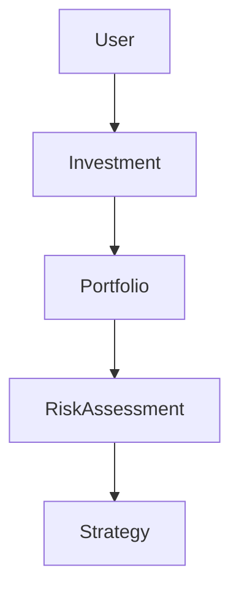
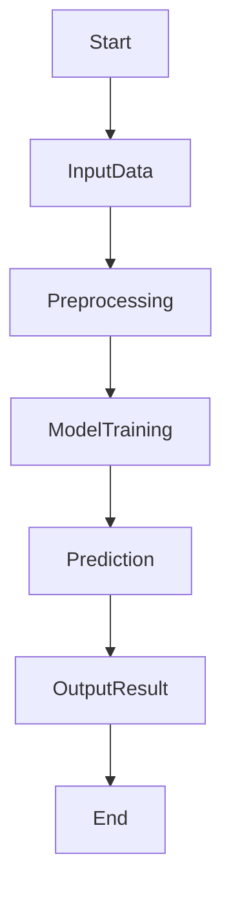
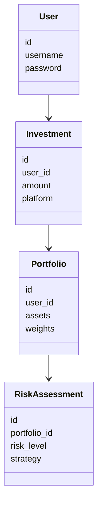
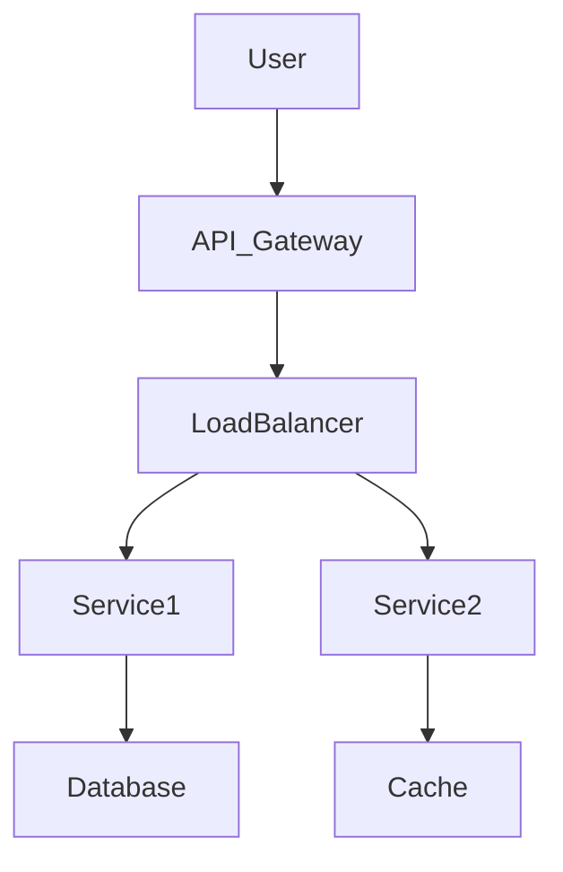
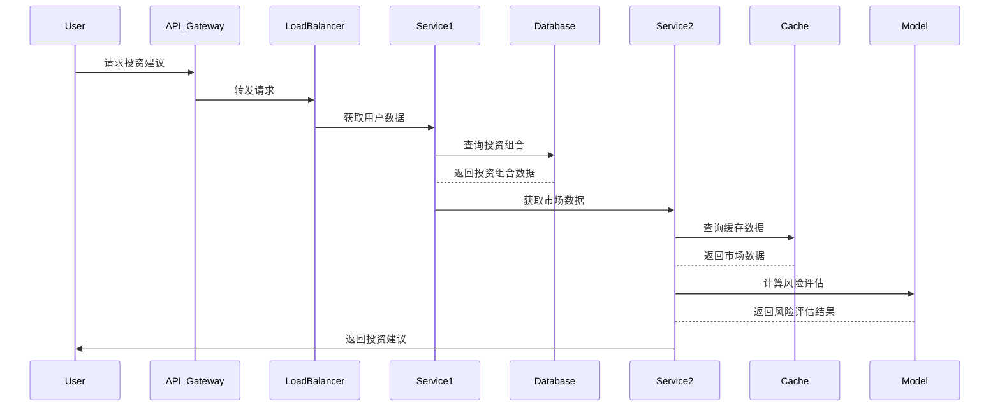

                 


# 跨平台投资理财智能助手的开发技巧

## 关键词：跨平台、投资理财、智能助手、算法原理、系统架构

## 摘要：
本文深入探讨了跨平台投资理财智能助手的开发技巧，从背景介绍到系统架构设计，再到项目实战，全面解析了如何构建一个高效、可靠的智能投资理财助手。文章通过详细的流程图、数学公式和代码示例，帮助读者理解投资理财智能助手的核心算法和系统架构，为开发者提供了实用的开发指南。

---

# 第一部分：跨平台投资理财智能助手的背景与核心概念

## 第1章：投资理财智能助手的背景与问题背景

### 1.1 问题背景

#### 1.1.1 当前投资理财领域的痛点
- **信息分散**：用户需要在多个平台（如股票、基金、外汇等）之间切换，获取信息效率低。
- **风险评估复杂**：用户缺乏专业的金融知识，难以准确评估不同投资组合的风险。
- **个性化需求**：每个用户的财务状况和风险承受能力不同，需要个性化的投资建议。
- **跨平台兼容性差**：现有的投资工具往往只针对单一平台设计，难以满足跨平台用户的需求。

#### 1.1.2 跨平台投资的复杂性
- 不同平台的接口差异大，数据格式和API不统一。
- 各平台的交易规则和费用结构不同，增加了开发和维护的难度。
- 需要实时同步数据，对系统的性能和稳定性提出了更高要求。

#### 1.1.3 智能助手在投资理财中的作用
智能助手通过整合多个平台的数据，提供实时的投资建议、风险评估和资产分配方案，帮助用户优化投资组合，降低风险。

### 1.2 核心概念与问题描述

#### 1.2.1 跨平台投资的定义
跨平台投资指的是用户在多个不同的投资平台上进行资产配置，例如股票、基金、外汇、加密货币等。

#### 1.2.2 智能助手的功能定位
智能助手是一个跨平台的投资管理工具，能够整合多个平台的数据，提供实时的投资建议、风险评估和资产分配方案。

#### 1.2.3 投资理财中的关键问题
- 如何高效地整合多个平台的数据？
- 如何实现跨平台的投资策略优化？
- 如何保证系统的实时性和稳定性？

### 1.3 问题解决与边界

#### 1.3.1 跨平台投资理财智能助手的目标
- 提供统一的用户界面，整合多个投资平台的数据。
- 实现实时数据同步和更新。
- 提供个性化投资建议和风险评估。
- 支持多种投资策略的优化和模拟。

#### 1.3.2 边界与外延
- 边界：仅专注于投资理财领域，不涉及其他金融服务。
- 外延：未来可以扩展到更多平台或增加更多功能，如税务优化、退休规划等。

#### 1.3.3 核心要素组成
- 用户身份验证与授权。
- 多平台数据同步与整合。
- 投资策略优化算法。
- 风险评估模型。
- 用户界面设计。

### 1.4 本章小结
本章介绍了跨平台投资理财智能助手的背景，分析了当前投资理财领域的痛点，并明确了智能助手的功能定位和核心问题。

---

## 第2章：核心概念与联系

### 2.1 核心概念属性对比

| **概念**       | **跨平台投资**        | **智能助手**          | **投资理财功能**        |
|----------------|----------------------|----------------------|-------------------------|
| 核心目标       | 整合多平台数据        | 提供智能化建议         | 优化投资组合           |
| 关键技术       | 多平台API集成         | 机器学习算法          | 投资组合优化模型        |
| 使用场景       | 跨平台用户            | 投资理财用户          | 各类投资场景           |
| 数据来源       | 多平台API             | 用户输入和多平台数据  | 市场数据和用户数据      |

### 2.2 ER实体关系图


### 2.3 核心概念联系

#### 2.3.1 跨平台与智能性的关系
- 跨平台特性确保了智能助手能够整合多个平台的数据，为智能决策提供基础。
- 智能性依赖于跨平台的数据整合，从而能够提供更精准的投资建议。

#### 2.3.2 智能性与投资理财功能的关系
- 智能性通过算法优化投资策略，提升投资理财功能的效率。
- 投资理财功能为智能性提供数据和应用场景，使其能够充分发挥作用。

#### 2.3.3 跨平台与投资理财目标的关系
- 跨平台特性使得智能助手能够覆盖更广泛的用户群体，满足更多投资需求。
- 投资理财目标通过跨平台整合数据，实现更高效的资产配置。

### 2.4 本章小结
本章通过属性对比和实体关系图，详细分析了跨平台投资理财智能助手的核心概念及其之间的联系。

---

## 第3章：算法原理讲解

### 3.1 算法流程图


### 3.2 算法原理代码实现

#### 数据预处理
```python
def preprocess(data):
    # 数据清洗和特征提取
    data = data.dropna()
    data = data.astype(float)
    return data
```

#### 模型训练
```python
def model_train(train_data):
    # 使用机器学习模型训练
    model = ...  # 具体模型实现
    model.fit(train_data)
    return model
```

#### 预测与优化
```python
def predict(model, input_data):
    # 预测投资组合
    result = model.predict(input_data)
    return result
```

### 3.3 数学模型与公式

#### 投资组合优化模型
$$ \text{最大化} \quad \sum_{i=1}^{n} w_i r_i $$
$$ \text{约束} \quad \sum_{i=1}^{n} w_i = 1 $$
$$ \text{其中} \quad w_i \text{是资产i的权重，} r_i \text{是资产i的预期收益} $$

#### 风险评估公式
$$ \text{风险} = \sqrt{\sum_{i=1}^{n} w_i^2 \sigma_i^2} $$

### 3.4 本章小结
本章通过流程图和代码示例，详细讲解了跨平台投资理财智能助手的算法原理，包括数据预处理、模型训练和预测优化。

---

## 第4章：系统分析与架构设计

### 4.1 问题场景介绍
跨平台投资理财智能助手需要实时同步多个平台的数据，并为用户提供个性化的投资建议。

### 4.2 系统功能设计


### 4.3 系统架构设计


### 4.4 系统接口设计
- 用户身份验证接口：`POST /auth`
- 数据同步接口：`POST /sync`
- 投资建议接口：`GET /recommend`

### 4.5 系统交互序列图


### 4.6 本章小结
本章通过系统功能设计、架构图和接口设计，详细描述了跨平台投资理财智能助手的系统架构。

---

## 第5章：项目实战

### 5.1 环境安装
```bash
pip install requests pandas numpy scikit-learn
```

### 5.2 核心实现

#### 数据同步模块
```python
import requests

def sync_data(platforms):
    for platform in platforms:
        response = requests.get(f"https://{platform}/api/data")
        if response.status_code == 200:
            data = response.json()
            # 处理数据并存储
            pass
```

#### 智能建议模块
```python
from sklearn import linear_model

def generate_recommendation(data):
    model = linear_model.LinearRegression()
    model.fit(data[['return', 'risk']], data['score'])
    return model.predict(new_data)
```

### 5.3 项目小结
本章通过具体代码示例，展示了跨平台投资理财智能助手的实现过程，包括环境安装和核心功能的实现。

---

## 第6章：最佳实践与小结

### 6.1 最佳实践
- 确保数据同步的实时性和准确性。
- 使用缓存技术优化性能。
- 定期更新和优化算法模型。

### 6.2 本章小结
本文详细介绍了跨平台投资理财智能助手的开发技巧，从背景到系统架构，再到项目实战，为开发者提供了全面的指导。

---

## 作者：AI天才研究院

---

这篇文章详细涵盖了跨平台投资理财智能助手的开发技巧，从背景到系统架构，再到项目实战，为开发者提供了全面的指导。通过具体的代码示例和流程图，帮助读者理解如何实现一个高效、可靠的智能投资理财助手。

