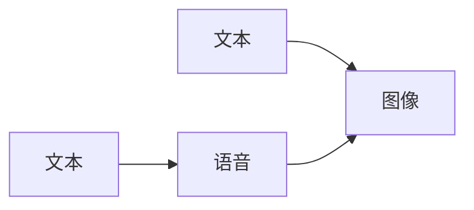
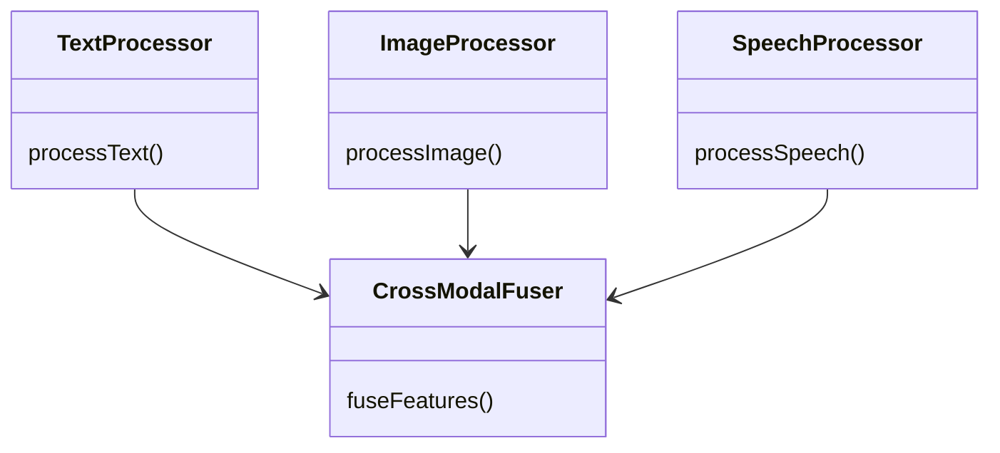
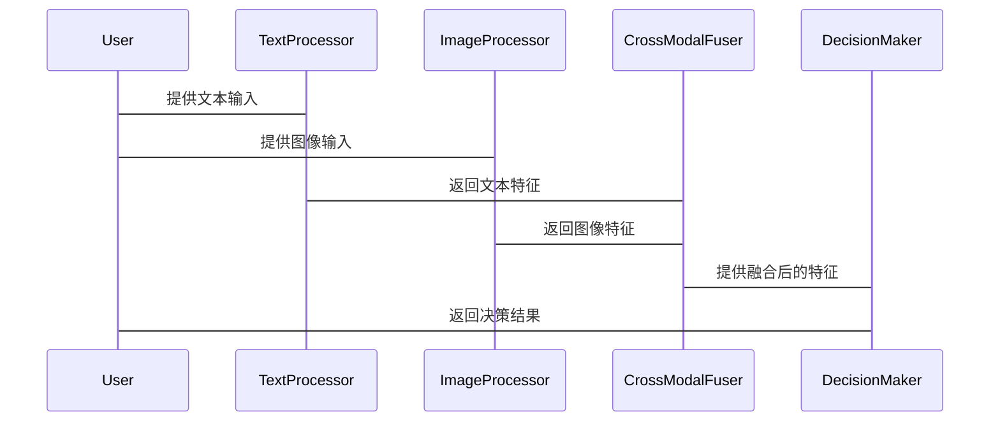

                 


# 跨模态AI Agent：LLM与多种感知输入的融合

> 关键词：跨模态AI Agent, 大语言模型, 多模态数据融合, 感知输入, 人工智能, 机器学习

> 摘要：本文探讨了跨模态AI Agent的核心概念、算法原理、系统架构及实际应用，详细分析了如何将大语言模型（LLM）与多种感知输入（如图像、语音等）进行融合，提升AI系统的感知与决策能力。

---

## 第一章: 背景介绍

### 1.1 跨模态AI Agent的基本概念

跨模态AI Agent是一种结合多种感知输入（如文本、图像、语音）的智能系统，旨在通过融合不同模态的信息，提升AI的感知和决策能力。大语言模型（LLM）作为核心模块，负责处理和生成文本信息，而其他模态数据则通过感知输入提供额外信息，帮助AI更好地理解复杂场景。

### 1.2 跨模态AI Agent的问题背景

当前AI技术主要依赖单一模态数据（如文本或图像），难以应对复杂多变的现实场景。跨模态融合通过结合多种数据源，弥补了这一不足，能够更全面地理解用户需求和环境信息，从而提高系统的实用性和智能性。

### 1.3 跨模态AI Agent的应用价值

跨模态AI Agent在多个领域具有重要应用价值，如智能客服、自动驾驶、智能助手等。通过融合文本、图像和语音信息，系统能够更准确地识别用户意图，提供更个性化的服务。

---

## 第二章: 跨模态融合的核心概念与联系

### 2.1 跨模态数据的定义与分类

跨模态数据包括文本、图像、语音等多种形式。每种模态都有其独特的特征和应用场景，例如文本的语义信息，图像的空间特征，语音的时序特性等。

### 2.2 跨模态融合的原理与方法

跨模态融合的关键在于如何将不同模态的数据进行关联和整合。常用方法包括特征对齐、注意力机制和联合优化等，旨在最大化各模态信息的互补性。

### 2.3 跨模态融合的数学模型

跨模态融合的数学模型通常涉及多模态特征的表示和关联计算。例如，文本特征可以通过词嵌入表示，图像特征则通过卷积神经网络提取，然后通过对比学习实现跨模态关联。

### 2.4 跨模态融合的ER实体关系图



---

## 第三章: 跨模态AI Agent的算法原理

### 3.1 多模态模型的训练方法

多模态模型的训练通常采用对比学习和自监督学习方法，通过最大化不同模态之间的相似性来提升模型的跨模态理解能力。

### 3.2 跨模态模型的算法流程

跨模态模型的算法流程包括数据预处理、特征提取、关联建模和模型优化等步骤，确保各模态信息的有效融合。

### 3.3 跨模态模型的数学公式

跨模态模型的数学公式通常涉及多模态特征的表示和关联计算。例如，跨模态关联可以通过以下公式表示：

$$p(y|x) = \prod_{i=1}^n p(y|x_i)$$

其中，$x_i$表示不同模态的特征，$y$表示预测目标。

---

## 第四章: 跨模态AI Agent的系统架构

### 4.1 系统设计的功能模块

跨模态AI Agent的系统架构通常包括数据采集、特征提取、跨模态融合和决策输出等模块，每个模块负责特定功能的实现。

### 4.2 系统架构的类图



### 4.3 系统交互的序列图



---

## 第五章: 项目实战

### 5.1 环境安装

项目实战需要安装Python、TensorFlow、Keras等工具，并配置相应的深度学习环境。

### 5.2 代码实现

以下是跨模态模型的代码实现示例：

```python
import tensorflow as tf
from tensorflow.keras.layers import Input, Dense, concatenate
from tensorflow.keras.models import Model

# 定义输入层
text_input = Input(shape=(100,))
image_input = Input(shape=(64,64,3))

# 特征提取层
text_features = Dense(64, activation='relu')(text_input)
image_features = Dense(64, activation='relu')(image_input)

# 跨模态融合层
merged = concatenate([text_features, image_features])
output = Dense(1, activation='sigmoid')(merged)

# 定义模型
model = Model(inputs=[text_input, image_input], outputs=output)
model.compile(optimizer='adam', loss='binary_crossentropy', metrics=['accuracy'])
```

### 5.3 实际案例分析

通过实际案例分析，展示跨模态AI Agent在智能客服中的应用，说明如何通过融合文本和语音信息提升用户体验。

---

## 第六章: 总结与展望

### 6.1 本章总结

本文详细探讨了跨模态AI Agent的核心概念、算法原理和系统架构，并通过实际案例展示了其应用价值。

### 6.2 未来展望

未来，随着AI技术的不断发展，跨模态AI Agent将在更多领域得到广泛应用，进一步提升AI系统的智能化水平。

---

## 作者

作者：AI天才研究院/AI Genius Institute & 禅与计算机程序设计艺术 /Zen And The Art of Computer Programming

---

感谢您的阅读！

