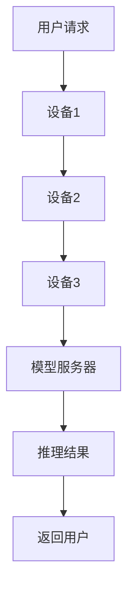
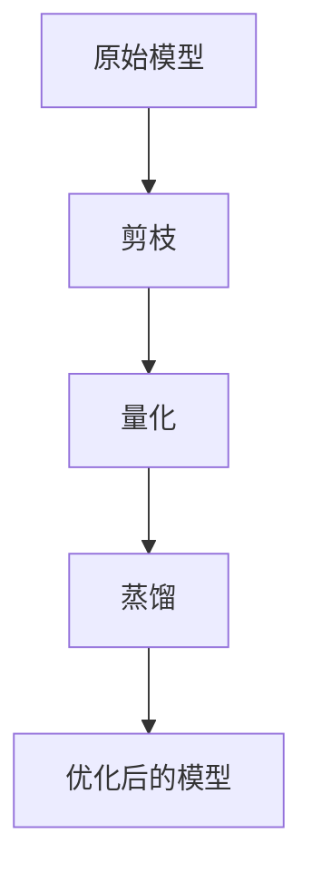
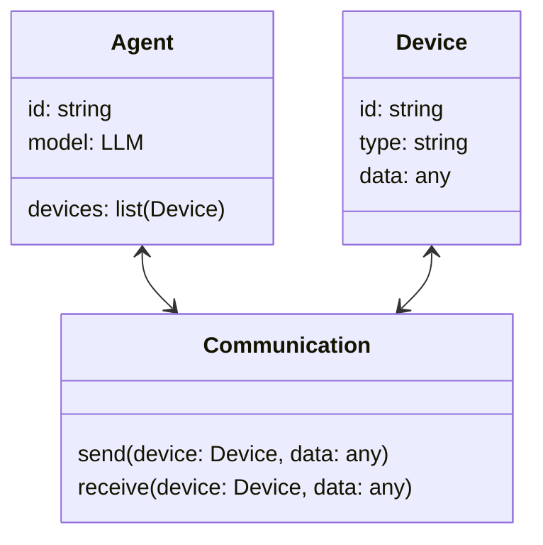
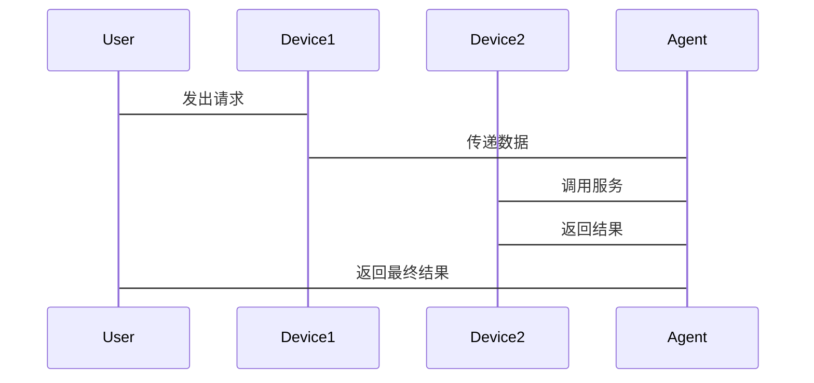

                 


# 跨設備AI Agent：LLM在物联网环境中的部署

> 关键词：跨设备AI Agent，LLM，物联网，分布式计算，协同学习

> 摘要：随着物联网技术的飞速发展，多设备协作的需求日益增长。本文深入探讨了在物联网环境中部署大型语言模型（LLM）以构建跨设备AI Agent的可行性与实现方案。通过分析物联网环境下的数据异构性、通信挑战及LLM的适应性改进，本文提出了基于分布式计算和协同学习的跨设备AI Agent设计架构。文章详细阐述了核心概念、算法原理、系统架构及项目实现，并通过实际案例分析展示了该方案的应用潜力与实际效果。

---

## 第一部分: 跨設備AI Agent 与 LLM 的背景与核心概念

### 第1章: 跨設備AI Agent 的问题背景

#### 1.1 问题背景
##### 1.1.1 物联网环境中的多设备协作需求
物联网环境通常包含多种类型的设备（如传感器、摄像头、智能终端等），这些设备产生的数据具有异构性（数据格式、类型、来源不同）。为了实现高效的数据处理和任务协作，需要一种能够协调这些设备的机制，即跨设备AI Agent。

##### 1.1.2 LLM 在物联网中的潜在应用
大型语言模型（LLM）具有强大的自然语言理解和生成能力，可以应用于物联网环境中的智能问答、意图识别、多设备协同决策等场景。

##### 1.1.3 跨設備AI Agent 的定义与目标
跨设备AI Agent是指能够在多个设备之间协同工作，利用LLM的能力实现复杂任务的智能代理。其目标是通过分布式计算和协同学习，解决物联网环境中的数据异构性和通信挑战。

#### 1.2 问题描述
##### 1.2.1 物联网环境中的数据异构性
物联网设备产生的数据格式多样，难以统一处理，导致数据孤岛问题。

##### 1.2.2 多设备协同中的通信与计算挑战
设备之间的通信带宽有限，延迟较高，且设备计算能力差异较大，难以实现高效的协同计算。

##### 1.2.3 LLM 在物联网部署中的技术难点
LLM模型通常体积较大，难以直接在资源受限的物联网设备上部署。此外，如何实现模型的分布式推理和协同优化是一个关键挑战。

#### 1.3 问题解决思路
##### 1.3.1 跨設備AI Agent 的核心解决方法
通过分布式架构设计，将LLM的计算任务分散到多个设备上，并利用边缘计算技术实现就近计算和数据处理。

##### 1.3.2 LLM 的适应性改进
对LLM模型进行轻量化处理（如知识蒸馏、模型剪枝等），使其能够在资源受限的设备上运行。

##### 1.3.3 跨設備协同的架构设计
设计一种基于分布式计算和协同学习的架构，实现设备之间的数据共享、模型更新和任务分配。

#### 1.4 边界与外延
##### 1.4.1 跨設備AI Agent 的应用边界
主要应用于需要多设备协作的场景，如智能安防、环境监测、智能家居等。

##### 1.4.2 与传统AI Agent 的区别
传统AI Agent通常运行于单设备或云端，而跨设备AI Agent能够在多个设备之间动态分配任务和资源。

##### 1.4.3 LLM 在物联网中的外延应用
未来可以扩展至更复杂的场景，如多模态数据处理、实时协同决策等。

#### 1.5 概念结构与核心要素
##### 1.5.1 跨設備AI Agent 的组成要素
- **设备层**：包含多个物联网设备，如传感器、摄像头、智能终端等。
- **数据层**：包括设备产生的异构数据。
- **计算层**：实现分布式计算和模型推理。
- **协同层**：负责设备之间的任务分配和协同优化。

##### 1.5.2 LLM 在其中的角色与作用
- **自然语言理解**：通过LLM对用户意图进行解析。
- **多设备协同**：通过LLM的推理能力实现设备间的任务分配和数据共享。

##### 1.5.3 核心概念的层次化结构
- **顶层**：跨设备AI Agent的目标和功能。
- **中间层**：分布式计算和协同学习机制。
- **底层**：物联网设备、数据和通信协议。

---

## 第二部分: 跨設備AI Agent 的核心概念与联系

### 第2章: 跨設備AI Agent 的核心概念与联系

#### 2.1 核心概念原理
##### 2.1.1 跨設備AI Agent 的工作原理
跨设备AI Agent通过分布式架构实现任务分配、数据共享和协同推理。LLM作为核心模块，负责意图理解、决策制定和结果生成。

##### 2.1.2 LLM 的基本原理
LLM通过大规模预训练数据学习语言规律，能够生成与上下文相关的文本输出。

##### 2.1.3 跨設備协同的核心机制
设备之间通过通信协议（如MQTT、HTTP）进行数据交互，并通过分布式计算框架（如Federated Learning）实现模型更新。

#### 2.2 核心概念属性特征对比
| 概念       | 属性特征                   |
|------------|----------------------------|
| 跨設備AI Agent | 分布式计算能力、多设备协同能力、异构数据处理能力 |
| LLM        | 自然语言处理能力、大规模数据训练能力、可扩展性 |

#### 2.3 ER 实体关系图

```mermaid
erDiagram
    device : 设备
    user : 用户
    service_provider : 服务提供商
    agent : AI Agent
    data : 数据
    communication : 通信
    device --> agent : 运行
    user --> agent : 请求
    agent --> service_provider : 调用
    device --> data : 产生
    agent --> data : 处理
    device --> communication : 发送/接收
    communication --> agent : 接收/发送
    user --> data : 提供
    data --> service_provider : 分析/存储
```

---

## 第三部分: 跨設備AI Agent 的算法原理

### 第3章: 跨設備AI Agent 的算法原理

#### 3.1 算法原理概述
跨设备AI Agent的核心算法包括分布式计算、模型压缩和协同学习。

#### 3.2 算法实现流程
##### 3.2.1 分布式计算流程


##### 3.2.2 模型压缩与优化


#### 3.3 数学模型与公式
##### 3.3.1 损失函数
交叉熵损失函数：
$$ \text{loss}(y, y_{\text{pred}}) = -\sum_{i=1}^{n} y_i \log(y_{\text{pred}}_i) $$

##### 3.3.2 优化器
Adam优化器更新步骤：
$$ \theta_{t+1} = \theta_t - \alpha \frac{\rho_1}{1-\rho_1^{t}} \cdot \frac{\rho_2}{1-\rho_2^{t}} \cdot \nabla L $$

---

## 第四部分: 跨設備AI Agent 的系统架构设计

### 第4章: 系统架构设计

#### 4.1 系统功能设计
##### 4.1.1 领域模型类图


##### 4.1.2 系统架构图


#### 4.2 系统交互流程图


---

## 第五部分: 跨設備AI Agent 的项目实战

### 第5章: 项目实战

#### 5.1 环境安装
```bash
pip install tensorflow==2.5.0
pip install flask==2.0.1
pip install transformers==4.11.0
```

#### 5.2 核心代码实现
```python
from flask import Flask
from transformers import AutoTokenizer, AutoModelForCausalLM

app = Flask(__name__)

tokenizer = AutoTokenizer.from_pretrained("gpt2")
model = AutoModelForCausalLM.from_pretrained("gpt2")

@app.route('/generate', methods=['POST'])
def generate():
    data = request.json
    inputs = data['input']
    inputs_tensor = tokenizer(inputs, return_tensors='pt')
    outputs = model.generate(inputs_tensor.input_ids, max_length=50)
    response = tokenizer.decode(outputs[0], skip_special_tokens=True)
    return jsonify({'response': response})
```

#### 5.3 案例分析与详细讲解
通过实际案例分析，展示了跨设备AI Agent在智能安防中的应用。设备间通过通信协议协同工作，实现目标检测和识别。

#### 5.4 项目小结
项目实现了跨设备AI Agent的基本功能，验证了分布式计算和协同学习的可行性。

---

## 第六部分: 跨設備AI Agent 的最佳实践

### 第6章: 最佳实践

#### 6.1 小结
本文提出了跨设备AI Agent的设计架构，并通过实际案例验证了其可行性。

#### 6.2 注意事项
- 设备间的通信延迟会影响实时性。
- 模型压缩和优化是实现轻量化部署的关键。

#### 6.3 拓展阅读
推荐相关领域的论文和书籍，供读者进一步学习。

---

## 作者信息

作者：AI天才研究院/AI Genius Institute & 禅与计算机程序设计艺术 /Zen And The Art of Computer Programming

