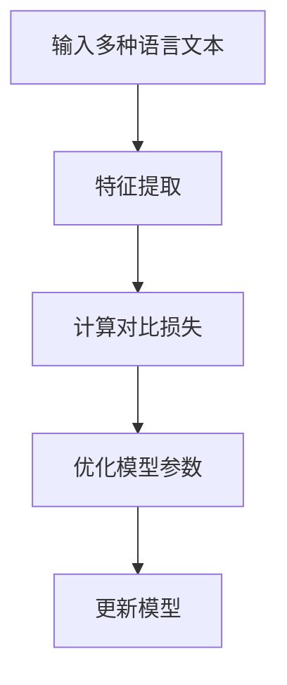
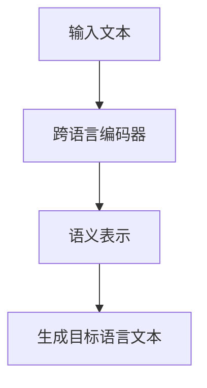
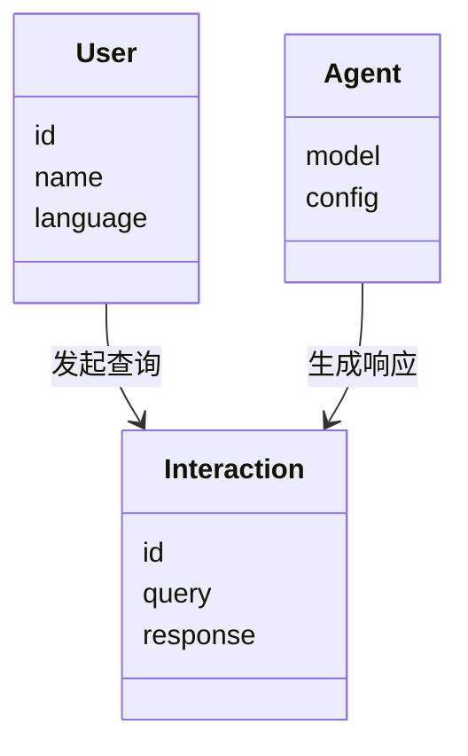
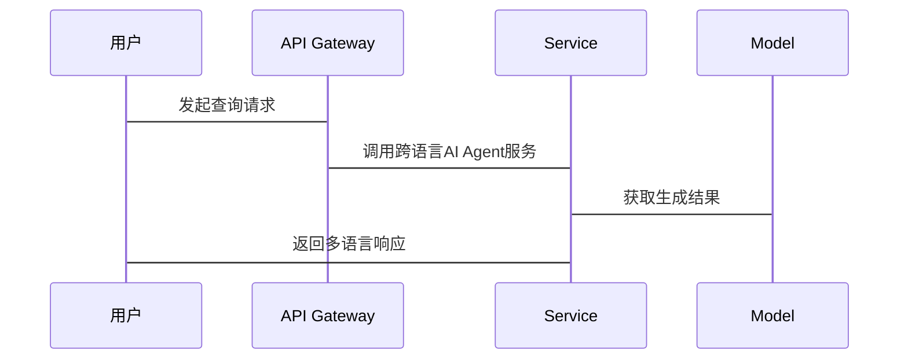

                 


# 跨语言AI Agent：突破语言障碍的智能助手

> 关键词：跨语言AI Agent, 多语言模型, 跨语言迁移学习, 跨语言表示学习, 多语言智能助手, 语言障碍解决方案

> 摘要：本文深入探讨了跨语言AI Agent的核心概念、技术原理、系统架构及实际应用。通过详细分析多语言模型的工作原理，结合具体的算法实现和项目实战，展示了如何突破语言障碍，构建智能化的多语言助手系统。

---

# 第一部分: 跨语言AI Agent的背景与核心概念

## 第1章: 跨语言AI Agent的背景与问题描述

### 1.1 跨语言AI Agent的定义与背景

#### 1.1.1 语言障碍的现状与挑战
在当前全球化背景下，语言障碍已成为跨文化交流和商业合作的主要障碍之一。传统的单语言AI模型无法满足多语言环境下的需求，用户在不同语言间切换时，往往需要手动调整工具或依赖人工翻译，效率低下且体验不佳。

#### 1.1.2 跨语言AI Agent的定义
跨语言AI Agent是一种能够理解和生成多种语言的智能助手，它通过跨语言技术，将多种语言信息进行统一表示和处理，从而实现跨语言的交互和理解。

#### 1.1.3 跨语言AI Agent的核心目标
- 提供多语言支持，实现跨语言交互
- 消除语言障碍，提升用户体验
- 支持全球化应用，适应不同语言环境

### 1.2 跨语言AI Agent的问题背景

#### 1.2.1 当前多语言交流的主要问题
- 不同语言间的语义差异难以统一处理
- 单语言模型无法适应多语言场景
- 跨语言数据的稀缺性和不均衡性

#### 1.2.2 跨语言AI Agent的应用场景
- 全球化客户服务
- 多语言内容生成
- 跨语言信息检索与分析

#### 1.2.3 跨语言AI Agent的技术难点
- 多语言模型的训练与优化
- 跨语言语义理解与生成
- 跨语言数据的高效处理与表示

---

## 第2章: 跨语言AI Agent的核心概念与联系

### 2.1 跨语言AI Agent的核心概念

#### 2.1.1 多语言模型的基本原理
多语言模型通过共享语言间的语义信息，实现对多种语言的统一理解和生成。其核心在于构建一个能够同时处理多种语言的模型架构，如多语言BERT（mBERT）。

#### 2.1.2 跨语言迁移学习的定义
跨语言迁移学习是指在一种语言上训练好的模型，能够迁移到另一种语言上的技术。其关键在于利用跨语言的共享特征，减少对目标语言数据的依赖。

#### 2.1.3 跨语言表示学习的原理
跨语言表示学习通过将不同语言的文本映射到共享的语义空间中，实现语言间的语义对齐。常用的技术包括对比学习和跨语言预训练。

### 2.2 跨语言AI Agent的核心要素

#### 2.2.1 多语言模型的输入输出结构
- 输入：多种语言的文本或语音
- 输出：多种语言的文本或语音

#### 2.2.2 跨语言理解与生成的模块划分
- 理解模块：跨语言编码器，用于提取文本的语义表示
- 生成模块：跨语言解码器，用于生成目标语言的文本

#### 2.2.3 跨语言迁移的特征提取机制
- 特征提取：利用跨语言的共享特征，实现不同语言间的语义对齐

### 2.3 跨语言AI Agent的概念属性特征对比表

| 特性         | 跨语言AI Agent                  | 单语言AI Agent                  |
|--------------|---------------------------------|---------------------------------|
| 输入         | 支持多语言输入                 | 仅支持单一语言输入              |
| 输出         | 支持多语言输出                 | 仅支持单一语言输出              |
| 模型结构     | 共用一个跨语言表示层           | 每语言独立模型                 |
| 训练数据     | 跨语言训练数据                 | 单一语言训练数据               |
| 应用场景     | 全球化服务、多语言客服         | 本地化服务、单一语言场景       |

### 2.4 跨语言AI Agent的ER实体关系图

```mermaid
erDiagram
    user {
        id
        name
        language
    }
    agent {
        id
        model_version
        training_data
    }
    interaction {
        id
        user_id
        query
        response
        timestamp
    }
    user -|> interaction: 发起交互
    agent -|> interaction: 处理交互
```

---

# 第三部分: 跨语言AI Agent的算法原理

## 第3章: 跨语言AI Agent的核心算法与实现

### 3.1 跨语言迁移学习的算法原理

#### 3.1.1 对比学习原理
对比学习通过最大化相似样本的相似性，最小化不相似样本的相似性，实现跨语言的语义对齐。

#### 3.1.2 跨语言预训练
跨语言预训练通过对多种语言文本的联合训练，构建跨语言的语义表示。

#### 3.1.3 对比学习的数学模型
$$ \text{损失函数} = \log\left(\frac{1}{1 + e^{-d_{ij}}}\right) $$
其中，$d_{ij}$ 是样本 $i$ 和 $j$ 的相似度。

#### 3.1.4 跨语言预训练的实现流程



### 3.2 多语言模型的实现与优化

#### 3.2.1 多语言模型的结构设计



#### 3.2.2 跨语言模型的训练策略

```python
def contrastive_loss(x1, x2, y):
    # x1: 源语言特征向量
    # x2: 目标语言特征向量
    # y: 标签
    similarity = torch.cosine_similarity(x1, x2)
    loss = -torch.mean(torch.log(torch.sigmoid(similarity * y + (1 - y) * (1 - similarity))))
    return loss
```

---

## 第4章: 跨语言AI Agent的系统架构与实现

### 4.1 系统分析与设计

#### 4.1.1 问题场景介绍
用户需要一个能够支持多种语言的智能助手，实现跨语言的交互和理解。

#### 4.1.2 系统功能设计



#### 4.1.3 系统架构设计


#### 4.1.4 系统接口设计



---

## 第5章: 跨语言AI Agent的项目实战

### 5.1 环境安装与配置

#### 5.1.1 安装依赖
```bash
pip install transformers torch
```

#### 5.1.2 环境配置
```bash
export PYTHONPATH=$PYTHONPATH:./
```

### 5.2 核心代码实现

#### 5.2.1 对比学习模型实现

```python
class ContrastiveModel(torch.nn.Module):
    def __init__(self, encoder, decoder):
        super().__init__()
        self.encoder = encoder
        self.decoder = decoder

    def forward(self, x1, x2):
        h1 = self.encoder(x1)
        h2 = self.encoder(x2)
        similarity = torch.cosine_similarity(h1, h2)
        return similarity
```

#### 5.2.2 跨语言模型训练

```python
def train(model, optimizer, criterion, dataloader, epochs):
    for epoch in range(epochs):
        for batch in dataloader:
            optimizer.zero_grad()
            x1, x2, y = batch['x1'], batch['x2'], batch['y']
            output = model(x1, x2)
            loss = criterion(output, y)
            loss.backward()
            optimizer.step()
```

### 5.3 实际案例分析与解读

#### 5.3.1 案例分析
假设用户输入中文查询：“今天天气如何？” AI Agent需要生成英文响应：“How's the weather today?”

#### 5.3.2 代码实现
```python
def query_agent(agent_model, input_text, target_language):
    with torch.no_grad():
        inputs = tokenizer(input_text, return_tensors='pt')
        outputs = agent_model.generate(inputs.input_ids, max_length=50)
        response = tokenizer.decode(outputs[0], skip_special_tokens=True)
        return response
```

### 5.4 项目小结

---

## 第6章: 跨语言AI Agent的最佳实践

### 6.1 小结与总结

跨语言AI Agent通过突破语言障碍，为全球化服务提供了新的可能性。其核心在于多语言模型的构建和跨语言迁移学习的应用。

### 6.2 注意事项与建议

- 确保模型的跨语言能力
- 处理好语言间的语义差异
- 优化模型的训练效率

### 6.3 拓展阅读与学习

- 《多语言模型的构建与优化》
- 《跨语言迁移学习的最新进展》

---

作者：AI天才研究院/AI Genius Institute & 禅与计算机程序设计艺术 /Zen And The Art of Computer Programming

