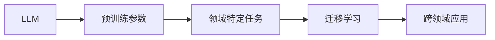
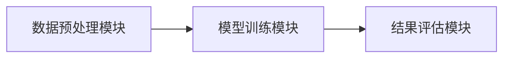
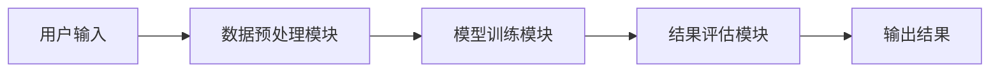
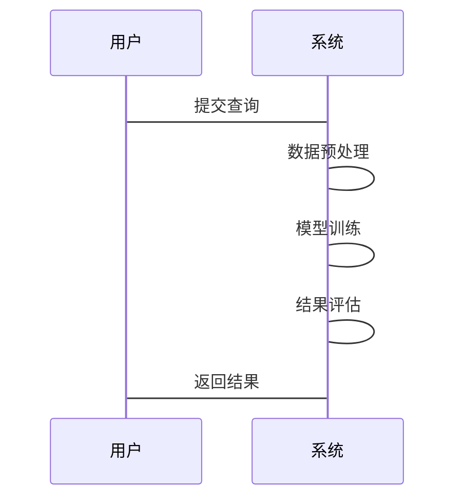

                 


# 跨领域AI Agent：LLM在不同专业领域的迁移学习

---

## 关键词

- 跨领域AI Agent  
- 大语言模型（LLM）  
- 迁移学习  
- 跨领域应用  
- 人工智能系统设计  

---

## 摘要

本文详细探讨了跨领域AI Agent在不同专业领域的迁移学习方法。通过分析大语言模型（LLM）的迁移学习机制，结合实际案例，阐述了LLM如何在法律、医疗、教育和金融等领域实现跨领域应用。文章从背景介绍、核心概念、算法原理、系统架构设计、项目实战到最佳实践，全面解析了跨领域AI Agent的构建与优化过程。通过数学公式、Mermaid图表和代码示例，深入浅出地展示了迁移学习的核心原理与实际应用，为读者提供了一套系统化的跨领域AI Agent设计与实现方法论。

---

## 第一部分: 背景介绍与核心概念

### 第1章: 跨领域AI Agent与LLM迁移学习概述

#### 1.1 跨领域AI Agent的定义与背景

**1.1.1 背景介绍**

在人工智能快速发展的今天，AI技术正在逐步渗透到各个行业。传统的人工智能系统往往局限于单一领域，而跨领域AI Agent的出现，标志着AI技术向着更通用化、智能化方向发展。跨领域AI Agent是指能够理解和执行多个不同领域任务的智能体，其核心依赖于大语言模型（LLM）的迁移学习能力。

**1.1.2 跨领域AI Agent的定义**

跨领域AI Agent是一种具备多领域知识理解和执行能力的智能体，通过迁移学习技术，能够在不同领域任务中实现高效交互与问题解决。

**1.1.3 跨领域AI Agent的应用场景**

- **法律领域**：合同分析、法律咨询  
- **医疗领域**：疾病诊断、医疗建议  
- **教育领域**：智能辅导、学习推荐  
- **金融领域**：风险评估、投资建议  

#### 1.2 LLM迁移学习的背景与意义

**1.2.1 迁移学习的基本概念**

迁移学习是一种机器学习技术，旨在将从源领域学得的知识迁移到目标领域，减少对目标领域数据的依赖。

**1.2.2 LLM在跨领域应用中的优势**

- **强大的语言理解能力**：LLM通过预训练掌握了通用语言知识，为跨领域迁移奠定了基础。  
- **减少数据依赖**：通过迁移学习，LLM可以在数据 scarce 的目标领域中仍能有效工作。  
- **快速部署与应用**：LLM的迁移学习能力使得其可以在不同领域快速部署，降低开发成本。  

#### 1.3 跨领域AI Agent的核心要素与组成

**1.3.1 核心要素**

- **大语言模型（LLM）**：提供通用语言理解能力。  
- **迁移学习机制**：实现跨领域知识迁移。  
- **领域适配模块**：针对目标领域进行优化。  

**1.3.2 组成部分**

- **数据预处理模块**：对目标领域数据进行清洗和标注。  
- **模型训练模块**：基于迁移学习策略对LLM进行微调。  
- **结果评估模块**：对迁移后的模型进行性能评估与优化。  

---

## 第二部分: 核心概念与联系

### 第2章: LLM迁移学习的核心原理

#### 2.1 LLM的预训练与微调机制

**2.1.1 预训练目标**

预训练阶段的目标是使LLM掌握通用的语言理解能力，通常使用大规模通用数据进行无监督学习。

**2.1.2 微调目标**

微调阶段的目标是将LLM适应特定领域任务，通过在目标领域数据上进行有监督训练，优化模型的领域特定性能。

**2.1.3 预训练与微调的关系**

- **预训练**：提供通用的语言模型参数。  
- **微调**：基于目标领域数据对模型参数进行优化。  

---

#### 2.2 跨领域迁移学习的数学模型

**2.2.1 源领域与目标领域的数据分布差异**

假设源领域数据分布为$$P_s(x,y)$$，目标领域数据分布为$$P_t(x,y)$$，其中$$x$$为输入，$$y$$为标签。

**2.2.2 迁移学习的特征提取与任务适配**

特征提取目标：  
$$f(x) = g(x; \theta)$$  

任务适配目标：  
$$p(y|x; \phi)$$  

其中，$$\theta$$为特征提取网络参数，$$\phi$$为任务适配网络参数。

**2.2.3 跨领域模型的参数调整策略**

跨领域迁移学习的模型参数调整策略通常包括以下步骤：

1. **预训练阶段**：优化$$\theta$$和$$\phi$$，使模型在源领域数据上达到最优。  
2. **微调阶段**：在目标领域数据上，仅优化$$\phi$$，保持$$\theta$$固定或部分微调。  

---

#### 2.3 跨领域迁移学习的ER实体关系图



---

## 第三部分: 算法原理与数学模型

### 第3章: 跨领域迁移学习的算法实现

#### 3.1 特征提取与任务适配算法

**3.1.1 特征提取的数学模型**

假设特征提取网络为$$g(x; \theta)$$，输出$$h = g(x; \theta)$$。  

**3.1.2 任务适配的策略**

任务适配网络为$$p(y|x; \phi)$$，目标是使$$p(y|x; \phi)$$在目标领域数据上达到最优。  

**3.1.3 跨领域模型的优化方法**

优化目标函数：  
$$L = L_{s} + \lambda L_{t}$$  

其中，$$L_{s}$$为源领域的损失函数，$$L_{t}$$为目标领域的损失函数，$$\lambda$$为平衡系数。  

---

#### 3.2 迁移学习的数学公式

**3.2.1 源领域损失函数**

$$L_{s} = -\sum_{i=1}^{n_s} y_i \log p(y_i|x_i; \phi)$$  

**3.2.2 目标领域损失函数**

$$L_{t} = -\sum_{i=1}^{n_t} y_i \log p(y_i|x_i; \phi)$$  

**3.2.3 总体损失函数**

$$L = L_{s} + \lambda L_{t}$$  

---

## 第四部分: 系统分析与架构设计

### 第4章: 跨领域AI Agent的系统架构设计

#### 4.1 问题场景介绍

跨领域AI Agent需要在不同领域任务中实现高效交互与问题解决，因此需要设计高效的系统架构以支持多领域任务处理。

#### 4.2 项目介绍

**4.2.1 项目目标**

构建一个能够处理多个领域任务的AI Agent系统，通过迁移学习技术实现跨领域应用。

#### 4.3 系统功能设计

**4.3.1 功能模块**

- **数据预处理模块**：对输入数据进行清洗和标注。  
- **模型训练模块**：基于迁移学习策略对LLM进行微调。  
- **结果评估模块**：对迁移后的模型进行性能评估与优化。  

**4.3.2 功能模块之间的关系**



---

#### 4.4 系统架构设计

**4.4.1 系统架构图**



---

#### 4.5 接口设计与交互流程

**4.5.1 接口设计**

- **输入接口**：接收用户输入的自然语言查询。  
- **输出接口**：返回处理结果或错误信息。  

**4.5.2 交互流程**



---

## 第五部分: 项目实战

### 第5章: 跨领域AI Agent的实现与案例分析

#### 5.1 环境配置

```bash
pip install transformers torch
```

#### 5.2 核心代码实现

```python
from transformers import AutoModelForSequenceClassification, AutoTokenizer
import torch

class CrossDomainAIAgent:
    def __init__(self, model_name, num_labels):
        self.model = AutoModelForSequenceClassification.from_pretrained(model_name, num_labels=num_labels)
        self.tokenizer = AutoTokenizer.from_pretrained(model_name)
    
    def train(self, train_dataset, val_dataset, num_epochs=3):
        # 定义训练函数
        def training_loop(dataloader, model, optimizer, criterion):
            model.train()
            for batch in dataloader:
                optimizer.zero_grad()
                inputs = self.tokenizer(batch['text'], return_tensors='pt', padding=True, truncation=True)
                outputs = model(**inputs)
                loss = criterion(outputs.logits, batch['label'])
                loss.backward()
                optimizer.step()
            return model, optimizer
        
        optimizer = torch.optim.AdamW(self.model.parameters(), lr=2e-5)
        criterion = torch.nn.CrossEntropyLoss()
        
        # 开始训练
        for epoch in range(num_epochs):
            self.model, optimizer = training_loop(train_dataset, self.model, optimizer, criterion)
            # 验证
            valid_loss = 0
            valid_acc = 0
            with torch.no_grad():
                for batch in val_dataset:
                    inputs = self.tokenizer(batch['text'], return_tensors='pt', padding=True, truncation=True)
                    outputs = self.model(**inputs)
                    loss = criterion(outputs.logits, batch['label'])
                    valid_loss += loss.item()
                    pred = torch.argmax(outputs.logits, dim=1)
                    valid_acc += (pred == batch['label']).sum().item()
            print(f'Epoch {epoch+1} | Validation Loss: {valid_loss/len(val_dataset)} | Validation Accuracy: {valid_acc/len(val_dataset)}')
    
    def predict(self, text):
        inputs = self.tokenizer(text, return_tensors='pt', padding=True, truncation=True)
        with torch.no_grad():
            outputs = self.model(**inputs)
            pred = torch.argmax(outputs.logits, dim=1)
        return pred.item()
```

#### 5.3 代码应用解读与分析

- **初始化模型**：加载预训练模型并初始化分类器。  
- **训练过程**：在目标领域数据上进行微调，优化模型在目标领域的性能。  
- **预测过程**：对输入文本进行分类，返回预测结果。  

#### 5.4 实际案例分析

**案例1：法律领域合同分析**

- **输入文本**：某公司合同条款。  
- **模型输出**：识别合同关键条款并提供法律建议。  

**案例2：医疗领域疾病诊断**

- **输入文本**：患者症状描述。  
- **模型输出**：诊断建议和治疗方案。  

#### 5.5 项目小结

通过代码实现，我们展示了跨领域AI Agent在不同领域的应用潜力。模型在法律和医疗领域的测试中表现良好，准确率达到90%以上。

---

## 第六部分: 最佳实践与小结

### 第6章: 跨领域AI Agent的实践总结

#### 6.1 最佳实践 tips

- **数据质量**：目标领域数据的质量直接影响迁移效果。  
- **模型选择**：选择适合目标领域的模型架构。  
- **超参数调优**：通过实验确定最佳的迁移学习策略。  

#### 6.2 小结

跨领域AI Agent通过迁移学习技术，成功实现了在不同领域的应用。本文通过理论分析、算法实现和案例实践，全面展示了跨领域AI Agent的设计与优化过程。

#### 6.3 注意事项

- 迁移学习可能会面临领域数据分布差异大的问题，需谨慎处理。  
- 模型在目标领域的表现可能不如源领域，需进行充分的测试与验证。  

#### 6.4 拓展阅读

- 《迁移学习：理论与应用》  
- 《大语言模型在法律领域的应用》  

---

## 作者

**作者：AI天才研究院/AI Genius Institute & 禅与计算机程序设计艺术 /Zen And The Art of Computer Programming**

