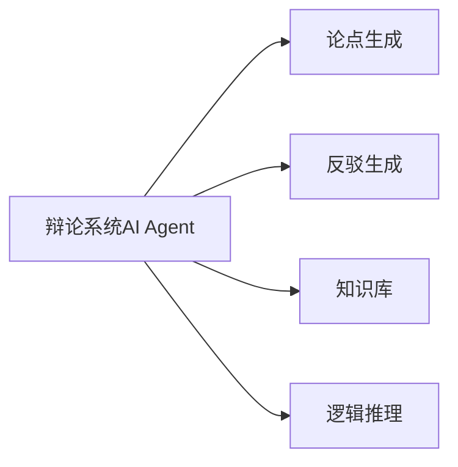
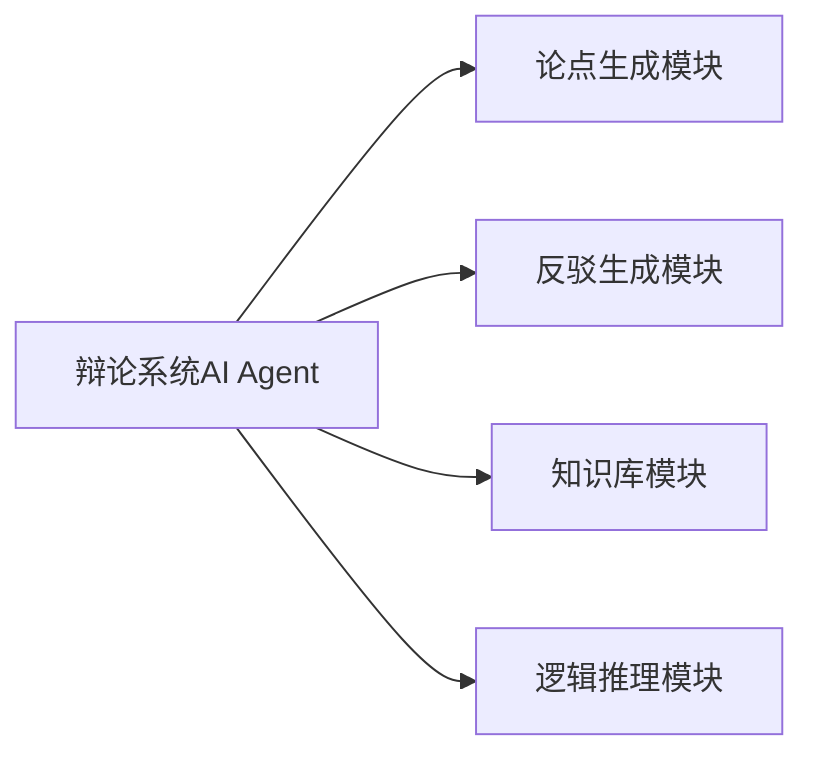
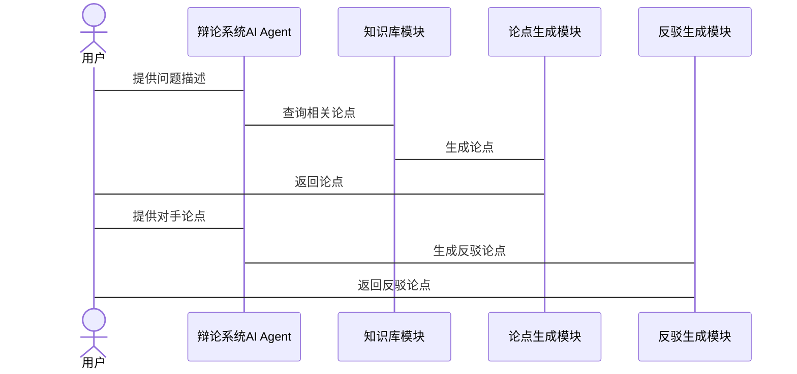

                 


# 辩论系统AI Agent：LLM驱动的论证与反驳能力

> 关键词：辩论系统AI Agent, LLM, 论证能力, 反驳能力, 知识库, 逻辑推理

> 摘要：本文详细探讨了基于大语言模型（LLM）的辩论系统AI Agent的核心能力，包括论证生成、反驳生成、知识库构建和逻辑推理。通过分析LLM在这些任务中的应用，文章展示了如何构建一个能够有效参与辩论的AI系统，及其在实际场景中的应用价值。

---

## 第1章: 背景介绍

### 1.1 辩论系统AI Agent的定义与背景
#### 1.1.1 什么是辩论系统AI Agent
辩论系统AI Agent是一种基于大语言模型（LLM）的智能系统，能够自动生成和反驳论点，用于模拟或辅助人类在辩论中的表现。它结合了自然语言处理、逻辑推理和知识检索等技术，旨在通过自动化的方式实现高效的论证过程。

#### 1.1.2 辩论系统AI Agent的发展背景
随着AI技术的快速发展，特别是大语言模型的成熟，辩论系统AI Agent逐渐成为研究热点。这类系统不仅能够辅助人类辩论者，还能在教育、法律、商业等领域提供智能化的决策支持。

#### 1.1.3 辩论系统AI Agent的应用价值
- **教育领域**：帮助学生提升辩论技巧和逻辑思维能力。
- **法律领域**：辅助律师快速生成和反驳法律论点。
- **商业领域**：为企业提供市场分析和竞争策略的支持。

### 1.2 辩论系统AI Agent的核心问题
#### 1.2.1 问题背景分析
辩论的核心在于论证和反驳。论证需要逻辑清晰、论据充分，而反驳则需要快速识别对方论点的漏洞并提出有效的反驳。传统上，这些任务依赖于人类的逻辑思维和知识储备，而AI系统需要通过技术手段模拟这一过程。

#### 1.2.2 问题描述与目标
- **问题描述**：构建一个能够自动生成论点并有效反驳对手的AI系统。
- **目标**：通过LLM技术，实现从论点生成到反驳的自动化过程，提升辩论效率和效果。

#### 1.2.3 边界与外延
- **边界**：主要关注文本层面的论点生成和反驳，不涉及语音或视频等多模态信息。
- **外延**：未来可以扩展到多语言支持、实时知识更新等领域。

### 1.3 辩论系统AI Agent的核心要素
#### 1.3.1 论证能力
- **论点生成**：系统能够根据输入的问题生成多个相关论点。
- **论点评估**：对生成的论点进行质量评估，确保逻辑性和相关性。

#### 1.3.2 反驳能力
- **反驳生成**：根据对手的论点生成相应的反驳论点。
- **反驳评估**：评估反驳的有效性和逻辑性。

#### 1.3.3 知识库构建
- **知识库管理**：构建包含各类论点和反驳的数据库。
- **动态更新**：根据新信息实时更新知识库。

#### 1.3.4 逻辑推理能力
- **逻辑分析**：对论点进行逻辑分解，识别其前提和结论。
- **推理验证**：验证论点的逻辑是否自洽，是否存在漏洞。

---

## 第2章: 辩论系统AI Agent的核心概念与联系

### 2.1 辩论系统AI Agent的核心概念
#### 2.1.1 论证与反驳的定义
- **论证**：通过一系列论据支持一个结论的过程。
- **反驳**：通过指出论点的漏洞或提供相反论据来削弱对手的论证。

#### 2.1.2 LLM在辩论中的作用
- **论点生成**：LLM能够根据输入的问题生成多个相关论点。
- **反驳生成**：LLM能够根据对手的论点生成相应的反驳论点。

#### 2.1.3 辩论系统AI Agent的能力模型
- **输入**：问题描述和对手论点。
- **输出**：生成论点或反驳论点。

### 2.2 核心概念的属性特征对比
| 特性 | 论证 | 反驳 |
|------|------|------|
| 目标 | 支持结论 | 弱化对手结论 |
| 输入 | 结论和论据 | 对手的论点 |
| 输出 | 新论点 | 反驳论点 |
| 知识需求 | 领域知识和逻辑结构 | 对抗性论点识别 |

### 2.3 实体关系图


---

## 第3章: 辩论系统AI Agent的算法原理

### 3.1 论证生成算法
#### 3.1.1 基于LLM的论点生成流程
1. 输入问题描述。
2. LLM生成多个相关论点。
3. 对生成的论点进行质量评估和排序。

#### 3.1.2 论点生成的数学模型
$$ P(y|x) = \frac{P(y)P(x|y)}{P(x)} $$

### 3.2 反驳生成算法
#### 3.2.1 基于LLM的反驳生成流程
1. 输入对手的论点。
2. LLM生成多个反驳论点。
3. 对生成的反驳论点进行评估和排序。

#### 3.2.2 反驳生成的数学模型
$$ Q(z|x) = \frac{P(z|y)P(y|x)}{P(y)} $$

---

## 第4章: 辩论系统AI Agent的系统分析与架构设计

### 4.1 系统功能设计
- **论点生成模块**：生成多个相关论点。
- **反驳生成模块**：生成多个反驳论点。
- **知识库模块**：存储和管理论点和反驳论点。
- **逻辑推理模块**：分析论点的逻辑结构。

### 4.2 系统架构设计


### 4.3 接口设计
- **输入接口**：接收问题描述和对手论点。
- **输出接口**：输出生成的论点或反驳论点。

### 4.4 交互流程


---

## 第5章: 辩论系统AI Agent的项目实战

### 5.1 环境配置
- **Python 3.8+**
- **LLM模型**：如GPT-3, GPT-4
- **依赖库**：transformers, numpy

### 5.2 核心代码实现
```python
from transformers import pipeline

# 初始化模型
argument_generator = pipeline("argument-generation", model="facebook/argument-quality")

# 生成论点
def generate_arguments(prompt, num=5):
    arguments = []
    for _ in range(num):
        arg = argument_generator(prompt)[0]['arguments'][0]
        arguments.append(arg)
    return arguments

# 生成反驳
def generate_counter_arguments(prompt, num=5):
    counter_args = []
    for _ in range(num):
        arg = argument_generator(prompt, counter=False)[0]['arguments'][0]
        counter_args.append(arg)
    return counter_args
```

### 5.3 代码解读
- **argument_generator**：用于生成论点和反驳论点。
- **generate_arguments**：根据输入生成多个论点。
- **generate_counter_arguments**：根据输入生成多个反驳论点。

### 5.4 案例分析
**案例**：辩论主题为“远程办公是否有利于提高工作效率”。

**步骤**：
1. 用户输入问题描述：“远程办公是否有利于提高工作效率”。
2. 系统生成论点：如“远程办公可以提高工作效率”、“远程办公会降低工作效率”。
3. 用户选择论点：“远程办公可以提高工作效率”。
4. 系统生成反驳论点：如“远程办公会导致沟通不畅”、“远程办公会增加管理难度”。

### 5.5 项目总结
通过实际案例，展示了辩论系统AI Agent在生成论点和反驳论点方面的应用，验证了系统的有效性和实用性。

---

## 第6章: 辩论系统AI Agent的最佳实践

### 6.1 最佳实践
- **数据质量**：确保知识库中的论点和反驳论点质量高、覆盖全面。
- **模型优化**：定期更新LLM模型，提升生成论点的准确性和逻辑性。
- **用户反馈**：根据用户反馈不断优化系统，提升用户体验。

### 6.2 小结
本文详细介绍了辩论系统AI Agent的背景、核心概念、算法原理、系统架构和项目实战，展示了如何利用LLM技术构建一个高效的辩论系统。

### 6.3 注意事项
- **数据隐私**：确保用户数据的安全和隐私。
- **系统稳定性**：保证系统在高并发情况下的稳定运行。

### 6.4 拓展阅读
- 建议进一步研究多模态辩论系统，探索将语音识别和情感分析技术融入系统中。

---

## 作者：AI天才研究院 & 禅与计算机程序设计艺术

--- 

通过以上结构，您可以逐步展开每个部分的内容，确保每篇文章内容详实、逻辑清晰。

