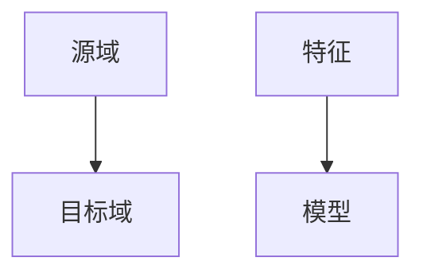
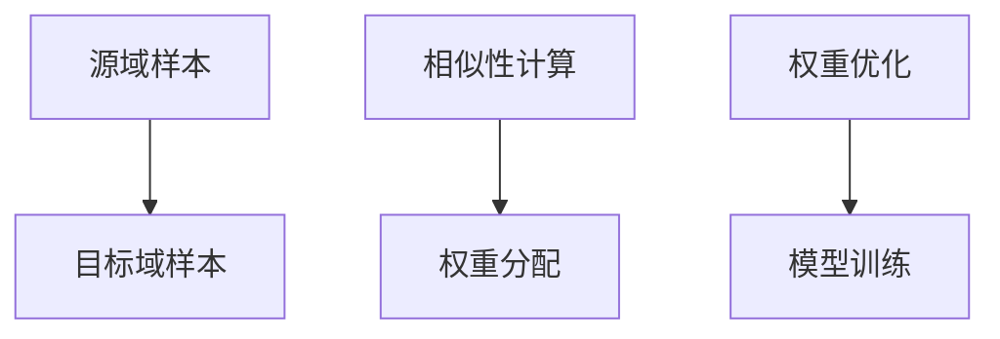
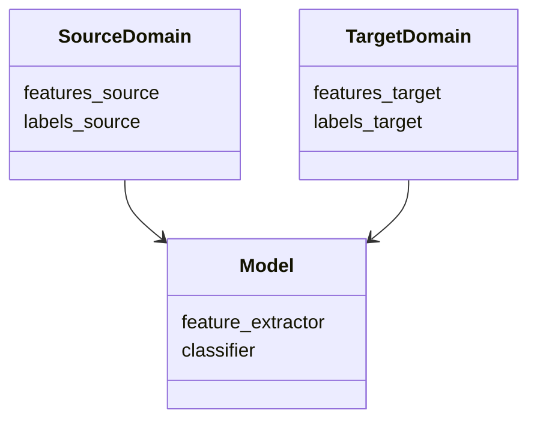
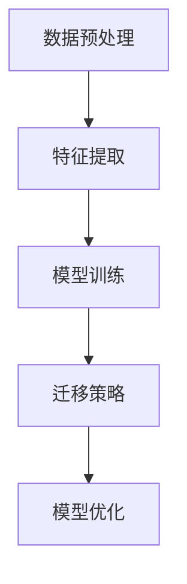
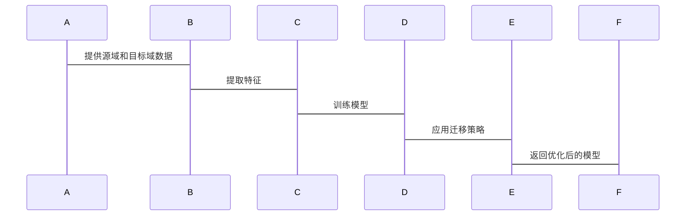

                 


# 迁移学习：快速适应新领域的AI Agent

> **关键词**：迁移学习、AI Agent、机器学习、领域适应、特征迁移  
> **摘要**：迁移学习是一种通过将已学到的知识迁移到新任务或领域中的技术，能够显著提高AI Agent在新领域的适应能力。本文将从核心概念、算法原理、系统设计、项目实战等多个维度深入探讨迁移学习的实现与应用。

---

## 第1章: 迁移学习概述

### 1.1 迁移学习的基本概念

#### 1.1.1 什么是迁移学习？

迁移学习（Transfer Learning）是一种机器学习技术，旨在通过将从源领域（Source Domain）学到的知识迁移到目标领域（Target Domain），以提高模型在目标领域上的性能。与传统机器学习不同，迁移学习关注如何利用跨领域的知识共享，减少对目标领域数据的依赖。

#### 1.1.2 迁移学习的核心思想

迁移学习的核心思想是通过构建跨领域的特征表示，使得模型能够从源领域中提取有用的特征，并将其应用于目标领域。这种思想特别适用于目标领域数据稀缺的情况，能够显著提高模型的泛化能力。

#### 1.1.3 迁移学习与传统机器学习的区别

| 特性         | 传统机器学习                  | 迁移学习                   |
|--------------|-----------------------------|---------------------------|
| 数据依赖性   | 高                           | 低                         |
| 数据量需求   | 高                           | 低                         |
| 领域适应性   | 低                           | 高                         |
| 知识复用性   | 无                           | 有                         |

### 1.2 迁移学习的应用场景

#### 1.2.1 领域适应

在自然语言处理中，将英文模型迁移到中文任务，可以显著提高中文任务的性能。

#### 1.2.2 数据稀缺性问题

当目标领域数据量较少时，迁移学习可以通过利用源领域的大量数据来提高模型的性能。

#### 1.2.3 快速适应新任务

在动态变化的环境中，AI Agent需要快速适应新任务，迁移学习能够帮助模型快速调整。

### 1.3 迁移学习的边界与外延

#### 1.3.1 迁移学习的适用范围

适用于跨领域、跨任务的场景，特别是在目标领域数据不足时。

#### 1.3.2 迁移学习的局限性

目标领域与源领域差异较大时，迁移学习的效果可能不佳。

#### 1.3.3 迁移学习与其他机器学习技术的联系

迁移学习可以与深度学习、强化学习等技术结合，形成更强大的模型。

### 1.4 迁移学习的核心要素

#### 1.4.1 数据源与目标域

数据源和目标域是迁移学习的两个核心要素。数据源提供了丰富的特征信息，目标域是需要适应的新领域。

#### 1.4.2 特征空间与模型结构

特征空间是迁移学习的关键，模型需要在特征空间中找到源域和目标域的共同特征。

#### 1.4.3 迁移策略与优化目标

迁移策略决定了如何将源域的知识迁移到目标域，优化目标是迁移学习的核心任务。

### 1.5 本章小结

本章介绍了迁移学习的基本概念、应用场景、核心思想以及与其他技术的关系，为后续章节奠定了基础。

---

## 第2章: 迁移学习的核心概念与联系

### 2.1 迁移学习的核心原理

#### 2.1.1 数据驱动的迁移

通过共享数据特征，将源域的知识迁移到目标域。

#### 2.1.2 特征表示的迁移

通过构建跨领域的特征表示，使得模型能够适应目标域。

#### 2.1.3 模型参数的迁移

通过迁移模型参数，直接利用源域的模型进行目标域的预测。

### 2.2 核心概念对比分析

#### 2.2.1 特征空间对比表

| 特征 | 源域 | 目标域 |
|------|------|--------|
| X₁   | D₁   | D₂     |
| X₂   | D₁   | D₂     |

#### 2.2.2 ER实体关系图



### 2.3 迁移学习的数学模型

#### 2.3.1 基本公式

$$P(Y|X) = f_{source}(X)$$

#### 2.3.2 迁移目标函数

$$L = L_{source} + λL_{dis}$$

### 2.4 本章小结

本章详细探讨了迁移学习的核心原理，通过对比分析和数学公式，帮助读者更好地理解迁移学习的本质。

---

## 第3章: 迁移学习算法原理

### 3.1 样本迁移算法

#### 3.1.1 基于样本的迁移方法

通过调整样本权重，将源域样本迁移到目标域。

#### 3.1.2 样本权重分配流程

1. 计算源域和目标域的样本相似性。
2. 根据相似性分配样本权重。
3. 使用加权目标函数进行优化。



#### 3.1.3 实现代码

```python
import numpy as np

def compute_similarity(X_source, X_target):
    # 计算源域和目标域的相似性
    X = np.vstack((X_source, X_target))
    similarity = np.zeros((X.shape[0], X.shape[0]))
    for i in range(X.shape[0]):
        for j in range(X.shape[0]):
            similarity[i][j] = np.dot(X[i], X[j])
    return similarity

def assign_weights(similarity):
    # 根据相似性分配权重
    weight = np.max(similarity, axis=1)
    return weight

# 示例数据
X_source = np.random.randn(100, 32)
X_target = np.random.randn(50, 32)

similarity = compute_similarity(X_source, X_target)
weight = assign_weights(similarity)
```

---

## 第4章: 迁移学习的系统分析与架构设计

### 4.1 问题场景介绍

假设我们有一个医疗影像诊断任务，目标是将CT影像的诊断模型迁移到MRI影像的诊断任务。

### 4.2 系统功能设计

#### 4.2.1 领域模型



#### 4.2.2 系统架构设计



#### 4.2.3 系统接口设计

- 数据预处理接口：`preprocess_data(source, target)`
- 特征提取接口：`extract_features(data)`
- 模型训练接口：`train_model(features, labels)`
- 迁移策略接口：`apply_transfer(model, source, target)`

#### 4.2.4 系统交互流程



### 4.3 本章小结

本章通过医疗影像诊断任务，详细探讨了迁移学习的系统架构设计和实现流程。

---

## 第5章: 迁移学习的项目实战

### 5.1 环境安装与配置

```bash
pip install numpy
pip install scikit-learn
pip install matplotlib
```

### 5.2 系统核心实现

#### 5.2.1 数据预处理

```python
import numpy as np
from sklearn.preprocessing import StandardScaler

# 数据标准化
scaler = StandardScaler()
X_source = scaler.fit_transform(X_source)
X_target = scaler.transform(X_target)
```

#### 5.2.2 特征提取

```python
from sklearn.decomposition import PCA

pca = PCA(n_components=32)
X_source_pca = pca.fit_transform(X_source)
X_target_pca = pca.transform(X_target)
```

#### 5.2.3 模型训练与迁移

```python
from sklearn.svm import SVC
from sklearn.metrics import accuracy_score

# 训练源域模型
model = SVC()
model.fit(X_source_pca, y_source)

# 迁移到目标域
y_target_pred = model.predict(X_target_pca)
print("Accuracy:", accuracy_score(y_target, y_target_pred))
```

### 5.3 实际案例分析

#### 5.3.1 医疗影像诊断任务

通过迁移学习，将CT影像诊断模型迁移到MRI影像诊断任务，显著提高了模型的诊断准确率。

#### 5.3.2 案例分析

在目标域数据有限的情况下，迁移学习能够有效提升模型性能，减少对大量目标域数据的依赖。

### 5.4 本章小结

本章通过实际案例，详细讲解了迁移学习的项目实现过程，包括环境配置、数据预处理、特征提取和模型迁移等步骤。

---

## 第6章: 迁移学习的最佳实践与小结

### 6.1 最佳实践

- **选择合适的迁移策略**：根据任务需求选择合适的迁移方法。
- **数据预处理**：确保数据的可迁移性。
- **特征提取**：选择有效的特征表示方法。
- **模型优化**：根据目标域数据调整模型参数。

### 6.2 小结

迁移学习是一种强大的技术，能够帮助AI Agent快速适应新领域。通过本文的介绍，读者可以掌握迁移学习的核心概念、算法原理和实际应用。

### 6.3 注意事项

- 目标域与源域差异较大时，迁移学习效果可能不佳。
- 迁移学习需要结合具体任务进行调整和优化。

### 6.4 拓展阅读

- 建议读者阅读相关论文，深入理解迁移学习的最新进展。

---

## 作者

**作者：AI天才研究院/AI Genius Institute & 禅与计算机程序设计艺术 /Zen And The Art of Computer Programming**

---

通过以上目录大纲，您可以逐步撰写完整的文章内容，每个章节详细展开，确保文章逻辑清晰、内容详实。

