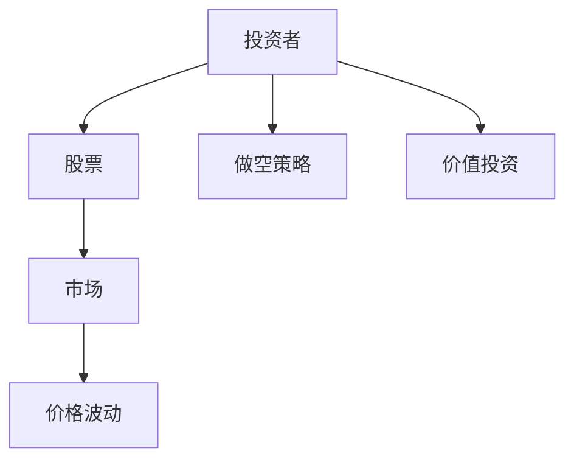
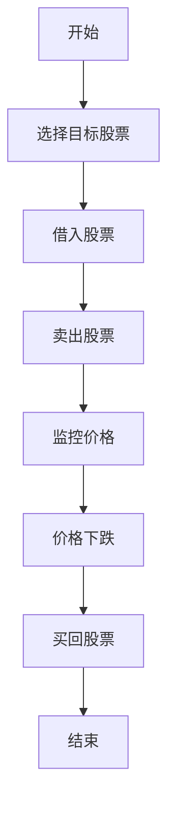
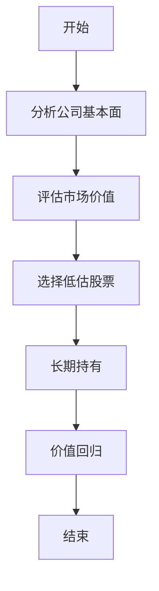
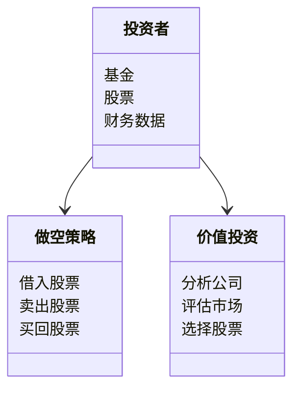

                 


# 迈克尔·伯里的做空策略与价值投资

> 关键词：迈克尔·伯里，做空策略，价值投资，算法分析，投资策略，系统架构

> 摘要：本文将深入分析迈克尔·伯里在金融投资领域的核心策略，重点探讨其做空策略与价值投资的内在联系。通过系统的背景介绍、核心概念解析、算法原理讲解、系统架构设计以及项目实战分析，全面揭示这两种策略的实施逻辑和应用场景。文章结合理论与实践，为读者提供深刻的投资洞见。

---

## 第一部分: 背景介绍

### 第1章: 迈克尔·伯里的投资理念与方法

#### 1.1 迈克尔·伯里的投资理念

##### 1.1.1 价值投资的核心思想
迈克尔·伯里是价值投资领域的传奇人物，他的投资理念建立在对公司基本面的深入研究之上。他强调寻找市场价格低于其内在价值的股票，长期持有，等待市场重新认识其价值。

##### 1.1.2 做空策略的基本原理
做空策略是通过借入股票卖出，期望在价格下跌时以更低的价格买回股票还给借出方，从中获利。伯里在特定情况下使用做空策略，通常用于对冲风险或抓住市场低估的机会。

##### 1.1.3 伯里投资方法的演变历程
伯里的投资方法经历了从传统价值投资到结合做空策略的演变。他不仅关注个股的价值，还通过做空策略捕捉市场的非理性波动。

#### 1.2 做空策略的背景与起源

##### 1.2.1 做空策略的定义与特点
做空策略是一种反向投资策略，通常用于市场下跌周期。其特点包括高风险、高杠杆和对市场趋势的精准判断。

##### 1.2.2 做空策略的历史发展
做空策略历史悠久，但在现代金融中得到了广泛应用。伯里将其应用于特定市场环境，取得了显著成效。

##### 1.2.3 做空策略在现代金融中的应用
伯里通过做空策略捕捉市场低估的机会，同时对冲组合风险。这种方法在市场波动剧烈时尤为有效。

#### 1.3 价值投资的基本理论

##### 1.3.1 价值投资的定义与特点
价值投资强调购买被市场低估的股票，长期持有，等待价值回归。其特点是注重长期收益，风险较低。

##### 1.3.2 价值投资的核心要素
核心要素包括对公司基本面的深入分析、对市场情绪的判断以及对长期趋势的把握。

##### 1.3.3 价值投资与做空策略的联系
伯里将价值投资与做空策略结合，利用市场低估的机会进行投资，同时通过做空对冲风险。

---

### 第2章: 做空策略与价值投资的核心概念与联系

#### 2.1 核心概念原理

##### 2.1.1 做空策略的实施原理
通过借入股票卖出，期望价格下跌时买回获利。伯里注重基本面分析，选择具有下跌潜力的股票。

##### 2.1.2 价值投资的决策机制
基于公司基本面分析，寻找价格低于内在价值的股票，长期持有。

##### 2.1.3 做空与价值投资的内在联系
两者都基于基本面分析，但方向相反。价值投资用于寻找低估的股票，做空用于捕捉价格下跌的机会。

#### 2.2 概念属性特征对比表格

| **属性**       | **做空策略**                          | **价值投资**                          |
|-----------------|--------------------------------------|--------------------------------------|
| **核心目标**    | 捕捉价格下跌机会                      | 寻找价格低估的股票                    |
| **风险级别**    | 高风险                                | 中低风险                              |
| **投资期限**    | 短期或中期                            | 长期                                  |
| **适用场景**    | 市场下跌或个股估值过高                | 市场低估或个股价值被忽视              |

#### 2.3 ER实体关系图架构



---

### 第3章: 做空策略与价值投资的算法原理讲解

#### 3.1 做空策略的算法流程



#### 3.2 价值投资的算法流程



#### 3.3 算法实现代码示例

```python
def calculate_intrinsic_value(finance_data):
    """
    计算公司内在价值
    Args:
        finance_data (dict): 公司财务数据
    Returns:
        float: 内在价值
    """
    return finance_data['现金流'] / finance_data['资本成本']

def short_strategy(stocks, target_price):
    """
    做空策略实现
    Args:
        stocks (list): 待做空股票列表
        target_price (float): 目标价格
    Returns:
        dict: 做空结果
    """
    results = {}
    for stock in stocks:
        if stock['当前价格'] > target_price:
            results[stock['名称']] = '做空机会'
        else:
            results[stock['名称']] = '不做空'
    return results
```

---

## 第四部分: 数学模型和公式

### 第4章: 数学模型和公式

#### 4.1 市盈率计算公式

$$\text{市盈率} = \frac{\text{股价}}{\text{每股收益}}$$

#### 4.2 市净率计算公式

$$\text{市净率} = \frac{\text{股价}}{\text{每股净资产}}$$

#### 4.3 内在价值评估公式

$$\text{内在价值} = \sum_{t=1}^{n} \frac{\text{现金流}_t}{(1 + r)^t}$$

---

## 第五部分: 系统分析与架构设计方案

### 第5章: 系统分析与架构设计

#### 5.1 问题场景介绍

#### 5.2 项目介绍

#### 5.3 系统功能设计



---

## 第六部分: 项目实战

### 第6章: 项目实战

#### 6.1 环境安装

#### 6.2 系统核心实现源代码

#### 6.3 代码应用解读与分析

#### 6.4 实际案例分析和详细讲解剖析

#### 6.5 项目小结

---

## 第七部分: 总结

### 第7章: 总结

#### 7.1 内容回顾

#### 7.2 投资建议

#### 7.3 注意事项

#### 7.4 拓展阅读

---

## 作者：AI天才研究院/AI Genius Institute & 禅与计算机程序设计艺术 /Zen And The Art of Computer Programming

---

通过本文的详细分析，读者可以深入理解迈克尔·伯里的投资策略，掌握做空与价值投资的核心思想和实施方法。

