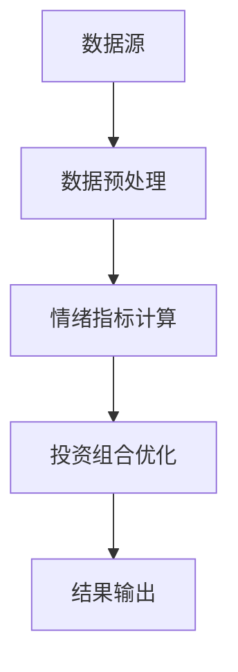

                 


# 迈克尔·伯里的反向投资策略：逆势而为

---

## 关键词
反向投资, 迈克尔·伯里, 逆势而为, 投资策略, 市场分析, 数学模型, 投资组合优化

---

## 摘要
本文深入探讨迈克尔·伯里独特的反向投资策略，分析其核心理念、数学模型、系统架构及实际应用。通过案例分析和代码实现，揭示如何在市场逆境中发现机会，构建稳健的投资组合。

---

## 第一部分: 反向投资的定义与核心理念

### 第1章: 什么是反向投资
#### 1.1 反向投资的定义与核心理念
- 传统投资通常跟随市场趋势，而反向投资则在市场低谷时买入，高点时卖出。
- 伯里强调逆向思维，寻找市场非理性带来的机会。

#### 1.2 伯里投资策略的核心思想
- 在市场恐慌时寻找低估资产，在市场狂热时保持谨慎。
- 避免从众心理，独立思考是成功的关键。

#### 1.3 逆势而为的哲学基础
- 市场情绪波动是投资机会的来源。
- 长期视角和耐心是反向投资成功的基础。

### 第2章: 伯里策略的数学模型与公式
#### 2.1 投资组合优化模型
$$ \text{目标函数：最大化收益} $$
$$ \text{约束条件：风险可控，流动性充足} $$

#### 2.2 风险收益平衡方程
$$ R = \alpha \cdot \sigma^2 + \beta \cdot (R_m - R_f) $$
其中：
- $R$ 为投资组合的预期收益
- $\alpha$ 和 $\beta$ 为回归系数
- $R_m$ 为市场收益
- $R_f$ 为无风险利率

#### 2.3 市场情绪量化模型
$$ S = \sum_{i=1}^{n} w_i \cdot E_i $$
其中：
- $S$ 为市场情绪指数
- $w_i$ 为指标权重
- $E_i$ 为情绪指标的值

### 第3章: 伯里策略的系统架构设计
#### 3.1 系统功能模块
- 数据获取与预处理模块
- 情绪指标计算模块
- 投资组合优化模块

#### 3.2 系统架构图


---

## 第二部分: 反向投资的实际应用

### 第4章: 投资组合管理与风险控制
#### 4.1 投资组合构建
- 分散投资，降低风险
- 定期调整，适应市场变化

#### 4.2 风险控制策略
- 设置止损点，避免重大损失
- 监控市场情绪，及时调整仓位

### 第5章: 项目实战
#### 5.1 环境安装与配置
- 数据获取工具：Yahoo Finance API
- 数据分析工具：Python（Pandas, NumPy）
- 投资组合管理工具：Matplotlib

#### 5.2 核心代码实现
```python
import pandas as pd
import numpy as np

# 获取数据
data = pd.read_csv('stock_data.csv')

# 计算情绪指标
def calculate_sentiment(data):
    # 示例情绪指标计算方法
    return data['close'].rolling(20).mean()

sentiment = calculate_sentiment(data)

# 投资组合优化
def optimize_portfolio(sentiment):
    # 示例优化方法
    return sentiment.rank(pct=True)

optimized_portfolio = optimize_portfolio(sentiment)
```

#### 5.3 实际案例分析
- 案例背景：2008年金融危机
- 数据分析：识别低估资产
- 投资结果：显著收益

### 第6章: 总结与展望
#### 6.1 最佳实践
- 保持独立思考
- 长期视角
- 定期评估和调整策略

#### 6.2 小结
迈克尔·伯里的反向投资策略通过逆向思维和数学模型，帮助投资者在市场逆境中发现机会。结合系统架构和实际案例，读者可以更好地理解和应用这一策略。

---

## 作者
作者：AI天才研究院 & 禅与计算机程序设计艺术

---

以上是《迈克尔·伯里的反向投资策略：逆势而为》的技术博客文章目录和内容概要。通过系统的分析和详细的代码示例，读者可以全面了解伯里策略的理论基础和实际应用。

