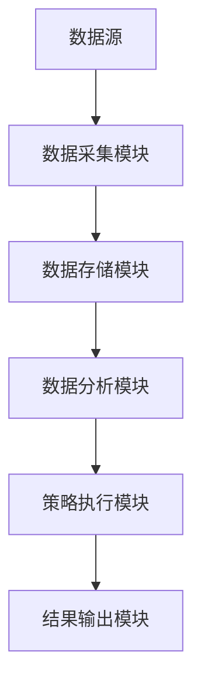
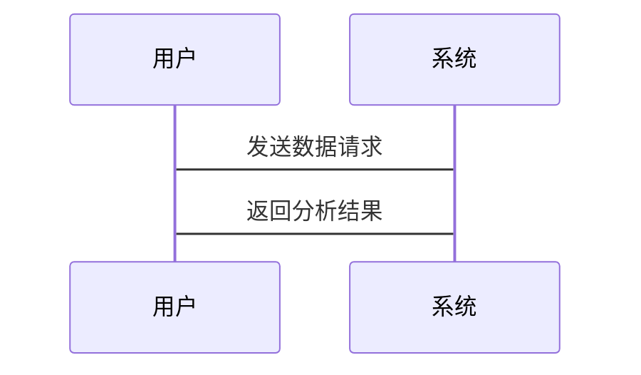

                 


# 迈克尔·伯里的宏观对冲策略

> 关键词：宏观对冲，迈克尔·伯里，投资策略，数学模型，系统架构

> 摘要：本文深入探讨了迈克尔·伯里在宏观对冲领域的投资策略，分析了其核心原理、数学模型、系统架构以及实际应用案例，提供了丰富的代码实现和详细解读，帮助读者全面理解并应用这一策略。

---

## 第1章: 宏观对冲的基本概念与背景

### 1.1 宏观对冲的定义与特点
#### 1.1.1 宏观对冲的基本概念
宏观对冲是一种基于宏观经济指标和趋势的投资策略，通过分析和预测经济变量的变化，如GDP、通货膨胀率、利率等，来指导投资决策。其核心在于利用宏观经济的波动性，捕捉市场中的套利机会。

#### 1.1.2 宏观对冲的核心特点
- **跨市场性**：涉及多个市场和资产类别，如股票、债券、外汇和商品。
- **长期性**：关注长期的宏观经济趋势，而非短期波动。
- **低相关性**：与其他传统投资策略相关性较低，有助于分散风险。

#### 1.1.3 宏观对冲与传统投资的区别
传统投资策略通常基于个股分析或技术分析，而宏观对冲则从宏观经济的角度出发，强调资产配置和风险控制。

### 1.2 迈克尔·伯里及其投资策略
#### 1.2.1 迈克尔·伯里的投资哲学
迈克尔·伯里（Michael Burry）是宏观对冲领域的先驱，以其在2008年金融危机前成功预测并获利而闻名。他的投资哲学强调基本面分析和风险控制，注重长期趋势的把握。

#### 1.2.2 伯里宏观对冲策略的核心思想
伯里策略的核心在于通过宏观经济分析，识别市场中存在定价错误的资产，并利用这些错误进行套利。他强调分散投资和风险控制，以降低策略的波动性。

#### 1.2.3 伯里策略在投资领域的影响力
伯里通过成功实施宏观对冲策略，成为对冲基金领域的传奇人物，他的策略被广泛研究和应用，推动了宏观对冲策略的发展。

---

## 第2章: 宏观对冲策略的核心原理

### 2.1 宏观经济分析的基础
#### 2.1.1 宏观经济指标的分类与作用
宏观经济指标分为两类：**领先指标**（如工业产值、PMI）和**滞后指标**（如失业率、GDP）。这些指标帮助投资者预测市场走势。

#### 2.1.2 主要宏观经济模型的介绍
- **凯恩斯模型**：关注总需求和货币政策对经济的影响。
- **IS-LM模型**：分析产品市场和货币市场的均衡。

#### 2.1.3 宏观经济分析对投资决策的影响
宏观经济分析帮助投资者识别经济周期，制定资产配置策略，并优化投资组合的风险收益比。

### 2.2 伯里策略的数学模型
#### 2.2.1 资产配置的数学公式
$$ 资产配置 = \sum_{i=1}^{n} w_i \times a_i $$
其中，$w_i$ 是第 $i$ 个资产的权重，$a_i$ 是第 $i$ 个资产的金额。权重基于宏观经济指标的预测结果确定。

#### 2.2.2 风险调整后的收益计算
$$ R_i = \frac{R_p - R_f}{\sigma_p} $$
其中，$R_p$ 是对冲基金的收益，$R_f$ 是无风险利率，$\sigma_p$ 是对冲基金的风险。该公式用于评估风险调整后的收益。

### 2.3 策略的实施步骤
#### 2.3.1 数据收集与处理
收集宏观经济指标数据，清洗和预处理，确保数据的准确性和完整性。

#### 2.3.2 模型构建与测试
基于宏观经济模型，构建数学模型，并通过历史数据进行回测，验证模型的有效性。

#### 2.3.3 策略优化与调整
根据回测结果，优化资产权重和风险控制参数，提高策略的收益风险比。

---

## 第3章: 伯里策略的系统架构设计

### 3.1 系统功能设计
#### 3.1.1 数据采集模块
负责从数据源获取宏观经济指标，如GDP、通货膨胀率等。

#### 3.1.2 数据分析模块
对采集的数据进行处理和建模，生成投资建议。

#### 3.1.3 策略执行模块
根据分析结果，执行交易指令。

### 3.2 系统架构设计


### 3.3 接口设计与交互
#### 3.3.1 系统接口设计
- 数据接口：用于数据源和数据存储模块之间的交互。
- 模型接口：用于数据分析模块和策略执行模块之间的交互。

#### 3.3.2 用户交互流程


---

## 第4章: 伯里策略的项目实战

### 4.1 环境安装与配置
#### 4.1.1 安装必要的软件工具
安装Python、Pandas、NumPy等工具，用于数据处理和建模。

#### 4.1.2 数据源的获取与配置
从可靠的数据源获取宏观经济指标数据，并将其配置到系统中。

### 4.2 核心代码实现
#### 4.2.1 数据处理代码
```python
import pandas as pd
data = pd.read_csv('macro_data.csv')
```

#### 4.2.2 模型构建代码
```python
from sklearn.linear_model import LinearRegression
model = LinearRegression()
model.fit(X, y)
```

### 4.3 实际案例分析
#### 4.3.1 案例背景介绍
以2008年金融危机为例，分析伯里策略的成功实施。

#### 4.3.2 数据分析与结果解读
通过数据分析，识别出次贷危机前的市场信号，指导投资决策。

#### 4.3.3 策略优化与调整
根据实际结果，优化模型参数，提高策略的稳定性。

---

## 第5章: 最佳实践与注意事项

### 5.1 投资策略的注意事项
#### 5.1.1 风险控制的重要性
在宏观对冲中，风险控制是关键，需定期评估和调整。

#### 5.1.2 数据质量的保证
确保数据的准确性和完整性，避免因数据问题导致错误决策。

#### 5.1.3 策略的持续优化
市场环境不断变化，需持续优化模型和策略。

### 5.2 项目总结与小结
#### 5.2.1 项目成果回顾
总结项目实施成果，分析其成功与不足。

#### 5.2.2 经验与教训总结
分享项目中的经验和教训，为未来提供参考。

#### 5.2.3 未来研究方向
探讨未来可能的研究方向，如人工智能在宏观对冲中的应用。

---

## 第6章: 拓展阅读

### 6.1 相关书籍推荐
- 《投资学精要》
- 《宏观经济学》

### 6.2 在线资源链接
- [伯里宏观对冲策略](https://example.com)

---

## 作者：AI天才研究院/AI Genius Institute & 禅与计算机程序设计艺术 /Zen And The Art of Computer Programming

---

这篇博客文章详细介绍了迈克尔·伯里的宏观对冲策略，从理论到实践，提供了丰富的代码实现和案例分析，帮助读者全面理解和应用这一策略。

