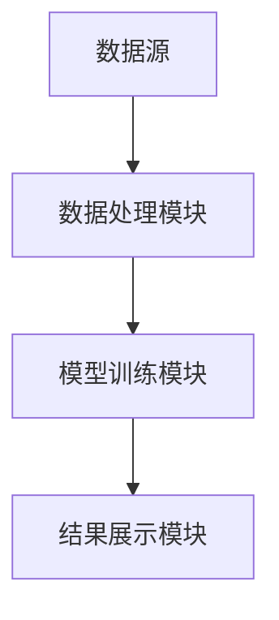

                 


# 迈克尔·莫布森的价值投资定量分析

## 关键词：价值投资、定量分析、迈克尔·莫布森、CAPM、夏普比率、因子分析、系统架构

## 摘要：本文深入探讨了迈克尔·莫布森在价值投资中的定量分析方法，结合经典金融模型和现代数据科学，分析其在投资决策中的应用。通过详细讲解CAPM、夏普比率等核心概念，以及系统架构设计和项目实战案例，本文为读者提供了从理论到实践的全面指导。

---

# 第一部分: 价值投资与定量分析基础

## 第1章: 价值投资概述

### 1.1 价值投资的起源与发展

#### 1.1.1 价值投资的定义与核心理念
价值投资是一种投资策略，强调以低于内在价值的价格购买优质资产。核心理念包括安全边际、长期视角和逆向思维。

#### 1.1.2 价值投资的历史发展
起源于20世纪初，本杰明·格雷厄姆和菲利普·费雪是主要推动者。莫布森在其基础上，引入了定量分析方法，使价值投资更具科学性。

#### 1.1.3 迈克尔·莫布森的贡献
莫布森通过《投资中最简单的事》等著作，将定量分析与价值投资结合，提出了基于因子模型的投资策略。

---

## 第2章: 定量分析的基本概念

### 2.1 定量分析的定义
定量分析通过数学模型和数据驱动的方法，评估资产的内在价值和风险，帮助投资者做出理性决策。

### 2.2 价值投资中的定量分析
莫布森将定量分析应用于筛选低估股票，利用因子如低市盈率、低市净率等指标，寻找具有安全边际的投资机会。

### 2.3 定量分析在现代投资中的作用
在现代金融中，定量分析帮助投资者应对市场不确定性，通过大数据和机器学习提升投资效率。

---

## 第3章: 价值投资的核心概念

### 3.1 股票的内在价值

#### 3.1.1 内在价值的定义
股票的内在价值是基于公司基本面分析的未来现金流的现值，公式为：
$$ V = \sum_{t=1}^{n} \frac{CF_t}{(1 + r)^t} $$

#### 3.1.2 内在价值的计算方法
使用DCF模型，考虑现金流、折现率等因素，评估企业的真实价值。

#### 3.1.3 影响内在价值的因素
包括净利润、现金流、ROE、行业地位等。

### 3.2 安全边际

#### 3.2.1 安全边际的定义
安全边际是市场价格低于内在价值的部分，公式为：
$$ 安全边际 = 内在价值 - 市场价格 $$

#### 3.2.2 安全边际的重要性
提供缓冲，降低投资风险，确保在市场波动中保持收益。

---

## 第4章: 定量分析的数学模型

### 4.1 资本资产定价模型（CAPM）

#### 4.1.1 CAPM的定义
CAPM用于确定资产的预期收益，公式为：
$$ E(r_i) = r_f + \beta_i (E(r_m) - r_f) $$

#### 4.1.2 CAPM的应用
评估资产的系统性风险，指导投资组合的构建。

### 4.2 夏普比率

#### 4.2.1 夏普比率的定义
衡量投资组合的风险调整后收益，公式为：
$$ 夏普比率 = \frac{E(r_i) - r_f}{\sigma_i} $$

#### 4.2.2 夏普比率的意义
夏普比率越高，投资组合的性价比越高。

---

## 第5章: 数据驱动的定量分析方法

### 5.1 数据收集与处理

#### 5.1.1 数据源的选择
包括财务报表、市场数据和宏观经济指标。

#### 5.1.2 数据清洗与预处理
去除缺失值、异常值，标准化数据。

### 5.2 因子分析

#### 5.2.1 因子分析的定义
通过统计方法提取影响资产收益的关键因子，如市值、价值、动量等。

#### 5.2.2 常用因子的介绍
- 市盈率（P/E）
- 市净率（P/B）
- 股息率（Dividend Yield）

---

## 第6章: 系统架构与算法实现

### 6.1 系统架构设计

#### 6.1.1 系统模块划分
- 数据采集模块
- 数据处理模块
- 模型训练模块
- 结果展示模块

#### 6.1.2 数据流图


### 6.2 算法实现

#### 6.2.1 算法选择
使用多元回归模型进行因子分析。

#### 6.2.2 算法实现步骤
1. 数据预处理
2. 选择相关因子
3. 构建回归模型
4. 验证模型准确性

---

## 第7章: 项目实战与案例分析

### 7.1 项目环境搭建

#### 7.1.1 Python环境安装
使用Anaconda安装Python 3.8及以上版本。

#### 7.1.2 数据库安装与配置
使用MySQL或MongoDB存储数据。

### 7.2 核心代码实现

#### 7.2.1 数据处理代码
```python
import pandas as pd
import numpy as np

# 数据清洗
data = pd.read_csv('stock_data.csv')
data = data.dropna()
```

#### 7.2.2 因子计算代码
```python
# 计算市盈率因子
data['PE'] = data['净利润'] / data['股价']
```

#### 7.2.3 模型训练代码
```python
from sklearn.linear_model import LinearRegression

# 构建多元回归模型
model = LinearRegression()
model.fit(X, y)
```

### 7.3 案例分析

#### 7.3.1 案例介绍
分析某公司的财务数据，计算其内在价值和安全边际。

#### 7.3.2 实际操作
通过因子分析筛选出具有高安全边际的股票，构建投资组合。

---

## 第8章: 总结与展望

### 8.1 小结
本文详细介绍了莫布森的价值投资定量分析方法，结合数学模型和系统架构，为投资者提供了科学的决策工具。

### 8.2 最佳实践 tips
- 定期更新数据，保持模型准确性
- 结合定性分析，提高投资决策的全面性
- 风险控制是投资成功的关键

### 8.3 注意事项
- 数据质量直接影响分析结果
- 模型选择应根据实际情况调整
- 避免过度拟合，防止虚假信号

### 8.4 拓展阅读
推荐阅读莫布森的《投资中最简单的事》和《投资的艺术》。

---

## 作者：AI天才研究院 & 禅与计算机程序设计艺术

---

这篇文章系统地介绍了迈克尔·莫布森的价值投资定量分析方法，从理论到实践，结合丰富的案例和代码示例，帮助读者深入理解并应用这些方法。

