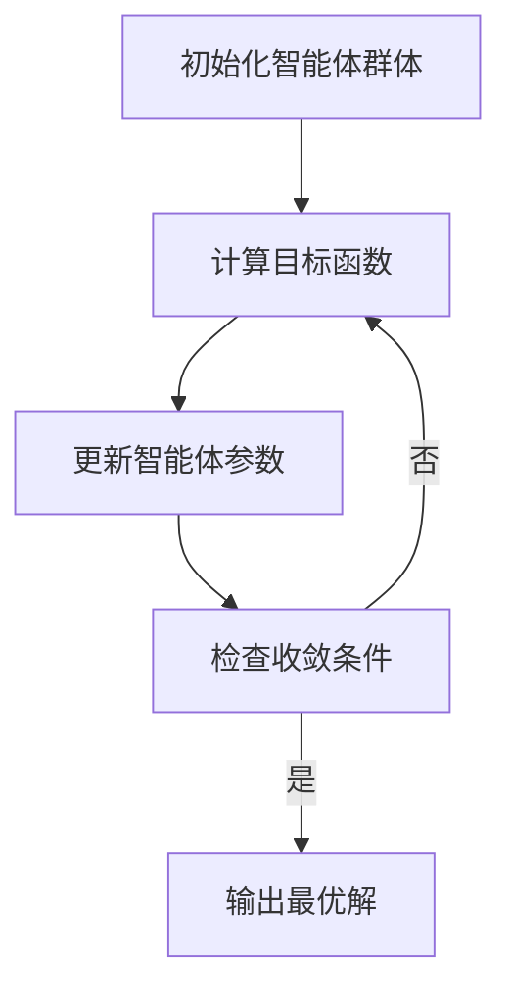

                 


# 运用AI智能体群体优化现金流折现模型

> 关键词：AI智能体，现金流折现模型，群体优化，金融建模，智能优化算法

> 摘要：本文探讨了如何利用AI智能体的群体优化技术来改进现金流折现模型（DCF模型），通过分析传统DCF模型的局限性，提出了一种基于AI智能体的优化方法，详细阐述了其数学模型、算法实现和实际应用，展示了如何通过群体智能提升金融建模的准确性和效率。

---

## 第一部分: 现金流折现模型与AI智能体群体优化的背景介绍

### 第1章: 现金流折现模型的基本概念

#### 1.1 现金流折现模型的基本概念
现金流折现模型（Discounted Cash Flow Model, DCF模型）是评估公司或项目价值的核心方法，通过将未来现金流折现到现值，计算其内在价值。DCF模型广泛应用于企业估值、投资决策等领域。

#### 1.2 现金流折现模型的应用领域
DCF模型的应用领域包括企业估值、投资决策、项目评估等。通过DCF模型，投资者可以评估公司的内在价值，判断其股价是否被高估或低估。

#### 1.3 现金流折现模型的核心要素
- 现金流预测：未来各期的现金流预测。
- 折现率：用于将未来现金流折现到现值的利率。
- 终值：永续年金的现值，假设现金流在无限期后的价值。

### 第2章: AI智能体的基本概念与群体优化原理

#### 2.1 AI智能体的定义与特点
AI智能体（Artificial Intelligence Agent）是指能够感知环境并采取行动以实现目标的实体。AI智能体的特点包括自主性、反应性、目标导向性和学习能力。

#### 2.2 AI智能体的核心特点
- **自主性**：智能体能够自主决策，无需外部干预。
- **反应性**：能够根据环境反馈调整行为。
- **目标导向性**：通过优化目标函数实现目标。
- **学习能力**：通过数据学习优化策略。

#### 2.3 群体智能的基本原理
群体智能是指多个智能体协同工作，通过信息共享和协作优化问题。群体智能的优点包括鲁棒性高、适应性强，能够解决复杂问题。

### 第3章: 现金流折现模型与AI智能体的结合应用

#### 3.1 现金流折现模型的传统方法与局限性
- **局限性**：现金流预测和折现率的选择存在主观性，可能导致估值偏差。

#### 3.2 AI智能体优化现金流折现模型的必要性
通过AI智能体的群体优化，可以提高现金流预测的准确性和折现率的选择，从而提升DCF模型的估值精度。

---

## 第二部分: 核心概念与联系

### 第4章: 现金流折现模型的数学模型

#### 4.1 DCF模型的基本公式
$$DCF = \sum_{t=1}^{n} \frac{CF_t}{(1+r)^t} + \frac{TV}{(1+r)^n}$$

其中：
- $CF_t$：第t期的现金流
- $r$：折现率
- $TV$：终值
- $n$：时间跨度

#### 4.2 优化目标
最小化DCF模型的预测误差，最大化模型的准确性。

### 第5章: AI智能体群体优化的核心原理

#### 5.1 群体优化算法
- **遗传算法**：通过选择、交叉和变异操作优化参数。
- **粒子群优化**：通过粒子群的运动寻找最优解。

#### 5.2 优化目标函数
$$f(x) = \sum_{i=1}^{m} (DCF_i - ActualDCF_i)^2$$

其中：
- $DCF_i$：模型预测的DCF值
- $ActualDCF_i$：实际DCF值

---

## 第三部分: 算法原理

### 第6章: 现金流折现模型的AI智能体优化算法

#### 6.1 算法步骤
1. 初始化智能体群体。
2. 计算各智能体的目标函数值。
3. 更新智能体的参数，寻找最优解。

#### 6.2 算法流程图


---

## 第四部分: 系统分析与架构设计

### 第7章: 项目背景与系统功能设计

#### 7.1 项目背景
本项目旨在通过AI智能体优化现金流折现模型，提高金融建模的准确性和效率。

#### 7.2 系统功能设计
- **数据输入**：读取历史现金流数据。
- **模型优化**：通过AI智能体优化DCF模型。
- **结果分析**：输出优化后的DCF模型结果。

#### 7.3 系统架构设计


---

## 第五部分: 项目实战

### 第8章: 环境搭建与核心代码实现

#### 8.1 环境搭建
安装必要的库，如NumPy、Pandas、Scikit-learn等。

#### 8.2 核心代码实现
```python
def optimize_dcf():
    # 初始化智能体群体
    agents = initialize_agents()
    # 迭代优化
    for _ in range(max_iterations):
        evaluate_agents(agents)
        update_agents(agents)
    return get_best_agent(agents)
```

---

## 第六部分: 总结与展望

### 第9章: 总结与展望

#### 9.1 总结
本文详细探讨了如何利用AI智能体优化现金流折现模型，展示了其在金融建模中的应用价值。

#### 9.2 未来展望
未来可以进一步研究多智能体协同优化，结合强化学习提升模型的优化效果。

---

作者：AI天才研究院/AI Genius Institute & 禅与计算机程序设计艺术 /Zen And The Art of Computer Programming

