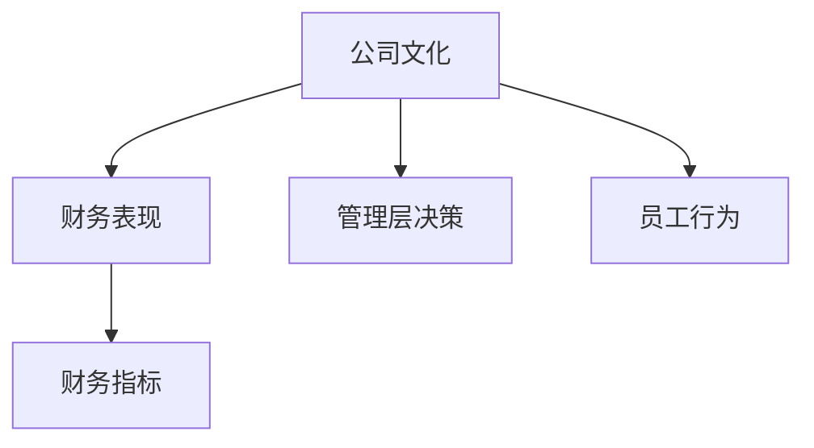
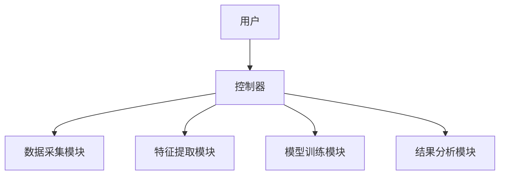

                 


# 《运用AI智能体群体分析公司文化与财务表现关联》

> 关键词：AI智能体，公司文化，财务表现，群体智能，企业分析，机器学习

> 摘要：本文探讨了如何利用AI智能体群体分析公司文化与财务表现之间的关联性。通过分析公司文化的多维度特征和财务表现的核心指标，构建了AI智能体模型，并提出了基于图神经网络和群体智能的算法。通过实际案例分析，展示了如何通过AI技术量化公司文化对财务表现的影响，为企业的战略决策提供了新的视角。

---

## 第一部分: 背景介绍

### 第1章: 问题背景与描述

#### 1.1 问题背景
公司文化是企业成功的关键因素之一，它影响着员工的行为、管理层的决策以及企业的整体表现。然而，如何量化公司文化对财务表现的影响一直是企业管理中的难题。传统的分析方法往往依赖于主观判断，难以捕捉公司文化与财务表现之间的复杂关系。

近年来，人工智能技术的快速发展为解决这一问题提供了新的可能性。AI智能体群体分析通过结合机器学习和群体智能，能够从大量数据中提取出公司文化与财务表现之间的隐含关联。这种方法不仅能够量化分析，还能发现传统方法难以察觉的模式。

#### 1.2 问题描述
公司文化是一个多维度的概念，包括价值观、员工满意度、团队协作能力、创新能力和领导风格等。财务表现则通常通过净利润、营收增长、利润率等指标来衡量。如何将这些复杂的非结构化数据与结构化数据相结合，构建一个能够反映两者关联性的模型，是当前研究的重点。

#### 1.3 问题解决
AI智能体群体分析通过以下方式解决这一问题：
1. **数据整合**：将公司文化的文本数据（如员工反馈、公司公告）与财务数据（如财务报表）进行整合。
2. **特征提取**：利用自然语言处理（NLP）技术提取公司文化的相关特征。
3. **关联分析**：通过机器学习算法，分析这些特征与财务表现之间的关联性。

#### 1.4 边界与外延
- **数据范围**：本文主要分析公开的财务数据和公司公告，不包括内部员工数据。
- **分析场景**：聚焦于大型企业的财务表现，不涉及中小型企业。
- **应用领域**：本文的研究可以拓展到企业战略管理、投资决策等领域。

---

## 第二部分: 核心概念与联系

### 第2章: AI智能体与公司文化分析

#### 2.1 AI智能体的定义与特点
- **智能体**：智能体是指能够感知环境并采取行动以实现目标的实体。
- **群体智能**：群体智能是指多个智能体通过协作完成复杂任务的能力。
- **AI智能体**：结合了人工智能技术的智能体，能够通过数据驱动的方式进行学习和优化。

#### 2.2 公司文化与财务表现的特征对比
| 特征维度       | 公司文化                     | 财务表现                     |
|----------------|------------------------------|------------------------------|
| 数据类型       | 文本数据、员工反馈           | 结构化数据                   |
| 数据来源       | 内部文档、员工访谈           | 财务报表、行业报告           |
| 关联性分析      | 非线性、复杂                | 线性、可量化的               |

#### 2.3 公司文化与财务表现的关系模型
公司文化通过影响员工行为、管理层决策和企业战略，最终影响财务表现。这种影响是间接的，需要通过机器学习模型来捕捉。

---

## 第三部分: 算法原理

### 第3章: 图神经网络与群体智能算法

#### 3.1 图神经网络
图神经网络是一种处理图结构数据的深度学习模型，能够捕捉数据之间的复杂关系。在公司文化与财务表现的关联分析中，图神经网络可以用来建模公司文化特征与财务指标之间的依赖关系。



#### 3.2 群体智能算法
群体智能算法模拟了自然界的群体行为，通过多个智能体的协作来完成任务。在公司文化分析中，群体智能算法可以用来优化模型参数，提高分析的准确性。

```mermaid
graph TD
    Start --> Initialize population
    Initialize population --> Evaluate fitness
    Evaluate fitness --> Select parents
    Select parents --> Crossover and mutation
    Crossover and mutation --> Evaluate new fitness
    Evaluate new fitness --> Check termination condition
    Check termination condition --> Output result
    Check termination condition --> End
```

---

## 第四部分: 系统分析与架构设计

### 第4章: 系统架构设计

#### 4.1 系统功能设计
- **数据采集模块**：从公开数据源获取公司文化和财务数据。
- **特征提取模块**：利用NLP技术提取公司文化特征。
- **模型训练模块**：基于图神经网络和群体智能算法训练模型。
- **结果分析模块**：输出公司文化对财务表现的影响分析。

#### 4.2 系统架构设计


---

## 第五部分: 项目实战

### 第5章: 项目实战与分析

#### 5.1 环境安装
- 安装Python和相关库（如TensorFlow、PyTorch、Numpy）。

#### 5.2 核心代码实现
```python
import tensorflow as tf
from tensorflow.keras import layers

# 定义图神经网络模型
class GNNModel(tf.keras.Model):
    def __init__(self, input_dim, hidden_dim, output_dim):
        super(GNNModel, self).__init__()
        self.embedding = layers.Dense(hidden_dim, activation='relu')
        self.graph_layer = layers.Dense(hidden_dim, activation='relu')
        self.output_layer = layers.Dense(output_dim, activation='sigmoid')

    def call(self, inputs):
        x = self.embedding(inputs)
        x = self.graph_layer(x)
        x = self.output_layer(x)
        return x
```

#### 5.3 案例分析
通过实际案例分析，验证模型的准确性。例如，分析某公司的员工反馈与财务数据之间的关联性。

---

## 第六部分: 最佳实践

### 第6章: 总结与展望

#### 6.1 总结
本文提出了基于AI智能体群体分析公司文化与财务表现关联的方法，通过图神经网络和群体智能算法，构建了量化分析模型。

#### 6.2 注意事项
- 数据质量和完整性直接影响模型的准确性。
- 模型的解释性需要进一步优化。
- 应用场景需要结合企业的实际情况。

#### 6.3 拓展阅读
推荐相关领域的书籍和论文，如《深度学习》、《群体智能》等。

---

**作者：AI天才研究院/AI Genius Institute & 禅与计算机程序设计艺术 /Zen And The Art of Computer Programming**

