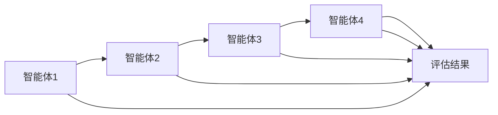
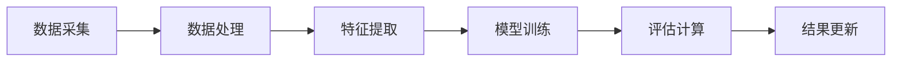
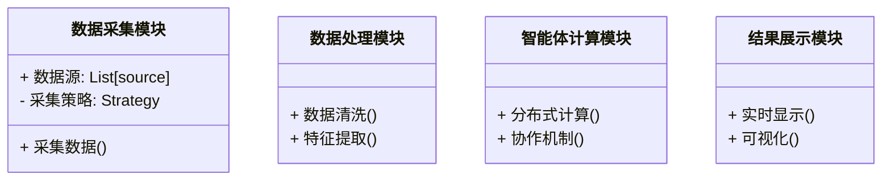
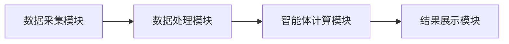
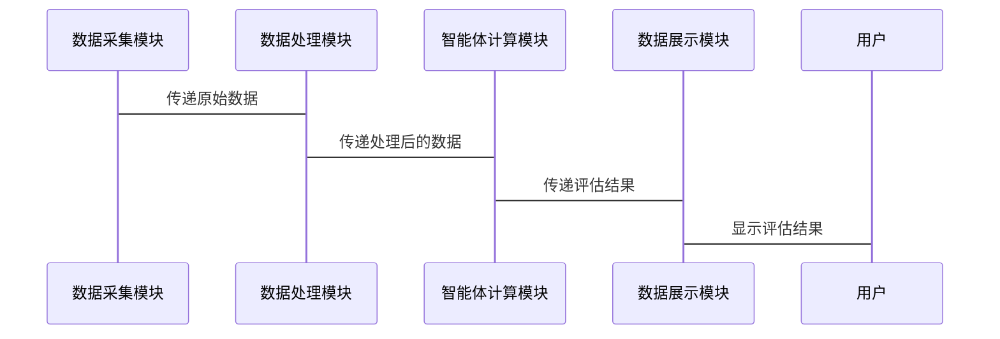

                 


# 运用AI智能体群体实现动态行业吸引力评估

> 关键词：AI智能体，群体智能，动态评估，行业吸引力，算法原理

> 摘要：本文探讨如何运用AI智能体群体实现动态行业吸引力评估。通过分析传统评估方法的局限性，提出基于群体智能的动态评估新思路。详细阐述AI智能体的定义、动态评估机制，以及群体智能在行业吸引力评估中的应用。结合实际案例，展示算法实现和系统架构设计，总结实践经验，为行业吸引力评估提供新方法。

---

## 第1章: 动态行业吸引力评估的背景与问题

### 1.1 问题背景

#### 1.1.1 传统行业吸引力评估的局限性
传统行业吸引力评估方法通常基于静态数据分析，如市场规模、增长率等。然而，随着市场的动态变化，行业吸引力受多种因素影响，如政策变化、技术进步、消费者行为等。静态评估难以捕捉这些动态变化，导致评估结果滞后或不准确。

#### 1.1.2 动态市场环境下的评估需求
在快速变化的市场环境中，企业需要实时了解行业吸引力，以做出快速决策。例如，在疫情后经济恢复期，某些行业的吸引力可能迅速变化，传统评估方法难以满足实时需求。

#### 1.1.3 AI技术在行业分析中的潜力
AI技术能够处理大量实时数据，识别复杂模式，为动态评估提供技术支持。通过AI算法，可以实时更新行业吸引力评估结果，满足动态市场环境的需求。

### 1.2 问题定义

#### 1.2.1 行业吸引力的定义与关键指标
行业吸引力可以定义为行业内企业的盈利能力、市场增长潜力、竞争程度等的综合指标。关键指标包括市场规模、利润率、竞争强度、政策环境等。

#### 1.2.2 动态评估的核心问题
动态评估的核心问题是如何实时更新行业吸引力指标，捕捉市场变化。这需要处理大量实时数据，并建立动态模型。

#### 1.2.3 智能体群体在动态评估中的角色
智能体群体通过分布式计算和协作，能够实时处理数据，更新评估结果。每个智能体负责特定数据的处理和分析，群体通过协同实现整体评估。

### 1.3 问题解决

#### 1.3.1 AI智能体群体的优势
智能体群体能够分布处理数据，提高计算效率。通过协作，可以实时更新评估结果，适应市场变化。

#### 1.3.2 动态评估的实现路径
通过智能体群体实时采集数据，利用AI算法进行分析，动态更新行业吸引力指标。

#### 1.3.3 群体智能与行业吸引力的结合
群体智能通过分布式计算和协作，实现行业吸引力的动态评估。智能体之间的协同能够捕捉市场变化，提供实时评估结果。

### 1.4 边界与外延

#### 1.4.1 评估范围的界定
动态行业吸引力评估的范围包括实时数据采集、分析模型构建、评估结果更新等。

#### 1.4.2 相关概念的区分
动态评估与静态评估的区别在于数据更新频率和处理方式。群体智能与传统AI方法的区别在于计算模式的分布性。

#### 1.4.3 群体智能的适用场景
适用于需要实时数据处理和动态决策的场景，如金融市场、电子商务等领域。

### 1.5 概念结构与核心要素

#### 1.5.1 行业吸引力评估的系统架构
系统架构包括数据采集层、智能体计算层、评估结果层。

#### 1.5.2 智能体群体的组成与功能
智能体群体由多个分布式智能体组成，每个智能体负责特定数据的处理和分析。

#### 1.5.3 动态评估的数学模型
动态评估模型包括数据预处理、特征提取、评估算法等步骤。

---

## 第2章: AI智能体群体的核心概念与联系

### 2.1 AI智能体的定义与分类

#### 2.1.1 智能体的基本定义
智能体是指能够感知环境、做出决策并采取行动的实体。在动态行业吸引力评估中，智能体负责数据采集和分析。

#### 2.1.2 基于智能体的分类
智能体可以分为简单反射智能体和基于模型智能体。简单反射智能体基于规则做出决策，基于模型智能体利用模型进行推理。

#### 2.1.3 智能体的属性特征对比
| 特性       | 简单反射智能体 | 基于模型智能体 |
|------------|----------------|----------------|
| 决策方式   | 基于规则       | 基于模型推理   |
| 复杂性     | 低             | 高             |

### 2.2 动态评估机制的原理

#### 2.2.1 动态评估的核心原理
动态评估通过实时数据更新，利用AI算法不断调整评估结果。评估结果反映了行业吸引力的变化。

#### 2.2.2 智能体之间的交互机制
智能体之间通过消息传递协同工作，共享数据和计算结果。协同机制确保评估结果的准确性和一致性。

#### 2.2.3 评估结果的更新与反馈
智能体根据反馈调整行为策略，优化评估结果。反馈机制确保评估模型适应市场变化。

### 2.3 群体智能与动态评估的关系

#### 2.3.1 群体智能的基本概念
群体智能是指多个智能体通过协作实现复杂任务的智能形式。在动态评估中，群体智能通过分布计算提高效率。

#### 2.3.2 动态评估中的群体
在动态评估中，群体智能通过分布式计算和协作，实现实时数据处理和评估结果更新。

---

### 图表：智能体群体的协作流程图



---

## 第3章: 算法原理与实现

### 3.1 算法原理

#### 3.1.1 算法选择
选择强化学习算法，通过奖励机制优化智能体的决策策略。

#### 3.1.2 算法流程
1. 数据采集：智能体从数据源获取实时数据。
2. 数据处理：对数据进行预处理和特征提取。
3. 模型训练：利用强化学习训练智能体的决策策略。
4. 评估计算：基于智能体的协同计算，生成评估结果。
5. 结果更新：根据反馈调整模型参数。

### 3.2 算法实现

#### 3.2.1 Python代码实现

```python
import numpy as np
import gym

class Agent:
    def __init__(self, env):
        self.env = env
        self.model = self._build_model()
    
    def _build_model(self):
        # 简单的强化学习模型，实际可替换为更复杂的模型
        return np.random.rand(4, 1)
    
    def act(self, observation):
        action = self.env.action_space.sample()
        return action
    
    def update(self, reward):
        # 简单的更新策略，实际可替换为梯度下降等方法
        self.model += reward * self.model

# 初始化环境和智能体
env = gym.make('CustomEnv-v0')
agent = Agent(env)

# 算法实现
observation = env.reset()
while True:
    action = agent.act(observation)
    observation, reward, done, info = env.step(action)
    agent.update(reward)
    if done:
        break
```

#### 3.2.2 算法流程图



#### 3.2.3 数学模型

评估函数：$$ A(t) = \alpha \cdot S(t) + \beta \cdot G(t) + \gamma \cdot C(t) $$

其中，$$ A(t) $$ 表示第t时刻的行业吸引力，$$ S(t) $$ 是市场规模，$$ G(t) $$ 是增长率，$$ C(t) $$ 是竞争程度，$$ \alpha $$、$$ \beta $$、$$ \gamma $$ 是权重系数。

---

## 第4章: 系统分析与架构设计

### 4.1 问题场景介绍

动态行业吸引力评估系统需要处理来自多个数据源的实时数据，包括市场数据、政策变化、消费者行为等。系统需要高效处理这些数据，实时更新评估结果。

### 4.2 系统功能设计

#### 4.2.1 功能模块
- 数据采集模块：实时采集市场数据。
- 数据处理模块：对数据进行预处理和特征提取。
- 智能体计算模块：利用群体智能进行评估计算。
- 结果展示模块：实时显示评估结果。

#### 4.2.2 领域模型类图



### 4.3 系统架构设计

#### 4.3.1 系统架构图



### 4.4 系统接口设计

- 数据接口：与数据源对接，获取实时数据。
- 计算接口：与智能体模块交互，传递数据和计算结果。
- 展示接口：将评估结果传递给展示模块。

### 4.5 系统交互流程图



---

## 第5章: 项目实战

### 5.1 环境安装

安装Python和相关库，如numpy、gym等。配置开发环境，如Jupyter Notebook或PyCharm。

### 5.2 系统核心实现

#### 5.2.1 数据采集模块实现

```python
import requests

def get_market_data():
    response = requests.get('https://api.market.com/data')
    return response.json()
```

#### 5.2.2 数据处理模块实现

```python
def process_data(data):
    # 数据清洗和特征提取
    processed_data = data['market_size'], data['growth_rate']
    return processed_data
```

#### 5.2.3 智能体计算模块实现

```python
class Agent:
    def __init__(self):
        self.model = self._build_model()
    
    def _build_model(self):
        return np.random.rand(2, 1)
    
    def act(self, observation):
        return np.argmax(observation.dot(self.model))
    
    def update(self, reward):
        self.model += reward * self.model
```

### 5.3 实际案例分析

以某行业为例，展示评估结果的变化。通过动态调整权重系数，观察评估结果的变化趋势。

---

## 第6章: 最佳实践与总结

### 6.1 小结

通过智能体群体实现动态行业吸引力评估，能够实时捕捉市场变化，提高评估的准确性和及时性。

### 6.2 注意事项

- 确保数据源的可靠性和实时性。
- 设计高效的协同机制，避免计算瓶颈。
- 定期更新模型，适应市场变化。

### 6.3 拓展阅读

建议阅读相关领域的书籍和论文，深入理解群体智能和动态评估的理论与实践。

---

## 作者：AI天才研究院/AI Genius Institute & 禅与计算机程序设计艺术 /Zen And The Art of Computer Programming

---

以上是《运用AI智能体群体实现动态行业吸引力评估》的技术博客文章的完整内容。文章详细介绍了AI智能体群体在动态行业吸引力评估中的应用，从背景、核心概念、算法原理、系统设计到项目实战，层层深入，为读者提供了全面的知识和实践指导。

